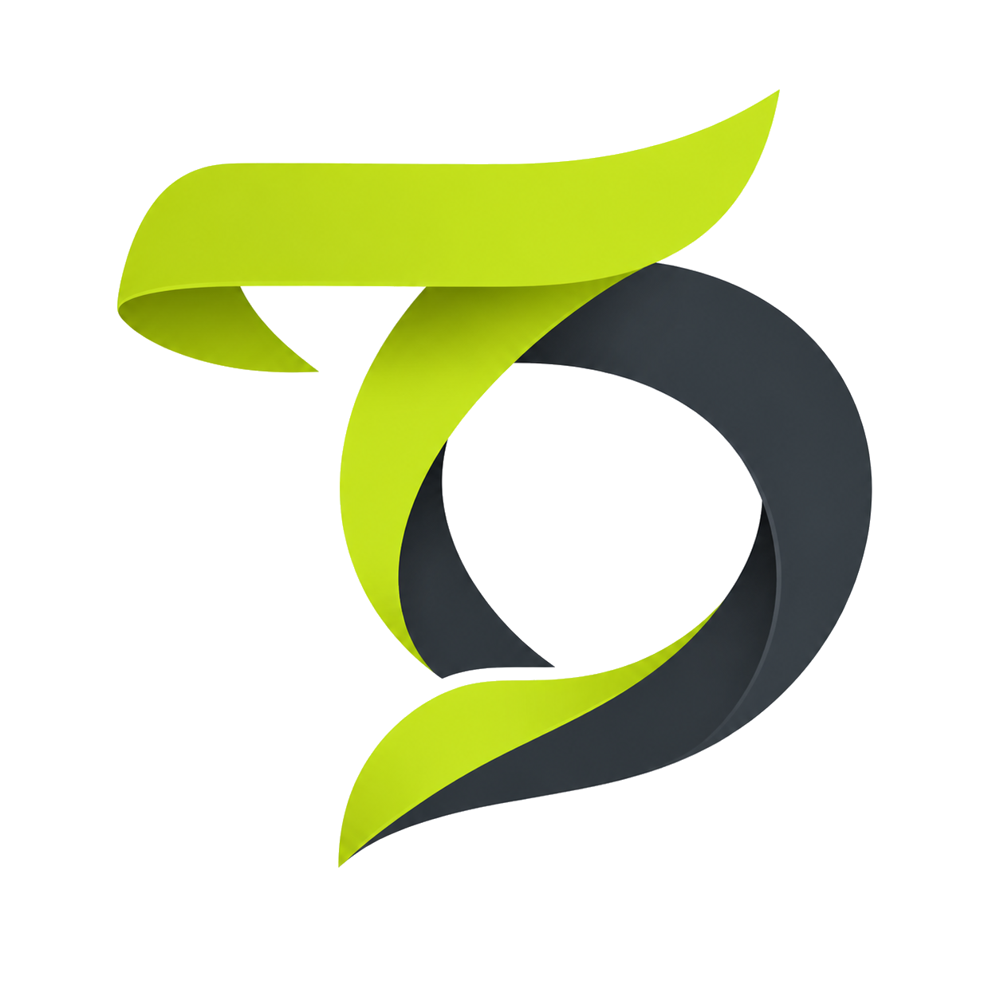
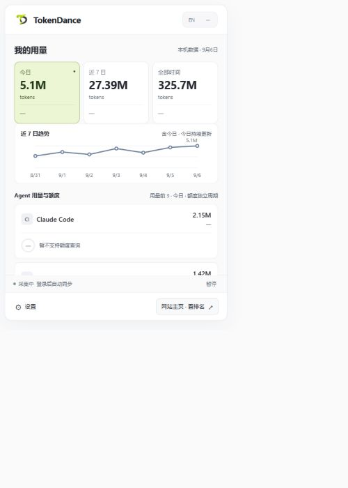
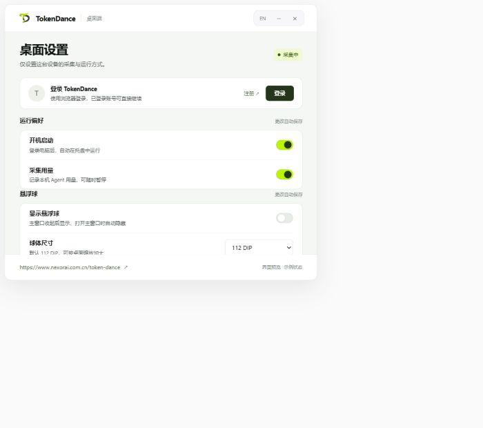

  

<h1 align="center">TokenDance</h1>

Let Token Dance · 看见你与 AI 一起创造的每一天

  <a href="https://www.nexorai.com.cn/token-dance/">访问官网</a> ·
  <a href="https://github.com/DarrenHoo-10/token_dance/releases">下载最新版本</a>

TokenDance 是一款 AI 编程用量统计工具。它把不同 Agent 的 Token 消耗、费用和额度汇总到桌面，让你随时查看用量，也能在网站回顾个人数据和排行榜。

## 用量，一眼看清

- **按周期查看**：今日、近 7 日和全部时间的 Token 用量与费用。
- **看见使用趋势**：每日折线图和年度活动热力图，记录持续创作的轨迹。
- **了解 Agent 构成**：分别查看不同编程工具的用量，知道 Token 花在了哪里。
- **关注订阅额度**：查看已接入工具的额度使用情况与重置时间。

  

## 留在桌面，随手可看

TokenDance 常驻 Windows 托盘，点击图标即可展开用量面板。也可以开启悬浮球，在工作时查看今日 Token 和所选来源的额度。

开机启动、采集暂停、Agent 来源和自动更新都能在设置中管理。

  

以上为产品界面预览，数据与状态为示例。

## 本地使用，也能同步到网站

**不登录也可以使用。** 在本机查看已采集的用量与历史统计，离线时继续记录。

登录后自动同步到网站，查看个人用量、趋势、活跃日历、Agent 构成和已记录的 Skill 使用情况。你可以设置昵称与头像，通过开关选择是否公开个人数据页。

**TokenBoard 排行榜**支持按不同时间周期查看排名、总参与人数和相较昨日的变化。注册账号即可参与；个人数据页是否公开，不影响参与排行榜。

## 支持的编程工具

**Codex · Claude Code · Grok Build · ZCode · Cursor · Pi · DeepSeek Harness**

不同工具支持的用量、费用和额度信息有所不同，具体以应用内显示为准。

## 开始使用

1. 前往 [下载页面](https://github.com/DarrenHoo-10/token_dance/releases)，在最新发布版本的 **Assets** 中下载 `TokenDance.exe` 或 Windows ZIP 压缩包。
2. 运行程序，在 Windows 右下角托盘打开用量面板。
3. 在设置中选择需要采集的工具；如需网站同步，点击登录或注册。

已有用户可在设置中点击 **检查更新**，或开启自动更新。

## 开源协议

[MIT License](LICENSE)
