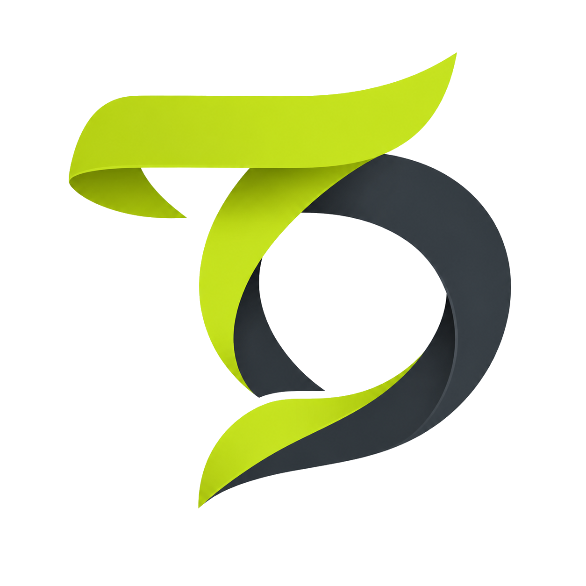
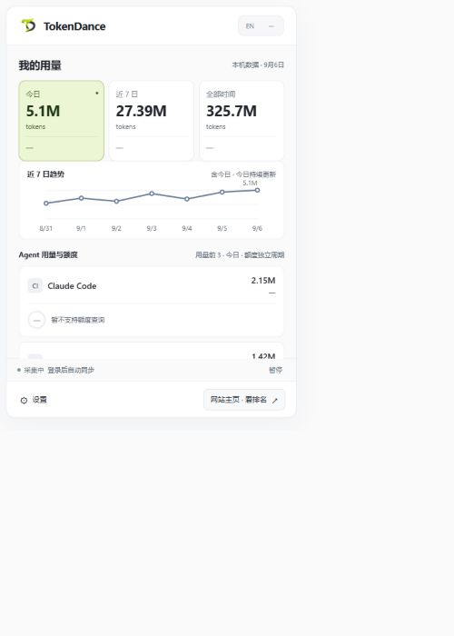
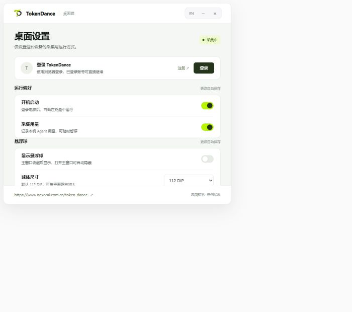

<p align="center">
  
</p>

<h1 align="center">TokenDance</h1>

<p align="center">Let Token Dance · 看见你与 AI 一起创造的每一天</p>

<p align="center">
  <a href="https://www.nexorai.com.cn/token-dance/">官网</a> ·
  <a href="https://www.nexorai.com.cn/token-dance/download">下载</a> ·
  <a href="https://github.com/DarrenHoo-10/token_dance/releases">GitHub Releases</a> ·
  <a href="docs/development.md">开发指南</a>
</p>

TokenDance 是一款 AI 编程用量统计工具。桌面客户端在本机采集 Codex、Claude Code、Cursor 等编程 Agent 的 Token 用量、费用和订阅额度，汇总在一个面板里；登录后同步到网站，查看个人统计并参与 TokenBoard 排行榜。

<p align="center">
  
</p>

## 功能

- **用量统计**：按今日、近 7 日和全部时间查看 Token 用量与费用。
- **趋势与热力图**：每日折线图和年度活动热力图，记录持续创作的轨迹。
- **按 Agent 拆分**：分别查看每个编程工具的用量，知道 Token 花在了哪里。
- **订阅额度**：查看已接入工具的额度使用情况与重置时间。
- **常驻桌面**：Windows 托盘 / macOS 菜单栏常驻，可开启悬浮球随时查看今日 Token 和额度。
- **离线可用**：不登录也能在本机查看用量与历史，离线时继续记录。
- **网站与排行榜**：登录后自动同步，在网站查看个人趋势、活跃日历、Agent 构成和 Skill 使用情况，并参与 TokenBoard 排行榜。

<p align="center">
  
</p>

<p align="center"><sub>以上为产品界面预览，数据与状态为示例。</sub></p>

## 支持的编程工具

| 工具 | 说明 |
| --- | --- |
| Codex | 读取本地会话记录中的用量；有近期额度记录时展示额度 |
| Claude Code / Cowork | 采集本机已完成会话的 Token |
| Cursor | 用量与套餐额度分开展示，额度需要本机有效登录 |
| Grok Build | 读取本地已完成轮次的日志；周额度为 Grok 产品共享额度 |
| ZCode | 额度查询支持个人 Coding Plan |
| OpenCode | 读取本机 `opencode.db` 中的 Token、AI 交互次数和变更行数 |
| WorkBuddy / Doubao Work | 检测到本机安装后采集本地会话记录 |
| Pi / DeepSeek Harness | 可用指标以客户端中的来源状态为准 |
| Droid (Factory) | 读取本机 droid 日志中的逐次模型用量；日志随 droid 重启清空，仅统计运行期间采集到的部分 |

不同工具能提供的用量、费用和额度信息不同，没有对应数据时不会显示为 0。

## 下载与安装

前往 [下载页面](https://www.nexorai.com.cn/token-dance/download) 获取最新版本。

**Windows**

1. 下载 `TokenDance.exe` 或 Windows ZIP 压缩包，直接运行。
2. 点击右下角托盘图标打开用量面板。
3. 在设置中选择要采集的工具；需要网站同步时点击登录或注册。

在设置中可以管理开机启动、采集暂停、悬浮球和自动更新，也可以手动 **检查更新**。

**macOS**

1. 按芯片选择 Apple Silicon 或 Intel 的 DMG（在“关于本机”中查看芯片类型）。
2. 打开 DMG，把 TokenDance 拖入“应用程序”后启动。
3. 如果首次打开被系统拦截，确认来源后到“系统设置 → 隐私与安全性”中选择“仍要打开”。

macOS 版暂不支持应用内自动更新，更新时先从菜单栏退出旧版，再替换应用，本机数据会保留。

## 数据与隐私

- 采集在本机进行，数据先经过本地隐私过滤再保存或上传。
- **不上传**提示词、模型回复、源代码、diff 或工具输出，也不会把各 Agent 的登录凭据上传到 TokenDance。
- 只有登录后才会同步到网站。昵称、头像、用量趋势会在排行榜和个人页展示；邮箱、设备、项目和会话明细不会公开。个人数据页可以在网站设置中关闭公开，这不影响参与排行榜。
- 部分工具的额度通过本机登录状态向官方服务发起只读查询，查询失败时显示“待更新”。

## 参与开发

仓库包含三部分：

| 部分 | 目录 | 技术栈 |
| --- | --- | --- |
| 桌面客户端与采集端 | `collector/` | Rust、Tauri 2、React、TypeScript |
| 网站 | `web/` | React、TypeScript、Vite |
| 服务端 | `server/` | Go、MySQL、Redis |

环境要求：Node.js 22.18+、Rust stable、Go 1.25+；Windows 桌面构建还需要 MSVC C++ 构建工具和 Windows SDK。

```powershell
# 构建 Windows 桌面端，输出 collector/apps/desktop/release/TokenDance.exe
cd collector/apps/desktop
npm ci
npm run build:windows

# 启动网站开发服务器，API 默认代理到 http://127.0.0.1:8081
cd web
npm ci
npm run dev

# 校验跨端事件协议（仓库根目录）
npm ci
npm run check:protocol:all
```

完整的构建、测试和发布流程见 [开发指南](docs/development.md)，服务端部署见 [部署说明](deploy/README.md)，打包与签名见 [打包说明](collector/packaging/README.md)。

<details>
<summary>目录结构</summary>

| 目录 | 用途 |
| --- | --- |
| `collector/apps/desktop/` | Tauri 桌面应用；`src/` 为 React 界面，`src-tauri/` 为 Rust 原生逻辑 |
| `collector/apps/service/` | 本地采集服务、来源发现及运行时集成 |
| `collector/adapters/` | 各编程工具的采集适配器及测试样本 |
| `collector/crates/` | 采集、协议、隐私处理、持久化、上传和平台能力等共享 Rust 库 |
| `collector/packaging/` | Windows/macOS 安装包构建、签名及打包验证 |
| `collector/schemas/` | 适配器清单和事件的 JSON Schema |
| `server/` | Go 服务端；`cmd/` 为 API/worker 入口，`internal/` 为业务实现，`api/` 为接口说明，`db/` 为数据库迁移 |
| `web/` | 网站：个人统计、排行榜、账号设置和下载文档页；`e2e/` 为端到端测试 |
| `schemas/` | 跨端事件协议、协议样本和桌面发布清单的 JSON Schema |
| `tools/` | 协议代码生成与校验、发布清单管理、安全检查等工具 |
| `scripts/` | 跨模块集成验收脚本 |
| `deploy/` | 云端部署脚本、Nginx 与 systemd 配置 |
| `docs/` | 项目文档，见 [文档目录](docs/README.md) |
| `.github/workflows/` | CI、跨平台打包、发布清单及敏感信息扫描 |
| `.githooks/` | 本地 Git 钩子（提交前敏感信息扫描） |

</details>

协作与部署约束见 [AGENTS.md](AGENTS.md)，安全规则见 [SECURITY.md](SECURITY.md)。请勿把密钥、凭据或本地配置提交到仓库。

## 开源协议

[MIT License](LICENSE)
