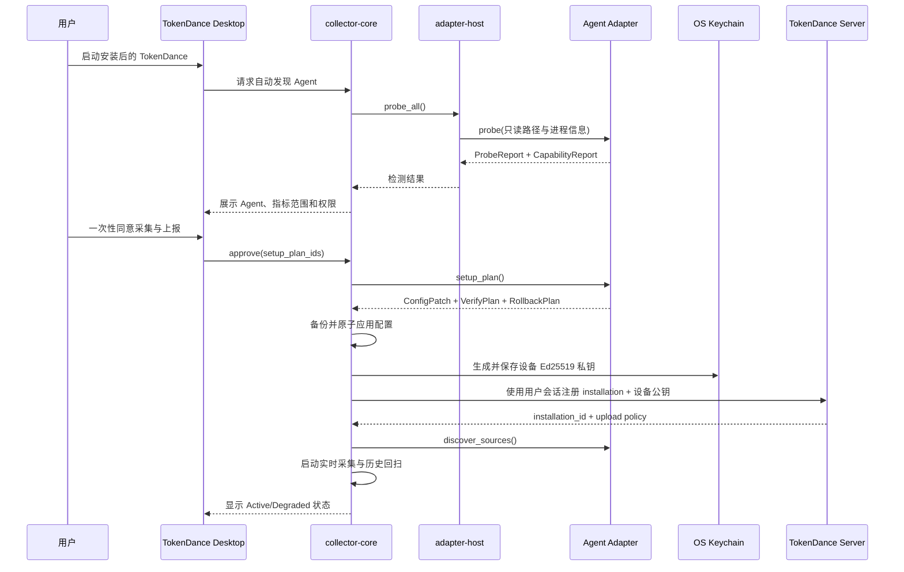
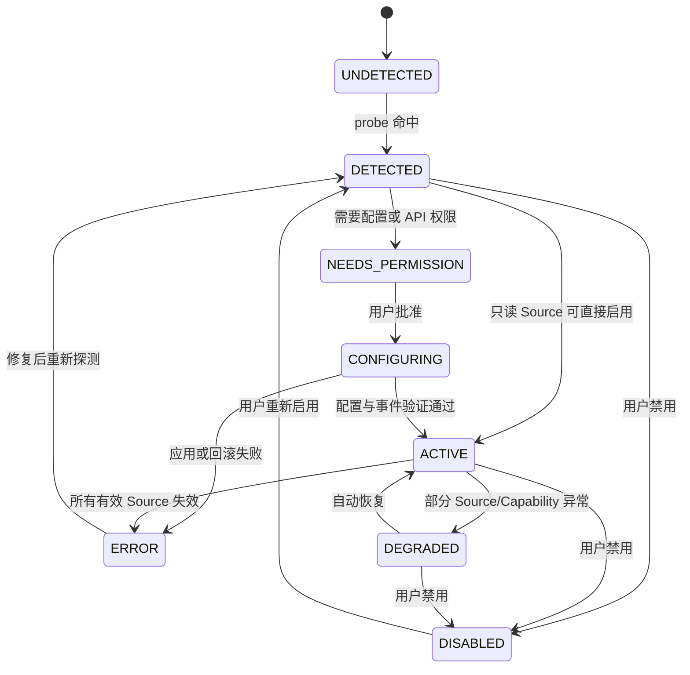
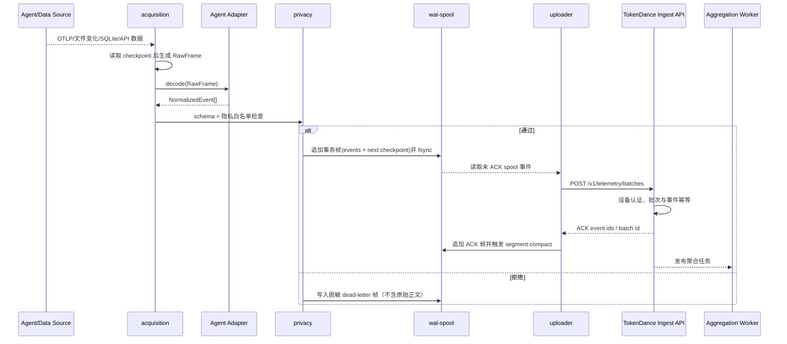
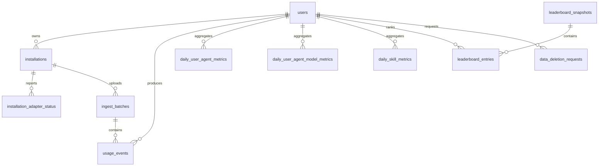

# TokenDance 跨 Agent 数据采集系统技术方案与验收标准

> 文档版本：v1.0  
> 文档状态：研发基线草案  
> 更新时间：2026-08-30  
> 目标系统：Windows、macOS  
> 首期 Agent：Codex、Claude Code、Grok Build、Cursor、ZCode、DeepSeek Harness  
> 主轴：`adapter_runtime.status`、`event_delivery.status`  
> 子轴：`setup_plan.status`、`source_checkpoint.status`、`upload_batch.status`  
> 本地运行状态：文件型 append-only WAL、checkpoint、未 ACK spool、加密配置备份；Collector 不创建本地数据库  
> 中心数据存储：MySQL 8.0  
> 覆盖范围：本地 Agent 自动发现、插件化采集、标准化、隐私过滤、离线缓存、可靠上报、服务端聚合和排行榜数据输入  
> 已知排除项：Linux、移动端、提示词/回复内容采集、源代码内容上传、企业管理后台细节、计费结算

## 1、文档目的与产品目标

### 1.1 文档目的

本文档作为 TokenDance 数据采集系统首期研发、联调、测试和发布验收的共同基线，解决以下问题：

1. 如何在 Windows 和 macOS 上自动发现用户已安装的 AI Coding Agent。
2. 如何在 Collector Core 不依赖具体 Agent 的前提下持续接入新 Agent。
3. 如何同时兼容 OTLP、JSONL、SQLite、运行时事件、本地 API、命令快照和远程 API。
4. 如何把不同 Agent 的 token、Skill、代码量、交互轮次和会话数据转换为统一口径。
5. 如何保证安装后持续自动采集、断网不丢数据、重复上报不重复计数。
6. 如何确保默认不采集提示词、模型回复、源代码、绝对路径和凭据。
7. 如何用可执行、可复现的标准判断首期版本是否达到发布条件。

### 1.2 产品目标

首期产品应实现以下用户体验：

1. 用户安装 TokenDance Collector。
2. Collector 在首次运行时自动检测已安装的首期 Agent。
3. 用户在统一授权页面查看数据范围并完成一次授权。
4. Collector 对支持原生遥测的 Agent 生成配置变更计划，备份后安全应用。
5. Collector 自动导入历史数据并持续接收实时数据。
6. 数据在本地完成标准化、去重、脱敏后批量上报 TokenDance Server。
7. 用户在 TokenDance 网站看到 token、Skill、AI 代码量、轮次、会话数等统计和排行榜。
8. 后续增加 Agent 时，仅增加 Adapter，不修改 Collector Core 和服务端标准事件协议。

### 1.3 非目标

首期明确不做：

- 不上传提示词、模型回复、代码正文、diff 正文或工具输出。
- 不对不同 Agent 的“生产力”做未经解释的统一评分。
- 不承诺所有 Agent 都能提供相同精度的 Skill 和 AI 代码量数据。
- 不绕过 Cursor Team/Enterprise、API Key 或管理员权限限制。
- 不注入或代理模型请求，不成为 LLM Gateway。
- 不把 Agent 凭据复制到 TokenDance Server。
- 不支持未经签名的第三方原生插件自动执行。
- 不在首期支持 Linux、远程 SSH 主机或容器内 Agent 自动发现。

### 1.4 核心术语

| 术语 | 定义 |
| --- | --- |
| Collector | 安装在用户设备上的 TokenDance 后台采集程序 |
| Collector Core | 不感知具体 Agent 的采集、存储、隐私和上报核心 |
| Adapter | 把某个 Agent 的数据源转换为 TokenDance 标准事件的插件 |
| Source | OTLP、文件、SQLite、运行时流、API 等原始数据入口 |
| RawFrame | Core 从 Source 读取后交给 Adapter 的最小原始数据单元 |
| NormalizedEvent | Adapter 输出的 TokenDance 标准事件 |
| Checkpoint | 某个 Source 已消费位置的持久化游标 |
| Outbox | 已标准化、等待可靠上报的逻辑队列；实现为加密 WAL/spool 文件，不是数据库表 |
| Accuracy | 数据准确度：原生精确、派生、关联、估算或不可用 |
| Capability | Adapter 对 token、Skill、代码量、轮次等指标的支持声明 |

## 2、系统整体架构

### 2.1 整体架构图

<whiteboard type="blank"></whiteboard>

### 2.2 飞书画板绘制提示词

绘制 TokenDance 数据采集系统分层架构图，不画节点间连线，按以下层级从上到下排列：

- 用户界面层：`TokenDance Web (React 19 + TypeScript)`、`TokenDance Desktop Settings (Tauri 2)`。
- Agent 层：`Codex`、`Claude Code`、`Grok Build`、`Cursor`、`ZCode`、`DeepSeek Harness`。
- 本地采集层：`collector-core`、`adapter-host`、`acquisition`、`normalization`、`privacy`、`wal-spool`、`uploader`。
- Adapter 层：`adapter-codex`、`adapter-claude`、`adapter-grok-build`、`adapter-cursor`、`adapter-zcode`、`adapter-deepseek-harness`。
- 本地运行状态层：`collector.wal`、`checkpoint snapshots`、`OS Keychain/Credential Manager`、加密的 `config-backups/` 文件；不创建 SQLite/MySQL 等本地数据库。
- 服务端层：`TokenDance Go API`、`Go Aggregation Worker`、`Leaderboard API`、`Adapter Registry`。
- 服务端存储层：`MySQL 8.0`、后续可选 `ClickHouse`、对象存储中的脱敏诊断包。
- 外部依赖层：`Cursor Admin/Analytics API`、各 Agent 原生 OTLP、操作系统启动项和代码签名服务。

### 2.3 核心模块职责

| 模块 | 部署位置 | 职责 | 明确不负责 |
| --- | --- | --- | --- |
| `collector-core` | 本地 | 生命周期、调度、权限、状态机、能力聚合 | 解析具体 Agent 格式 |
| `adapter-host` | 本地 | Adapter 注册、调用、版本握手、熔断、隔离 | 数据上报 |
| `acquisition` | 本地 | 文件监听、SQLite 快照、OTLP、API 调度 | Agent 语义映射 |
| `normalization` | 本地 | schema 校验、单位统一、时间标准化、去重键生成 | 保存原始敏感内容 |
| `privacy` | 本地 | 字段白名单、路径哈希、内容阻断、诊断审计 | 业务聚合 |
| `wal-spool` | 本地 | 文件型 checkpoint、未 ACK spool、备份索引、dead letter 索引 | 长期业务数据存储 |
| `uploader` | 本地 | 批处理、压缩、签名、重试、ACK | 直接读取 Agent 文件 |
| `TokenDance Go API` | 服务端 | 身份验证、批次幂等、schema 校验、MySQL 入库 | 解析 Agent 私有格式 |
| `Go Aggregation Worker` | 服务端 | 日/周/月聚合、排行榜口径计算 | 接收客户端原始文件 |
| `TokenDance Web` | 云端 | 个人统计、能力覆盖说明、排行榜展示 | 本地扫描 |

### 2.4 技术栈

| 层 | 技术选择 | 选择原因 |
| --- | --- | --- |
| Collector Core | Rust stable | 跨平台、低资源占用、适合文件/SQLite/网络并发 |
| Desktop Shell | Tauri 2 | Windows/macOS 安装、托盘、设置 UI、签名发布 |
| Async Runtime | Tokio | 文件、网络、定时器和任务取消统一运行时 |
| File Watch | `notify` | Windows/macOS 文件变化统一接口 |
| Local State | Rust 文件型 append-only WAL + CBOR/JSON checkpoint | 不安装本地数据库；只保存崩溃恢复所需的短期运行状态 |
| OTLP | `opentelemetry-proto` + HTTP/gRPC receiver | 接入 Claude、Codex、Grok Build、DeepSeek Harness |
| HTTP Client | `reqwest` + rustls | 跨平台 TLS、代理和超时控制 |
| Secret Store | Windows Credential Manager / macOS Keychain | 不把设备 Ed25519 私钥放入普通配置文件 |
| Web | 现有 React 19 + TypeScript + Vite/vinext | 复用现有排行榜原型和组件体系 |
| Backend API | Go 1.25+，HTTP 框架采用标准库兼容路由器 | 高并发、低资源、静态二进制、适合采集和聚合服务 |
| MySQL Driver | `go-sql-driver/mysql` + `sqlc` | 成熟驱动；由 SQL 生成类型安全访问层 |
| Primary DB | MySQL 8.0 | 中心业务数据唯一事实源，承载用户、设备、事件、聚合和排行榜 |
| Event Analytics | ClickHouse，达到容量阈值后引入 | 高吞吐明细事件和排行榜分析 |

### 2.5 端到端安装与激活流程



## 3、可插拔 Adapter 架构

### 3.1 设计原则

1. **Core 无 Agent 分支**：`collector-core` 中禁止出现 `if agent == "codex"` 等具体产品判断。
2. **采集与解析分离**：Core 负责安全读取和调度，Adapter 负责格式和语义。
3. **配置修改计划化**：Adapter 只能返回变更计划，不能直接写用户配置。
4. **上传路径唯一**：只有 `uploader` 可以访问 TokenDance Server 的上报凭据。
5. **能力可降级**：同一 Adapter 在不同 Agent 版本、账号类型下可返回不同 Capability。
6. **失败隔离**：一个 Adapter 失败不能阻塞其他 Adapter 和整个 Collector。
7. **可追溯**：每条事件保存 `adapter_id`、`adapter_version`、`source_kind`、`source_cursor` 和 `accuracy`。
8. **协议先行**：Adapter SDK、标准事件和 manifest 均带独立 schema 版本。

### 3.2 两层插件机制

#### 首期官方 Adapter

- 每个 Adapter 是独立 Rust crate。
- 通过统一 `AgentAdapter` trait 注册到 `adapter-host`。
- 默认随 Collector 安装包发布。
- 可单独开启、禁用和热重载配置，但二进制升级随 Collector 或官方 Adapter Pack 完成。

#### 后续第三方 Adapter

- 独立进程运行，通过 JSON-RPC 2.0/stdio 与 `adapter-host` 通信。
- 插件包必须签名，并声明文件、命令、网络和系统权限。
- 第三方插件不获得设备私钥、用户登录 token 或上报 API 认证信息。
- 纯解析型插件优先迁移到 WASI Component，默认无网络能力。

不使用 Rust 动态库 `.dll`/`.dylib` 作为公开 ABI，避免 Rust ABI 不稳定导致的跨版本崩溃。

### 3.3 AgentAdapter 接口

```rust
#[async_trait]
pub trait AgentAdapter: Send + Sync {
    fn manifest(&self) -> &AdapterManifest;

    async fn probe(
        &self,
        ctx: ProbeContext,
    ) -> Result<ProbeReport, AdapterError>;

    async fn setup_plan(
        &self,
        ctx: SetupContext,
    ) -> Result<SetupPlan, AdapterError>;

    async fn discover_sources(
        &self,
        ctx: SourceContext,
    ) -> Result<Vec<SourceSpec>, AdapterError>;

    async fn decode(
        &self,
        frame: RawFrame,
    ) -> Result<Vec<NormalizedEvent>, AdapterError>;

    async fn health(&self) -> AdapterHealth;
}
```

接口约束：

- `probe` 必须只读、可重复、无网络副作用。
- `setup_plan` 只能产生声明式计划，不能写文件或环境变量。
- `discover_sources` 不能返回 manifest 未声明的路径或网络域名。
- `decode` 必须是确定性的；相同 `RawFrame` 和 Adapter 版本应产生相同事件。
- `decode` 遇到未知字段应忽略并记录兼容性指标，不得上传未知字段。
- `health` 必须区分可恢复错误、权限错误、格式不兼容和永久禁用。

### 3.4 Adapter Manifest

```json
{
  "$schema": "https://schemas.tokendance.dev/adapter-manifest/v1.json",
  "id": "dev.tokendance.adapter.codex",
  "name": "Codex",
  "version": "1.0.0",
  "protocolVersion": "1.0",
  "agent": {
    "id": "codex",
    "versionRange": ">=0.100.0"
  },
  "platforms": [
    "windows-x64",
    "windows-arm64",
    "macos-x64",
    "macos-arm64"
  ],
  "sources": ["otlp", "jsonl-tail"],
  "permissions": {
    "readPathTemplates": ["${CODEX_HOME}/sessions/**"],
    "writePathTemplates": ["${CODEX_HOME}/config.toml"],
    "commands": [],
    "networkDomains": []
  },
  "capabilities": [
    "tokens",
    "sessions",
    "turns",
    "tools",
    "skills"
  ]
}
```

Manifest 校验规则：

- `id + version` 全局唯一。
- `protocolVersion` 与 Collector 不兼容时拒绝加载。
- 路径必须使用受支持模板，不能使用未解析通配根目录。
- 禁止声明用户主目录整体读取权限。
- 网络域名必须精确到域名，禁止 `*`。
- 官方 Adapter 的 manifest 和二进制必须包含在签名范围内。

### 3.5 数据源抽象

```rust
pub enum SourceSpec {
    OtlpReceiver(OtlpSource),
    JsonlTail(JsonlTailSource),
    SqliteSnapshot(SqliteSource),
    FileSnapshot(FileSource),
    RuntimeStream(RuntimeStreamSource),
    LocalHttpApi(LocalHttpSource),
    CommandSnapshot(CommandSource),
    RemoteApi(RemoteApiSource),
}
```

| Source | 适用场景 | Checkpoint | 核心安全限制 |
| --- | --- | --- | --- |
| `OtlpReceiver` | 原生实时遥测 | signal + resource + sequence/hash | 默认仅监听 `127.0.0.1` |
| `JsonlTail` | 追加式会话记录 | file identity + byte offset + last hash | 检测截断和轮转 |
| `SqliteSnapshot` | Agent 本地数据库 | DB fingerprint + row cursor/update time | 只读 URI，优先 snapshot/backup API |
| `FileSnapshot` | 小型 JSON/CSV/摘要 | file identity + mtime + content hash | 文件大小上限 |
| `RuntimeStream` | ACP/hooks/session event | stream id + monotonic sequence | 不允许 Adapter 启动任意进程 |
| `LocalHttpApi` | Agent 本地服务 | endpoint cursor/etag | 仅 loopback，端口必须探测验证 |
| `CommandSnapshot` | 官方只读统计命令 | command + output hash | 命令固定、无 shell 拼接、超时 |
| `RemoteApi` | Cursor Admin/Analytics | remote cursor + time window | 凭据只从系统密钥库按句柄使用 |

### 3.6 配置变更计划

```rust
pub struct SetupPlan {
    pub plan_id: String,
    pub adapter_id: String,
    pub summary: String,
    pub mutations: Vec<ConfigMutation>,
    pub required_permissions: Vec<PermissionRequest>,
    pub verify: Vec<VerifyStep>,
    pub rollback: Vec<RollbackStep>,
}

pub enum ConfigMutation {
    JsonMergePatch { path: PathTemplate, patch: Value },
    TomlMergePatch { path: PathTemplate, patch: Value },
    EnvironmentSet { scope: UserScope, key: String, value: SecretRef },
    DirectoryCreate { path: PathTemplate },
}
```

配置写入流程必须满足：

1. 路径解析后仍在 manifest 允许范围内。
2. 读取当前文件并记录内容哈希。
3. 在加密的 `config-backups/<adapter>/` 目录中创建备份文件和 before/after hash 元数据。
4. 写入同目录临时文件并进行语法解析。
5. 使用原子替换提交。
6. 执行 `VerifyStep`。
7. 验证失败时自动恢复备份。
8. 用户卸载或禁用集成时，可以选择恢复 TokenDance 引入的配置项，而不是覆盖整个文件。

### 3.7 插件包结构

```text
adapter-package/
  manifest.json
  schemas/
  bin/
    windows-x64/
    windows-arm64/
    macos-x64/
    macos-arm64/
  fixtures/
  LICENSES/
  SIGNATURE
```

## 4、状态模型

### 4.1 状态字段口径

以下枚举为本方案拟定的协议基线；实现时必须落入 `schemas/` 并生成 Rust/Go/TypeScript 类型，禁止客户端、服务端和 Web 分别手写另一套枚举。

| 字段 | 所有者 | 作用 | 枚举类型 | 读法 |
| --- | --- | --- | --- | --- |
| `adapter_runtime.status` | Collector Core | Adapter 当前运行状态 | `AdapterRuntimeStatus` | 是否能继续采集 |
| `setup_plan.status` | Collector Core | 配置计划执行状态 | `SetupPlanStatus` | 是否完成安全接入 |
| `source_checkpoint.status` | Acquisition | 单数据源消费状态 | `SourceCheckpointStatus` | 是否需要重扫或人工处理 |
| `event_delivery.status` | WAL Spool/Uploader | 单事件可靠投递状态 | `EventDeliveryStatus` | 是否已被服务端确认 |
| `upload_batch.status` | Uploader | 批次上传状态 | `UploadBatchStatus` | 当前网络投递阶段 |

### 4.2 `adapter_runtime.status`：Adapter 运行状态

| 枚举值 | 中文含义 | 作用 |
| --- | --- | --- |
| `UNDETECTED` | 未检测到 Agent | 不创建 Source，保留低频重新探测 |
| `DETECTED` | 已检测 | 已识别安装和版本，但未完成授权或配置 |
| `NEEDS_PERMISSION` | 等待权限 | 等待用户授权文件、API 或配置修改 |
| `CONFIGURING` | 配置中 | 正在备份、写入和验证配置 |
| `ACTIVE` | 正常采集 | 所有必需 Source 正常，能力完整或符合声明 |
| `DEGRADED` | 降级采集 | 至少一个能力可用，但部分 Source/指标缺失 |
| `ERROR` | 采集错误 | 当前无法产生有效事件，可重试或修复 |
| `DISABLED` | 已禁用 | 用户或策略明确关闭，不自动恢复 |

### 4.3 `setup_plan.status`：配置计划状态

| 枚举值 | 中文含义 | 作用 |
| --- | --- | --- |
| `PROPOSED` | 已生成计划 | 尚未获得用户同意 |
| `APPROVED` | 已批准 | 可以执行声明的变更 |
| `APPLYING` | 应用中 | 已进入原子变更流程 |
| `VERIFYING` | 验证中 | 检查语法、Agent 启动或事件到达 |
| `APPLIED` | 已应用 | 配置成功且验证通过 |
| `ROLLING_BACK` | 回滚中 | 验证失败或用户取消 |
| `ROLLED_BACK` | 已回滚 | 已恢复变更前状态 |
| `FAILED` | 失败 | 回滚完成但计划未生效，或回滚也失败并报警 |

### 4.4 `event_delivery.status`：事件投递状态

| 枚举值 | 中文含义 | 作用 |
| --- | --- | --- |
| `PENDING` | 待处理 | 已解析但尚未进入可上传队列 |
| `QUEUED` | 已入队 | 已通过隐私和 schema 校验 |
| `IN_FLIGHT` | 上传中 | 已绑定到上传批次 |
| `ACKED` | 已确认 | 服务端已幂等接收 |
| `RETRYABLE` | 可重试 | 网络、限流或服务端临时失败 |
| `DEAD_LETTER` | 死信 | schema、隐私或不可恢复格式错误 |

### 4.5 主状态流转图



## 5、标准事件与指标口径

### 5.1 EventEnvelope

```json
{
  "schemaVersion": "1.0",
  "eventId": "<base64url-32-byte-hmac>",
  "adapterId": "dev.tokendance.adapter.claude",
  "adapterVersion": "1.0.0",
  "agentId": "claude-code",
  "agentVersion": "x.y.z",
  "installationId": "ins_01...",
  "occurredAt": "2026-08-29T12:00:00.000Z",
  "sessionHash": "hmac-sha256:...",
  "turnHash": "hmac-sha256:...",
  "source": {
    "kind": "otlp",
    "cursor": "opaque-checkpoint",
    "rawFingerprint": "sha256:..."
  },
  "accuracy": "exact",
  "payload": {
    "type": "model_usage_recorded"
  }
}
```

### 5.2 事件类型

| 事件 | 必需字段 | 可选字段 | 聚合用途 |
| --- | --- | --- | --- |
| `session_started` | session、agent、time | model、workspace hash | 会话数、活跃用户 |
| `session_ended` | session、time、reason | duration | 会话时长、完成率 |
| `turn_started` | session、turn、time | trigger | 交互轮次 |
| `turn_completed` | session、turn、time、success | duration、error class | 轮次、成功率、延迟 |
| `model_usage_recorded` | token breakdown、model | provider cost | token、模型和成本排行 |
| `tool_invoked` | tool category、success | duration | 工具使用统计 |
| `skill_invoked` | skill name/hash、invoke type | plugin name、duration | Skill 使用排行 |
| `code_changed` | added、removed、accuracy | language、file count | AI 代码量 |
| `cost_recorded` | amount、currency、cost source | discount | 成本统计 |
| `agent_spawned` | parent session、agent type | child session hash | 子 Agent 使用统计 |

### 5.3 Token 统一口径

```text
input_tokens
output_tokens
cache_read_tokens
cache_write_tokens
reasoning_tokens
tool_tokens
total_tokens
```

规则：

- Agent 原生提供 `total_tokens` 时保留原值，同时校验分项和是否一致。
- 未提供 `total_tokens` 时，由已知分项求和并把 `accuracy` 标为 `derived`。
- 未知分项使用 `null`，不能使用 `0` 伪装成明确没有消耗。
- 上下文窗口占用量不能当作累计 input token。
- 估算 token 必须标为 `estimated`，不得进入默认精确 token 排行。
- 价格表计算得到的成本使用 `cost_source=estimated_price_table`；平台账单成本使用 `provider_reported`。

### 5.4 会话和轮次口径

- `session`：Agent 持久化并可恢复的顶层对话单位。
- `turn`：一次用户输入或系统触发到 Agent 完成本轮处理的单位。
- 单轮内部多次模型请求不能重复计为多个用户交互轮次。
- 子 Agent 会话必须保留 `parent_session_hash`，并可按产品口径选择是否计入独立会话。
- 默认排行榜展示“顶层会话数”；子 Agent 数单独展示。

### 5.5 Skill 使用口径

- `skill_invoked` 只在存在明确 Skill 名称或稳定 Skill 资源 ID 时生成。
- 仅加载 Skill catalog 不算调用。
- 明确提及但注入失败时记录 `success=false`，不计入成功使用次数。
- 通过工具命令推断 Skill 时使用 `accuracy=correlated`。
- 上传 `skill_name` 前执行长度、字符集和敏感词校验；本地私有 Skill 可只上传 HMAC hash 和用户自定义显示开关。
- 不上传 `SKILL.md` 内容、路径或参数。

### 5.6 AI 代码量口径

代码量按以下证据优先级归因：

1. Agent 原生提供 accepted/model-added/model-removed 行数：`exact`。
2. Agent 编辑工具提供明确 patch 统计：`derived`。
3. Collector 在工具调用窗口内关联工作区 diff：`correlated`。
4. 仅根据会话前后 Git diff 推断：`estimated`，默认不进入精确排行。

排除项：

- 二进制文件。
- `node_modules`、构建产物、依赖缓存、锁文件大规模机械更新。
- minified 文件和超过行长/文件大小阈值的生成文件。
- formatter 在 Agent 编辑后造成的纯格式变化，应尽可能单独标记。
- 用户在同一时间窗口手工修改且无法可靠分离的代码。

### 5.7 事件幂等键

`event_id` 必须可重建：

```text
HMAC-SHA256(
  installation_id
  + adapter_id
  + source_identity
  + source_cursor
  + semantic_event_type
  + semantic_sequence
)
```

服务端以 `(installation_id, event_id)` 建唯一约束。客户端重扫、崩溃恢复和批次重试不得增加聚合结果。

## 6、采集、标准化和上传链路

### 6.1 实时采集流程



### 6.2 Checkpoint 与文件型 WAL 原子边界

Collector 不创建本地数据库。RawFrame 转换结果和 checkpoint 推进写入同一个 append-only WAL transaction frame：

1. 从内存索引读取 Source 当前 checkpoint；启动恢复时由 WAL replay 重建。
2. 获取 checkpoint 之后的 RawFrame。
3. Adapter 输出零个或多个 NormalizedEvent。
4. 对每条事件执行 schema、隐私和幂等校验。
5. 编码一个 `TXN` frame，其中同时包含事件列表和 `next_checkpoint`。
6. 写入 frame header、payload、CRC32C 和 frame trailer。
7. 调用 `fsync`/`FlushFileBuffers`，成功后才更新内存 checkpoint。

重启 replay 只接受 header、长度、CRC 和 trailer 均完整的 frame；尾部半帧直接截断。这样事件与 checkpoint 要么同时生效，要么同时不生效。上传 ACK 以独立 `ACK` frame 追加，segment compact 只能清理已 ACK 事件。

### 6.3 文件轮转和截断

`JsonlTail` 的 Source identity 至少包含：

- 规范化路径模板 ID，而不是上传真实路径。
- Windows File ID 或 macOS inode/device identity；不可用时使用创建时间和前缀 hash。
- 当前文件长度。
- 已消费 offset。
- 最后一条完整记录 hash。

处理规则：

- 文件变长：从 offset 继续读取。
- 文件变短：判定截断，创建新的 source generation，从头读取并依靠 event id 去重。
- 文件被替换：保留旧 identity checkpoint，创建新 identity。
- 行尾不完整：缓存到下次，不推进越过该行的 checkpoint。
- 单行超过 4 MiB：拒绝正文解析，记录安全诊断，不能整行上传。

### 6.4 Agent 自有 SQLite 的安全读取

这里的 SQLite 仅指 Cursor、ZCode 等 Agent 自己创建的数据源。TokenDance 只做受限只读采集，Collector 自身不创建、不写入 SQLite。

- 使用只读连接 URI。
- 优先使用 SQLite Online Backup API 或只读 snapshot，避免长时间锁住 Agent 数据库。
- 不读取凭据表、auth 表或 manifest 未声明的表。
- Adapter manifest 声明允许的 table/view 和字段白名单。
- 查询必须参数化，不能根据远程下发配置拼接任意 SQL。
- 数据库 `schema_version` 或 fingerprint 不匹配时进入 `DEGRADED`，停止未知表扫描。

### 6.5 OTLP Receiver

- 默认监听 `127.0.0.1` 随机可用端口，或用户固定配置的 loopback 端口。
- 同时支持 OTLP/HTTP protobuf；gRPC 作为兼容能力按 Adapter 需求启用。
- 不绑定 `0.0.0.0`，除非未来企业策略显式启用且存在 mTLS。
- Agent 配置只指向本地 Receiver，不直接持有 TokenDance Server 的上报密钥。
- Receiver 按 `service.name`、resource attributes 和 Adapter 声明路由。
- 未知 service 不进入上报队列，只记录计数型诊断。
- 对 attribute 数量、字符串长度、单请求大小和并发数设置上限。

### 6.6 上传协议

#### 注册

```http
POST /v1/installations/register
Authorization: Bearer <user-session-token>
Content-Type: application/json
```

```json
{
  "devicePublicKey": "base64-ed25519-public-key",
  "osType": "windows",
  "architecture": "x86_64",
  "collectorVersion": "1.0.0"
}
```

返回：

```json
{
  "installationId": "ins_01...",
  "policy": {
    "maxBatchEvents": 500,
    "maxBatchBytes": 524288,
    "flushIntervalSeconds": 30
  }
}
```

Collector 首次启动时在本机生成 Ed25519 密钥对，私钥直接写入 OS 密钥库且不可上传；服务端只保存公钥。注册请求的用户登录令牌把公钥绑定到当前用户。

#### 批量上报

```http
POST /v1/telemetry/batches
Authorization: Device <installation-id>:<signature>
Content-Encoding: gzip
Idempotency-Key: <batch-id>
```

批次使用设备 Ed25519 私钥签名，签名输入包含：HTTP method、path、timestamp、nonce、body SHA-256。服务端以 installation 公钥验签，并拒绝过期 timestamp、重复 nonce和签名不匹配请求。

#### ACK

服务端返回：

```json
{
  "batchId": "bat_01...",
  "accepted": 480,
  "duplicates": 20,
  "rejected": [],
  "serverTime": "2026-08-29T12:00:30.000Z"
}
```

只有收到成功 ACK 后，客户端才能把事件标为 `ACKED`。部分拒绝必须逐事件返回稳定错误码。

### 6.7 重试、限流和背压

| 场景 | 行为 |
| --- | --- |
| DNS/网络失败 | 指数退避加抖动，初始 2 秒，最大 15 分钟 |
| HTTP 429 | 遵守 `Retry-After`，同时降低批次频率 |
| HTTP 5xx | 保留批次，幂等重试 |
| HTTP 400 schema 错误 | 拆分批次定位事件，问题事件进入 dead letter |
| HTTP 401/403 | 暂停上传，尝试设备凭据恢复；失败后要求重新登录 |
| Outbox 达软阈值 | 降低历史回扫速率，实时事件优先 |
| Outbox 达硬阈值 | 停止历史回扫，保留实时最小指标并提示用户 |

默认阈值（均为短期本地 spool，不是业务数据库）：

- Outbox 软阈值：128 MiB 或 100,000 个事件。
- Outbox 硬阈值：256 MiB 或 250,000 个事件。
- 单批最多 500 个事件或压缩前 512 KiB，以先到者为准。

## 7、首期 Agent Adapter 详细方案

### 7.1 Codex Adapter

#### 检测

- 可执行文件：从 PATH 和常见安装位置探测 `codex`，只执行固定的版本查询参数。
- 数据目录：优先 `CODEX_HOME`，否则使用用户目录下 `.codex`。
- Windows 与 macOS 均探测 `sessions`、`archived_sessions` 和 `config.toml`。
- 不读取 `auth.json` 或任何认证文件。

#### 数据源优先级

1. OTLP logs/metrics/traces，若当前 Codex 版本和运行模式支持。
2. `sessions/**/*.jsonl` 与归档 session 文件。
3. Core 的工作区 diff 关联，用于代码量补充。

#### 配置计划

- 在现有 `[otel]` 中合并本地 exporter，不能覆盖其他键。
- `log_user_prompt=false` 必须保持或显式写入。
- 工具结果和参数的内容采集必须关闭。
- 若用户已有 OTLP 后端，优先支持本地 Collector 转发或提示冲突，不静默替换。

#### 指标映射

| TokenDance 指标 | Codex 数据 | Accuracy |
| --- | --- | --- |
| token | response/token count 事件 | `exact` |
| session | conversation/thread start | `exact` |
| turn | user message/turn id | `exact` 或 `derived` |
| tool | tool decision/result | `exact` |
| skill | `codex.skill.injected` 等当前版本指标 | `exact`；旧版不可用 |
| code | apply patch/tool event + Core diff | `derived`/`correlated` |

#### 兼容性边界

- interactive、`exec`、app-server 等运行模式的 OTel 覆盖可能不同，必须按运行模式在 CapabilityReport 中报告。
- 未识别的 session record type 忽略并计数，不能导致整个文件失败。
- Codex 源码当前存在 Skill 调用归因，但 Adapter 必须按版本测试，不能假设所有历史版本都有相同事件。

#### 依据

- [Codex OTel 模块](https://github.com/openai/codex/blob/main/codex-rs/otel/README.md)
- [Codex Skill 调用与指标](https://github.com/openai/codex/blob/main/codex-rs/core/src/skills.rs)

### 7.2 Claude Code Adapter

#### 检测

- 探测 `claude` 可执行文件和版本。
- 本地会话根目录使用用户目录下 `.claude/projects` 等官方/版本约定位置。
- 探测用户配置文件，但不读取凭据内容。

#### 数据源优先级

1. Claude Code 原生 OTLP metrics/logs。
2. 官方 hooks，仅用于缺失的生命周期事件，不启用内容详情。
3. 本地 JSONL 会话记录用于历史导入和 OTel 中断兜底。

#### 配置计划

- 启用 Claude Code telemetry。
- 配置 OTLP metrics/logs 到本地 Receiver。
- 保持 `OTEL_LOG_USER_PROMPTS` 关闭。
- 保持 `OTEL_LOG_TOOL_DETAILS` 和 `OTEL_LOG_TOOL_CONTENT` 关闭。
- 若采用 HTTP hook，只允许 `127.0.0.1`，并使用一次性本地鉴权 token。

#### 指标映射

Claude Code 原生提供 token、session、代码行、成本和工具活动，并可按 `skill.name`、`plugin.name`、`agent.name` 归因。首期优先采用原生指标，不重复从日志计算相同事件。

| TokenDance 指标 | Claude 数据 | Accuracy |
| --- | --- | --- |
| token | `claude_code.token.usage` | `exact` |
| session | `claude_code.session.count` + session attributes | `exact` |
| turn | prompt/lifecycle event | `exact`/`derived` |
| skill | `skill.name` | `exact` |
| code | `claude_code.lines_of_code.count` | `exact` |
| tool | tool usage/result event | `exact` |

#### 依据

- [Claude Code Monitoring](https://code.claude.com/docs/en/monitoring-usage)
- [Claude Code Hooks](https://code.claude.com/docs/en/hooks)

### 7.3 Grok Build Adapter

#### 检测

- 探测官方 `grok` 可执行文件、版本和用户目录 `.grok`。
- 探测 `sessions`，跳过 `summary.json` 标为 subagent 且不应独立计入顶层会话的记录。
- 不读取 `.grok/auth.json`。

#### 数据源优先级

1. Grok Build 原生外部 OTLP。
2. 本地 `~/.grok/sessions` 会话文件和摘要。
3. 固定只读 usage/session 命令快照，只有官方版本明确支持时启用。

#### 配置计划

- 使用 Grok Build 的 `OTEL_*`/telemetry 配置能力指向本地 Collector。
- 若存在产品 telemetry 和外部 OTLP 两种通道，只接收对外定义的无内容 schema。
- 禁止开启 trace/codebase 内容上传作为 TokenDance 采集依赖。

#### 指标映射

Grok Build 当前外部 schema 已定义：

- `grok_code.session.count`
- `grok_code.token.usage`
- `grok_code.turn.count`
- `grok_code.tool.decision`
- `grok_code.tool.usage`

| TokenDance 指标 | Grok Build 数据 | Accuracy |
| --- | --- | --- |
| token | `grok_code.token.usage` | `exact` |
| session | `grok_code.session.count` | `exact` |
| turn | `grok_code.turn.count` | `exact` |
| tool | tool decision/usage | `exact` |
| skill | Skill/plugin 事件或会话事件 | `exact`/`derived`，取决于版本 |
| code | 工具事件 + Core diff | `derived`/`correlated` |

#### 依据

- [Grok Build Monitoring Usage](https://github.com/xai-org/grok-build/blob/main/crates/codegen/xai-grok-pager/docs/user-guide/24-monitoring-usage.md)
- [Grok Build 外部遥测 schema](https://github.com/xai-org/grok-build/blob/main/crates/codegen/xai-grok-telemetry/src/external/schema.rs)

### 7.4 Cursor Adapter

#### 运行模式

Cursor Adapter 必须区分：

1. `enterprise_api`：有 Analytics API 和管理员权限。
2. `team_admin_api`：有使用事件 API，但部分分析能力受套餐限制。
3. `personal_local`：只有 Cursor 自有的本地数据库/缓存，能力有限且版本相关；TokenDance 只读，不创建本地库。

不能把企业能力显示为个人版必然支持。

#### 数据源优先级

1. Cursor Analytics API：Agent accepted LOC 等统计。
2. Cursor Admin API：token、model、conversation、cost。
3. 官方 CSV 导出或 TokenBar 类本地缓存导入。
4. 本地 SQLite 仅读取经过版本验证的表和字段。

#### 凭据

- API Key 由用户或管理员输入，保存在 OS 密钥库。
- Adapter 只获得 `SecretRef` 句柄，真实值由 Core 的 RemoteApi driver 注入请求。
- 日志、诊断和 crash report 中禁止出现 Key。

#### 指标映射

| TokenDance 指标 | Cursor 数据 | Accuracy |
| --- | --- | --- |
| token | `/teams/filtered-usage-events` | `exact`，仅授权账号 |
| session | `conversationId` | `exact`/`derived` |
| turn/chat | Analytics chats 或 usage events | `exact`/`derived` |
| code | Agent/accepted lines | `exact`，Analytics 可用时 |
| skill | 无统一官方口径 | `unavailable`，除非未来明确支持 |
| cost | `chargedCents`/provider fields | `exact` |

#### API 调度

- 使用基于时间窗口和 remote cursor 的增量轮询。
- 遵守平台建议的最低轮询间隔和 rate limit。
- 时间窗口重叠 5 分钟并依靠 event id 去重，避免边界事件丢失。
- 429 时遵守 `Retry-After`。

#### 依据

- [Cursor Admin API](https://prod.cursor.com/docs/account/teams/admin-api)
- [Cursor Analytics](https://cursor.com/docs/account/teams/analytics)

### 7.5 ZCode Adapter

#### 当前结论

ZCode 当前公开资料可确认存在本地 SQLite、session event、step-finish token、工具数量和 Skill/Plugin 运行时能力，但尚未发现稳定的官方 OTel 公共契约。因此首期 ZCode Adapter 定位为**版本保护的本地适配器**。

#### 检测

- 探测 ZCode Desktop/CLI 安装、版本和用户目录 `.zcode`。
- 候选数据库：`.zcode/cli/db/db.sqlite`，实际路径必须通过配置和只读探测确认。
- 检测 runtime event 能力，但不修改或提取官方 runtime 二进制。

#### 数据源优先级

1. 官方 runtime/session event，如果当前安装公开稳定接口。
2. 本地 SQLite snapshot。
3. 会话摘要和 step-finish metrics。

#### Schema Fingerprint

ZCode Adapter 每个受支持版本必须记录：

- Agent version range。
- SQLite `user_version`。
- 允许的表名和字段签名。
- 样例事件 schema hash。
- 对应脱敏 fixture。

任何 fingerprint 不匹配时：

1. 禁止执行猜测 SQL。
2. Adapter 进入 `DEGRADED`。
3. 只保留已验证的运行时指标。
4. 提示“当前 ZCode 版本尚未适配”，不影响其他 Adapter。

#### 指标映射

| TokenDance 指标 | 数据来源 | Accuracy |
| --- | --- | --- |
| token | step-finish/session usage | `exact`/`derived` |
| session | session store | `exact` |
| turn | session event | `exact`/`derived` |
| tool | runtime metrics/event | `exact`/`derived` |
| skill | Skill catalog + 明确调用事件 | `exact` 或 `unavailable` |
| code | Core diff | `correlated` |

#### 依据与限制

- [ZCode 官方 Agent 文档](https://zcode.z.ai/en/docs/agents)
- [ZCode CLI runtime bridge（社区项目，仅用于验证数据面，不作为官方稳定承诺）](https://github.com/kingsword09/zcode-cli)

### 7.6 DeepSeek Harness Adapter

#### 检测

- 探测 `@deepseek-ai/dsh` 安装和 Harness 配置目录。
- 探测当前 composition 是否加载 SessionTelemetryBackend。
- 探测 session root 和 persistence backend，但不读取 provider credentials。

#### 数据源优先级

1. 官方 `SessionTelemetryBackend` 配合 `dsh-session-telemetry-otel`。
2. append-only `SessionEvent` log。
3. JSONL/SQLite persistence backend snapshot。

#### 配置计划

- 向 Harness composition 加入 TokenDance 本地 OTLP endpoint，或复用已有 OTel provider 的安全转发。
- 不开启会话正文、reasoning、tool argument 等内容采集。
- 使用 Harness 的 redaction waterfall 后，TokenDance privacy 模块再次执行白名单过滤。

#### 指标映射

Harness 的 session log 包含 turn、step、user/message、assistant、tool/call、tool/result 等事件，SessionTelemetryBackend 提供可插拔上报边界。

| TokenDance 指标 | Harness 数据 | Accuracy |
| --- | --- | --- |
| token | telemetry/model usage | `exact` |
| session | session lifecycle | `exact` |
| turn | `turn/start`、`turn/end` | `exact` |
| tool | `tool/call`、`tool/result` | `exact` |
| skill | Skill/plugin lifecycle | `exact`/`derived` |
| code | file editor/tool event + Core diff | `derived`/`correlated` |
| subagent | scheduling/session relation | `exact` |

#### 依据

- [DeepSeek Harness SessionTelemetryBackend](https://github.com/deepseek-ai/deepseek-harness/blob/master/docs/subsystems/session-telemetry.md)
- [DeepSeek Harness Core/Session](https://deepseek-harness.github.io/deepseek-harness/en/reference/subsystems/core)

## 8、Windows 与 macOS 平台设计

### 8.1 路径模板

Adapter manifest 只能使用 Core 提供的逻辑模板：

```text
${USER_HOME}
${LOCAL_APP_DATA}
${ROAMING_APP_DATA}
${MAC_APP_SUPPORT}
${CODEX_HOME}
${AGENT_CONFIG_HOME}
```

Core 解析后执行以下校验：

- 解析结果必须是绝对路径。
- 消除 `..`、符号链接和 junction 后仍在授权根目录。
- Windows 路径大小写和长路径前缀统一。
- macOS 符号链接、APFS 大小写差异和 sandbox container 路径统一。
- 日志和服务端只记录模板 ID 和本地 HMAC，不记录真实路径。

### 8.2 自启动

| 平台 | 机制 | 要求 |
| --- | --- | --- |
| Windows | 当前用户级启动任务或合规 Startup registration | 不要求管理员权限；可在设置中关闭 |
| macOS | `LaunchAgent`/Tauri 支持的登录启动机制 | 使用用户级 plist；卸载时清理 |

后台进程应与设置窗口解耦：关闭窗口不停止采集；用户从托盘明确选择“退出并停止采集”时才停止。

### 8.3 密钥存储

| 平台 | 存储 | ACL |
| --- | --- | --- |
| Windows | Credential Manager | 当前 Windows 用户 |
| macOS | Keychain | 当前登录用户，TokenDance 签名应用访问 |

禁止 fallback 到明文 JSON。密钥库不可用时暂停远程 API 和上传，并进入需要用户处理的状态。

### 8.4 签名、公证与升级

- Windows 安装包和可执行文件使用 Authenticode 签名。
- macOS 使用 Developer ID 签名、Hardened Runtime 和 notarization。
- Adapter Pack 必须有独立签名和 SHA-256 清单。
- 升级前验证签名、目标平台、版本单调性和 schema compatibility。
- 升级失败保留上一个可运行版本，并在下次启动回退。

### 8.5 平台权限

- 首期不要求 macOS Full Disk Access 作为统一前置条件。
- 某个 Agent 数据位于受保护目录时，只为对应 Adapter提示权限，并允许其保持 `DEGRADED`。
- Windows 不申请管理员权限读取用户级 Agent 数据。
- 用户拒绝权限后不循环弹窗；设置页提供手动重试入口。

## 9、本地文件型运行状态设计

### 9.1 边界

TokenDance 的用户、会话、使用明细、聚合结果和排行榜全部保存在中心 MySQL。Collector 不创建 SQLite、MySQL 或其他本地业务数据库。

为了满足断网续传和崩溃后不丢 checkpoint，本地仅保留短期运行文件：

```text
collector-state/
  collector.lock
  state.json
  wal/
    0000000000000001.wal
    0000000000000002.wal
  snapshots/
    checkpoint-00000042.cbor
  config-backups/
    <adapter-id>/<backup-id>.enc
  diagnostics/
    safe-events.log
```

这些文件不是业务查询数据库：正常在线时，事件收到中心服务端 ACK 后即从本地 compact；排行榜和历史统计不得读取本地文件。

### 9.2 WAL Frame

每个 frame 采用长度前缀和校验尾：

```text
magic[4]             = "TSW1"
format_version[u16]
frame_type[u8]       = TXN | ACK | DEAD_LETTER | SETTINGS
flags[u8]
sequence[u64]
payload_length[u32]
payload[CBOR]
crc32c[u32]
trailer[4]           = "1WST"
```

`TXN` payload：

```text
transaction_id
source_id
previous_checkpoint
next_checkpoint
normalized_events[]
created_at
```

`ACK` payload：

```text
batch_id
acked_event_ids[]
server_acked_at
```

WAL 不保存 RawFrame、prompt、response、源代码、工具参数或真实路径，只保存已经通过隐私白名单的 NormalizedEvent。

### 9.3 原子性与持久化

- 单个 `TXN` frame 同时包含事件和下一 checkpoint。
- frame 完整写入后调用 Windows `FlushFileBuffers` 或 macOS `fsync`。
- 内存 checkpoint 只能在持久化成功后推进。
- 启动 replay 遇到不完整尾帧时截断到最后一个合法 frame。
- CRC 错误的中间 frame 使对应 segment 进入隔离状态，禁止越过损坏点猜测恢复。
- segment 达 16 MiB 或 10,000 frames 后轮转。
- 只有所有事件均已 ACK 的 segment 才能删除。

### 9.4 Snapshot 与压缩

- 每 10,000 个 frame 或每 10 分钟生成 checkpoint snapshot。
- snapshot 使用临时文件写入、`fsync`、原子 rename。
- snapshot 内容包括 Adapter 状态、Source checkpoint、未 ACK event index 和 WAL sequence，不包含业务历史。
- compact 创建新 segment，只复制未 ACK TXN 和必要状态；原子切换成功后删除旧 segment。
- 本地 spool 默认上限 256 MiB，达到阈值后停止历史回扫并提示用户。

### 9.5 本地加密

- WAL/spool 使用每设备数据密钥进行 AEAD 加密，密钥保存在 Windows Credential Manager 或 macOS Keychain。
- 每个 frame 使用独立 nonce；nonce 不能复用。
- 配置备份单独加密，并保存 before/after hash。
- 密钥库不可用时不降级为明文文件；暂停采集并提示用户处理。

### 9.6 损坏恢复

1. 验证 snapshot hash、WAL magic、sequence 和 CRC32C。
2. snapshot 损坏时从完整 WAL replay。
3. WAL 尾帧损坏时截断尾帧并继续。
4. WAL 中间损坏时隔离 segment，从 Agent Source 的上一个安全 checkpoint 重扫。
5. Source 无法重扫时保留安全诊断并提示数据缺口。
6. 中心 MySQL 以 event id 幂等去重，重扫不得造成重复排行计数。

## 10、服务端与排行榜数据链路

### 10.1 后端技术选型

中心服务端统一使用 Go，首期建议固定以下组合：

| 层 | 选型 | 说明 |
| --- | --- | --- |
| Runtime | Go 1.25+ | 单二进制、并发模型简单、适合高频小批量接入和后台聚合 |
| HTTP | `net/http` + `chi/v5` | 保持标准库兼容；中间件只承担认证、限流、追踪和请求上限 |
| DB access | `go-sql-driver/mysql` + `sqlc` | SQL 显式可审计，生成类型安全 Go 代码，不引入隐式 ORM 查询 |
| Migration | `goose` 或等价单向受控 migration runner | 生产 migration 先 expand、再回填、最后 contract |
| Primary DB | MySQL 8.0.34+ / InnoDB | 用户、设备、事件、聚合和排行榜的唯一事实源 |
| Cache/queue | Redis 7，可用性降级时落 MySQL durable job | nonce 防重、限流、热点榜单缓存和短任务通知；Redis 不是事实源 |
| Object storage | S3 兼容对象存储 | 仅放签名 Adapter 包和用户授权上传的脱敏诊断包 |
| Analytics | ClickHouse，达到容量阈值后引入 | 长周期明细分析；首期不作为写入必需依赖 |

选择 MySQL 而不是 SQLite 的原因是：TokenDance 是多用户在线服务，存在多实例并发写入、事务幂等、在线索引、权限隔离、备份恢复、只读副本和高可用需求。SQLite 适合单进程嵌入式状态，不应承担中心服务的共享业务数据。Collector 端也不使用 SQLite；断网和崩溃恢复由第 9 章的加密 WAL/spool 完成。

### 10.2 Go 服务模块

| 模块 | 责任 |
| --- | --- |
| `cmd/api` | 启动公开 HTTP API，负责优雅退出和依赖装配 |
| `internal/ingest` | 设备验签、nonce 防重、批次幂等、事件 schema/隐私版本校验和事务入库 |
| `internal/device` | 安装注册、公钥绑定、设备撤销和最后在线状态 |
| `internal/aggregate` | 按用户、Agent、模型、日期、Skill 增量聚合和受控重算 |
| `internal/leaderboard` | 从聚合表生成不可变快照，执行公开范围和排名规则 |
| `internal/adapterregistry` | 发布签名 Adapter manifest、版本和兼容策略 |
| `internal/privacy` | 删除任务、数据保留策略和排行榜匿名化 |
| `internal/store/mysql` | `sqlc` 查询和显式事务边界，禁止业务层拼接 SQL |
| `cmd/worker` | 聚合、重算、删除、过期 nonce 清理和 Adapter 发布任务 |

API 与 Worker 可从同一 Go module 构建为两个二进制。初期允许部署在同一集群，但必须使用独立进程、连接池和资源限制，避免历史重算拖慢 ingest。

### 10.3 MySQL 数据模型



首期表及用途：

| 表 | 作用 | 关键约束 |
| --- | --- | --- |
| `users` | 账号、公开资料和榜单可见范围 | `auth_subject_hash` 唯一；邮箱加密存储 |
| `teams` | 团队榜作用域和团队资料 | `team_id` 唯一；团队榜使用明确 `scope_key` |
| `team_memberships` | 团队成员关系和团队榜鉴权 | `(team_id, user_id)` 唯一 |
| `installations` | Windows/macOS Collector 注册设备 | Ed25519 公钥唯一，可撤销 |
| `installation_adapter_status` | 每设备 Adapter 版本、能力和健康状态 | `(installation_id, adapter_id)` 唯一 |
| `ingest_nonces` | Redis 不可用时的 durable nonce 防重 | `(installation_id, nonce_hash)` 唯一并按过期时间清理 |
| `ingest_batches` | 批次接收结果和请求摘要 | `(installation_id, batch_id)` 唯一 |
| `ingest_batch_rejections` | 部分拒绝的逐事件稳定 ACK 详情 | `(batch_id, ordinal)` 唯一，重放返回相同错误码和顺序 |
| `usage_events` | 标准化不可变事件事实表 | `(installation_id, event_id)` 唯一；正文/代码/真实路径禁止入库 |
| `aggregation_watermarks` | 聚合 Worker 的持久事件水位 | `watermark_name` 唯一；通知丢失或进程重启后继续补偿扫描 |
| `daily_user_agent_metrics` | 用户/日期/Agent 日聚合 | `(metric_date, user_id, agent_id)` 唯一 |
| `daily_user_agent_model_metrics` | 用户/日期/Agent/provider/model 日聚合 | 日期、用户、Agent、provider、model 复合唯一 |
| `daily_skill_metrics` | 匿名 Skill 日聚合 | `(metric_date, user_id, agent_id, skill_key)` 唯一 |
| `daily_cost_metrics` | 用户/Agent/provider/model/currency/cost source 成本日聚合 | 不同币种和成本来源分列，禁止混算 |
| `leaderboard_snapshots` | 特定规则和时间窗的不可变榜单版本 | board/scope/window/rule version 唯一 |
| `leaderboard_entries` | 快照排名项 | `(snapshot_id, rank_no)` 和 `(snapshot_id, user_id)` 唯一 |
| `adapter_releases` | 平台 Adapter 包、哈希、签名和灰度比例 | adapter/version/OS/arch 唯一 |
| `data_deletion_requests` | 删除工作流状态和审计引用 | 删除用户后保留不含身份正文的流程记录 |

`usage_events.event_id` 在 API 中使用 hex 或 base64url 表达，进入 MySQL 前解码为 `BINARY(32)`。其余业务主 ID 使用 4 字符类型前缀加 26 字符 ULID（如 `ins_01...`、`bat_01...`），数据库固定存为 ASCII `CHAR(30)`，禁止静默截断。

`usage_events.safe_extension_json` 不是任意 payload 存储：只允许当前 schema 注册且通过隐私白名单的标量扩展字段，禁止 prompt、response、reasoning、代码正文、工具参数、环境变量、真实路径和原始 Agent 对象。核心排行字段必须落入强类型列，不能长期藏在 JSON 中。

完整生产 DDL 依次执行 [`0001_tokendance_server.sql`](ddl/mysql/0001_tokendance_server.sql)、[`0002_tokendance_user_system.sql`](ddl/mysql/0002_tokendance_user_system.sql)、[`0003_tokendance_analytics_extensions.sql`](ddl/mysql/0003_tokendance_analytics_extensions.sql) 和 [`0004_deletion_workflow_fencing.sql`](ddl/mysql/0004_deletion_workflow_fencing.sql)，并与 `server/db/migrations/` 保持一致。DDL 显式使用 InnoDB、`utf8mb4`、外键、唯一键、CHECK 和查询索引。首期不对 `usage_events` 做 MySQL 原生分区，因为分区表与外键的运维约束会增加复杂度；单表达到 5 亿行、在线索引窗口不可接受或 90 天明细超过约定存储预算时，再通过归档任务迁移冷数据至 ClickHouse/对象存储。

### 10.4 Ingest 事务与幂等

单批上报的服务端事务边界：

1. 在事务外完成 body 大小限制、gzip 解压上限、时间戳检查和 Ed25519 验签。
2. 使用 Redis `SET NX EX` 校验 nonce；Redis 不可用时在 `ingest_nonces` 以唯一键完成同等防重。
3. 开启 MySQL transaction，读取或插入 `ingest_batches`；同一 batch id 但 request hash 不同必须返回 `409 BATCH_HASH_CONFLICT`。
4. 以批量 `INSERT ... ON DUPLICATE KEY UPDATE event_id = event_id` 写入 `usage_events`，依靠 `(installation_id, event_id)` 判定重复。
5. 更新 batch 的 accepted/duplicate/rejected 计数并提交；只有 MySQL commit 成功后才能返回 ACK。
6. commit 后发送聚合通知；通知丢失时 Worker 仍通过 `source_max_event_pk` 水位扫描补偿，因此 Redis/通知系统不成为数据正确性的依赖。

Go 代码必须对每个请求设置 5 秒 ingest deadline；单批最多 500 个事件或压缩前 512 KiB，解压后最多 4 MiB。连接池初始建议 `MaxOpenConns=CPU*4`、`MaxIdleConns=CPU*2`，最终值由压测决定而不是硬编码为环境无关常量。

### 10.5 聚合口径

- 事件原始时间统一保存 UTC，展示时按用户时区转换。
- 公共 Global Today 榜使用统一的 `board_timezone=UTC`，时间窗为当日 `[00:00:00, now)`；团队榜可以显式配置团队时区，但同一榜内所有用户必须使用同一时间窗。
- 精确和估算指标分列；默认 token 排名只统计 `exact + derived`。
- `correlated` AI 代码量需要 UI 标记，不能与原生 accepted LOC 无差别合并。
- 顶层会话和子 Agent 会话分开聚合。
- 删除设备或用户数据后，重新生成受影响时间范围的排行榜快照。

### 10.6 Today 排行榜刷新与发布

Today 榜的后端刷新基线确定为 **每 60 秒检查并发布**，不是按用户请求现场执行全表排名：

1. Ingest 事务提交后发送聚合通知；Aggregation Worker 同时每 10 秒扫描一次 `usage_events.event_pk` 水位，确保通知丢失也能补齐。
2. Worker 增量更新 `daily_user_agent_metrics`、`daily_user_agent_model_metrics` 和 `daily_skill_metrics`，聚合以 `source_max_event_pk` 保证可重复执行。
3. Leaderboard Scheduler 在每个整分钟触发。聚合水位没有变化时继续使用当前快照；水位推进后创建新的 `leaderboard_snapshots`，状态先为 `building`。
4. 同一 MySQL 事务中批量写入 `leaderboard_entries`、校验参与人数/名次唯一性/聚合水位，再把新快照改为 `published`。API 只查询 `published` 快照，永远不暴露半成品。
5. API 返回 `snapshotId`、`generatedAt`、`dataWatermarkAt` 和 `lagSeconds`。从事件在 MySQL commit 到 Today 榜可见，目标为 P95 ≤ 75 秒、P99 ≤ 120 秒。

其他榜单的默认调度：7 Days 和 30 Days 每 5 分钟检查一次，All Time 每 15 分钟检查一次；删除、隐私范围变更和管理员重算通过高优先级任务触发，不等待常规周期。

Redis 只缓存已经发布的结果：

- `leaderboard:active:<board>:<scope>:<metric>:<window>` 保存当前 `snapshot_id`，TTL 90 秒。
- 分页结果以不可变 `snapshot_id` 为 key 缓存 5 分钟；发布新快照后原 key 可自然过期，无需原地改排名。
- Redis 不计算最终名次、不保存唯一副本。Redis 不可用时 Leaderboard API 直接按 `snapshot_id` 查询 MySQL，结果正确性和刷新任务不受影响。

### 10.7 排行榜隐私

- 用户必须单独选择是否参加公开排行榜。
- 默认显示用户设置的公开昵称和头像，不暴露邮箱。
- 可选择仅自己可见、团队可见或公开。
- 服务端不把 installation ID、session hash 或 workspace hash 返回给排行榜前端。
- 低样本量或可识别私有 Skill 名称按策略隐藏。

### 10.8 MySQL 部署与运维基线

- 生产使用托管 MySQL 8.0 的同地域主实例和至少一个跨可用区只读/备用实例；Go API 不跨公网直连数据库。
- 客户端连接强制 TLS，MySQL 用户按 `migration`、`api_readwrite`、`worker_readwrite`、`readonly` 分权；应用账号没有 `DROP DATABASE`、用户管理或全局权限。
- 所有连接初始化 `time_zone='+00:00'`，并开启 `STRICT_TRANS_TABLES`、`ONLY_FULL_GROUP_BY`、`ERROR_FOR_DIVISION_BY_ZERO`、`NO_ENGINE_SUBSTITUTION`。
- Ingest 短事务使用 `READ COMMITTED`，禁止事务内调用外部网络；聚合通过 event 水位分片读取，避免大事务和长时间一致性快照。
- 持久性基线为 `innodb_flush_log_at_trx_commit=1`、`sync_binlog=1`，开启 ROW 格式 binlog、每日全量/增量备份和时间点恢复。RPO/RTO 由部署 SLA 固化并按季度演练。
- Migration 只由单一发布任务执行并持有 advisory lock；大表变更采用 expand/backfill/contract，禁止应用实例启动时并发自动改表。
- 监控连接池等待、事务延迟、deadlock、buffer pool 命中率、慢查询、磁盘增长、binlog/副本延迟和聚合水位；每项设置告警阈值与 runbook。
- Web 前端永不直连 MySQL；公共榜单只读 `leaderboard_snapshots/entries`，个人仪表盘优先读聚合表，明细查询必须带用户 ID 和时间范围索引。

## 11、安全与隐私设计

### 11.1 允许上传字段白名单

允许：

- Agent、Adapter、模型和 provider 的规范化 ID。
- token 数值、成本数值、时间、时长和成功状态。
- 会话、轮次、工具、Skill 和代码量的计数及匿名关联 ID。
- 操作系统类型、架构、Agent/Collector 版本。
- `accuracy`、`cost_source`、安全错误码和能力状态。

默认禁止：

- prompt、response、reasoning、system instruction。
- 代码、patch/diff 正文、文件内容。
- 工具参数、工具输出、终端 stdout/stderr。
- 文件绝对路径、仓库 URL、分支名和 commit message。
- 邮箱、真实姓名、OS 用户名和机器名。
- API Key、OAuth Token、Cookie、Authorization header。
- Agent auth、credential、secret、environment 文件内容。

### 11.2 双重隐私防线

1. Adapter 只生成标准 schema 允许的字段。
2. `privacy` 模块在事件入 Outbox 前再次按事件类型执行字段白名单。

任何额外 JSON key 都必须拒绝或删除并产生安全指标，不能“先上传再过滤”。

### 11.3 标识符哈希

本地生成随机 `device_salt`，使用 HMAC-SHA-256 转换：

- session ID
- workspace path
- repository identity
- 本地私有 Skill ID

服务端不能根据 hash 反推真实值。不同设备默认使用不同 salt，除非业务明确需要跨设备关联且用户授权。

### 11.4 配置与凭据安全

- 配置备份内容本地加密，不上传。
- 远程 API 凭据仅保存在 OS 密钥库。
- Adapter 日志使用结构化字段白名单。
- crash report 默认不包含 event payload、路径和 Agent 配置内容。
- “复制诊断信息”必须先显示将复制的精确内容。

### 11.5 插件供应链

- 官方发布私钥离线或托管于受审计签名系统。
- Collector 内置公钥验证 Adapter Pack。
- manifest、二进制、schema、许可证清单均在签名覆盖范围。
- 插件降级安装需要明确用户确认，防止回滚攻击。
- 第三方原生插件默认禁用网络和上报能力；无法沙箱时必须显示风险等级。

### 11.6 用户控制

设置页必须提供：

- 全局暂停采集。
- 按 Agent 开关。
- 按指标类别开关。
- 查看最近一次上报的字段预览。
- 清空本地队列。
- 请求删除服务端数据。
- 撤销当前设备。
- 恢复 TokenDance 对 Agent 配置所做的修改。

## 12、可靠性与可观测性

### 12.1 故障隔离

- Adapter panic/error 被 `adapter-host` 捕获，不能导致 Core 退出。
- 同一 Adapter 连续失败达到阈值后进入 circuit breaker。
- 熔断期间每 15 分钟进行一次低成本健康探测。
- Adapter 恢复后先小批量回扫，再恢复正常并发。
- 一个 Source 失败时，同 Adapter 的其他 Source 可以继续工作。

### 12.2 本地指标

Collector 至少产生以下本地诊断指标：

```text
tokendance.adapter.detected
tokendance.adapter.status
tokendance.source.frames_read
tokendance.source.decode_errors
tokendance.events.normalized
tokendance.events.privacy_rejected
tokendance.events.deduplicated
tokendance.outbox.events
tokendance.outbox.bytes
tokendance.upload.batch_duration_ms
tokendance.upload.events_acked
tokendance.upload.retry_count
tokendance.checkpoint.lag_seconds
tokendance.config.rollback_count
```

这些指标默认仅保存在本地诊断日志；若需上传 Collector 自身运行指标，应使用独立授权和独立 schema。

### 12.3 安全日志

日志字段：

- timestamp
- level
- module
- adapter_id
- source_kind
- safe error code
- duration/count
- hashed correlation id

禁止日志字段：

- RawFrame 内容
- event payload 全文
- 真实路径
- session 原 ID
- header/credential

### 12.4 数据一致性与修复

| 关注点 | 设计/边界 |
| --- | --- |
| 数据一致性 | checkpoint 和事件写入同一 WAL TXN frame 并同步刷盘；服务端 event id 唯一 |
| 幂等防重 | 客户端可重建 event id；批次和事件双层幂等 |
| 并发控制 | 单 Source lease；WAL segment 单写者；上传批次状态机 |
| 异步健壮性 | 文件型持久 spool、指数退避、部分 ACK、重扫恢复 |
| 失败语义 | 未 ACK 不 compact；不可恢复事件进脱敏 dead-letter frame，不阻塞健康事件 |
| 对账修复 | 客户端本地计数与服务端 ACK 数对账；支持指定时间窗重扫 |
| 可观测性 | Adapter/Source/outbox/upload 全链路结构化指标 |

## 13、性能和容量目标

### 13.1 基线测试设备

至少覆盖：

- Windows 11 x64，8 核 CPU，16 GB 内存，SSD。
- macOS 最新两个主版本，Apple Silicon，16 GB 内存。
- macOS Intel 仍在支持范围时，增加 Intel 基线设备或 CI Runner。

### 13.2 目标值

| 指标 | 目标 |
| --- | --- |
| 冷启动到 UI 可交互 | P95 ≤ 3 秒 |
| 六个 Adapter 首轮本地探测 | P95 ≤ 10 秒，不含远程 API |
| Collector 空闲 CPU | 15 分钟平均 ≤ 1% 单机总 CPU |
| Collector 空闲 RSS | ≤ 100 MiB |
| 正常活跃采集 CPU | 5 分钟平均 ≤ 5% 单机总 CPU |
| 实时事件到本地 Outbox | P95 ≤ 5 秒 |
| 在线状态事件到服务端 ACK | P95 ≤ 60 秒 |
| 10 万历史事件回扫 | ≤ 10 分钟，且 UI 保持可交互 |
| 默认本地 Outbox 硬上限 | ≤ 256 MiB |
| 单 Agent 文件变化触发频率 | 合并/防抖，不因 token 流逐 token 执行磁盘同步刷新 |
| 正常退出 outbox 丢失 | 0 |
| 强制杀进程后可重建事件丢失 | 0 |
| 服务端重复聚合 | 0 |

## 14、代码结构与依赖方向

```text
TokenDance/
  web/                              # 现有 React 19 排行榜
  collector/
    apps/
      desktop/                      # Tauri UI、托盘、安装入口
      service/                      # 后台采集进程
    crates/
      collector-core/
      adapter-sdk/
      adapter-host/
      acquisition/
      normalization/
      privacy/
      wal-spool/
      uploader/
      platform-windows/
      platform-macos/
    adapters/
      codex/
      claude/
      grok-build/
      cursor/
      zcode/
      deepseek-harness/
    schemas/
      events/v1/
      adapter-manifest/v1/
      rpc/v1/
    fixtures/
      codex/
      claude/
      grok-build/
      cursor/
      zcode/
      deepseek-harness/
  server/                           # Go module
    cmd/
      api/
      worker/
    internal/
      ingest/
      device/
      aggregate/
      leaderboard/
      adapterregistry/
      privacy/
      store/mysql/
    db/
      migrations/
    api/
      openapi/
  docs/
```

依赖规则：

- Adapter 依赖 `adapter-sdk`，不得依赖 `collector-core`、`uploader` 或服务端代码。
- `collector-core` 依赖抽象接口，不反向依赖具体 Adapter crate。
- `privacy` 位于 Adapter 与 `wal-spool` 之间，不能被绕过。
- `uploader` 只能读取 WAL/spool 的未 ACK 事件，不直接访问 Agent Source。
- Rust、Go 和 TypeScript 类型必须从同一 JSON Schema/Protobuf 定义生成。
- Web 不直接查询明细事件表，只访问聚合 API。

## 15、实施阶段与交付物

### 15.1 Phase 0：协议和骨架

交付：

- Cargo workspace 和 Tauri 2 框架。
- `adapter-sdk`、manifest schema、标准事件 schema。
- `adapter-host` 注册和 mock Adapter。
- 文件型 WAL frame codec、checkpoint/spool 原子事务、replay 与 compact。
- Go API 骨架、MySQL migration runner 和首版中心库 DDL。
- 隐私白名单和本地 payload preview。
- Mock Ingest API 和端到端 fixture 测试。

退出条件：Mock Adapter 可从 fixture 产生事件，断网缓存，恢复后幂等 ACK。

### 15.2 Phase 1：原生遥测 Adapter

交付：

- Claude Code Adapter。
- Grok Build Adapter。
- DeepSeek Harness Adapter。
- 本地 OTLP Receiver。
- 配置计划、备份、验证和回滚。

退出条件：三个 Adapter 在 Windows/macOS 均完成实时采集和历史兜底验证。

### 15.3 Phase 2：Codex、Cursor、ZCode

交付：

- Codex OTel + session parser。
- Cursor API + 本地降级模式。
- ZCode schema fingerprint + SQLite/runtime event。
- 六个 Adapter 统一 Capability UI。

退出条件：六个 Adapter 均能正确进入 `ACTIVE`、`DEGRADED` 或明确不可用状态，不出现静默假成功。

### 15.4 Phase 3：服务端与排行榜联调

交付：

- Ingest API、设备注册、批次幂等。
- 日聚合和排行榜快照。
- Web 的 Agent、accuracy、coverage 展示。
- 用户公开范围和删除能力。

退出条件：本地事件到排行榜端到端数据可追踪、可删除、可重算。

### 15.5 Phase 4：发布工程

交付：

- Windows 签名安装包。
- macOS 签名和 notarized 安装包。
- 自动更新、回滚和 Adapter Pack 签名。
- 安全、性能、崩溃恢复和升级测试报告。

退出条件：满足第 17 章全部 P0/P1 验收项和发布门禁。

## 16、测试策略

### 16.1 测试分层

| 测试层 | 范围 | 必须覆盖 |
| --- | --- | --- |
| Unit | 单 crate/模块 | manifest、路径、hash、状态机、schema、隐私规则 |
| Adapter Contract | 每个 Adapter | probe、source、decode、未知字段、版本不兼容 |
| Golden Fixture | 脱敏真实格式样本 | 输入 RawFrame 与期望 NormalizedEvent |
| Integration | Collector 文件型 WAL/spool + mock Go server | checkpoint/TXN frame/upload/ACK/重试 |
| Platform | Windows/macOS | 路径、密钥库、自启动、文件监听、升级 |
| E2E | 真实 Agent 受控账号 | 安装、配置、产生会话、服务端聚合、Web 展示 |
| Security | 权限、签名、隐私、攻击样本 | 路径穿越、恶意字段、secret、超大 payload |
| Performance | 历史回扫、实时并发 | CPU、内存、磁盘、延迟和背压 |

### 16.2 Fixture 规范

每个 Adapter 至少包含：

- 最小合法 session。
- 多轮、多模型和多次 tool call。
- cache/reasoning token 分项。
- Skill 成功、失败、缺失。
- 子 Agent 或等价嵌套会话。
- 文件尾部半行。
- 文件轮转/截断。
- 未知事件类型和新增字段。
- 旧版 schema。
- 含 prompt、路径、token、API Key 特征的隐私攻击 fixture。
- 10,000+ 事件的大样本。

Fixture 必须脱敏并通过 secret scanning。禁止把真实用户会话或凭据提交到仓库。

### 16.3 兼容性矩阵

每个 Adapter 维护：

```text
agent_version
adapter_version
os
source_kind
schema_fingerprint
capabilities
test_fixture_version
result
```

支持策略：

- 当前 Agent 稳定版本。
- 上一个已验证稳定版本。
- 对更新版本采用“安全探测 + 能力降级”，不得默认声称兼容。
- 格式变化后必须先增加 fixture 和 contract test，再更新兼容范围。

### 16.4 隐私自动化测试

构建 canary 字符串：

```text
TOKSHOW_TEST_PROMPT_SECRET
TOKSHOW_TEST_SOURCE_CODE_SECRET
TOKSHOW_TEST_ABSOLUTE_PATH_SECRET
TOKSHOW_TEST_API_KEY_SECRET
```

把它们放入 Agent fixture 的 prompt、response、代码、路径和工具参数中。测试必须证明：

- canary 不出现在解密后的 WAL/spool 事件 payload。
- canary 不出现在上传请求 body。
- canary 不出现在 Collector 日志。
- canary 不出现在 crash/diagnostic bundle。

## 17、验收标准

### 17.1 验收规则

- `P0`：阻塞发布，任何一项失败均不能发布。
- `P1`：首期承诺，必须全部通过；仅允许有明确负责人、期限和用户无损降级方案的例外。
- `P2`：优化项，不阻塞内测，但必须进入后续版本计划。
- 所有验收结果必须包含操作系统、Collector 版本、Adapter 版本、Agent 版本、执行人、时间和证据链接。
- “界面显示正常”不能作为唯一证据；必须同时验证本地 WAL/spool、上传 ACK 或 MySQL 聚合结果。

### 17.2 Core 与插件框架验收

| ID | 优先级 | 验收项 | 操作/输入 | 预期结果 |
| --- | --- | --- | --- | --- |
| CORE-001 | P0 | Core 不含具体 Agent 分支 | 静态扫描 `collector-core` | 不存在具体 Agent 名称驱动的业务条件；仅允许测试/展示元数据 |
| CORE-002 | P0 | Adapter 统一注册 | 启动含六个官方 Adapter 的 Collector | 六个 Adapter 均通过同一 registry 和 trait 注册 |
| CORE-003 | P0 | 未安装 Agent | 在干净用户环境执行 probe | 返回 `UNDETECTED`，无文件写入、无弹窗、无错误退出 |
| CORE-004 | P0 | Adapter 崩溃隔离 | 使用 panic/failure mock Adapter | 其他 Adapter 继续采集，Core 不退出，失败 Adapter 进入 `ERROR`/熔断 |
| CORE-005 | P0 | 协议版本拒绝 | 加载不兼容 protocolVersion 插件 | 插件被拒绝且有安全错误码，不执行插件逻辑 |
| CORE-006 | P0 | Manifest 权限限制 | 插件声明读取用户目录根 | 安装/加载校验失败，不能获得宽泛访问 |
| CORE-007 | P1 | 能力降级 | Adapter 仅保留 session 能力 | 状态为 `DEGRADED`，UI 精确显示缺失 token/Skill/LOC |
| CORE-008 | P1 | 热禁用 | 采集中禁用一个 Adapter | 对应 Source 停止，其他 Adapter 不受影响，checkpoint 保留 |
| CORE-009 | P1 | 重启恢复 | 重启 Collector | Adapter 状态、Source 和 checkpoint 恢复，不重复产生聚合数据 |
| CORE-010 | P1 | 新 Adapter 接入 | 实现 fixture-only 示例 Adapter | 不修改 Core 即可发现、解码、入队、上传标准事件 |
| CORE-011 | P0 | Collector 无本地数据库 | 干净安装后采集、断网、重启并检查数据目录和依赖 | 不创建 `.sqlite`/`.db` 或本地 MySQL；只存在加密 WAL、snapshot、配置备份和安全诊断文件 |

### 17.3 配置与权限验收

| ID | 优先级 | 验收项 | 操作/输入 | 预期结果 |
| --- | --- | --- | --- | --- |
| CFG-001 | P0 | 先授权后修改 | 首次检测到需配置 Agent | 用户批准前 Agent 配置文件 hash 不变 |
| CFG-002 | P0 | 保留现有配置 | 配置文件含用户自定义键 | Merge 后自定义键和值不变 |
| CFG-003 | P0 | Prompt 采集关闭 | 检查 Claude/Codex/Grok/DSH 变更结果 | 所有支持项明确关闭 prompt/content 采集 |
| CFG-004 | P0 | 原子写入 | 在写入中模拟进程中断 | 原文件或新文件完整存在，不出现半写文件 |
| CFG-005 | P0 | 语法失败回滚 | Adapter 返回非法 TOML/JSON patch | Verify 失败，原文件恢复，状态 `ROLLED_BACK`/`FAILED` |
| CFG-006 | P0 | 路径越界 | 构造符号链接、junction 和 `..` | Core 拒绝变更，不写授权根外文件 |
| CFG-007 | P1 | 卸载恢复 | 选择恢复 TokenDance 配置 | 只删除/还原 TokenDance 引入项，用户之后的无关修改保留 |
| CFG-008 | P1 | 已有 OTLP 冲突 | Agent 已配置其他 endpoint | UI 展示冲突和方案，不静默覆盖 |
| CFG-009 | P1 | 权限拒绝 | 用户拒绝某 Adapter 权限 | 该 Adapter `NEEDS_PERMISSION`/`DEGRADED`，不重复骚扰，其他正常 |
| CFG-010 | P1 | 备份限制 | 连续执行 5 次配置变更 | 按策略保留最近 3 版且可恢复指定版本 |

### 17.4 数据采集与 Checkpoint 验收

| ID | 优先级 | 验收项 | 操作/输入 | 预期结果 |
| --- | --- | --- | --- | --- |
| SRC-001 | P0 | JSONL 增量读取 | 先读 100 行，再追加 10 行 | 第二次只处理新增 10 行 |
| SRC-002 | P0 | 半行处理 | 文件末尾写入不完整 JSON | 不生成错误事件、不越过 offset；补全后正常生成一次 |
| SRC-003 | P0 | 文件截断 | 消费后清空并写入新内容 | 建立新 generation，重读并依靠 event id 去重 |
| SRC-004 | P0 | 文件替换 | 原子替换同名 session 文件 | 识别新 identity，不遗漏新记录 |
| SRC-005 | P0 | Checkpoint 事务 | 在 WAL TXN frame 刷盘前后分别强杀 | 重启只接受完整 frame；不丢可重建事件，服务端最终只聚合一次 |
| SRC-006 | P0 | Agent SQLite 只读 | Agent 自有 DB 正在写入时扫描 | 不修改 DB，不长期阻塞 Agent，不出现 corruption；TokenDance 不创建 SQLite |
| SRC-007 | P0 | Agent SQLite schema 变化 | 移除/修改已知字段 | Adapter 降级并停止未知查询，不猜测映射 |
| SRC-008 | P0 | OTLP loopback | 检查监听地址 | 仅绑定 loopback，不对 LAN 暴露 |
| SRC-009 | P1 | 历史与实时优先级 | 导入 10 万历史事件同时产生实时事件 | 实时事件延迟满足目标，历史任务受背压调节 |
| SRC-010 | P1 | Source 独立失败 | 同 Adapter 一个 Source 权限失效 | 其他 Source 继续，CapabilityReport 更新 |

### 17.5 标准化、幂等与聚合验收

| ID | 优先级 | 验收项 | 操作/输入 | 预期结果 |
| --- | --- | --- | --- | --- |
| DATA-001 | P0 | Token 分项 | 输入带 input/output/cache/reasoning 的 fixture | 字段逐项正确，无重复相加 |
| DATA-002 | P0 | 未知与零区分 | 输入缺失 cache token | 输出 `null` 而不是 `0` |
| DATA-003 | P0 | Turn 口径 | 单用户轮次内含 5 次模型调用 | 用户交互轮次计 1，模型请求可另行计 5 |
| DATA-004 | P0 | 顶层/子 Agent | 输入父子会话 fixture | parent 关系正确，顶层会话榜不重复计子会话 |
| DATA-005 | P0 | 重扫幂等 | 同一 Source 从头扫描两次 | event id 相同，服务端聚合不变化 |
| DATA-006 | P0 | 批次幂等 | 同 batch 重传 3 次 | 服务端仅接收一次，duplicates 数正确 |
| DATA-007 | P0 | 跨批事件重复 | 同 event 放入不同 batch | `usage_events` 唯一约束生效，聚合一次 |
| DATA-008 | P1 | 时区边界 | UTC 跨日事件和用户时区 | 日榜归属符合明确展示的时区规则 |
| DATA-009 | P1 | Accuracy 分离 | 混合 exact/derived/correlated/estimated | API 和 UI 可分辨；默认精确榜排除 estimated |
| DATA-010 | P1 | 成本来源 | 平台成本和价格表估算同时存在 | provider reported 优先且来源可见，不重复累加 |

### 17.6 Skill 与 AI 代码量验收

| ID | 优先级 | 验收项 | 操作/输入 | 预期结果 |
| --- | --- | --- | --- | --- |
| METRIC-001 | P0 | Skill 加载不算调用 | 仅启动 Agent 加载 catalog | Skill invocation count 不增加 |
| METRIC-002 | P0 | 明确 Skill 调用 | 执行可识别 Skill | 生成一次 `skill_invoked`，名称/哈希和 invoke type 正确 |
| METRIC-003 | P0 | Skill 失败 | 注入失败或执行失败 | 记录 `success=false`，不计成功使用次数 |
| METRIC-004 | P0 | Skill 内容隐私 | Skill 文件包含 canary | canary 不进入 DB、日志和上传 payload |
| METRIC-005 | P0 | 原生 LOC | 输入 Claude/Gemini/Cursor accepted LOC fixture | added/removed 精确映射为 `exact` |
| METRIC-006 | P0 | Patch LOC | 输入明确 Agent patch | 行数正确，标为 `derived`，不上传 patch 正文 |
| METRIC-007 | P1 | Diff 关联 | Agent 工具窗口内产生可归因 diff | 标为 `correlated`，包含文件数而不含路径 |
| METRIC-008 | P1 | 用户并发编辑 | 同窗口用户同时改文件 | 无法分离的变化不标为 exact，UI 显示估算/不确定 |
| METRIC-009 | P1 | 生成物排除 | 更新锁文件、minified、构建目录 | 按排除规则不计或单独分类 |
| METRIC-010 | P1 | Formatter 影响 | Agent 编辑后自动格式化 | 尽可能分离或降低 accuracy，不冒充原生行数 |

### 17.7 隐私与安全验收

| ID | 优先级 | 验收项 | 操作/输入 | 预期结果 |
| --- | --- | --- | --- | --- |
| SEC-001 | P0 | Prompt canary | fixture prompt 含 canary | 文件型 spool、HTTP body、日志、诊断包均不存在 canary |
| SEC-002 | P0 | 代码 canary | 文件/patch 含 canary | 仅上传行数，所有本地上报面不存在 canary |
| SEC-003 | P0 | 路径 canary | 绝对路径含 canary | 仅本地 HMAC，真实路径不出现在上报和日志 |
| SEC-004 | P0 | API Key canary | header/config/工具参数含 canary | 密钥库之外不可检索到 canary |
| SEC-005 | P0 | 额外字段攻击 | Adapter 输出未声明 key | privacy/schema 层拒绝或删除，绝不上传 |
| SEC-006 | P0 | 超大 payload | 发送超过限制 OTLP/frame | 请求受控拒绝，内存不失控，Collector 不崩溃 |
| SEC-007 | P0 | 恶意插件签名 | 篡改 manifest 或二进制 | 加载失败，记录签名错误，不执行 |
| SEC-008 | P0 | 插件直接上报 | 第三方 Adapter 尝试获取设备私钥 | API/IPC 不提供私钥，权限测试失败关闭 |
| SEC-009 | P1 | Payload preview | 用户打开最近上报预览 | 显示实际标准字段，与抓包内容一致 |
| SEC-010 | P1 | 数据删除 | 用户发起设备/账号数据删除 | 服务端数据按承诺删除并重算榜单，可验证状态 |

### 17.8 上传与故障恢复验收

| ID | 优先级 | 验收项 | 操作/输入 | 预期结果 |
| --- | --- | --- | --- | --- |
| NET-001 | P0 | 断网缓存 | 断网产生 1,000 事件 | 全部进入加密文件型 spool，无上传假成功 |
| NET-002 | P0 | 网络恢复 | 恢复网络 | 在重试窗口内完成上传，ACK 后清理，聚合无重复 |
| NET-003 | P0 | 进程强杀 | 上传中强杀 Collector | 重启后批次安全重试，未 ACK 事件不丢 |
| NET-004 | P0 | 服务端 500 | 连续返回 500 后恢复 | 指数退避，不高频打满服务端，最终成功 |
| NET-005 | P0 | 服务端 429 | 返回 `Retry-After` | 客户端遵守时间且降低频率 |
| NET-006 | P0 | 部分拒绝 | 批次中一条 schema 错 | 健康事件 ACK，错误事件进 dead letter，不无限整批重试 |
| NET-007 | P0 | 凭据撤销 | 服务端撤销 installation | 停止上传并提示重新登录，不删除本地未 ACK 数据 |
| NET-008 | P1 | Spool 软阈值 | 队列达到 128 MiB | 历史回扫降速，实时数据优先 |
| NET-009 | P1 | Spool 硬阈值 | 队列达到 256 MiB | 停止历史回扫、显示告警，不无限占用磁盘 |
| NET-010 | P1 | 时钟偏差 | 设备时钟明显偏差 | 使用服务端时间提示修复，签名失败不丢队列 |

### 17.9 Go 服务端与 MySQL 验收

| ID | 优先级 | 验收项 | 操作/输入 | 预期结果 |
| --- | --- | --- | --- | --- |
| SRV-001 | P0 | 干净建库 | 对 MySQL 8.0.34+ 空实例依次执行正式 `0001`～`0004` migrations | DDL 全部成功，25 张表、外键、唯一键和 CHECK 生效，连接时区为 UTC |
| SRV-002 | P0 | Go 服务启动 | 仅配置 MySQL DSN 启动 `cmd/api` 和 `cmd/worker` | 健康检查成功；日志不包含 DSN、密码或用户邮箱 |
| SRV-003 | P0 | 批次 hash 冲突 | 同 installation/batch id 上传不同 body | 第二次返回 `409 BATCH_HASH_CONFLICT`，原批次和事件不被覆盖 |
| SRV-004 | P0 | 事件唯一约束 | 同 event id 跨批并发写入 20 次 | `(installation_id,event_id)` 只保留一条，duplicate 计数正确，无 500 |
| SRV-005 | P0 | ACK 事务边界 | 在 event insert 后、commit 前故障注入 | 客户端不收到成功 ACK；重试后只提交一次完整批次 |
| SRV-006 | P0 | 签名与 nonce | 重放同一已签名请求 | 首次成功，后续请求因 nonce 重复拒绝；Redis 故障时 MySQL fallback 等价生效 |
| SRV-007 | P0 | 聚合补偿 | commit 后丢弃聚合通知，再启动 Worker 水位扫描 | 日聚合最终补齐，重复扫描不增加统计值 |
| SRV-008 | P0 | 排行榜隐私 | 混合 private/team/public 用户生成快照 | 公榜只含 public 用户，API 不返回 installation/session/workspace 标识 |
| SRV-009 | P0 | 删除与重算 | 发起安装、时间窗和账号三类删除 | 明细按范围删除或匿名化，相关聚合和榜单重算，状态可审计 |
| SRV-010 | P1 | 备份恢复 | 从全量备份和 binlog 恢复至指定时间点 | RPO/RTO 达部署约定，事件唯一键和聚合水位保持一致 |
| SRV-011 | P0 | Today 刷新时效 | 持续提交带唯一时间戳的事件并观测公开榜 API | Scheduler 每 60 秒检查；commit 到可见 P95 ≤ 75 秒、P99 ≤ 120 秒，响应包含数据水位和 lag |
| SRV-012 | P0 | 快照原子发布 | 在 entries 写入中故障注入并并发读取榜单 | API 仍返回上一个完整 `published` 快照，绝不返回 `building` 或部分排名 |
| SRV-013 | P0 | Redis 故障降级 | 发布和查询期间停止 Redis | Worker 继续生成 MySQL 快照；API 回源 MySQL，榜单正确且无空榜/旧榜回退 |

### 17.10 Windows/macOS 验收

| ID | 优先级 | 验收项 | 操作/输入 | 预期结果 |
| --- | --- | --- | --- | --- |
| OS-001 | P0 | Windows 普通用户安装 | 无管理员权限安装 | 安装、启动、采集和卸载成功 |
| OS-002 | P0 | macOS 签名与公证 | 下载正式构建 | Gatekeeper 正常通过，无未签名组件警告 |
| OS-003 | P0 | Windows 凭据 | 保存设备私钥/API key 后检查文件系统 | 普通配置、WAL 和 spool 中不存在明文凭据 |
| OS-004 | P0 | macOS Keychain | 保存并重启 | 当前签名应用可恢复，普通配置文件不可见 |
| OS-005 | P0 | 自启动 | 开启后重启系统 | Collector 在用户登录后启动且不弹主窗口 |
| OS-006 | P0 | 禁用自启动 | 设置关闭后重启 | Collector 不自动启动 |
| OS-007 | P0 | 卸载 | 执行标准卸载 | 程序、自启动项清理；用户选择是否保留未 ACK spool 与加密配置备份，不存在本地业务库 |
| OS-008 | P1 | Windows 路径 | 路径含空格、Unicode、长路径 | probe、watch、Agent SQLite 只读 snapshot 和加密备份正常 |
| OS-009 | P1 | macOS 路径 | 路径含空格、Unicode、符号链接 | 授权根解析和隐私 hash 正确 |
| OS-010 | P1 | 睡眠唤醒 | 系统睡眠 30 分钟后唤醒 | watcher/API/OTLP 自动恢复，无高 CPU 和数据重复 |

### 17.11 六个 Agent 专项验收

| ID | 优先级 | Adapter | 验收条件 |
| --- | --- | --- | --- |
| AGT-001 | P0 | Codex | 真实受控会话产生 token、session、turn；prompt 内容不上传 |
| AGT-002 | P1 | Codex | 支持版本产生 Skill 事件；不支持版本明确显示 unavailable |
| AGT-003 | P0 | Claude | 原生 OTel token/session/tool/LOC 正确进入标准事件 |
| AGT-004 | P0 | Claude | `skill.name` 正确归因且不上传 Skill 内容 |
| AGT-005 | P0 | Grok Build | `grok_code.token.usage/session.count/turn.count` 正确映射 |
| AGT-006 | P1 | Grok Build | 本地 session fallback 与 OTLP 重叠时不重复计数 |
| AGT-007 | P0 | Cursor | 有效 Admin API Key 可获取 token/model/cost，Key 仅在密钥库 |
| AGT-008 | P1 | Cursor | Enterprise Analytics 可获取 accepted Agent LOC；个人模式明确降级 |
| AGT-009 | P0 | ZCode | 受支持 fingerprint 可读取 session/token，不执行未知 SQL |
| AGT-010 | P0 | ZCode | 未支持版本进入 `DEGRADED`，其他 Adapter 不受影响 |
| AGT-011 | P0 | DeepSeek Harness | SessionTelemetryBackend/OTLP 产生 session/turn/tool/token 事件 |
| AGT-012 | P1 | DeepSeek Harness | append-only log fallback 与 OTel 重叠时幂等 |

### 17.12 性能验收

| ID | 优先级 | 验收项 | 通过标准 |
| --- | --- | --- | --- |
| PERF-001 | P1 | 冷启动 | P95 ≤ 3 秒 |
| PERF-002 | P1 | 六 Adapter 探测 | P95 ≤ 10 秒，不含远程 API |
| PERF-003 | P1 | 空闲 CPU | 15 分钟平均 ≤ 1% |
| PERF-004 | P1 | 空闲内存 | RSS ≤ 100 MiB |
| PERF-005 | P1 | 活跃采集 CPU | 5 分钟平均 ≤ 5% |
| PERF-006 | P1 | 实时本地延迟 | P95 ≤ 5 秒 |
| PERF-007 | P1 | 在线 ACK 延迟 | P95 ≤ 60 秒 |
| PERF-008 | P1 | 历史回扫 | 10 万事件 ≤ 10 分钟且 UI 可交互 |
| PERF-009 | P0 | 磁盘上限 | 达硬阈值后不继续无界增长 |
| PERF-010 | P0 | 长稳 | 六 Adapter 24 小时运行无崩溃、无持续内存增长、无重复聚合 |

### 17.13 Web 与用户体验验收

| ID | 优先级 | 验收项 | 预期结果 |
| --- | --- | --- | --- |
| UX-001 | P0 | 首次授权说明 | 清楚显示 Agent、字段、权限、默认禁止内容 |
| UX-002 | P0 | Agent 状态 | `ACTIVE/DEGRADED/ERROR/NEEDS_PERMISSION` 有明确中文说明和修复入口 |
| UX-003 | P0 | 能力覆盖 | 每个 Agent 分别显示 token、Skill、LOC、turn、session 是否可用 |
| UX-004 | P1 | Accuracy | exact/derived/correlated/estimated 有用户可理解的标识 |
| UX-005 | P0 | 全局暂停 | 点击后所有 Source 停止推进，服务端不上报新事件 |
| UX-006 | P0 | 单 Agent 禁用 | 仅目标 Adapter 停止 |
| UX-007 | P1 | 上报预览 | 用户能看到最近批次实际字段，不展示内部密钥 |
| UX-008 | P0 | 排行榜授权 | 默认不公开；用户明确选择后才进入公开榜 |
| UX-009 | P1 | 删除与撤销 | 用户能发起数据删除和设备撤销并查看状态 |
| UX-010 | P1 | 离线状态 | 明确显示离线缓存数量和最近成功同步时间 |

## 18、发布门禁与 Definition of Done

### 18.1 发布门禁

正式发布必须满足：

1. 第 17 章全部 `P0` 通过。
2. `P1` 无未说明失败项；任何例外均有负责人、期限、影响范围和降级 UX。
3. 六个 Adapter 至少在 Windows 和 macOS 各完成一次真实受控 E2E。
4. 隐私 canary 测试在 DB、日志、HTTP 抓包和诊断包四个面均通过。
5. Windows 安装包签名有效；macOS 签名、公证和 Gatekeeper 验证通过。
6. 24 小时稳定性测试通过。
7. 安全评审、依赖许可证和第三方 notices 完成。
8. 数据删除和设备撤销经过端到端验证。
9. 服务端批次/事件幂等经过并发和重放测试。
10. 升级失败回滚经过正式包验证。

### 18.2 Adapter Definition of Done

新增任意 Adapter 必须同时交付：

- Adapter manifest。
- 支持版本和平台矩阵。
- CapabilityReport。
- probe、setup plan、source 和 decode 实现。
- 最小、完整、异常、旧版、隐私和大样本 fixture。
- golden tests 和 contract tests。
- 路径、命令、网络权限说明。
- 未支持版本的安全降级行为。
- 用户界面名称、说明和故障修复文案。
- 许可证与来源声明。
- 不上传敏感内容的安全测试证据。

### 18.3 系统 Definition of Done

- Collector Core 不依赖具体 Agent。
- 六个首期 Adapter 可独立启停和降级。
- Windows/macOS 安装、升级、回滚、卸载可用。
- 断网、崩溃、重扫和重复批次不丢不重。
- 标准事件 schema 在 Rust、Go、TypeScript 和 MySQL DDL 侧一致。
- Web 能正确显示 Agent、能力、accuracy 和排行榜口径。
- 用户能暂停、预览、删除、撤销和恢复配置。
- 所有 P0/P1 验收证据归档。

## 19、风险与应对

| 风险 | 影响 | 应对 |
| --- | --- | --- |
| Agent 本地格式频繁变化 | Adapter 失效或误读 | schema fingerprint、版本白名单、fixture CI、自动降级 |
| Agent 原生 OTel 覆盖不一致 | 指标缺失 | OTLP 优先、本地日志兜底、Capability 明示 |
| Cursor 账号权限差异 | 个人用户数据不足 | 区分运行模式，不宣传企业能力为通用能力 |
| AI 代码归因不精确 | 排行争议 | accuracy 分层、默认榜只使用高置信数据 |
| 配置修改破坏用户环境 | Agent 无法启动 | 声明式 patch、备份、原子替换、verify、rollback |
| 本地敏感数据泄漏 | 严重隐私事故 | schema 白名单、双重过滤、canary、无内容设计 |
| 插件供应链攻击 | 本地代码执行风险 | 签名、权限 manifest、进程隔离、WASI 方向 |
| 断网队列无限增长 | 磁盘占满 | 软硬阈值、历史回扫降速、用户告警 |
| 服务端重复事件 | 排行数据错误 | batch/event 双幂等、唯一索引、重放测试 |
| Windows/macOS 行为差异 | 平台故障 | 平台 crate、真实设备 CI、路径/密钥/自启动专项测试 |

## 20、已确定的架构决策

| ADR | 决策 | 理由 |
| --- | --- | --- |
| ADR-001 | Collector Core 使用 Rust | 低资源、跨平台、本地数据处理安全 |
| ADR-002 | Desktop 使用 Tauri 2 | 复用 Web 技术并获得原生安装/托盘能力 |
| ADR-003 | Adapter 采用统一 trait，后续第三方走 JSON-RPC sidecar | 兼顾首期效率与运行时可插拔 |
| ADR-004 | 不公开 Rust 动态库 ABI | 避免 ABI 和平台加载风险 |
| ADR-005 | OTLP 优先、本地数据兜底、远程 API 补充 | 覆盖实时性、历史导入和平台差异 |
| ADR-006 | Adapter 不允许直接上传 | 集中控制认证、隐私、重试和审计 |
| ADR-007 | checkpoint 与事件位于同一 WAL TXN frame | 不引入本地数据库仍保证崩溃后可恢复且不重复聚合 |
| ADR-008 | 服务端 batch/event 双层幂等 | 保证重试和重扫不重复聚合 |
| ADR-009 | Accuracy 是标准事件必填字段 | 防止估算指标冒充精确指标 |
| ADR-010 | 默认不公开排行榜 | 用户明确选择后才公开 |

## 21、外部依据

- [TokenBar](https://github.com/Nanako0129/TokenBar)：多 Agent 本地扫描与聚合产品参考。
- [tokscale-core](https://github.com/Nanako0129/tokscale-core)：跨 Agent session parser、scanner、cache、pricing 和 aggregation 参考。
- [ccusage](https://github.com/ccusage/ccusage)：多 Agent 本地 token/session 报告参考。
- [Claude Code Monitoring](https://code.claude.com/docs/en/monitoring-usage)：Claude 原生 OTel 指标、Skill、Agent 和 LOC。
- [Codex OTel](https://github.com/openai/codex/blob/main/codex-rs/otel/README.md)：Codex 会话遥测实现。
- [Grok Build Monitoring](https://github.com/xai-org/grok-build/blob/main/crates/codegen/xai-grok-pager/docs/user-guide/24-monitoring-usage.md)：Grok Build 外部指标。
- [Cursor Admin API](https://prod.cursor.com/docs/account/teams/admin-api)：token、模型、成本和 usage event。
- [Cursor Analytics](https://cursor.com/docs/account/teams/analytics)：accepted AI code 和团队分析。
- [ZCode Agent](https://zcode.z.ai/en/docs/agents)：ZCode 官方 Agent 能力说明。
- [DeepSeek Harness Session Telemetry](https://github.com/deepseek-ai/deepseek-harness/blob/master/docs/subsystems/session-telemetry.md)：可插拔遥测后端。

## 22、文档与实现一致性要求

当前仓库在本文编写时只有 `web/` 排行榜原型，Collector、Adapter 和 Server 均属于待实现目标架构。进入研发后必须执行：

1. 建立 `collector/`、`server/` 和 `schemas/` 后，把本文中的接口、枚举和表名同步到真实代码。
2. 若实现改变字段、枚举、模块或验收阈值，必须同时更新本文和 ADR。
3. 验收报告引用真实 commit、构建版本和测试证据，不能仅引用本文。
4. 每个正式版本冻结对应文档版本，保证历史 Adapter 行为可追踪。
