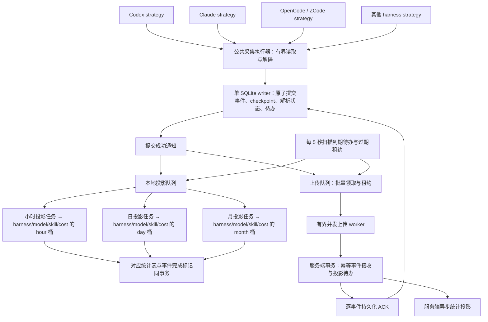

# Harness 并发采集与事件同步设计 v2

完整客户端/服务端实现方案和服务端 DDL 已补齐，后续以 [重构技术方案 v1](event-pipeline-refactor-technical-plan-v1.md) 为总入口。2026-09-12 用户确认仍在内测、旧数据不迁移：空库初始化后直接启用新链路，删除历史兼容与双协议过渡设计。正常运行后的事件保留、幂等和断点续读规则不变。

状态：按 2026-09-11 用户明确的目标架构收敛，尚未实施。本轮收敛为 10 张表、183 个字段；每表统一 id、created_at、updated_at、delete_at、extra，events 聚类为 23 列，本地不持久化账号：小时/日/月按 grain 合表，统计和上传异步消费，明细按首次创建时间保留 14 天。删表与删字段的逐项依据见 [精简审查](schema-simplification-review-v1.md)。本文替代上一轮调研中“继续以日快照作为长期上传主链路”的建议；保留其中的一致性问题与验收要求。

## 1. 目标与保证

不同 harness 的采集任务独立并发，统一转为内部事件，先可靠写入本地数据库。统计投影与服务端上传异步执行；提交后的通知触发及时处理，每 5 秒的持久队列扫描负责补偿遗漏通知、失败和租约超时。

语义是 **至少一次投递 + 幂等接收/投影**，不是承诺网络只传一次。在 14 天明细保留窗口内，进程崩溃、响应丢失、同批重复请求、多个上传 worker 竞争时允许重试，不允许重复累计或确认未收到的数据；超过窗口按明确的过期规则结束本地处理，不标记为成功。

必须满足：

- 源 checkpoint 只越过已持久化的事件、解析状态及有明确处理结果的记录。
- 不同 harness 不共用覆盖整个读、解码过程的全局锁；同一有状态流只有一个在途推进任务。
- 落统计表与已处理标记同事务；服务端接收 ACK 只在事件事务提交后返回。
- 采集、落统计表、上传有各自状态，互相失败不造成数据丢失。
- 本地仅保存本机采集事实，事件、任务和统计都不持久化账号；同步时从认证上下文识别账号，由服务端确定归属。已 ACK 的事件不因换号重传。
- events 作为细节表，按本地首次创建时间 created_at 保留 14 天；occurred_at 不参与过期计算，不为未完成事件另设延期明细存储。
- 时间选择顺序：记录自身有效时间 → 同文件前一条有效源时间 → 读取时原始文件 mtime；在 payload_json.meta 标记 time_source。按选定时间执行北京时间当天准入，源明确给出的历史时间不能被兜底覆盖。前序锚点放入同流 decoder_state，和游标同事务提交。禁止补 1970 或当前时间；已准入事件跨日继续原有统计/上传重试。缺少逐条源时间时不承诺真实日期精确，边界见时间规则。

时间准入、缺失时间修复及真实样本证据见 [事件时间与当天采集准入规则 v1](D:/ProgrammingProjects/TokenDance/docs/event-time-admission-v1.md)。该规则替代本文之前允许任意历史事件首次补采的建议。

## 2. 处理链



“单 writer”表示 SQLite 写事务有统一入口，不表示读取/解码/HTTP 串行。writer 不执行外部网络、Agent 文件读取或耗时解码；投影也以有界批次提交。UI 使用短读事务或缓存快照。

## 3. 事件抽象与幂等

用户已明确不需要 accuracy=estimated 的用量：不计入统计、不展示、不保留对应聚合列；Token 统一 exact+derived（可验证的确定性推导）。策略将估计用量作为明确 ignored 结果处理，保留必要诊断和读取进度。价格表计算费用的 cost_source 与用量 accuracy 分开，仍按独立费用规则处理。

内存/传输协议用公共事件头和类型化 payload；本地保存可检索头字段、payload_json、status_json，不再复制整份 envelope。payload 使用有类型的枚举：`UsageRecorded`、`CostRecorded`、`SessionStarted`、`SessionEnded`、`ToolInvoked`、`SkillInvoked`、`CodeChanged` 等；更正使用明确的事实版本/撤销语义，不能把同一记录的所有快照当作可累加的新请求。

| 字段 | 含义 |
| --- | --- |
| event_id | 一次不可变事实版本的幂等键；重试、换批次、重新扫描不改变。 |
| fact_key | 同一逻辑事实身份，用于定位更正对象与同键串行处理。 |
| fact_revision | 可比较的事实版本；不是软件版本、轮询批次号或发送次数。 |
| schema_version | 内部事件协议版本。 |
| harness_id / adapter_version | 来源策略及解析实现版本；adapter 升级本身不生成新的事实身份。 |
| collection_source_id | 本地采集流的整数外键；跨端幂等使用稳定来源身份 source_key，不使用这个本地行号。 |
| occurred_at / observed_at | 选定的事件时间、采集观察时间；前者优先源记录时间，缺失时按同文件前序有效时间、原始文件 mtime 兜底，观察时间不参与稳定事件身份。 |
| time_source | payload_json.meta 内的时间依据：source_record、previous_record、file_mtime；不改变用量 accuracy。 |
| session_key / turn_key | 可选关联维度，不要求原始数据按会话分文件。 |
| accuracy / payload | 精度与经过隐私白名单校验的结构化事实。 |
| content_hash | 确定性序列化后摘要，用于检测同 ID 不同内容。 |

幂等键的逻辑组成：

```text
fact_key = HMAC(device_identity_key,
                canonical(harness_namespace, logical_source_scope, native_record_key, fact_kind))
event_id = HMAC(device_identity_key, canonical(fact_key, fact_revision))
```

必须使用带类型/长度边界的规范化编码，不简单拼接可能包含分隔符的字符串。设备身份密钥保持稳定。路径、会话 ID、raw 文本不直接上传；内部标准事件只包含明确允许同步的统计信息。

策略负责提供稳定 `native_record_key`：优先源原生 ID，JSONL 无原生 ID 时才使用持久来源身份、完整记录位置及必要的内容校验。通用来源表不设置重置代次，正常追加不改变来源身份。若来源与已提交游标不符，先停止该来源推进并记录诊断，不自动重置游标或更换事实身份；具体恢复规则需基于已验证的 harness 行为。跨多个采集源可能出现同一事实时，策略需提供共同事实键或声明唯一权威源，公共层不能自行猜测去重。

版本与增量读取规则：

1. 普通完成明细固定 fact_revision=1，event_id 由稳定来源和原生记录身份决定。保留期内重复读取由 events 的唯一键判重，沿用已有 occurred_at 和 created_at；相同 ID 的不同事实内容仍报冲突。
2. 仅有可靠原生修订号且能撤回旧贡献的来源才支持更正。使用原生顺序和 14 天内仍存在的事件，不再通过永久身份表分配本地版本；缺少旧贡献不能直接叠加快照。
3. 正常 JSONL 从持久化字节游标继续读取，SQLite 按查询流的已提交进度增量读取或有界复查。源游标、解析基线与新事件同事务提交；重启恢复进度，明细清理不删除来源游标。
4. 删除 event_identity_ledger，不以 extra、decoder_state 或其他表保存同等的永久逐事件身份集合。decoder_state 仅保留读取流必要的时间锚点、计数基线和有限复查进度。
5. 本地不提供在保留旧统计的原库中任意从头重放的能力。需要重新开始采集时采用重新安装并重新初始化本地数据的流程，重新采集产生新本地统计，不与旧库累计结果叠加。普通更新和重启不能自动回绕游标；本轮不执行任何重装或清库。

接收规则：相同 event_id + 相同 content_hash 返回 duplicate ACK；相同 event_id + 不同 content_hash 返回明确冲突并隔离，绝不能静默忽略。服务端以事实最新版本进行投影；乱序旧版本可以持久化为已接收但不能覆盖新版本或再次累加。统计计算应按最新事实重算受影响的日期/维度，或在同事务内应用可证明正确的替换差额。

content_hash 覆盖规范化后的事实语义字段，不覆盖每次扫描变化的 observed_at、本地 created_at、上传时间、尝试次数和诊断性 adapter_version；首次接受后冻结的事件头和 payload 不因重试重新生成；status_json、created_at、updated_at、delete_at、extra 不进入业务摘要。请求签名仍保护整个传输 body。更正改变日期或维度时，旧归属和新归属都必须进入投影重算集合。

## 4. 本地表与事务边界

完整字段、约束、初始化语句和索引统一收录在 [本地事件流水线完整 DDL v3](event-pipeline-ddl-v3.md)，共 10 张表。每表前五列统一为 id、created_at、updated_at、delete_at、extra，业务键保留 UNIQUE，每个字段有注释。本地不保存 account_id，也不在 JSON 中保存账号。认证和设备注册仅由上传流程使用，schema_meta 复用现有设施。

| 表 | 核心内容 |
| --- | --- |
| collection_sources | 来源、流、游标、解析状态、commit_seq、调度租约；忽略记录数及最近原因。 |
| events | 23 列；14 天标准细节，payload_json 按业务分组，status_json 的 hour/day/month/upload 独立。 |
| processing_tasks | 每个事件/consumer 的租约、重试时间、次数、错误；不保存完成状态副本。 |
| model_dimensions | provider + model 身份与 unknown 模型。 |
| skill_dimensions | 稳定匿名技能身份与展示标签。 |
| harness_metrics | 会话、轮次、工具/技能次数、消息、代码、活动。 |
| model_metrics | Token、覆盖、模型请求；按模型求和得到工具用量，包含 unknown。 |
| skill_metrics | 各技能调用、成功/失败、耗时。 |
| cost_metrics | 每笔有效费用只归一个模型和币种；按模型求和得到工具金额。 |
| bucket_entity_state | 粒度内会话/轮次去重与时长选择所需的最小实体状态。 |

事件进入 `events` 就代表已持久化，不增加容易失真的 `stored=true`。用户所说“是否落表”对应 status_json 的 hour/day/month，上传对应 upload；同一个 JSON 内仍是四个独立状态。更新使用 json_set 修改单一路径，禁止按旧快照整块覆盖。processing_tasks 只保存租约、重试等执行信息，避免另存一套相互不一致的完成状态。

本地接收事务包含：

```text
检查来源身份、期望 checkpoint 的 commit_seq 与本次租约是否仍有效
→ 根据稳定 event_id 查询仍在保留期的 events；重复记录复用冻结身份与时间
→ 新事实核验选定时间，仅准入北京时间当天；否则累计忽略计数并保留必要解析状态
→ 对已证实支持修订的来源核验版本顺序；普通完成明细固定版本 1
→ 插入标准事件
→ 插入三个统计待办和上传待办；未登录只暂停上传执行
→ 保存 decoder_state 和 typed checkpoint
→ COMMIT
→ 发出唤醒通知（通知失败可由 5 秒扫描恢复）
```

无法登录时仍采集和统计；上传流程在执行时读取当前认证上下文，本地不存在账户认领或归属迁移。HTTP 请求固定发起时的认证上下文；返回仅能更新匹配 event_id/content_hash/lease_token 的任务，不能因切换账号重新生成事件身份或重传已 ACK 事件。服务端需用稳定设备/事件身份防重，已接收事件不因换号再次入账或转移归属。现有账号绑定协议在实施时需要对齐。

每张表的 created_at 首次写入后不变；updated_at 在实际更新时由 writer 同事务维护。delete_at 为可空软删除时间，extra 为默认空对象的本地扩展 JSON；extra 不承担业务 payload、任务状态、账号或凭据，也不默认上传。不增加通用更新时间触发器或五字段索引。

解析返回 `accepted / ignored / rejected / retryable` 及候选下一状态；禁止 `Err(_) => {}` 后直接推进。临时错误保留重试边界；永久不支持/非法记录在来源表累计忽略计数和最近原因，与游标一起提交；详细位置复用现有日志，不存额外诊断明细表。适配器不得在本地事务成功前永久改变驱动或解析状态。

### 4.1 小时、日、月异步定时统计

用户后续确认小时/日/月可以合表：同一统计主题共用一张表，以 grain=hour/day/month 和 bucket_start 区分，唯一键和范围查询均带 grain。完整指标、四张主题表与索引见 [统计表设计 v3](D:/ProgrammingProjects/TokenDance/docs/statistics-model-and-indexes-v3.md)。合表不合并三个消费任务，事件仍独立维护三个统计状态。

三个粒度是三个独立 consumer，均使用公共 `AggregationRunner<BucketStrategy>`；策略只定义桶边界、维度和指标。采集事务不更新统计表。任务每 5 秒扫描一次各自到期未完成事件，以有界批次工作；小时/日/月是分桶粒度，不表示必须等该小时/日/月结束才计算。任务周期可单独配置，任务池需保证三个粒度都能获得处理名额。

初版三个任务直接消费标准事件，不让月统计依赖日任务成功、日统计又依赖小时任务成功。这样某个粒度任务暂时失败，其他粒度和上传可以继续。三个消费者通过任务到期索引和有界批次工作；同桶贡献批量合并，不新增分层汇总或版本切换表。

单个统计批次：

```text
按本 consumer 状态、重试到期时间、id 领取有界批次
→ writer 事务校验租约、事实顺序、事件状态、未软删和未过期
→ 读取最新实体状态，计算并更新本粒度实际贡献
→ 将对应事件状态标记 applied（或明确 not_applicable），删除本任务
→ 提交
```

相同事件对同一消费者只能应用一次；更正还需撤回该消费者已应用的旧贡献。失败回滚统计值和状态；租约失效的任务不能提交。小时桶用 UTC+8 小时起点，日/月桶分别用当地日首和月首，均按 occurred_at 归属；三个任务共用同一日期边界实现。唯一键包含 grain、harness、桶及规范化维度键，不含账号，不能将多种维度混进无约束 JSON。

Token、费用等可加指标按贡献计算；会话数、活跃时长、去重请求等不能简单将每事件 count 相加，也不能直接把小时去重数加成日/月去重数。各指标必须定义对应粒度的去重键、区间合并或等价算法。

界面通过各消费者积压和统计 updated_at 表达刷新情况。当前不增加全局 applied_through 表；最大已处理事件 ID 不能证明前面没有失败缺口。需要固定范围对账时，先确认该范围相关任务全部完成，再比较各粒度结果。

### 4.2 按创建时间保留 14 天细节

按用户明确要求，事件细节从**本地首次创建时间 created_at**起保留滚动 14 天（336 小时）：

```text
created_at = 事件首次成功写入本地 events 的时间（UTC）
expire_at  = created_at + 14 days
occurred_at = 优先源记录时间，否则按前序有效时间、原始文件 mtime 兜底；决定准入及统计归属
```

例如今天发生且今天首次入库的事件，从首次入库起保存 14 天；昨天发生、今天首次采到的事件直接丢弃，不创建本地明细或任务。重复采集、失败重试、修改处理状态和重新上传不得刷新 created_at 或延长 expire_at；已合法入库事件跨日后继续重试。同一事实的新修订也需要通过首次准入规则，不能借修订补入被拒绝的历史用量。

不增加过期明细归档或未完成事件延期存储。清理任务通过 expire_at 索引小批量处理 `expire_at <= now`，必须包含 delete_at 非空的软删除明细，过期条件不取决于 occurred_at，也不因处理失败无限延长：

1. 在短 writer 事务中终止过期事件的执行任务/租约，删除对应明细和任务元数据；已经生成的小时、日、月统计不删除。
2. 对到期仍有未完成消费者的事件，在对应来源累计 expired_incomplete_event_count；每个事件只计一次，详细错误沿用已有日志，不保留完整事件副本，不将它们标记为 applied/acked。14 天窗口内使用重试、积压监测和临近过期优先处理，减少到期未完成项。
3. 领取任务时排除过期事件；在途任务提交前再次检查事件存在、未过期及租约有效。清理之后迟到的 ACK/失败响应只能忽略，不得重新插入明细或改变已失效任务。
4. 时间判断使用受保护的 UTC 时间基准，系统时钟异常前跳不能未经检测就触发整批清理。清理按小批次执行，避免长期持有 SQLite 写锁。

事件明细及其完整 payload 的保留上限是 14 天；此前提到的独立异常待办转存方案取消。未完成数据超过保留窗口后不再承诺本地恢复重试，这属于保留策略到期，不是上传成功。未登录期间采集的事件使用同一创建时间窗口。

长期统计按桶/维度保留，collection_sources 的读取进度不随明细清理。事件物理删除后不再保存它的逐事件身份副本；正常采集依靠游标避免重新读取已提交部分，保留期内的重复由 events 唯一键处理。

历史统计不会随 events 裁剪清空。当前库不承诺删除明细后仍可从头回放并精确去重。需要本地重新采集时走重装/重新初始化流程；已有事件的有限修正必须有旧贡献，不能拿剩余 14 天数据覆盖完整历史。

## 5. 状态、并发和 5 秒补偿

上传状态：

```text
pending → inflight → acked
             ├→ retry_wait → inflight
             ├→ blocked（认证/设备状态，条件恢复后重排）
             └→ quarantined（身份冲突或明确不可恢复数据错误）
inflight 租约超时 → 可重新领取
```

投影使用独立的 pending/inflight/applied/retry_wait/quarantined；“统计表写入”和 applied 标记同事务，重试不二次累计。每个粒度只保存一份已提交统计。修复仅针对有完整已准入事实或可信基底的范围，暂停对应消费者，在事务内替换桶、实体状态和事件状态；失败回滚。不保留多版本热切换表。

领取规则：

- 在短 SQLite 写事务中查询到期待办、分配唯一 lease_token 和过期时间，再提交；网络请求在事务之外执行。
- 多个 worker 只能领取不同的有效租约。同 fact_key 的版本在客户端优先保持发送顺序；服务端仍须正确处理因超时重试产生的乱序。
- 完成、失败、延期更新必须匹配 event_id、内容摘要和本次 lease_token，并检查事件/任务未软删、事件未过期。旧 worker 的失败响应不能把新 worker 已 ACK 的任务退回 retry。
- 工作耗时超过租约时续租或允许再次领取；两种方式都依赖服务端幂等，租约不是唯一正确性保证。
- 新提交及时唤醒；5 秒调度器只负责扫到期任务与过期租约，禁止每个 tick 无限制创建新任务。worker 池和队列有上限。
- 指数退避加 jitter，遵守服务端 Retry-After；5 秒是检查频率，不是每条失败事件固定每五秒轰炸一次。

按状态和游标扫描的准确含义：新事件可用 id 做 keyset 分页；processing_tasks 对 `(consumer,runnable_at,event_row_id)` 和 `(consumer,lease_until,event_row_id)` 分别建部分索引，扫描到期待办与过期租约，并核对 events 的对应状态。任务到期索引只覆盖 delete_at IS NULL，租约回收仍覆盖软删在途任务；四个 JSON 状态不分别建索引。先有界取任务，再按事件主键校验状态。不能长期只查 `id > last_cursor`，否则低序号失败任务永远回不来。分页 cursor 是单轮扫描位置，不是已确认水位；下一轮从当前到期集合重新选择。扫描必须排除 expire_at 已到期的事件，过期任务由清理流程终止。

初始可配置值：全局读取/解码 worker 4、每 harness 活跃流配额 1–2、上传 worker 4、每批上限 100–500 条并受总字节数约束。仅作为测量起点。来源活跃与历史扫描保留公平配额，错误来源不能占满全部 worker。

积压超过存储预算时暂停推进相应源并报告状态，不提前删除保留窗口内的待传事件；到期明细统一按第 4.2 节清理，不建立额外延期存储。必须明确磁盘不足、Agent raw 自身裁剪时的恢复边界。

## 6. 服务端幂等与并发接收

数据库唯一键 `(installation_id, event_id)` 是跨实例正确性边界。按幂等键/事实键加锁可以减少重复计算，但不依赖内存锁或 Redis 锁保证不重复写账。

批量请求流程：校验签名、请求和安全 payload → 事务内核验有效授权 → 唯一键接收及内容一致性判断 → 同事务生成投影待办/dirty key → 提交 → 返回逐事件结果。accepted 和 duplicate 都表示事件已可靠存在；rejected/conflict 与 retryable 必须可区分。传输层 nonce 每次请求更新，event_id 不变。

服务端 ACK 返回与请求精确对应的 event_id/content_hash/结果；只有经过核验的 accepted/duplicate 才确认本地记录。超时属于结果未知，使用同一事件 ID 重试。ACK 表示服务端事件持久化，统计页面可能仍在异步刷新，UI 要区分这两种进度。

现有 `CommitIngest` 在整个批次期间 `FOR UPDATE` 锁 installation 和 user，同账户请求事实上串行。需缩小锁范围并保留撤销/封禁的事务语义，例如采用兼容并发接收的授权读锁协议或经验证的状态版本协议；不能简单删锁后只做一次非事务查询。同事实更新按 fact_key 局部协调，批次涉及多个键时使用一致顺序减少死锁；死锁和短暂数据库错误可幂等重试。

### 6.1 服务端按事件时间过滤

过滤使用事件 occurred_at，与什么时候重放、上传或接收无关。客户端重试保持原事件时间和 event_id；不使用本地 created_at 或重装时间重新给历史事实归日。服务端按自身明确的事件时间接收范围决定接受或过滤，时间范围内重复仍由稳定设备/事件唯一键判重。

完整技术方案建议服务端接收北京时间今天及此前 14 个日期，覆盖本地首次创建后 14 天内的正常重试；这是独立的服务器时间策略，不改变本地 TTL。不能把“已收到的最大 occurred_at”直接当作之前所有事件已经完成的水位，因为并发上传可乱序。窗口外返回明确过滤结果，不伪装为新接收事件的 ACK。

时间过滤无法替代同一时间范围内的身份判重。重新安装后的同步继续使用源事件时间；若设备身份也被重置，需要服务端设备绑定策略界定身份范围，不能声称仅凭时间自动识别全部同日重复。

## 7. 策略与公共模板

使用 trait + 组合形成模板流程，harness 策略只表达来源差异，不各写一套采集/重试/上传系统：

```text
HarnessStrategy
  discover()                         → source/stream descriptors
  capabilities()                     → append-only / mutable / decoder state 等
  read_batch(checkpoint, budget)      → bounded records + observed boundary + has_more
  normalize(record, decoder_state)   → fact candidates + candidate decoder state
  identity(candidate)                → logical source / native key / version semantics

CollectionRunner<S>
  调度 → 隔离流 → 调用策略 → 公共校验/隐私过滤
  → writer 原子提交 → 更新运行状态 → 唤醒投影/上传

公共服务
  JsonlReader / SqliteReader、IdentityService、LocalWriter、ProjectionRunner、
  AggregationRunner<BucketStrategy>、EventWorkRepository、UploadWorkerPool、
  RetryScheduler、RetentionWorker、Diagnostics
```

SqliteReader 不统一假设所有表是 append-only。策略声明 completed 过滤、可变行复查和可靠变更版本；JSONL 不通过产出事件数判断 EOF。公共执行器负责预算和状态协议，策略不直接写业务表、不直接发 HTTP、不修改已提交 checkpoint。

## 8. 现有代码复用与内测直接启用

已有可复用骨架：

- [EventEnvelope / EventPayload](D:/ProgrammingProjects/TokenDance/collector/crates/protocol/src/lib.rs:1)。
- [sync_delivery 租约队列](D:/ProgrammingProjects/TokenDance/collector/apps/desktop/src-tauri/src/local_store/sync.rs:280)，复用其领取/重试思路，收敛为通用 processing_tasks；完成状态放在 events.status_json，删除本地账号绑定依赖，并强化 lease_token、迟到响应和 ACK 内容验证。
- [服务端事件唯一键](D:/ProgrammingProjects/TokenDance/server/internal/migrate/migrations/0001_tokendance_server.sql:181)。
- [事件批量事务接收](D:/ProgrammingProjects/TokenDance/server/internal/store/mysql/ingest.go:52)，但当前重复事件不检查内容冲突，且设备/账户锁过粗。

不能直接恢复旧事件上传开关：[当前统计查询](D:/ProgrammingProjects/TokenDance/server/internal/worker/aggregation.go:37) 在同设备同日期存在日快照时排除事件。因此事件可能上传成功却不增加展示用量。

本次内测不迁移旧采集和统计数据，直接采用新事件链路：

1. 停止旧采集、日快照上传、业务 WAL 重放、聚合和缓存发布任务；服务端全局拒绝旧事件与日快照上传。
2. 本地初始化空的新事件库，不转换旧游标、解析状态、事件、任务或统计，不保留旧历史查询入口。
3. 服务端目标业务表初始化为空，清理旧明细、快照、统计、排行榜/community 结果及其发布待办和统计缓存；仅使用新事件生成新统计。
4. 账号、登录、设备身份和配置继续复用，不纳入统计重置；Agent raw 只读保留。首次从 raw 恢复必要基线，只准入北京时间当天事实，不导入旧库记录。
5. 不需要逐设备切换日期、协议模式、历史 ACK 清单、数据转换脚本或双协议握手。一次性初始化由现有 schema_meta/数据库版本设施记录完成，之后重启和普通升级恢复新库进度，不能再次清新数据。

详细启用顺序、清理范围和验收见完整技术方案第 10 节。本轮仅改设计文档，不执行数据删除。

## 9. 实施阶段与验收

1. 明确 typed event、身份与更正规则、三个粒度统计状态及独立上传状态、新 ACK 契约，补故障复现测试。
2. 抽取公共 reader/runner，先打通一个 JSONL 和一个 SQLite 策略；让 source state 与事件原子提交，再扩展全部 harness 并发。
3. 按 grain 合表的统计主题表和小时/日/月公共定时任务、事件处理状态、批量租约和并发上传；5 秒补偿、按创建时间保留 14 天的细节清理、过期任务终止、退避、背压同时完成。
4. 服务端内容冲突检测、幂等投影和并发锁改造；停用旧入口和工作器，空库直接启用新事件链路。
5. 故障注入与性能测试通过后再按仓库部署规则发布。

验收必须覆盖：重复采集/上传不增账、同 ID 不同内容报冲突、低序号失败可重试、ACK 丢失、租约超时重领、迟到响应不能回退状态、同步认证切换、事务中断、decoder 恢复、可变 SQLite 行晚完成、乱序更正、正常启动/升级不回绕游标，清理明细不丢来源进度，以及旧客户端被拒绝、旧待办和缓存不回填、初始化完成后不重复清库。通过队列年龄、阶段耗时、吞吐和实际重复处理量判断性能，不用“开了线程数”代替测量。

新增统计与保留验收：跨小时/午夜/月末统一归桶；单粒度失败不阻塞其他粒度；重试不二次累计；统计与状态提交间故障回滚；created_at + 14 天边界前后清理；首次发现的非当天历史不准入；此前已合法入库的记录仍从首次创建起保留 14 天；同一库内的重试不刷新 created_at；窗口内离线恢复可重试；到期未完成任务记录过期数量但不伪造成功；清理与在途 ACK/投影竞争不会恢复过期明细；裁剪后历史小时/日/月值保持；不存在额外延期保存完整事件的路径。

## 10. 公共字段的删除与扩展约定

普通列表、统计读取和任务领取过滤 delete_at IS NULL；来源/维度身份查找、保留期内事件判重和历史维度引用仍包含软删行。业务唯一键不包含 delete_at，不改为仅未删唯一，因此软删不释放事实、来源或桶身份。采集和重试不得自动复活软删行。

软删除不触发外键级联。停止事件处理时，writer 同事务标记事件并取消任务/租约；回写再次检查未软删。统计/实体状态的删除必须有同步贡献处理，公共字段存在不等于新增自动删除功能。事件满 14 天仍物理删除，任务随外键级联；来源游标和历史统计不随事件窗口删除。

完整 DDL 中已给出五列类型、默认值、注释和 JSON 检查。额外字段不作为隐私 raw 归档，也不存放可从既有状态直接推导的副本。
