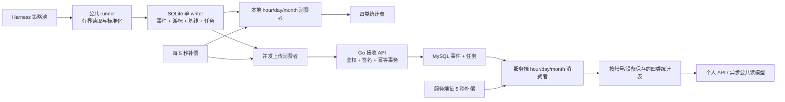

# 采集、事件同步与统计重构技术方案 v1

状态：设计稿，2026-09-12 修订。覆盖 Rust/Tauri 客户端、Go/MySQL 服务端和现有统计接口；尚未实施或发布。项目仍在内测，用户已确认旧采集和统计数据不需要迁移；本方案采用空库初始化、直接启用新事件链路。

## 1. 目标、边界和交付物

数据链路改为：**各 harness 并发采集 → 标准事件本地提交 → 本地小时/日/月统计与并发上传独立执行 → 服务端幂等接收 → 服务端异步统计 → 现有页面、排行榜和社区读模型。**

本地持久化是采集的成功边界；服务端接收事务提交是上传的成功边界；各粒度统计事务提交是各自的统计成功边界。允许至少一次投递，通过数据库唯一约束和同事务完成标记使结果只累计一次。

| 已确认要求 | 实施约束 |
| --- | --- |
| 不同 harness 并发 | 公共 runner 调度独立策略；文件/查询流内有状态处理有序；SQLite 写入仍由单 writer 提交 |
| 先本地落事件，再异步处理 | 事件、来源进度、解码基线和消费者任务同一事务落库 |
| 每 5 秒补偿 | 扫到期任务与超时租约；成功提交另发内存通知，通知丢失不丢任务 |
| 小时、日、月可以放同表 | 每个统计主题一张表，以 grain 区分；三个消费者各自完成，不逐级依赖 |
| 明细保留 14 天 | 从本地首次 created_at 计时；更新、上传、软删除不续期；到期物理删除，即使处理未完成 |
| 历史首次采到直接丢弃 | 首次准入按选定 occurred_at 的北京时间自然日判断；已入库事件允许跨日重试 |
| 时间兜底 | 原记录有效时间 → 同有序文件前序有效源时间 → 读取时原文件 mtime；禁止 1970 和采集当前时间兜底 |
| 不需要 estimated 用量 | Token 只取 exact + 可验证 derived；代码/技能 correlated 分列；价格表计算费用单独表达 |
| 本地不感知账号 | 事件、来源、任务、维度、统计及 extra 都不保存账号；同步时使用当前认证上下文 |
| 全表公共字段 | 所有本次新建/重构的表均有 id、created_at、updated_at、delete_at、extra，且所有字段有注释 |
| 拒绝冗余设计 | 不恢复 data_owners、sync_targets、source_generation、fact_versions、event_identity_ledger 或投影代次表 |
| 内测旧数据不迁移 | 丢弃旧采集明细、游标、待办和统计；不做历史导入、双协议过渡、切换日期或旧库兼容读取；登录和设备注册设施继续复用 |
| 不做原库任意历史重放 | 普通重启/升级恢复游标；确需重新采集，通过重新安装并初始化本地数据，不叠加旧库统计 |

本轮不涉及 Teams 产品、聊天内容采集、跨设备私有会话自动合并、历史估算修复或通用数据湖。原始提示词、代码正文、完整路径、凭据不进入同步协议。

配套规范：

- [本地完整 DDL](event-pipeline-ddl-v3.md)、[SQLite SQL](event-pipeline-schema-v3.sqlite.sql)：10 张本地业务表。
- [服务端完整 DDL](event-pipeline-server-ddl-v1.md)、[MySQL SQL](event-pipeline-server-schema-v1.mysql.sql)：本次服务端新建和重构表的目标结构。
- [统计计算契约](metric-contract-v1.md)：公式、去重、时长与费用选择、验收样例。
- [统计口径与索引](statistics-model-and-indexes-v3.md)：现有页面/API 需要什么数据。
- [时间与当天准入](event-time-admission-v1.md)：原始数据时间证据和兜底规则。
- [精简审查](schema-simplification-review-v1.md)：删表依据。

这些是同一份方案的分册，不要求实施者重新选择架构。旧调研中的日快照长期主链路、全局重建和代次方案已被替代。本文新增的服务端接收窗口、并发数、批量大小是**实现建议值**，不是已测生产容量。

## 2. 当前实现及必须解决的问题

下列是当前工作区代码行为；目标设计与现状分开，不能把已有旧事件 API 当作新协议直接使用。

| 当前代码位置 | 现状/问题 | 重构处理 |
| --- | --- | --- |
| collector/apps/desktop/src-tauri/src/daemon/mod.rs、state.rs、auto_sync.rs | 采集和上传分别运行；桌面上传以日快照为主；ProductionService 共享锁包住较长工作 | 保留独立循环，拆除覆盖源读取/解码/HTTP 的大锁 |
| collector/crates/acquisition/src/jsonl.rs | 从 offset 读剩余文件，再按帧数截断；大积压会重复读取后缀 | 字节、记录数和耗时三重预算；完整记录才推进 |
| collector/apps/desktop/src-tauri/src/rebuild.rs | 是否追平受解码事件数量影响 | 由 driver 返回 raw EOF/has_more；上下文行或 ignored 不等于 EOF |
| collector/crates/acquisition/src/drivers.rs | SQLite 每拍全库内存快照；多查询游标折叠；部分查询只筛 completed 且用 rowid 推进 | 只读短事务查询；每查询流独立游标；可变行必须复查 |
| 同上，ZCode model_usage 查询 | 低 rowid 尚未完成、高 rowid 已完成时可能越过低行 | 先按所有行推进发现边界，再保存未完成行的有限复查集合 |
| 同上，part 查询 | time_updated 单字段游标可能跳过相同时间戳的其他行 | 使用 (time_updated,rowid) 严格复合排序，并处理已发现未完成行 |
| collector/apps/service/src/lib.rs | 解码错误可以被吞掉后继续推进 | 明确 Emit/ContextOnly/Ignore/RetryableError；只有明确结果可提交进度 |
| collector/adapters/opencode、zcode | 数字 SQLite ID 被当字符串读，回退批内序号导致撞键 | 保留工作区已有数字 ID 修复；用真实数字 fixture 覆盖全量后增量 |
| local_store/mod.rs、state.rs | 当前 v7 重扫与清聚合可能遇到“明细短保留、旧指纹长期存在”；重扫意图可能过早清除 | 本次内测初始化空事件库，不转换旧进度；新库启用后重启和普通升级只恢复已提交进度 |
| local_store/sync.rs 等 | 按日期的 ACK 水位可能覆盖尚未确认的内容 | 新链路彻底取消 ackThroughDay；只按 event_id + hash 精确确认 |
| server/internal/store/mysql/ingest.go | 接收对 installations、users 使用 FOR UPDATE；重复事件不核对内容 | 授权共享锁、唯一键竞争、逐事件内容冲突判断；不在接收事务聚合 |
| server/internal/worker/aggregation.go | GET_LOCK 全局串行；按明细/日快照重建用户日统计 | 停用旧投影，清理旧统计；新事件按任务和统计桶并发 |
| server/internal/store/mysql/device.go | 同公钥绑定其他账号返回 PublicKeyConflict | 新协议支持经当前登录与设备证明的重新绑定；历史事件归属不迁移 |
| server/internal/store/mysql/window_scores.go | 清 dirty 时直接令 applied_version=dirty_version | 并发刷新必须确认领取时的版本，不能吞掉执行期间新变更 |

现有迁移、旧 WAL、旧服务器 raw events 不是新事件库的第二份真相。新链路启用后，业务事件可靠队列只保留 SQLite events + processing_tasks；SQLite 自己的 WAL 仍是数据库实现机制。

## 3. 全链路结构



并发是有界的。各 harness 公平轮转，一个大 SQLite 或巨大 JSONL 不能占满全部额度。读源/解码占采集池，HTTP 占上传池，统计计算占独立池；SQLite writer 只收短事务命令。不要给每个事件创建一个无限存活的协程。

### 3.1 初始运行参数

| 参数 | 建议初值 | 限制目的 |
| --- | --- | --- |
| 采集并发 | 全局 4，每 harness 最多 2，每流 1 | 保证不同工具均能推进；按机器核数和实测调整 |
| 单次源读取 | 256 条完整记录 / 1 MiB / 50 ms，先到为止 | 不把 decoded event count 当原始工作量 |
| 单条原始记录 | 上限 4 MiB，流式读取 | 超限记录有明确忽略结果；不为坏数据无限分配内存 |
| writer 单事务 | 最多 256 事件或 2 MiB 待写数据 | 不在 writer 里等待网络；大投影组另行限流 |
| 上传 | 4 个在途批次；每批最多 200 事件、未压缩 512 KiB | 服务端建议上限 500 事件 / 1 MiB；超大单事件独立拒绝 |
| 任务领取 | 每 consumer 每次 200 条 | keyset 扫描，不 OFFSET，不保存永久“已扫最大 ID” |
| HTTP 超时 / 任务租约 | 15 秒 / 30 秒 | 长任务每 10 秒用同令牌续租；租约不是业务幂等依据 |
| 重试 | 初次 5 秒，之后指数退避至 5 分钟，带抖动 | 每 5 秒检查哪些已经到期；尊重 Retry-After |
| 清理 | 每分钟，最多 500 事件一事务 | 不阻塞采集；完成后立即续批并让出 writer |

补偿间隔固定 5 秒不表示所有失败都每 5 秒重打服务端。401/未登录会阻塞 upload，认证恢复按 upload 任务索引有界重新排队；不扫描所有事件 JSON。SQLite 忙、HTTP 429/5xx、超时分别计量，不能用一个通用错误触发全库重建。

## 4. 客户端职责划分

### 4.1 策略接口与公共模板

以下是目标接口职责，不要求逐字采用类型名：

```rust
trait HarnessStrategy {
    fn discover(&self, budget: DiscoveryBudget) -> Result<Vec<SourceSpec>>;
    fn read(&self, source: &SourceSpec, committed: &Checkpoint,
            budget: ReadBudget) -> Result<RawBatch>;
    fn decode(&self, record: &RawRecord, candidate: &mut DecoderState)
              -> Result<DecodeOutcome>;
    fn native_identity(&self, record: &RawRecord, fact: &Fact) -> NativeFactKey;
}

enum DecodeOutcome {
    Emit(Vec<Fact>),
    ContextOnly,
    Ignore(IgnoreCode),
}
// I/O、暂不支持的结构或无法确定边界等错误通过 Result 返回，不伪装成空事件。
```

策略只负责发现、源读取方式、原生身份、原生时间和语义解析。公共 runner 负责租约、预算、时间准入、规范化、隐私白名单、业务键、落库、通知、重试和指标。统计计算器只消费标准事实，不再用 if harness == ... 修正输入口径。

流程：领取 collection_sources → 复制已提交 checkpoint/decoder_state → 在事务外读取和串行解码同流记录 → 形成候选进度与事实 → 交给 writer → CAS 提交 → 成功后替换内存已提交状态。任何失败都保留上次提交状态。

不可序列化的全局 decoder 缓存需要拆为每流状态。需要跨来源关联时，由策略明确唯一权威来源或稳定公共事实键；不能让几个 parser 的到达顺序决定身份。每个来源格式/版本都要有 capability 和 fixture，而非仅凭工具名字选择 SQL。

### 4.2 JSONL 与 SQLite

JSONL 正常从已提交字节 offset 续读；发现器只使用 mtime/size 等判断是否值得调度，不把 mtime 当事件 ID。读到未换行末尾不提交这条记录的 offset，等待写完；有完整换行的结构坏行可明确 Ignore 并计数。语义暂不支持或边界不明时阻塞该流，不能吞异常。

若源大小小于 cursor 或身份明显不符，停止该流并记录 source_changed。通用表不增加“第几代”，不自动回到 0，也不自动给旧行换身份。正常会话文件按持久追加处理。

SQLite 使用只读连接和短读事务读取实际源（包含正常 WAL 可见数据），不以 immutable 模式读取正在写的库，不每 5 秒备份全库。确有必须备份的来源才由特定策略在数据变化时使用受限快照，备份耗时和字节数单独监控。

| 源模式 | checkpoint 内容 | 推进规则 |
| --- | --- | --- |
| 不变完成行追加 | last_rowid | 按 rowid 排序，原生数值 ID 按整数读取 |
| 原地从 running 变 completed | discovered_rowid + pending 原生行 ID 集合 | 发现所有状态的新行；复查未完成行，完成后提交事件并移出集合 |
| 有可靠更新时间的变更行 | last_updated_at + last_rowid + 必要复查边界 | 用复合字典序分页；同时间戳的行不能跳过 |
| 无可靠变更序列 | 有界 keyset 扫描轮次的当前位置及固定范围 | 在当天业务相关行中循环检查；不把一次 rowid 高水位当永久完整性证明 |

pending 集合仅保存仍需复查的源行 ID，不存完成事件指纹。默认上限 4096；满时暂停推进发现游标，先消化旧行，不截断集合。对同毫秒内原地多次更新无法区分的来源，不承诺任意版本更正；优先等待最终完成事实。无法证明更新范围时不能仅用“最近几分钟重扫”宣称不漏。

源库不建索引、不改 journal 配置、不写任何字段。查询是否有索引应通过该格式 fixture 的 EXPLAIN 和实测确认；无法高效增量的具体版本降频或降级能力，不拖住其他 harness。

当前 OfficialAgent::ALL 包含以下 10 个工具。下表列的是代码中的来源分支，不表示每个来源在用户机器上都存在或都已经验证为可靠。

| Harness | 当前来源分支 | 迁移重点 |
| --- | --- | --- |
| Codex | session/archive JSONL、OTLP | 累计 Token 基线、模型上下文随流恢复；两源同事实选择一个权威入口 |
| Claude Code | projects/history JSONL、OTLP | 不能假设 history.jsonl 一文件一会话；时间和用量组成按格式验证 |
| Cursor | transcript JSONL、已识别 SQLite、企业/团队 Remote API | 缺时间 transcript 使用既定兜底；API 聚合值不能伪装请求明细 |
| ZCode | 已识别 SQLite、经验证 runtime stream | 数字原生 ID、running→completed 复查、多个查询流分开游标 |
| OpenCode | 已识别 SQLite | 同库多个会话；part 变更复合游标；只把完成事实发出一次 |
| Grok Build | 会话 updates.jsonl、OTLP、runtime hook | 不把 chat_history.json 与 updates 用量混为同一来源；跨来源明确权威 |
| DeepSeek Harness | JSONL、OTLP | 保持来源版本检查，事件时间/原生身份/累计基线 fixture |
| Pi | 会话 JSONL | append 断点续读和有序上下文恢复 |
| WorkBuddy | history/session JSONL | 验证原始记录键、精度和时间；复用 runner，不复制队列逻辑 |
| Doubao Work | history/session JSONL | 同上，结构差异只留在策略里 |

OTLP/runtime push 也走同一标准化和本地提交入口，只有持久化提交后才向可重试生产者确认接收；内存入队不是 durable ACK。无法重试的来源只能报告实际提供的可靠性，不能宣称崩溃时绝不漏。checkpoint 可用 opaque 游标表达生产者流身份/序号，不另设实时事件表。

Remote API 用原生分页 token/记录 ID 恢复进度；每轮重叠窗口读取仍以稳定事实键去重。OTLP 的累计序列、Remote API 的日汇总等若没有独立请求事实，必须先证明序列身份、时间窗口及累计差分基线；没有这些证据，就不开放该类用量能力，不把每次轮询的同一累计值当一条新请求。仅有估计值时按已确认规则 Ignore。所有网络来源共用大小上限、背压和隐私过滤。

### 4.3 时间、首次准入与源事务

从源读到的数据先计算 native identity，再查保留期内是否已有相同事件。已有事件沿用冻结的 occurred_at、time_source 和 created_at，避免文件 mtime 改变造成重复记录的内容冲突；若真正业务字段变化仍报冲突。

新事实按时间规则选择 occurred_at，再与**提交事务开始时的北京时间日期**比较。跨午夜读到昨天记录但尚未提交的首次事实直接 Ignore。Ignore 仍提交必要的累计用量基线、前序时间和游标，避免下一条累计计数包含被丢弃的历史用量。策略不得将历史累计总量当今天的增量。

只有有效原生记录时间更新 last_source_time。继承时间不能跨文件/会话串流传播；SQLite 多会话共表时，前一 rowid 的时间不是下一会话的合理兜底。mtime 指原文件，不是临时备份文件。非法显式时间按规则诊断，不能覆盖成今天。

writer 接收事务：

```text
BEGIN IMMEDIATE
  检查来源未删除且 enabled，lease_token 相等，commit_seq 等于读取时版本
  对每个候选事实：验证时间准入、业务类型、精度、隐私和整数边界
    新事件：插入 events，插入适用 consumer 的 processing_tasks
    同键同 hash：保留旧行和状态，不重复建已完成任务
    同键异 hash：停止该流，事务回滚，记录 identity_content_conflict
  更新 cursor_json、decoder_state_json、observed_boundary_json、忽略计数
  commit_seq += 1，清来源租约，更新 next_poll_at 和 updated_at
COMMIT
提交后发通知；通知失败不回滚已提交事件
```

一个事务内出现幂等冲突不跳过该行继续前进。明确可忽略的记录与未知解析错误应在解码阶段区分，避免毒行悄悄吞掉后面有用的数据。

## 5. 标准事件与跨端协议

### 5.1 事件头及类型

本地 events 仍为 23 列；完整物理字段见本地 DDL。内存对象、传输对象和表字段是三个视图，不要求完全同名，也不能各保存一份完整重复 envelope。

| 字段/组 | 业务含义与传输规则 |
| --- | --- |
| event_id | 不可变事件版本的 32 字节幂等键；wire 用无 padding base64url |
| fact_key / fact_revision | 同一逻辑事实及其原生修订序；普通完成事实 revision=1 |
| harness_id / event_type | 工具策略与标准事实类型；不由自由字符串决定任意数据库行为 |
| schema_version / metric_semantics_version | 结构版本与统计口径版本；服务端显式声明支持集合 |
| occurred_at | 选定发生时间 UTC 毫秒；跨端相同，按 UTC+8 分桶 |
| model | provider_id + model_id；本地 model_key、服务器维度 id 均不上传 |
| skill | 匿名 skill_key + 允许公开的标签；本地 skill_id 不上传 |
| session_key / turn_key / cost_scope_key | 匿名关联身份；本地未知为 NULL，wire 省略；不得用批内序号 |
| payload.usage | 已知 Token 分量、总量和请求事实；缺失与明确 0 区分 |
| payload.cost | units、currency、source、price_basis_id 及可验证覆盖范围 |
| payload.code | generated、accepted、added、removed、file_touch_count |
| payload.activity | duration_ms、success、trigger 等类型允许字段 |
| payload.context | parent_session_key、tool_call_key、请求/轮次关联；不得放正文或路径 |
| payload.meta | accuracy、time_source 和有 schema 的安全诊断标签 |
| content_hash | 冻结业务头与 payload 的规范字节 SHA-256，不含自身 |

公共事件类型固定为 model_usage_recorded、cost_recorded、session_started、session_ended、turn_started、turn_completed、tool_invoked、skill_invoked、code_changed。是否产生两个事实由契约确定，例如 usage 与 cost 分开时应各有 fact_kind，不能既累计 usage 内费用又累计独立 cost。

本地 created_at/updated_at/delete_at/extra/status_json、collection_source_id、locator_ref、认证账号、上传次数都不进入业务 envelope。必要 adapter_version 属诊断元信息，不能参与事件身份；不因软件升级改变重试内容。

### 5.2 稳定身份

```text
source_key = HMAC(identity_secret, encode("source/v1", harness, logical_source_scope))
fact_key   = HMAC(identity_secret, encode("fact/v1", harness, logical_source_scope,
                                       typed_native_record_key, fact_kind))
event_id   = HMAC(identity_secret, encode("event/v1", fact_key, native_revision_or_1))
```

encode 必须有类型和长度边界；数值 rowid=42 与字符串 "42" 不能依赖隐式转换。JSONL 无原生 ID 才使用稳定来源与完整记录起始字节位置；不使用本次读取第 N 条。一个 SQLite 包含多个会话时，native key 包括原生表/查询语义和必要 session 范围，不能把整个库看作一个会话。

identity_secret 是稳定的本机匿名化密钥，与账号无关；与设备签名密钥分离，通过操作系统安全存储管理，不放新业务表。服务端不需要拿到该密钥。普通升级、退出登录不更换设备或匿名身份。

重装且保留设备密钥/匿名化密钥时，同源原生身份仍可防重；若连这些密钥都删除，服务端无法只靠时间识别接收窗口内的同一事实。这是身份信息丢失的边界，不能把时间过滤描述成全局去重。

### 5.3 编码与内容冲突

协议 v2 从 schemas/protocol/v2 定义生成 Rust/Go/TypeScript 类型，复用 tools/generate-protocol.mjs 工具链，不手改 generated 文件。旧 v1 类型可作为实现改造的参考，但不保留 v1 采集上传兼容入口。

采用受限 JSON 规范编码：键按 Unicode 码点顺序递归排序；无多余空白；UTF-8；仅 JSON 必须的字符串转义；不做隐式 Unicode 归一化；未知可选字段统一省略；拒绝重复键、NaN、Infinity、负计数和未知业务字段。schema 指定的所有 64 位整数（时间、修订号、数量、金额单位）在 wire 编码为无前导零十进制字符串；结构版本等小枚举用 JSON 数字。数组顺序有业务意义时保留，否则 schema 明确排序，不能两端自行决定。

本地 JSON 的数量仍是受检整数；上传从类型化对象转换为 wire 字符串后计算 hash。服务端完成相同规范编码再验证 hash，不直接 hash MySQL 的 JSON 展示文本。至少提交一套含中文、转义字符、空值、2^53+1 和最大 i64 的跨语言 golden fixtures。

hash 的字段白名单为 event/fact 身份、业务类型和版本、occurred_at、不可变模型/技能身份、匿名关联键及业务 payload（meta 中包含 accuracy/time_source）。可变 skill.publicName 和 adapter_version 等展示/诊断标签不进入业务 hash，整份请求仍由签名保护。模型维度的 provider_id/model_id 插入后不改身份；重命名应使用独立展示标签，不能导致历史事件重试序列化变化。

相同 event_id/fact_revision 但 content_hash 不同返回 conflict，客户端隔离并保留错误码；不覆盖、不把冲突算重复成功。模型补全、重新定价不能直接修改已上传事件。首版开放普通 revision=1；有原生修订能力的策略需逐项通过旧贡献撤回测试才开放，缺旧贡献明确不支持更正。

## 6. 本地队列与统计事务

### 6.1 状态和领取

status_json 的 hour/day/month/upload 四个整数路径：0 pending、1 retry、2 in_flight、3 applied/acked、4 not_applicable、5 blocked、6 quarantined。它们是完成状态唯一来源。processing_tasks 仅保存调度时间、租约、重试次数、错误码；成功后删除任务。

每 5 秒按 `(consumer,runnable_at,event_row_id)` 从 due 索引取最多 N 条，再按 events.id 检查具体状态、delete_at 和 expire_at。每次扫描从当前到期集合开始；批内可 keyset 翻页，下一拍不沿用会跳过低 ID 重试的永久水位。

writer 在领取事务中写随机 lease_token、lease_until、runnable_at=NULL，并用 json_set 修改本 consumer 状态。回写必须核验租约、状态、未删除和未过期；旧租约迟到结果直接丢弃。

```sql
-- 只表示状态更新模式；完整条件还包括同事务核验过的租约与事件。
UPDATE events
SET status_json=json_set(status_json,'$.day',3), updated_at=:now
WHERE id=:event_row_id AND delete_at IS NULL AND expire_at>:now;
```

账号缺失只阻塞 upload；本地统计继续。已 ACK 的事件换号不重传；未 ACK 的事件在未来成功同步时由服务端按当次认证确认归属。一个已发出请求的认证、设备绑定版本、事件与 hash 必须冻结，不能拿 B 登录后的状态解释 A 请求的迟到响应。

### 6.2 统计计算及重复处理

可加事实（Token、明确代码行、独立调用）计算一次 Delta。writer 在事务内重新检查本 consumer 尚未完成，更新相应统计行、实体去重状态、事件状态并删除任务。一个提交失败则四部分全回滚；统计线程不能先“加计数”再单独“写已处理”。

新库连接显式设置 foreign_keys=ON、journal_mode=WAL、synchronous=FULL 和有界 busy_timeout。writer 通道初值限制为 16 个批次且总待写数据不超过 32 MiB；满时对采集/计算施加背压并停止推进来源，不丢弃已读候选后假装已提交。长读事务需要取消/超时，不能阻碍 WAL 长期回收。这些配置与字节预算同属待磁盘实测的初值。

会话/轮次通过 bucket_entity_state 在各 grain 桶内唯一；新建实体与计数增加同事务。start/complete/user-start 标志只在 0→1 时增加相应计数，不能把同轮多个模型请求当多条用户消息。

时长和费用存在组内选择，需要按**本 consumer 已应用的事实集合 + 本次候选事实**计算 old→new 差额。未完成的其他 consumer 或已落库但尚未被本 consumer 应用的事件，不能提前混入 old。同批同会话/计费范围先合并，避免每条事件都扫描整组。

时长按 session + 北京日期选权威值；月消费者也先在内部按业务日选择，再计算月桶差额，不能拿一个月内某次 session_end 覆盖整个月所有 turn。小时消费者同时撤回旧 fallback 小时并写权威结束小时。费用以已证明关联的请求/轮次范围选择 provider_reported 或价格计算贡献，不能双加。

这类读取需要两个明确的访问路径，完整 DDL 中补充：

```sql
CREATE INDEX idx_events_session_scope
 ON events(harness_id,session_key,occurred_at,id)
 WHERE delete_at IS NULL AND session_key IS NOT NULL;
CREATE INDEX idx_events_cost_scope
 ON events(harness_id,cost_scope_key,occurred_at,id)
 WHERE delete_at IS NULL AND cost_scope_key IS NOT NULL;
```

它们用于上述实际跨事件事务，不为任意 JSON 字段建索引。原有 harness+time 索引仍用于无会话筛选的细节页，两者前缀用途不同。版本查找使用已有 UNIQUE(fact_key,fact_revision)。没有关联身份的费用不能猜测替换，也不能复制到多个模型。

不新增永久逐事件贡献账。普通可加事实仅需本事件完成状态；非可加更正依赖仍在库的关联事实和实体状态。**到期清理与这类未完成任务的依赖检查必须一起实现**：清理某组第一条必要事实前，同事务取消该组仍需完整旧贡献的在途租约并阻塞相应任务，错误码 dependency_expired；剩余可独立计算的任务照常处理。blocked 不等于 applied，到期继续硬删除并计数。此时事件日期已经早于当天，首次准入不会再创建该历史组的新任务。

这明确承认硬 TTL 后失去旧贡献的边界，不用残缺明细重算后覆盖历史统计。若在 14 天内持续处理正常，组内所有贡献在清理前已完成，统计长期保留。

跨日计费范围若可能引用已被丢弃的历史请求，策略必须提供范围起点和完整覆盖证据（类型化 context 中的 scope_started_at/coverage），才能开放替换。无法证明输入仍完整，或范围早于当前可保证完整的明细日期，就返回 scope_unavailable，不把今天才出现的整段账单再加到旧价格贡献上。session/turn 实体状态用于去重和必要累计，不当作月内逐日权威输入的替代；月内每个业务日的选择从仍完整的已应用事实计算差额。

### 6.3 清理与软删除

expire_at = created_at + 1,209,600,000 ms。按 `(expire_at,id)` 扫描，包含 delete_at 非空行。清理事务核验依赖、按来源累计未完成事件数、删除 events，并级联删除 tasks；不动来源游标和统计。

delete_at 是软删除，不是 TTL，也不会自动撤销已累计贡献。业务删除若要求统计扣减，须在有完整贡献时按同样事务规则撤回；如果只是隐藏明细，不改变统计。软删事件应同事务取消任务，恢复必须显式处理，不能 UPSERT 自动复活。业务唯一键覆盖软删除行。

正常 UI 读短事务；SQLite WAL 文件大小、checkpoint 延迟、读事务时长单独监控。不要每拍 VACUUM，不因为文件尺寸暂时未缩小再次删除统计；空间回收在空闲时有界执行。

## 7. 需要统计什么

以下口径在本地与云端共用 fixtures，默认 UTC+8。服务器统计主体是账号，基础数据仍保存设备贡献；本地主体是本机，与当前登录账号无关。

| 产品指标 | 事实/统计来源 | 计算规则 |
| --- | --- | --- |
| 总 Token | model_metrics | exact_token_total + derived_token_total；包含 unknown 模型；不计 estimated |
| 输入上下文/输出/缓存/推理 | model_metrics | 源策略统一包含关系；cache 是输入组成，reasoning 可能是输出子集，不能重复加总 |
| 模型请求数与分布 | model_metrics + model_dimensions | 请求事实数；按模型求和是 harness 总量，不在 harness_metrics 再存一套 |
| 缓存命中率 | paired known 累计分子/分母 | SUM(eligible_read)/SUM(eligible_input)，分母 0 返回 null；不平均每条比例 |
| 费用与模型费用 | cost_metrics | 报告费用优先；其次冻结价格版本计算费用；同一范围只选一种生效来源；分币种 |
| 生成/接受/新增/删除行数 | harness_metrics | 不互相替代；correlated 单列；file_touch 是次数，不是唯一文件数 |
| 每行 Token | Token 与可信生成行 | 同范围总量相除，分母 0 返回 null，附覆盖信息 |
| 主会话/子会话/轮次 | harness_metrics + bucket_entity_state | 每个 grain 桶内去重；月会话数不能 SUM 日会话数 |
| 消息/用户消息 | harness_metrics | messages=started+completed；user_messages=user_started；模型请求不等于消息 |
| 活动时长 | harness_metrics | 同 session/业务日权威 session_end 优先，否则 turn_end 合计；并行会话时长不做重叠区间去重 |
| 工具调用/技能使用 | harness_metrics | 按逻辑调用事实去重；重复报告不加次数 |
| 技能排行/成功率/耗时 | skill_metrics + skill_dimensions | success/(success+failure)，未知不入分母；名称仅为标签 |
| 技能活跃日 | day skill_metrics | 按日期 DISTINCT，同天多个 harness 不重复算一天 |
| 日历、连续活跃、趋势 | day model_metrics | 可信 Token >0 活跃；分档沿用 1m/5m/20m；今天尚空不截断截至昨天的连续活跃 |
| 排行榜 | user_window_scores / ranking_outbox | today/7d/30d/all，使用可信 Token，尊重账号公开资格与删除状态 |
| 社区首页 | 现有 community 读模型 | 与个人/排行榜使用同一可信 Token 口径；活跃开发者按 user_id 去重 |
| 数据覆盖 | 各主题 known/observed 计数 | 未观察、未知、已知 0、部分覆盖分别返回；不依赖 14 天明细是否还存在 |

金额以 10^-8 币种单位整数表示。cost_metrics 中旧命名 estimated_cost_units/estimated_request_count 指已知用量按价格计算的费用，不是用户已删除的 estimated 用量；接口新命名采用 calculatedCost，兼容层可暂映射旧 estimatedCost 字段。没有价格时是 unpriced，不能显示成账单 0。

时间查询：today、7d、30d、10w、all 和最多 366 天自定义区间；month 是自然月，不能代替滚动 30 天。完整月与边界日只可加速可加指标且范围不重叠；日历始终读日桶。全历史唯一会话、跨设备同会话自动去重不新增承诺。

## 8. 服务端接收与账号/设备

### 8.1 API

新增 `GET /v2/telemetry/capabilities`、`POST /v2/telemetry/events`；沿用现有路由风格，最终路径与协议生成一起固定。不提供历史协议切换 API。

capabilities 返回支持 schema/semantics 版本、批次字节/事件上限、服务端时间、事件接收下界。客户端可提前过滤服务器明确不会接受的事件，但只有逐事件 ACK 才置 upload=3。不按设备保存新旧协议模式或切换日期。

请求传输示意：

```json
{
  "protocolVersion": 2,
  "requestId": "随机请求追踪 ID",
  "events": [
    {
      "eventId": "base64url-32bytes",
      "factKey": "base64url-32bytes",
      "factRevision": "1",
      "schemaVersion": 2,
      "metricSemanticsVersion": 1,
      "harnessId": "codex",
      "eventType": "model_usage_recorded",
      "occurredAt": "1789099200000",
      "model": {"providerId": "openai", "modelId": "source-model-id"},
      "payload": {
        "usage": {"token_total": "1100", "input_context_tokens": "1000", "output_tokens": "100"},
        "meta": {"accuracy": "exact", "time_source": "source_record"}
      },
      "contentHash": "base64url-32bytes"
    }
  ]
}
```

示例键为结构说明，正式 schema 要规定所有可选关联字段的编码与省略规则，hash 的真实值由 golden fixture 生成，不能复制占位符作为测试。

响应逐事件返回 `{eventId,contentHash,result,code?}`。result 为 accepted、duplicate、discarded、retry、blocked、conflict、invalid；请求级基础设施失败用 429/5xx，认证失败 401/403。不返回模糊的“accepted=200 就认为前 200 条成功”。身份/hash 头字段本身不合法、无法可靠对应单条结果时整批拒绝，不把缺身份的响应匹配到其他事件。

| 响应 | 客户端动作 |
| --- | --- |
| accepted/duplicate 且身份、hash、当前租约一致 | upload=3，删除上传任务；ACK 只代表云端已持久化 |
| discarded: outside_window / deleted | upload=4，记录非成功原因并结束该上传任务；本地统计状态不受影响 |
| conflict / invalid payload | upload=6，保留 task 错误码并停止自动重试 |
| retry: future_event_time / 暂时性单条失败 | upload=1，更新本任务 runnable_at；不影响同批其他事件结果 |
| 未返回此 event 或请求超时 | 不推断结果；释放/到期回收租约后重试 |
| blocked: unsupported version | upload=5，等待兼容服务或客户端更新，保留到 TTL |
| 401/403 | 阻塞 upload，刷新认证或注册能力后重排；采集和统计照常 |

协议完整字段合法性校验发生在单条结果判断前；整批不是合法 JSON、签名失败或超出大小上限时整个请求拒绝。经过验证的条目在一个受限事务中接收；遇到数据库故障整批回滚。幂等冲突等预期业务错误可以逐条返回，其他合法条目一起提交。只有 COMMIT 确认成功后才发送 accepted/duplicate；提交结果不确定则返回可重试错误。

### 8.2 接收时间窗口

服务端过滤依据始终是事件 `occurred_at`，不取本地 created_at、HTTP 接收时间或重放时间作为事件归属。不能把最大已收到 occurred_at 当作所有更早事件已收齐。

建议首版允许**北京时间今天及此前 14 个自然日**，即 15 个日期：`lower = start_of_beijing_day(server_now) - 14 days`。这覆盖新事件链路中“当天晚些时候首次本地入库，随后保留 14 天”的正常重试；仅允许今天会在午夜拒绝原已入库事件。此窗口用于新事件重试，不用于导入旧库数据，也不需要逐设备切换日期。

未来事件容忍建议 5 分钟，越界为 retryable future_event_time，不能改写时间；超过本地 TTL 仍按本地规则清理。客户端本机严重时钟偏差应阻塞新准入并提示时间异常，不自动移动历史统计日期。

接收下界是服务端明示的业务保留策略，不是已 ACK 日期。在服务端同设备/同事件唯一约束还覆盖的范围内先检查现有事实：同 hash 可返回 duplicate；已删除返回 discarded。未存在且早于下界的直接 discarded，不创建明细或任务。

服务端必须保证**仍可能被接收的时间区间内，已经计过的事件身份不会先被物理删除**。正常事件保留至少到时间窗口关闭且所有服务端统计任务完成；有未完成任务或同组统计依赖时保留必要事实，告警并修复，不以客户端的硬 TTL 删除已 ACK 的云端责任。窗口随北京时间日期推进；不在已清理后回退下界或扩大已关闭的历史接收范围。

### 8.3 认证、换号与唯一性

v2 请求同时验证当前登录凭据和设备 Ed25519 签名；签名包含 method/path/body_hash/timestamp/nonce/installation_id/binding_status_version。服务端在事务中核验当前账号等于设备当前绑定账号，且 status_version 未变化。客户端不持久化账号到采集库；可复用现有认证组件的安全凭据处理，不新增账号缓存表。

服务端 events.user_id 是首次接收的归属事实；不信任客户端 payload 中的账号。`UNIQUE(installation_id,event_id)` 不含 user_id：换号不能让同一设备事件在第二个账号再计一次。相同事件已属于 A，B 发来重复，只返回与此次设备证明相符的 duplicate/discarded 结果，不暴露 A 的账号信息，不转移历史事件。

现有设备注册拒绝同公钥换号，因此需要改造已存在的绑定服务：当前 B 登录授权 + 设备私钥证明 → 事务更新 installations.user_id，递增 status_version。复用现有字段即可，不为改绑增加协议模式字段；不能创建新设备键绕过幂等身份。旧上传入口在本次内测切换时全局关闭。

历史统计查询、用户删除、设备贡献删除都以事件/统计行保存的 user_id 为准，不能 JOIN installations 当前 user_id 后把 A 的历史归给 B。设备名称/当前控制权和历史贡献归属是两件事。服务端保留业务账号字段合理，本地则没有这些字段。

账号/设备撤销、改绑、删除与接收采用一致锁顺序；v2 接收只取得 users、installations 必要记录的共享锁，控制操作取得排他锁。签名和 JSON 解码在事务外；事务内再次核验状态。禁止接收时升级共享锁去写 last_seen_at，心跳使用独立节流更新，避免并发上传又被设备行串行化。共享锁与队列锁的语义见 [MySQL 锁定读取文档](https://dev.mysql.com/doc/refman/8.4/en/innodb-locking-reads.html)。

### 8.4 幂等接收事务

```text
事务外：限制请求大小 → 验证登录/签名/hash → 类型及隐私校验 → 事件按幂等键排序
BEGIN (READ COMMITTED)
  users / installations FOR SHARE，验证账号、设备状态、绑定版本
  在现有 ingest_nonces 中预留新 nonce（重试必须换 nonce）
  对每条合法事件：
    查/尝试插入 (installation_id,event_id)
    竞争重复键：锁定现有行，比较 fact_key/revision/content_hash/归属/软删
    首次插入：解析共享模型维度和设备内技能维度，插事件及三个统计任务
    同键同 hash：duplicate；同键异 hash：conflict；不重建已完成任务
COMMIT
逐条返回结果
```

requestId 仅用于追踪，不另建一张批次回执表；客户端重组批次或重试时，事件唯一键已足够重建逐条结果。旧 ingest_batches 随旧事件入口停用、旧记录清理，v2 不再写一份功能重复的持久批次状态。进程内 keyed mutex 可减少同键争抢，但正确性依赖 MySQL UNIQUE 与事务，不引入 Redis 分布式锁作为唯一保证。

## 9. 服务端表、索引和并发统计

完整字段与索引见 [MySQL DDL 分册](event-pipeline-server-ddl-v1.md)。目标基线为 MySQL 8.4/InnoDB；当前未连接线上数据库核实版本，正式迁移前必须在实际目标版本执行 schema 和并发测试。JSON 默认值采用表达式写法，JSON 结构由类型化入口及必要 CHECK 双重校验；默认值和 CHECK 行为参见 [默认值文档](https://dev.mysql.com/doc/refman/8.4/en/data-type-defaults.html) 与 [CHECK 文档](https://dev.mysql.com/doc/refman/8.4/en/create-table-check-constraints.html)。

### 9.1 表清单与取舍

| 服务端表 | 用途/本地对应 | 关键差别 |
| --- | --- | --- |
| telemetry_events | events | 含服务器确定的 user_id、installation_id；created_at 是首次云端提交时间；三个本端统计状态，无 upload 状态 |
| telemetry_tasks | processing_tasks | 三个消费者到期/租约队列；支持多进程领取 |
| telemetry_models | model_dimensions | provider/model 全局公开身份维度；unknown 使用初始化行，数值 id 不跨端传输 |
| telemetry_skills | skill_dimensions | (installation_id,skill_key) 唯一，避免猜测合并不同设备私有技能 |
| telemetry_harness_metrics | harness_metrics | 业务/活动统计按账号、设备、grain、日期保存 |
| telemetry_model_metrics | model_metrics | Token、覆盖、请求唯一来源；包含 unknown |
| telemetry_skill_metrics | skill_metrics | 技能调用、结果、耗时 |
| telemetry_cost_metrics | cost_metrics | 整数金额，模型与币种独立；没有工具总额重复行 |
| telemetry_bucket_entities | bucket_entity_state | 设备范围内的会话/轮次去重与权威时长所需状态 |
| aggregate_dirty_days（重构现表） | 现有读模型刷新队列 | 统一公共字段；用领取版本完成刷新；不新建一套同功能 outbox |

共 9 张新事件业务表、1 张现有统计刷新表的目标结构，全部初始化为空，不迁移旧记录。users、user_sessions、installations 和 nonce 等认证/设备设施继续使用现有结构与身份，不纳入统计数据重置，也不增加切换字段或改主键。user_window_scores、ranking_outbox、community 等复用结构与刷新机制，但清空旧统计结果和未完成发布任务，仅由新事件生成新值；旧日快照表退出读写链路。未修改结构的现表 DDL 位于既有迁移文件，本方案完整 DDL 仅定义本次 10 张目标表，均具备 id 主键和五个公共字段。

服务端不建 collection_sources，不存客户端读文件进度；不建永久 event_identity_ledger；不把完整 envelope 再复制到 extra。MySQL 用 BINARY(32) 保存摘要，短标识用有上限的 VARCHAR/CHAR，JSON 用原生 JSON，计数/时间用 BIGINT，可能很大的 Token/金额累计用 DECIMAL(38,0)，不使用浮点金额。大数 API 用十进制字符串。

### 9.2 索引必须对应查询

| 访问 | 索引设计 |
| --- | --- |
| 同设备事件重试/内容冲突 | UNIQUE(installation_id,event_id)；另 UNIQUE(installation_id,fact_key,fact_revision) |
| 账号近期明细 | (user_id,delete_at,occurred_at,id)，时间/id keyset 分页 |
| 时长/费用组内读取 | (installation_id,harness_id,session_key,occurred_at,id)、相同结构 cost_scope_key 索引 |
| 云端窗口外清理 | (occurred_at,id)，不排除软删除行；任务/依赖尚未完成则跳过 |
| 到期任务领取 | (consumer,delete_at,runnable_at,id)；runnable_at 为 NULL 时不领取 |
| 超时租约回收 | (consumer,lease_until,id)，包含软删；与 due 两次独立扫描 |
| 单账号某粒度/时间范围 | 统计 UNIQUE 前缀 (user_id,grain,bucket_start,installation_id,harness_id,...) |
| 删除设备贡献 | 各设备业务表以 installation_id 起始的已有索引或必要辅助索引 |
| harness/模型筛选 | 只给实际主要查询补 user_id+grain+harness/model+bucket_start 索引 |

MySQL 无 SQLite 式部分索引，因此不可照抄 WHERE 索引 DDL。状态不做四个 JSON 表达式索引；到期调度查 task 数值列。成功任务物理删除，使队列大小接近未完成工作量。临时排序是否合理取决于候选统计桶数量，不为 SUM(use_count) 排行盲建 use_count 单列索引。

### 9.3 服务端 worker

领取使用短事务：

```sql
SELECT id,event_row_id
FROM telemetry_tasks
WHERE consumer=:consumer AND delete_at IS NULL
  AND runnable_at IS NOT NULL AND runnable_at<=:now
ORDER BY runnable_at,id
LIMIT 200
FOR UPDATE SKIP LOCKED;
-- 同事务写 lease_token/lease_until，runnable_at=NULL，并提交领取。
```

SKIP LOCKED 只用于可以下轮再领取的任务队列；不用于业务事实查询，否则被锁事实缺失会算错统计。领取与执行分成两个事务；处理崩溃由每 5 秒租约回收补偿。不得依赖连接级 GET_LOCK 保证整套新投影串行。

执行事务遵循全局顺序：授权/删除 fencing 所需记录 → 相关 session/turn 实体锚点（按完整业务键排序）→ 本次事件与任务 → 各统计桶（按表与完整键排序）。缺实体时按唯一键先插入空锚点；同一权威选择范围必须使用共同的 session 或 turn 锚点。独立且无关联的不可变费用可直接以事实处理；无法提供可靠范围身份的重叠费用不能开放替换能力。

在锚点锁保护下重新读取本 consumer 已完成事实集合，计算 old→new；读取当前统计值并应用受检差额；更新实体状态、事件单个 JSON 路径、删除任务。日统计产生变更时在同事务标记 aggregate_dirty_days。同一账号不同设备/harness/桶可以并行，相同月桶数值行会短暂串行，这是正常共享写点。死锁/锁等待超时回滚后抖动重试，不能只重试其中一条 SQL。

接收任务、统计任务与授权撤销的锁顺序必须在集成测试里一起验证；不能保留旧“先锁设备再锁用户”的写路径又让新路径反向锁。首次开放策略只允许 immutable revision=1；后续有序原生修订在相同事实/实体锚点下比较当前已应用修订，旧版本可被接收但不能反盖新统计。

### 9.4 读模型刷新

私有统计 API 直接按 user_id 聚合设备统计表，不等公共排行榜刷新。共享页面/排行榜继续使用已有 user_window_scores、ranking_outbox、community 机制。

aggregate_dirty_days 是“这个账号的这天读模型需要刷新”的合并队列，和逐事件统计任务职责不同。每次日统计变更增加 dirty_version；worker 领取时记住版本 v 和 lease_token；读一致快照构建结果；提交时只确认 applied_version=v。如果执行期间 dirty_version 已增加，重新排队，不能把新的 dirty_version 一并盖成完成。

读取源统计的快照必须在取得领取版本之后建立；发布用户同一窗口的累计值还需锁 user_window_scores 对应行，防止两个日期任务用旧窗口结果反向覆盖。复用现有 ranking_outbox 在 MySQL 事务内写 Redis 发布待办，Redis 失败不回滚已接收事件。社区统计也从可信统计读模型汇总，不能再扫 estimated 原始用量。

窗口更新锁必须在重新读取该窗口源数据之前取得；若计算发生在事务外，则提交时核验捕获的窗口 revision，不匹配即重新计算，不能仅在写回前加锁后直接发布旧结果。新 dirty 到达在途任务时保留 next_attempt_at=NULL，完成后再按 dirty_version>v 重排；不能沿用 LEAST(NULL,new_time) 作为通用唤醒逻辑。

数据删除：先 fencing 禁止后续接收/旧租约提交，再按事件与设备贡献行的 user_id 删除/扣除，标 dirty，刷新窗口与公开读模型；最后按外键顺序清理设备/账号设施。同步修改现有 deletion worker、相关覆盖检查、灰度镜像/导入工具的表清单，不能只让主查询看不到数据而留下公开排名贡献。

设备改绑后，A 删除自己的历史数据只能删除 A 的贡献；不能删除已归 B 控制的设备或 B 的数据。B 撤销当前设备也不能借机删除 A 的历史贡献。仍被其他账号历史事实引用的 installations/匿名技能维度保留必要的已撤销身份行，待引用清理后再物理删除，避免外键失败或跨账号数据误删。

## 10. 内测直接启用与空库初始化

### 10.1 重置范围

本次不迁移旧业务数据。客户端旧明细、来源进度、解析状态、指纹、待上传任务、日快照和小时/日/月统计全部废弃；服务端旧事件、批次记录、日快照、派生统计、排行榜/社区结果及其发布待办全部重置。不做历史导入、旧库只读兼容、双写双读、按日期划分统计权威或双协议握手。

账号、登录会话、设备注册/密钥、用户配置等非统计设施继续复用。Agent 原始会话文件和源 SQLite 只读保留；“旧数据不迁移”指 TokenDance 旧采集与统计数据，不删除 harness 自己的数据，不把整个用户目录作为清理目标。本文仅定义实施范围，本轮不执行清库。

检查更新和版本发布机制保持原样：desktop_releases（版本记录）、desktop_release_channels（当前发布版本指向）、desktop_release_publication（发布清单生成进度）均保留现有表结构和记录，不纳入统计重置。现有发布工具继续从这些表生成 stable.json，客户端继续读取该清单检查更新；安装包、发布清单和自动更新设置也保留。本文所说的“统计发布待办”仅指排行榜/community 等派生统计任务，不包括软件版本发布状态。

### 10.2 客户端首次启用

1. 停止旧采集器、旧统计任务、日快照上传器和旧业务 WAL 重放，确保没有旧 worker 再写入或发送。
2. 初始化空的新事件库及 unknown 模型维度；不从旧库转换 cursor、decoder_state、事件或统计。旧统计库/业务 spool 从运行路径移除，不保留历史读取入口。
3. 通过现有 schema_meta 记录新库初始化完成；初始化提交成功后才启动新 worker。失败时重试尚未完成的初始化，新库已激活后不能因再次启动而清空已采集事件。
4. 各 harness 重新发现来源，从 raw 恢复必要上下文和累计基线；只准入提交时属于北京时间当天的事实。读取旧记录可以建立基线，但不产生历史事件或历史统计；不得把旧累计总量当今天增量。
5. 采集、三个粒度统计和上传按本方案独立运行。未登录或服务端暂不可用只阻塞上传，事件仍正常落库和统计。

当天在新软件启动前已经发生的 raw 事实仍按事件发生时间准入，不把软件安装/启动时刻另设为事件截止线。正常运行后，14 天明细 TTL、断点续读和幂等规则不变；这次内测重置不是以后每次升级都清库的规则。

### 10.3 服务端与发布顺序

1. 停止旧接收写入、旧聚合及 outbox/社区发布 worker，等待在途事务结束；旧事件上传和日快照入口返回明确的 CLIENT_UPGRADE_REQUIRED，禁止旧客户端重新填入数据。
2. 按统计业务表清单及外键依赖顺序清理旧数据，创建/初始化目标事件表和任务表。aggregate_dirty_days 直接按目标结构空表重建，不转换旧刷新状态。
3. 同步清空旧用户窗口分数、公开榜单、community 统计及对应 Redis 统计缓存和未完成发布待办。保留登录/认证缓存；先停旧发布者再清缓存，避免旧 outbox 把旧分数写回来。
4. 启动只接收 v2 事件的新 API、新统计 worker 和新查询链路；事件 ACK 后可追踪三个消费者和公共读模型的处理结果。
5. 发布新版内测客户端。未升级客户端需要升级才能同步；不为旧版本继续维护快照上传。核验空库 → 首次采集 → 并发上传 → 两端统计 → 页面显示的完整流程。

读取接口只读新事件生成的统计，不关联旧日快照或旧 raw events。既有账号、设备身份可直接用于新协议的认证，不需要逐设备切换日期、模式表或历史快照 ACK 清单。

### 10.4 故障恢复

首次初始化失败时保持新 worker 停止并重试初始化；完成后发生运行故障则保留新事件和任务，通过租约/重试恢复，不自动再次清库。回滚版本必须支持新事件协议和表结构；不能恢复旧上传入口或把旧历史数据重新混入。若尚无可用的新协议版本，暂停同步并修复，客户端本地采集继续按保留期运行。

正式发布仍遵守项目规则：只从已合入 origin/main 的干净 main 构建，HEAD=origin/main；记录完整 SHA。本文不会执行发布或数据重置。

## 11. 查询接口与展示兼容

桌面 read facade 保持现有 commands 返回结构，逐步替换数据来源；web/server API 对现有卡片字段提供兼容映射，增加 coverage、dataThrough/pending 信息需有 schema。updated_at 仅表示行更新时刻，不证明该时间前所有事件已完成。

本地显示“本机统计”，网页显示当前账号在云端已接收且已统计的数据；未登录采集、换号、尚未上传、统计待办和本地到期都可能造成暂时或明确差异。可展示待上传/待统计数量与最老任务年龄，不承诺当前本机总量必然等于当前账号云端总量。

近期“活动”旧接口本身若返回日/harness 汇总，继续读统计，不改为只剩 14 天的明细。新增细节分页使用 `(occurred_at,id)` 游标；模型/技能标签读取维度表；不在每个事件 JSON 里重复扩展展示对象。

范围汇总先求分子分母再算比率；多个币种返回分组，不能 MAX(currency) 后 SUM 所有金额。跨服务端多个 SQL 查询需要一致快照或已发布读模型，避免一个卡片读旧值、另一个读新值。

## 12. 实施拆分与模块落点

| 阶段 | 主要改动位置 | 完成条件 |
| --- | --- | --- |
| P0：契约 | schemas/protocol/v2、tools/generate-protocol.mjs、Rust/Go/TS generated、脱敏 fixtures | 事件结构、hash、时间、数字、状态和逐条 ACK golden tests 一致 |
| P1：客户端存储与队列 | collector/apps/desktop/src-tauri/src/local_store；schema_meta；新 writer/任务模块 | 10 表 DDL、原子源提交、租约、独立消费者、硬 TTL 与依赖阻塞测试通过 |
| P2：公共采集模板 | collector/apps/service/src/lib.rs、collector-core、acquisition/jsonl.rs、drivers.rs | 没有包住 I/O 的 ProductionService 大锁；bounded raw EOF、checkpoint CAS、decoder 状态恢复 |
| P3：策略迁移 | collector/adapters/*、adapter capability 与 contract tests | Codex/Claude/Cursor/Grok/SQLite 两工具分别覆盖真实格式；数字 ID 和可变行问题关闭 |
| P4：本地统计与查询 | usage_ledger、local_store/aggregate_activity、commands/read facade | 三个 grain 独立正确；公式/覆盖一致；查询只读新统计 |
| P5：服务端接收 | httpapi、device、domain、store/mysql/ingest、migrate、sqlcgen | 当前认证+设备签名、逐事件冲突、并发接收、改绑 fencing；旧上传入口关闭 |
| P6：服务端统计 | worker/aggregation、store/mysql、window_scores、device_aggregates、community | 新队列无全局 GET_LOCK；桶事务、dirty 版本确认、公共读模型一致 |
| P7：并发上传 | collector/crates/uploader、desktop/auto_sync、commands/account | 冻结 wire 重试、部分 ACK、租约防旧响应、5 秒补偿；停用旧日快照上传 |
| P8：空库初始化及周边 | desktop/state/rebuild/retention、server deletion/grayscale/import 工具 | 一次性初始化可恢复；旧任务/缓存不回填；认证保留；两端直接启用演练 |

P1/P5 可在 P0 契约冻结后独立实施；端到端上线必须等待 P2–P8 验收。不要先发布“客户端打开旧事件上传”的中间状态。Rust/Go 分别实现相同纯计算契约，使用共同输入/期望输出 fixture 校验，首版不引入跨语言嵌入运行时。

新建表和一次性统计重置逻辑落到现有数据库初始化/版本管理设施，并同步仓库的 SQL 镜像目录与生成链路；不编写旧业务记录转换脚本。installations 继续复用现表，不改主键、不转换设备注册时间。部署初始化成功必须持久记录，新 API 启用后重复启动不能再触发统计重置。

## 13. 验收矩阵

| 类别 | 必须通过的场景/结果 |
| --- | --- |
| 身份 | 数字 rowid 42；先全量后增量 1/2/3；同原始 ID 不同源/会话；同 ID 同 hash 不增量；异 hash 冲突 |
| JSONL | >32 条纯上下文后仍有用量；跨读取块一条记录；未换行末尾；大积压总读取字节随输入线性增长 |
| SQLite | 小 rowid 晚完成、大 rowid 先完成；相同 time_updated 多行；原地更新；pending 满不丢；读取失败不推进 |
| 时间 | 原生/前序/mtime 三种来源；非法时间不入 1970；跨午夜首次旧记录 ignored 且基线推进；已入库跨日继续重试 |
| 源事务 | 事件写入前/后、checkpoint 写入前/后崩溃；提交不确定重读；CAS/旧租约拒绝；不出现“游标成功事件未提交” |
| 消费者 | hour 成功 day 失败 month 成功；只重试 day；JSON 路径互不覆盖；同事件多 worker 不重复加 |
| 关联统计 | turn fallback 100+200 后 session 500 最终 500；所有到达顺序一致；跨日同会话月去重；跨月归属更正受控 |
| 费用 | 两请求价格 2+3 被同范围账单 4 替代为 4；unknown 模型不丢费用；币种分开；无关联不猜测覆盖 |
| 协议 | 2^53+1、中文/转义、重复 JSON 键、hash 一致；响应丢失后 duplicate；部分拒绝只处理对应事件 |
| 认证 | 未登录正常采集；A 请求在途切 B；绑定版本变化；旧 ACK 不改新租约；首次归属固定且不跨账号重复累计 |
| 保留期 | created_at+14 天硬删；updated_at 不续期；软删仍清理；未完成计数一次；相关旧贡献缺失时阻塞不覆盖统计 |
| 服务端窗口 | 窗口内乱序较老事件仍接收；窗外按 occurred_at 拒绝；窗口内身份不提前清理；云端未完成任务不被 TTL 假完成 |
| 并发数据库 | 多接收请求同 ID/不同 ID；SKIP LOCKED 只跳任务；同桶写锁；死锁重试；撤销/删除与接收/投影竞争 |
| 公共读模型 | dirty 刷新期间又增 dirty；旧刷新不能吞新版本或覆盖新窗口；Redis 故障后 outbox 补发 |
| 首次启用 | 旧客户端上传被拒绝；旧任务/缓存不回填；空库初始化中断可恢复；重复启动不清新数据；登录和设备身份保留 |
| 隐私 | canary prompt/path/代码正文不能出现在上传 body、extra、日志、测试产物；账号不进入本地业务表 |
| 删除 | 旧账号设备历史贡献、换号后的贡献分别删除；新旧表/排行榜/community 均无残余 |

验证层级：纯计算/golden → SQLite 事务与 fixture → 真实 MySQL 多连接集成 → 本机磁盘/WAL 压测 → 空库直接启用演练。不得拿内存 SQLite 的几毫秒查询结果当作磁盘并发吞吐证明。

建议性能验收在记录 CPU/磁盘/数据库版本的环境上进行：4 个 harness 并发输入，单工具大积压时其他工具新事件落库 p95<2 秒；无积压时各本地统计 p95<5 秒、可联网上传接收 p95<10 秒；常用 30 天统计读取 p95<100 ms；writer 短事务 p95<50 ms。服务器单机吞吐目标在样本体积与硬件确定后用 events/s、事务延迟及锁等待报告，不凭空承诺一个 QPS。

## 14. 可观测性与运维边界

至少监控：各 harness 原始读取行/字节、解码/忽略/冲突数、源积压、checkpoint 提交延迟、SQLite writer 队列/WAL 大小；每 consumer pending/retry/blocked/quarantine 数及最老年龄；HTTP accepted/duplicate/discarded/conflict；MySQL 接收/领取/统计耗时、锁等待/死锁、dirty 未应用版本、TTL 未完成过期数。

日志只写错误码、随机 requestId、harness、计数/耗时和必要匿名关联 ID；不写原始路径、SQL 行 data 全文、账号凭据或完整 body。指标标签不放无界 event_id/session_key，避免监控基数失控。

故障处理以来源、消费者、设备或具体桶为边界：暂停问题范围，保留可重试进度，其他范围继续。无数据库空间时不能 ACK 原始采集；云端提交不确定时不能猜测 ACK；14 天后本地任务过期必须明确报告损失。不要以自动清库、全量重建、换新设备身份解决一致性错误。

## 15. 本轮验证记录

本文与两端 DDL 为设计交付，未执行数据重置或发布。已读关键 Rust/Go 路径；MySQL 锁与 DDL 限制核对官方文档。2026-09-11 检查时本机 Docker Linux 引擎未运行；本次修订也仅对服务端 SQL 做结构/注释/键与索引检查，**未声称在真实 MySQL 执行通过**。本地 DDL 与访问路径使用内存 SQLite 验证，结果见随附验证文档。

实施开始前必须落实的环境检查有：内测 MySQL 实际版本/SQL mode/binlog 模式、各 harness 支持版本的脱敏原始 fixture、设备凭据稳定性，以及统计表/缓存与认证数据的重置范围。它们是实施验收项，不包含旧数据迁移或历史兼容读取。
