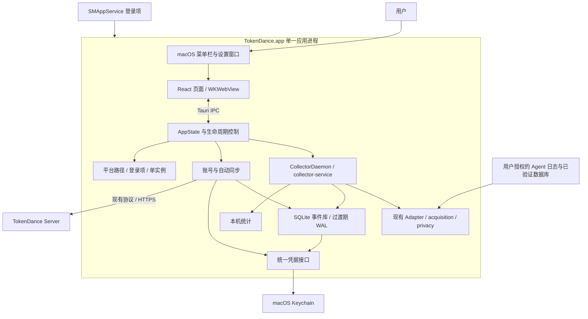

# TokenDance macOS 技术方案

状态：实施中，2026-09-12 对照 [采集事件流水线重构方案](event-pipeline-refactor-technical-plan-v1.md) 修订。平台层（Keychain、SMAppService、菜单栏、Application Support、单实例锁）继续按本文落地；采集、本地事件库、统计和上传以流水线方案为准，本文不再把加密 WAL 当作长期业务真相。

建议沿用 **Tauri 2 + React + Rust 采集核心**，将现有桌面应用适配为 macOS 菜单栏应用。首版保持一个应用进程；本地可靠队列将过渡到流水线规定的 SQLite 事件库，加密 WAL 只作为过渡期上传 spool。重点仍是平台密钥、应用生命周期、登录启动、路径解析和签名分发。

## 1. 目标与范围

本方案采用以下产品假设，均为拟议默认值：

- 系统最低版本为 **macOS 13.0**；原生支持 Apple Silicon 和 Intel，分别发布安装包。
- 使用官网 / GitHub Release 分发签名、公证后的 DMG；首版不走 Mac App Store。
- 功能对齐 Windows：用量面板、Agent 明细、历史趋势、已有额度来源、登录、自动同步、暂停与登录启动。
- 关闭面板或设置窗口后继续采集；明确执行“退出 TokenDance”后停止采集与同步。
- Codex、Claude Code 是首轮端到端验收对象，其余现有 Adapter 按已验证能力接入。没有可用数据源时明确展示状态，不把“检测到目录”解释为“已支持采集”。
- 首版不增加独立常驻服务、自动更新框架、全盘扫描或新的 Agent 格式适配任务。

最低版本选择 13.0 是为了统一使用系统 `SMAppService` 登录启动 API。Apple 将该 API 及主应用登录项接口的最低可用版本标记为 macOS 13.0；这不是 Tauri 自身的最低要求。[Apple SMAppService](https://developer.apple.com/documentation/servicemanagement/smappservice)、[主应用登录项](https://developer.apple.com/documentation/servicemanagement/smappservice/mainapp)

## 2. 当前代码与差距

仓库已有 macOS 代码和打包骨架，但不能据此认定 macOS 产品已经可用。以下为源码核对结果，未以 CI 历史或本机运行结果替代验证。

| 能力 | 当前证据 | macOS 工作 |
| --- | --- | --- |
| 桌面与后台 | `src-tauri/src/lib.rs` 在应用进程中启动 `CollectorDaemon` 和自动同步任务 | 复用该结构，不把名为 daemon 的 Rust 任务误认为独立系统服务 |
| 界面 | React 用量面板、设置页、账本与 IPC 已存在 | 复用组件，适配菜单栏定位、WKWebView 和 macOS 关闭行为 |
| 面板位置 | `commands/window.rs::panel_position` 固定锚定显示器工作区右下角 | macOS 改为菜单栏图标下方，保留 Windows 规则 |
| 生产密钥 | `collector/Cargo.toml` 的 keyring 3.6.3 只启用 `windows-native`，WAL 与签名种子实际使用 `wal-spool::OsKeyProvider` | 必须给生产链路接入 `apple-native` |
| 独立 macOS crate | `platform-macos` 有 Keychain / LaunchAgent 实现，但桌面和服务的 Cargo 依赖未接入它；Keychain 还使用旧 `dev.tokenshow.*` 命名与不同编码 | 整理为明确的平台入口，避免维护两份互不兼容的密钥逻辑 |
| 登录启动 | 桌面端只写 plist，并用文件存在与否判定启用；独立平台 crate 则有另一份带 `KeepAlive=true` 的 LaunchAgent | 改用系统状态；消除两套启动入口和退出后被拉起的风险 |
| 数据目录 | `state.rs` 与 `service/runtime.rs` 各实现一次路径选择，macOS 通常落到 `~/TokenDance/collector` | 统一到 Application Support，日志独立放置 |
| 登录会话 | `commands/account.rs` 将 Cookie / CSRF 写入 `account-session.json` | 会话也放入 Keychain，保留 origin 隔离与过期检查 |
| Agent 发现 | Codex 采集固定 `~/.codex`，额度读取却支持 `CODEX_HOME`；Cursor 只探测 `APPDATA/Cursor` 或 `~/.cursor`，没有在发现函数中配置真实采集源 | 统一来源配置与路径解析；补 macOS 路径与格式验证 |
| 设备信息 | 桌面登录链路已使用 `std::env::consts::{OS, ARCH}`；headless 上传链路仍硬编码 Windows / x86_64 | 统一映射，避免修错已支持的桌面注册路径 |
| 单实例 | 桌面生产初始化前未见锁；headless 使用 PID 文件检查，存在检查与创建间的竞争窗口 | 所有写 WAL 的入口共用 OS 文件锁，在打开存储前取得锁 |
| 发布 | macOS CI 的 release 构建未带 `custom-protocol`，而 `build.rs` 明确拒绝这种 release 构建 | 这是源码即可确认的构建阻断，先修构建入口 |
| 安装包 | 当前手工复制二进制生成 `.app`，最低系统版本写死 11.0；签名、公证、staple、归档绑定校验脚本已有 | 由 Tauri bundler 生成应用包，再复用校验思路 |
| CI 覆盖 | 现有双架构 check 仅覆盖 `platform-macos`，桌面应用未按双架构完整验证；触发路径遗漏部分共享采集代码 | 覆盖真实桌面依赖树、共享代码和最终交付物 |

keyring 3.6.3 官方文档说明：未启用适配当前平台的后端时会使用 mock store。因此，单独测试启用了 `apple-native` 的 `platform-macos` crate，不能证明桌面实际使用了 Keychain。当前依赖配置无法保证跨进程密钥持久化，直接影响 WAL 重开和设备身份连续性。[keyring 3.6.3](https://docs.rs/keyring/3.6.3/keyring/)

## 3. 目标架构

前端只获得展示所需的汇总、错误状态和控制结果。原始日志、Cookie、设备签名种子都留在 Rust 或系统凭据存储内。本地事件、任务和统计表不保存账号；登录会话只在同步时作为认证上下文使用。采集与统计的表结构、空库初始化和 14 天明细 TTL 以流水线方案为准，不在 macOS 平台层另做一套。

## 4. 关键架构决策（ADR）

### ADR-MAC-001：复用 Tauri，并保持单进程

- **状态**：Proposed。
- **背景**：现有 UI、采集与账号状态已通过 Tauri 和 Rust 库集成，没有现成的跨进程控制协议。
- **决策**：菜单栏、设置窗口、采集任务和上传任务同属 `TokenDance.app`；`collector-service` 作为库复用，headless 二进制保留为开发与诊断入口，不随首版登录项启动。
- **备选**：SwiftUI 重写会重复维护统计和设置交互；独立 LaunchAgent + UI 需要额外处理 IPC 认证、状态同步、服务升级和多进程存储互斥。
- **收益与代价**：复用已有实现、降低首版维护成本；应用崩溃或明确退出期间无法持续采集。重启后从已支持的持久化来源补采；未来若明确要求 UI 退出仍持续运行，再单独设计服务拆分。

### ADR-MAC-002：macOS 13+ 使用 SMAppService.mainApp

- **状态**：Proposed。
- **背景**：已有两套 LaunchAgent 逻辑，且“文件存在”不能代表系统允许登录启动。
- **决策**：将现有 `AutostartProvider` 的 macOS 实现替换为 `SMAppService.mainApp` 的注册、注销和状态查询，不安装独立 helper，也不使用 `KeepAlive` 拉起主应用。
- **备选**：保留手写 LaunchAgent 可覆盖更早系统，但需自行维护绝对路径、加载状态和卸载逻辑；本版不为 11/12 增加第二套实现。
- **收益与代价**：用户可在系统设置管理登录项，应用状态可回读；代价是最低系统版本提高及一层小型原生桥。

原生调用集中在 `platform-macos` 的 `login_items` 模块。可采用 `objc2-service-management`，锁定经验证的版本。其接口包含 unsafe 调用，而现有 crate 使用 `forbid(unsafe_code)`：若采用该绑定，必须显式将 crate 约束调整为默认 `deny(unsafe_code)`，仅在桥接模块局部允许，并记录线程、对象生命周期和系统版本前提；其他模块保留禁用。不要在桌面业务文件散布原生调用。[Rust ServiceManagement 绑定](https://docs.rs/objc2-service-management/latest/objc2_service_management/struct.SMAppService.html)

### ADR-MAC-003：统一凭据入口，使用系统原生后端

- **状态**：Proposed。
- **背景**：WAL 和签名种子经 `OsKeyProvider` 读取，账号会话却走明文文件；独立 macOS crate 还存在另一种密钥命名和编码。
- **决策**：新增轻量共享 crate `platform-credentials`，统一 get / put / delete 和错误映射。按目标平台启用 Windows / Apple keyring 后端；`wal-spool::OsKeyProvider` 保留公开兼容接口并委托此模块。账号会话复用同一凭据入口。
- **兼容性**：现有 `io.tokendance.desktop`、`collector-wal-key`、`collector-device-ed25519` 名称及既有 hex 密钥编码保持稳定。旧 `dev.tokenshow.*` 凭据只作为显式历史迁移来源，不自动覆盖正式凭据。
- **备选**：仅给 workspace 加 `apple-native` 能修复部分问题，但无法收敛会话保存、密钥重复实现及错误语义；普通文件保存敏感会话不作为正式方案。
- **收益与代价**：避免重启密钥丢失和凭据泄露；需处理 Keychain 锁定、用户拒绝、条目缺失和升级授权提示。

### ADR-MAC-004：Tauri 生成应用包，双架构独立发布

- **状态**：Proposed。
- **背景**：手写 `.app` 元数据易与 Tauri 配置偏离；当前双架构验证没有覆盖最终桌面程序。
- **决策**：固定 Tauri CLI 2 的具体版本，通过 CLI 构建包含前端的 `.app`，再走统一签名、公证和 DMG 制作流程。分别提供 arm64 与 x86_64 安装包。
- **备选**：Universal 2 可简化用户选择，但产物更大且仍需双架构测试；首版保留后续合并空间。手工复制二进制的脚本退出生产构建入口。
- **收益与代价**：应用资源、Info.plist、图标和版本由统一配置生成；需要维护两个原生运行验收环境。

Tauri 支持生成 `.app` 并合并自定义 Info.plist；应用最低版本可通过 `bundle.macOS.minimumSystemVersion` 指定。正式分发需使用 Developer ID Application 签名并公证。[Tauri 应用包](https://v2.tauri.app/distribute/macos-application-bundle/)、[Tauri macOS 签名](https://v2.tauri.app/distribute/sign/macos/)

## 5. 分模块设计

### 5.1 菜单栏、窗口与生命周期

- 保持 bundle identifier 为 `io.tokendance.desktop`；macOS 展示名称统一为 `TokenDance`。
- 新增 macOS 配置覆盖文件和 `Info.plist`，使用 `LSUIElement=true` 将其作为菜单栏应用；设置窗口按需激活，主应用默认不占 Dock。
- 菜单栏使用独立单色 template 图标及 Retina 资源，应用图标继续使用 `.icns`。
- 点击菜单栏图标时，使用事件中的图标 `rect` 作为面板锚点，面板在图标下方展开，再裁剪到目标屏幕可见区域。不要只使用鼠标点或右下角坐标。Tauri 已提供点击位置和图标矩形。[Tauri 2.11.5 TrayIconEvent](https://docs.rs/tauri/2.11.5/tauri/tray/enum.TrayIconEvent.html)
- 统一坐标单位后计算窗口大小和位置；覆盖 Retina / 非 Retina 混合、多屏负坐标、菜单栏自动隐藏、刘海与屏幕边缘。无法取得图标位置时，回退到当前屏幕顶部可见区域。
- 面板失焦、Escape 和关闭均隐藏；再次点击可收起。设置窗口使用 macOS 原生标题栏及关闭按钮，关闭仅隐藏。明确菜单“退出”与 `Cmd+Q` 才结束进程。
- 配置 macOS 编辑菜单 / responder 行为，使 `Cmd+C/V/A`、`Cmd+,` 等快捷键在设置和登录页工作。首版沿用普通 Tauri 窗口，只有实测证明全屏 Spaces 行为不可接受时才引入 NSPanel 桥接。
- 为避免主应用登录项不携带 `--minimized` 的差异，macOS 常规冷启动默认进入菜单栏；首次启动展示设置引导，Finder 重新打开已运行应用时展示面板。

必须将生产状态初始化移到可展示原生错误的生命周期中。当前 Keychain / WAL 初始化失败会在创建 UI 前 panic；新实现应保留菜单栏与设置入口，展示“凭据暂不可用”等可恢复状态，不无限重启或静默退出。

### 5.2 登录启动与单实例

登录启动默认关闭，由用户在设置中开启。建议扩展现有 `AutostartInfo`，新增 `status`，保留兼容布尔值 `enabled`：

| status | enabled | 展示与行为 |
| --- | --- | --- |
| `enabled` | true | 系统确认已启用 |
| `disabled` | false | 尚未注册或已注销 |
| `requires_approval` | false | 显示需要在系统设置中允许，并提供打开入口 |
| `unavailable` | false | API 返回 not found / 环境不满足，给出原因和重试 |

每次启用 / 关闭后回读系统状态；设置窗口重新激活时重新查询。用户在系统设置撤销后，不自动重新注册。应用从 DMG / 临时路径运行时，不注册登录项，引导先移动至 `/Applications` 或 `~/Applications`。

旧 plist 只在 Label、目标 executable 与已知 TokenDance 安装路径均匹配时迁移；先禁用旧项，再确认新项状态，保留可回退记录。不根据 `tokenshow` 字符串模糊删除登录项。

在任何 WAL / 账本初始化前获取同一规范数据目录下的 OS 文件锁，并持有至退出；桌面和 headless 共用该锁。Tauri 单实例插件可用于唤起已有窗口，但不能替代存储锁。第二次启动在取得锁失败时不得继续生成密钥、注册设备或打开 WAL。

退出流程统一为：停止新采集与新同步 → 取消或有界等待正在执行的任务 → 持久化本地 SQLite（及过渡期 WAL/checkpoint）→ 释放锁 → 退出。建议最长等待 3 秒，不要求断网时清空待上传队列。下一次登录仍按用户保留的登录项设置启动。在打开任何本地 writer（当前 `tokendance.sqlite3`、过渡期 spool、未来事件库）之前取得同一把 OS 文件锁。

### 5.3 路径与本地状态

在 `collector-service` 新增共享 `AppPaths` / 平台信息模块，供桌面和 headless 使用；避免两份路径解析继续分叉。

| 用途 | macOS 路径 |
| --- | --- |
| 配置、installation-id、当前 `tokendance.sqlite3`、过渡期 spool、checkpoint | `~/Library/Application Support/io.tokendance.desktop/collector/` |
| 流水线启用后的事件库（10 表，空库初始化，不迁移旧统计） | 同一 collector 目录；表结构见流水线 DDL，不另选 `~/TokenDance` |
| 轮转日志与崩溃摘要 | `~/Library/Logs/io.tokendance.desktop/` |
| 可删除临时缓存 | `~/Library/Caches/io.tokendance.desktop/` |
| 敏感凭据 | Keychain：设备签名种子、登录会话、过渡期 WAL 数据密钥；JSON 中最多保留 origin、过期时间等非秘密索引 |

HOME 不可用时应明确报错，不把生产持久化数据退到当前目录或临时目录。私有目录按 0700、私有文件按 0600 创建；临时写入文件在创建时即受相同权限约束。日志轮转建议 5 × 2 MB，诊断摘要不得包含原始行、用户名路径或凭据。

历史 macOS 测试目录 `~/TokenDance/collector` 采用一次性迁移：取得锁 → 检测版本和凭据可读性 → 复制到新目录的 staging → 校验安装 ID、账本及 WAL 可重开 → 原子切换 → 写迁移标记。成功前保留旧目录；失败保留原数据且不创建新的安装身份，不合并两个各有独立数据的目录。

### 5.4 Keychain 与会话

- 过渡期 WAL 数据密钥与 Ed25519 设备种子分别保存，继续使用不同 account 名称；不复用同一个密钥。流水线 writer 启用并停用 spool 后，不再为新安装创建 WAL 密钥。
- 登录会话以规范化网站 origin 的稳定摘要作为 account 后缀，保存版本化 Cookie / CSRF / expires_at；前端不接触秘密，后台恢复和手工登录统一使用此路径。
- 保留当前一个月的本地恢复上限，但实际登录状态必须由 `/api/v1/auth/session` 验证；本地期限不能延长服务端会话。
- 首次安装才允许创建新密钥。有既存加密 WAL 却缺失密钥时，禁止自动生成密钥覆盖，进入恢复状态；已有注册身份却缺失签名种子时同样阻止静默换身份。
- Keychain 暂时锁定或用户拒绝访问时，暂停依赖密钥的工作并支持重试；不能回退明文文件或 mock store。读取、解密失败不删除原数据。
- 旧 `account-session.json` 迁移须先成功写入 Keychain 并读回，再删除旧文件。退出登录清除相应会话，保留设备身份，沿用服务端撤销语义。
- 删除全部本地数据属于显式操作：先关闭写入任务，再按范围删除数据和对应凭据；过渡期先清 WAL 再删 WAL 密钥。账号会话与设备种子按认证语义单独处理，不能把 Keychain 里的登录态写进本地事件表。

Keychain 真实验证必须跨进程，并覆盖签名后的安装包升级。仅在同一测试进程 set/get 成功，无法证明生产持久化与访问授权正常。

### 5.5 Agent 来源与 GUI 环境

菜单栏应用不能假设获得交互式 shell 的 PATH 或 `.zshrc` 环境。路径优先级统一为：**用户在应用保存的显式来源 → 当前进程环境覆盖 → 系统默认目录**。采集与额度查询共用解析结果；不通过执行 shell 配置文件获取环境。

| Agent | 来源方案 | 首版验收边界 |
| --- | --- | --- |
| Codex | 统一解析 CODEX_HOME；默认 `~/.codex` 下的 sessions / archived_sessions；额度沿用已实现来源 | 当前支持格式的用量与已有额度闭环；自定义目录与采集一致 |
| Claude Code | 沿用 `~/.claude` 来源，支持显式指定配置根 | 只认解析器验证过的 usage 事件；普通 history 行不能当作用量记录 |
| Cursor | 增加 `~/Library/Application Support/Cursor` 候选，与 `~/.cursor` 区分 | 需获取脱敏样本验证数据源与 schema 后才配置 source；发现安装不等于能读 token |
| Grok Build / ZCode / DeepSeek Harness / Pi | 复用现有 home 相对目录规则及 Adapter | 用 macOS 脱敏 fixture 验证；格式、权限或来源不满足时保留不可用说明 |

这里的路径是基于当前实现提出的发现规则，不声明所有 Agent 当前版本都兼容。变更格式或新采集能力应另行验收，不用猜测字段补“精确值”。

文件读取沿用 JSONL tailer、checkpoint 与 Unix 文件标识能力。覆盖 APFS 重命名、截断、半行、符号链接和权限拒绝。SQLite 源只读访问，对 busy / locked 使用有界重试，不修改 Agent 数据库。

默认只扫描解析出的来源目录；不递归扫描整个 HOME。当前“选最新 8 个文件”发生在目录遍历后，仍可能遍历大目录：增加目录发现缓存、深度 / 数量 / 单轮耗时上限，并显式区分未发现、权限不足、格式不支持和等待新数据。

普通授权来源可读时不要求管理员、辅助功能、屏幕录制或完整磁盘访问。用户自选来源位于系统受保护目录且实际被拒绝时，再针对具体来源给出操作指引。不要把所有读失败统一变成“请授予完整磁盘访问”。

### 5.6 调度、耗电与数据口径

采集与任务补偿间隔与流水线方案对齐为 5 秒；未登录只阻塞上传，本地事件仍落库。面板可见时的刷新仍可短于补偿间隔。后台任务设置 missed-tick 为 Skip，防止睡眠唤醒后集中补跑；网络恢复仅唤醒一次同步，再进入既有重试策略。

重新扫描 Agent 安装 / 来源目录采用低频刷新或用户主动重试，使运行中新增 Agent 可以发现。状态刷新不重复读取 Keychain、全量日志或重算全部账本；主线程不执行文件遍历、数据库快照或网络请求。

本机展示本机统计；云端展示当前账号已接收且已统计的数据。流水线启用后不再承诺补齐源历史：首次只准入北京时间当天的事实，明细从本地 `created_at` 起保留 14 天。费用与缺失额度沿用流水线计量契约，不推导未经验证的账单。

性能验收目标为待测预算：菜单栏展开 P95 < 300 ms；空闲、无新事件、关闭面板时平均 CPU < 1%；总应用进程树常驻内存暂定 < 200 MB；连续运行 8 小时无持续增长。记录机型、系统版本、来源规模和采样窗口，不把目标写成已测结果。

### 5.7 服务端与网络

复用现有 Session → device grant → 设备注册 → 签名上传 / ACK 流程。协议已含 `macos`、`x86_64`、`aarch64`，无需因平台新增协议枚举或新建后端服务。

公共平台函数返回协议类型，并同时供桌面与 headless 使用：Apple Silicon 报 `macos/aarch64`，Intel 报 `macos/x86_64`。不将 Rust 的名称随意改成 `arm64`，也不沿用 headless 的 Windows 常量。

发布构建必须带正确的网站 / API 配置，验证登录、设备绑定、离线积压和恢复上传；现有 localhost 默认值仅供开发。发布流程对远程服务配置进行 HTTPS 校验，不依赖浏览器 Session 与桌面 Session 自动共享。

## 6. 构建、签名与分发

1. 在桌面 `package.json` 固定 `@tauri-apps/cli`，新增 `build:macos` 入口与脚本；继续使用锁文件和 `npm ci`。
2. 增加 `tauri.macos.conf.json`，指定展示名称、`app` / `dmg` 目标、图标、entitlements、最低系统版本 13.0。CLI / Rust deployment target / Info.plist 的最低版本保持一致。
3. 每个架构都构建完整桌面应用，启用 `custom-protocol`。保留 `build.rs` 的 release 防误用检查，将提示改为平台中立文字。生成的包无需 Vite 或本地前端服务器。
4. 应用包交给单一发布脚本处理签名：Developer ID Application + Hardened Runtime + 时间戳；若有嵌套 Mach-O / framework，按从内到外顺序签名，避免靠 `--deep` 隐藏遗漏。
5. 对 `.app` 制作提交归档并公证，staple / validate 后再制作 DMG；对最终 DMG 也完成签名、公证和 staple / validate。发布物不在公证后修改其已签名内容。
6. 在与提交物对应的 `.app` / DMG 上运行签名、Gatekeeper 和离线 staple 检查；扩展现有 `Verify-NotarizationArchive.sh` 思路，确保验证的是实际待分发文件。
7. 输出 `TokenDance-<version>-macos-arm64.dmg`、`TokenDance-<version>-macos-x86_64.dmg`、SHA-256 及 `build-info.json`。元数据记录源码 commit、目标架构、工具链、bundle ID、签名 Team ID 和公证结果。

不新增 JIT、可执行内存或关闭 library validation 等 entitlement，除非具体依赖有证据要求且完成评审。此应用使用系统 WKWebView，不在首版加入运行时下载原生插件的能力。

签名身份和公证凭据由 CI secrets 注入，复用仓库已有的临时 keychain 清理方式。PR 验证不要求发布凭据，也不接触正式签名证书；正式 release job 缺凭据时应失败，不能产出标记为正式发布的未公证安装包。

“可复现”在这里表示固定源码、锁文件、工具链、构建步骤和可追溯哈希；带时间戳的签名、公证产物不承诺逐字节完全一致。

CI 的验证触发范围至少覆盖整个 `collector/**`、共享 `schemas/**` 和相关 workflow。两个架构都执行完整桌面构建，原生运行测试覆盖 Apple Silicon 与 Intel；只 cross-check 某个 Rust crate 不算双架构验收。runner / Xcode 版本固定并记录，最低支持系统另设实机或虚拟机验收，不以较新 runner 的成功推断 macOS 13 兼容。

首版更新采用退出后替换应用，保持 bundle ID、Keychain service 和数据格式兼容。破坏性数据升级前做快照；回退程序版本时只能使用兼容数据或对应快照，不能用旧程序打开未知新格式。卸载入口提供“仅移除应用”和“同时清理本机数据”的说明，并允许在移除前注销登录项；直接拖入废纸篓不会主动删除用户账本与 Keychain 数据。

## 7. 实施拆分与改动位置

以下为一名熟悉本仓库的工程师的初步估算，约 **8–12 个工作日**；依赖 macOS 签名资格、两类芯片验收环境和脱敏样本可用。证书准备、等待公证及新增 Agent 格式适配不包含在净开发时间中。

| 阶段 | 主要改动 | 交付与出口 | 估算 |
| --- | --- | --- | --- |
| P0 可行性与阻断 | 桌面 package/config/build.rs、真实 Keychain 后端、SMAppService 小样验证 | 本机 `.app` 无开发服务器启动；跨进程密钥读回；确认系统登录项与原生桥可行 | 1–2 天 |
| P1 存储与生命周期 | `platform-credentials`、`wal-spool/keys.rs`、`service/platform.rs`、`state.rs`、`account.rs`、`autostart`、任务退出控制 | 私有目录、单实例、会话安全恢复、登录启动、密钥失败可恢复；重启不丢账本 / WAL | 2–3 天 |
| P2 菜单栏与来源 | `lib.rs`、`commands/window.rs`、设置组件、图标、`detect.rs`、`quotas.rs`、`service/upload.rs` | 菜单栏可用；Codex / Claude 用量到本地面板及网站；两种设备架构正确 | 2–3 天 |
| P3 发布与验收 | macOS 构建脚本、packaging、workflow、desktop 验证脚本与 README | 双架构 DMG、签名公证证据、安装 / 升级 / 权限 / 离线恢复验收记录 | 3–4 天 |

建议形成三个可独立评审的 PR：① 存储、启动与构建阻断；② 菜单栏和来源适配；③ CI、签名分发与验收。正式公开发布需要三个阶段的能力都满足，不将 P0 可启动包视为产品完成。

新增平台代码尽量隔离，保持 Windows 注册表启动和右下角定位行为；共享存储、账号或协议代码变动必须回归 Windows。现有 `verify-desktop.mjs` 包含固定 LaunchAgent 字符串断言和 Windows 风格 PATH 拼接，需要随方案更新，优先检查行为而非源码是否包含某个单词。

## 8. 验收矩阵与主要风险

| 场景 | 必须观察到的结果 |
| --- | --- |
| 两种架构安装 | 原生运行，最低系统与当前发布支持系统可启动；arm64 包无需 Rosetta |
| 正式下载安装 | 从真实下载路径首次打开经 Gatekeeper 接受，断网仍能验证 stapled 票据；前端不请求 localhost:1420 |
| 菜单栏 | 深浅主题清晰，点击 / 失焦 / Escape 正常，设置关闭继续采集，明确退出停止 |
| 多屏与 Spaces | Retina 混合、外接屏断开、自动隐藏菜单栏、全屏 Space 下不越界、不出现无法关闭的面板 |
| 登录项 | 开启、关闭、注销重登、系统设置撤销、应用移动 / 升级均正确读回；主动退出不会被 KeepAlive 拉起 |
| 双开 | 连续双击应用、桌面与 headless 同时启动只有一个 WAL 写入者，已有实例可被唤起 |
| 凭据 | 跨进程及签名升级后读取同一密钥；拒绝 / 锁定 / 条目丢失时不写明文、不覆盖密钥、不销毁旧 WAL |
| 登录 | Cookie 留在 Keychain；origin 隔离、服务端过期、退出登录和离线恢复均符合现有语义 |
| 数据目录迁移 | 新旧目录、迁移中断、凭据不可用均不误删原数据，不产生静默重复身份 |
| 来源与权限 | 自定义 CODEX_HOME 在采集与额度页一致；Finder 启动可用；权限不足和未知格式有具体状态 |
| 增量读取 | JSONL 追加 / 半行 / 截断 / 重命名与 SQLite busy 不损坏 checkpoint，不重复累计同一已记录事件 |
| 同步恢复 | 离线采集后恢复上传，ACK 前队列不丢；设备信息为实际 macOS 架构；本机与服务端口径可对账 |
| 睡眠与稳定性 | 合盖唤醒无任务洪峰，8 小时运行无持续内存增长，日志大小有界 |
| Windows 回归 | Windows 构建、密钥持久化、菜单、登录启动、用量统计和账号同步通过既有验证 |

重点自动化测试是跨进程凭据持久化、存储锁竞争、来源解析与缺失凭据恢复；菜单栏 / Keychain 交互 / 登录项 / Gatekeeper 使用签名安装包人工或系统集成测试。假数据单元测试不能替代这些验收。

主要剩余风险是 macOS 原生窗口焦点与全屏行为、签名升级后的 Keychain 访问、SMAppService 系统状态差异，以及各 Agent 的真实文件格式。这些应在 P0 / P2 尽早用安装包和样本验证。若 macOS 13 支持、Intel 首发或“退出后仍采集”需求改变，需要重新评估 ADR 与工期；其余常规实现细节可在上述边界内推进。

## 9. 评审依据

代码入口（均相对于仓库）：

- [桌面说明](../collector/apps/desktop/README.md)
- [桌面应用生命周期](../collector/apps/desktop/src-tauri/src/lib.rs)
- [窗口定位](../collector/apps/desktop/src-tauri/src/commands/window.rs)
- [账号会话与设备同步](../collector/apps/desktop/src-tauri/src/commands/account.rs)
- [登录启动](../collector/apps/desktop/src-tauri/src/autostart/mod.rs)
- [平台依赖配置](../collector/Cargo.toml)
- [实际生产密钥实现](../collector/crates/wal-spool/src/keys.rs)
- [已有 macOS 平台骨架](../collector/crates/platform-macos/src/lib.rs)
- [来源发现](../collector/apps/service/src/detect.rs)
- [跨平台打包流水线](../.github/workflows/cross-platform-packaging.yml)
- [已有 macOS 签名公证脚本](../collector/packaging/macos/sign-notarize.sh)
- [采集事件流水线重构方案](event-pipeline-refactor-technical-plan-v1.md)
- [本地事件 DDL](event-pipeline-ddl-v3.md)
- [原采集架构与验收基线](collector-plugin-architecture-and-acceptance.md)

官方技术资料在相关决策旁列出。网页检索工具本次连接失败，已通过直连方式读取 Apple、Tauri 与 docs.rs 的官方页面进行核对；未将未执行的测试标为通过。
