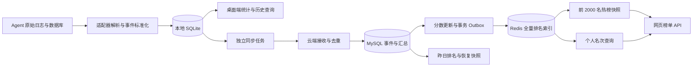

# TokenDance 离线存储与排行榜整体优化技术方案

> 日期：2026-09-06
>
> 状态：技术设计稿，尚未实施
>
> 代码核查基线：`f714272`
>
> 范围：桌面端离线持久化、原始数据重建、云端同步、排行榜规则、Redis 读模型、一致性和容量验收。

## 1. 已确定的产品与技术决策

1. 桌面端是完整的离线工具，不登录、不联网也能持续采集和查看历史。
2. 使用 SQLite 持久保存本地数据，云端同步是独立能力；上传积压不能阻断本地采集。
3. 从各 Agent 可获取的原始日志、数据库及归档全量重建，不迁移旧 JSON 统计格式。
4. 保留账号配置、设备身份和去重密钥；“不迁移统计”不等于重新生成设备身份。
5. 正常账号注册成功即参与排行榜，无用量记为 0，不要求先公开主页或完成资料填写。
6. 公开开关只控制个人详细数据页；榜单展示头像、昵称、周期 Token 和排名。
7. 页面继续限定公开列表的展示范围，但删除 `Top 1000`、`仅展示前 1000 名` 等解释文案。
8. 自己在第 1000 名之外时，在列表末行显示真实排名，使用浅绿色背景和“我”标记。
9. 显示总人数；排名持平和没有比较依据时留空，不显示“持平”“暂无对比”。
10. Redis 每个周期维护全量排名索引，另发布前 2000 名热榜快照。第一阶段不按名次切分冷榜，不维护跨段搬移和补位链。
11. MySQL 是云端可信数据源；Redis 是可重建的查询层，采用有监控、可恢复的最终一致性。

本方案更新既有设计中“公开资料且有用量才能参榜”和“上传缓存满则停止采集”的规则。其他权限边界沿用原有设计。

## 2. 当前实现与问题定位

| 当前实现 | 问题及目标变化 |
| --- | --- |
| 桌面端 `usage_ledger.rs` 将统计和去重集合保存在 JSON 中 | 随历史增长反复全量序列化；改成 SQLite 事务和索引查询 |
| `wal-spool` 保存待上传事件，使用 256 MiB 硬限制 | 上传存储压力会阻断采集；改成持久事件与同步状态分离 |
| Daemon 从 `unacked_events()` 构造本地统计输入 | 本地统计依赖上传队列，且可能把整个积压载入内存；改为本地提交时更新统计 |
| 常规扫描最近 8 个 JSONL 文件；Codex 启动扫描 128 个；Grok 历史扫描上限 512 个 | 不是完整历史扫描；新增可恢复的全量扫描任务，同时保留实时增量采集 |
| 全局 Token API 按请求关联用户、隐私和日汇总表，再做全体排序及昨日比较 | 查询一页、查询个人名次都可能重复汇总大量历史数据 |
| SQL 排除私密账号、未发布主页、零 Token 用户 | 与注册即参榜的新规则冲突 |
| 网页打开、切换周期、翻页时请求，无定时更新 | 改为页面可见时自动刷新，独立处理后台刷新失败 |
| `users`、`usage_events`、日汇总、`leaderboard_snapshots` 和 `leaderboard_entries` 已存在 | 复用持久化基础，扩展预计算分数和可靠发布任务 |

此前约 300 MB 缓存堆积的直接原因是重复写入无变化的文件进度，以及压缩时保留空进度事务。基线已修复这两个问题并增加压缩，但它仍是受上传缓存限制的架构；这些修复不能替代本方案。

十万注册用户不直接等于十万并发。容量评估必须同时测量活跃用户、事件写入速率、历史跨度、榜单读 QPS 和同步积压，不能只用注册人数判断 MySQL 或 Redis 的承载能力。

## 3. 目标架构



- 本地 SQLite 的持久提交是本地采集成功的依据；服务器 ACK 只代表云端接收状态。
- 云端榜单只计入已同步、去重并通过校验的数据。离线用户仍在榜，但离线新增用量在联网补传后才反映到云端。
- 云端确认接收、完成汇总、发布热榜是三个不同时间点；响应和监控分别记录相应进度。

## 4. 本地 SQLite 设计

### 4.1 数据模型

数据库建议命名为 `tokendance.sqlite3`，放在现有用户级应用数据目录下，不写入安装目录或 Release 包。

| 表 | 主要字段与约束 | 用途 |
| --- | --- | --- |
| `schema_meta` | `schema_version`、`aggregation_version` | 数据库和统计版本管理 |
| `source_files` | `source_id`、`file_identity`、路径定位信息、generation；唯一来源/文件身份 | 追踪轮转、截断和文件发现 |
| `source_checkpoints` | 来源/文件身份、generation、offset 或源端游标 | 已持久化的读取进度 |
| `rebuild_jobs` | 扫描根、发现进度、已处理文件、状态、错误码 | 全量扫描、暂停与断点续跑 |
| `events` | `local_seq`、唯一 `event_id`、Agent、时间、类型、规范化负载、解析版本 | 可重新聚合的本地事件事实 |
| `daily_agent_metrics` | 日期、Agent、统计版本，复合唯一键 | Token、消息、时长、代码等日汇总 |
| `daily_model_metrics` | 日期、Agent、模型，复合唯一键 | 模型用量和计价输入 |
| `daily_skill_metrics` | 日期、Agent、Skill 标识，复合唯一键 | Skill 次数、活跃日和可确认的结果 |
| `price_catalog` / `event_costs` | 模型、价格版本、事件 ID、计价来源、金额 | 离线估算、已有费用优先与后续补价 |
| `sync_targets` / `sync_delivery` | 账号/设备绑定代次、事件 ID、状态、租约、重试时间；目标/事件唯一 | 待同步、已同步、待重试及隔离记录 |

必要索引：`events(agent_id, occurred_at, local_seq)`、`events(event_type, occurred_at)`、`sync_delivery(target_id, status, next_attempt_at, local_seq)`。时间序列界面读取日汇总，不扫描所有事件；补传采用游标分页，不把所有待传事件载入内存。

Token 按整数处理，费用使用定点十进制。超过 SQLite 有符号 64 位范围的值采用规范十进制文本并在 Rust 中执行检查过的整数/定点运算；不能让 SQLite 对此类文本直接 `SUM()` 后隐式转成浮点数。未知费用保持缺失，免费模型的已知 0 与未知不同。

### 4.2 采集事务

一次有界批次执行以下事务：

1. 校验源文件身份、generation 和预期旧游标，拒绝陈旧扫描器覆盖新进度。
2. 插入规范化事件；重复 ID 不再累加统计。
3. 为新事件更新日汇总、计价输入；需要纠正旧事件时通过显式版本变更重算受影响桶。
4. 对启用同步的目标登记待传状态；未登录时只保存本地事件，之后可通过 `local_seq` 分批建立同步任务。
5. 更新采集进度并提交。

任一步失败则回滚整个批次，不能只推进游标。已成功提交的批次在重启后无需重新读取；重读仍可幂等。SQLite 事务不能包含网络请求。

对大源库先读取一致性快照或适配器提供的安全只读视图，不能复制一个正在变化的 SQLite 主文件后忽略其 WAL。

### 4.3 并发、持久性和容量

- 单个桌面采集实例持有 OS 级实例锁；第二次启动只唤起已有窗口。进程崩溃后锁由 OS 释放，避免两个采集器同时操作同一状态。
- 一个有界写入工作队列和短事务；界面使用独立短读事务，重建分批让出执行时间。
- 初始选择 SQLite WAL 模式、`synchronous=FULL`、有限 `busy_timeout`。实际链接的 SQLite 版本及其修复情况需在构建验收中记录。
- 空闲时执行 PASSIVE checkpoint，观测 WAL 页数和阻塞读事务；不能因数据库历史超过 256 MiB 而停止采集。SQLite WAL 模式允许读写并行，但同一时刻只有一个写者，长读事务会阻碍 checkpoint。[SQLite WAL 说明](https://www.sqlite.org/wal.html)
- 不手工删除活动的 `-wal` / `-shm` 文件。导出使用 SQLite 支持的一致性备份方式，不能直接复制正在写入的主文件。
- 默认长期保留本地历史；上传批次、扫描批次、内存队列和诊断日志分别限额。主数据库容量不采用原上传缓存的阈值。
- 实际磁盘不足、文件权限错误或数据库写入失败时停止提交，保留源进度并提示“存储异常”；空间恢复后从已提交游标继续。
- 日志轮转与 SQLite checkpoint 不得清理业务事实。用户主动清理按独立产品操作执行，不随同步 ACK 删除历史。

### 4.4 数据边界与费用

继续使用现有隐私过滤，只保存统计需要的规范化字段，不复制提示词、源代码、账号 Cookie 或 Agent 凭据。必要的规范化敏感负载沿用 OS 密钥保护和应用层加密，不因引入普通 SQLite 而退回明文保存；SQLCipher 不作为未经验证的默认依赖。密钥缺失应报错，不能生成新密钥后假装重建成功。

OpenRouter 价格表保存在本地。断网时使用最后成功获取的价格；没有匹配价格的事件保留计价输入，联网后补估算。已有实际费用优先，缓存和 reasoning Token 按各适配器明确的语义计价，避免重复收费。面板只显示 `$123.45` 等金额，不添加长解释。

## 5. 从 Agent 原始数据全量重建

### 5.1 执行方式

1. 创建新的 SQLite 构建代次，保留旧统计文件作为回退资料，不导入旧 JSON 统计值。
2. 枚举所有授权来源：会话日志、归档、Agent 数据库和可读取的其他用量来源；采用可恢复分页枚举，不用“最近 N 个文件”代表全量。
3. 优先处理活跃文件保证近期数据可见，后台分批补历史；进度持久化，重启可续跑。
4. 对文件尾部持续追加、半行、轮转、截断分别处理，完成初次扫描后再追平期间追加的数据。
5. 验证事件唯一性、时间分布、各 Agent Token 汇总与来源覆盖情况，成功后启用新数据库。

全量重建只针对原始来源仍然存在的数据。已清理的日志、已经过期且无法再次获取的接口数据，以及原始日志未记录的费用，不声称能够恢复；不以 0 或演示数据填充。旧文件不自动删除，也不把其中不完整统计混入新库冒充原始重建结果。

### 5.2 去重与云端历史兼容

- 同一设备重建保留 installation ID、设备密钥以及已有 `event_id` 算法版本，云端既有 `(installation_id, event_id)` 幂等约束继续生效。
- 必须用真实旧日志回放验证 ID 一致性；不能仅假设保留密钥就必然得到同一 ID。移动文件、改变读取批次、文件截断后的合法新事件都需要专门测试。
- 事件 ID 优先使用 Agent 原生会话/事件标识及稳定语义身份，文件路径和偏移只作为读取进度。若必须改变旧 ID 算法，要先提供服务器兼容识别机制，禁止直接全量重传导致翻倍。
- 同一事件来自多个采集通道时，由适配器指定主来源和补充字段，不能把 JSONL、OTLP 和额度快照视为不同 Token 消费。
- 跨设备去重另设能力边界：现有设备级 HMAC 不能自动识别“复制到另一台机器的同一会话”。具备稳定原生 ID 的来源可设计账号级同步身份及去重键；启用前完成密钥、隐私和历史兼容评审。无稳定身份的来源不做可能误删真实事件的启发式合并。
- 不回填虚构 Skill 调用。原生调用与成功读取 `SKILL.md` 的关联事件分别保留精度/来源，目录里装有 Skill 不等于使用过。

## 6. 离线与同步解耦

### 6.1 状态和账号

| 本地采集状态 | 云端同步状态 |
| --- | --- |
| 采集中、已暂停、正在重建、存储异常 | 未登录、已关闭、同步中、已同步、连接异常、需重新登录 |

网络失败只映射为“连接异常”，不能把本地采集状态改成停止。未登录也不影响本地查询。登录后沿用自动同步，并提供关闭同步的能力；关闭只停云端传输。

云端同步目标按账号和设备绑定代次隔离。退出登录后取消尚未发出的请求，旧账号租约不能提交到新账号。默认不把已经归属于账号 A 的历史自动上传给账号 B；切换账号后的历史归属和新数据起点需明确显示并由相应产品操作确定。

### 6.2 可靠补传

- 从 SQLite 按待传索引领取有界批次，租约和 ACK 状态事务化保存；网络请求在事务外执行。
- 上传成功只改变对应目标的 delivery 状态，完整事件和本地汇总继续保留。
- 接收成功但本机保存 ACK 前崩溃时允许重传，依赖服务器事件幂等避免重复计分。
- 临时失败退避重试；永久拒收记录进入可诊断的隔离状态，不删除原事件，也不能让一个坏事件永久堵住后续正常记录。
- 协议不兼容修复后可显式重新排队隔离记录；校验原 ACK 的批次、事件集合和数量，不把 HTTP 200 直接解释为全量成功。
- 历史积压采用限速补传，与实时新增公平调度。取消登录和暂停同步有有界响应时间，不能一次持锁上传数万条。
- 不再将未同步记录总量作为本地采集的停止条件。

## 7. 排行榜规则

### 7.1 参与人群和展示

参榜基表为 `users` 中注册成功且状态正常的账号，关联用量使用 LEFT JOIN 或已有零分记录，不依赖 `public_user_profiles` 是否存在。尚未填写头像/昵称时使用默认头像和非敏感的系统昵称，不展示邮箱或从邮箱生成公开昵称。

所有四个周期包含同一类参榜账号，无用量记为整数 0。注销、删除中、封禁等不可参榜状态需要与实际状态枚举逐项映射；不保留已注销用户在热榜中的头像、昵称或 Token。

总人数为全部有效参榜账号数，不能截成 1000/2000，也不能只统计本周期有用量的人。正常情况下切换周期不改变总人数；不同快照发布时间造成的新注册用户短暂差异必须能用版本和时间解释，并在下次刷新追平。

公开列表只返回第 1～1000 名。自己大于 1000 名时单独返回 `ownEntry`，在当前页末行展示；不能通过传入任意用户 ID 获取另一人的榜外行。已在公开范围内不重复追加自己。

关闭个人公开开关后仍显示榜单基本字段；详细页只允许本人访问。关闭公开的用户在榜单上的头像/昵称不链接到一个必然报错的公开主页；本人可进入自己的数据页。同步修改隐私设置、注册说明和旧空状态文案，准确说明基本排名与详情页的区别。

### 7.2 计分和时间

- 计分为已接收、去重、验证通过的实际 Token 用量；只有确认语义的 exact/derived 总量进入主榜。估计值与 Skill 关联事件不冒充精确 Token。
- 原始模型 Token 中若已包含缓存输入、reasoning 输出，不能再把这些子项加一遍。各来源必须有明确计分字段和对照测试。
- 排序：Token 降序，同分按注册时间升序，最后按用户 ID 升序；使用连续名次，不使用并列排名造成边界不确定。
- 保留 UTC 日历口径：今天为当前 UTC 日；近 7/30 天包括今天和之前 6/29 个 UTC 日；累计包含全部有效历史。
- 午夜推进周期时，即使用户没有新事件，也必须移除滚出周期的贡献；不能只刷新当天上传过数据的用户。
- 历史补传按事件发生日期归桶，不按上传日期增加今天的分数。
- 新注册账号不参与注册之前的历史快照。昨日名次来自已保存的昨日比较基准，而不是用当前人群重新计算“昨日”。
- 排名变化保存并使用可审计快照版本；持平或缺少基准时前端留空。历史补传可改变当前分数，但不静默篡改用户昨日实际看到的名次。

客户端日志可能被本机用户修改。设备签名能够证明请求来自已绑定设备，不能证明原始用量绝对真实。服务端需要事件去重、来源约束、非法时间/数值校验与异常增量检测；异常数据保留核查依据，不能靠 Redis 加速掩盖统计错误。

## 8. MySQL 预计算与可靠更新

### 8.1 持久数据

保留现有 `usage_events`、日汇总和快照表，拟增加以下逻辑结构，具体 DDL 在实施阶段提交：

| 结构 | 核心字段/索引 |
| --- | --- |
| `aggregate_dirty_days` | 用户、日期唯一；dirty 版本、租约和重试时间 |
| `user_window_scores` | 用户、周期、周期代次唯一；整数 Token、单调 revision、有效成员标记、注册排序字段 |
| `ranking_outbox` | 任务 ID、用户、周期、代次、绝对分数、revision、操作类型、任务状态和重试租约；状态/重试时间索引 |
| 排名快照扩展 | 明确 window/代次、规则版本、数据水位、人数；支持按快照/排名分页和按快照/用户查名次 |

接收事件的事务负责幂等插入和标记受影响日期。聚合任务只重算受影响用户/日期，再根据旧、新日汇总的差额维护周期分数；累计分数不在每个读请求里重扫历史。

注册事务创建零分参榜身份和对应任务。账号状态变化也生成可靠的成员更新任务。资料修改与排名数字可分开发布，但删除/封禁的可见性不得等待普通资料缓存自然过期。

### 8.2 事务 Outbox

一次 MySQL 事务内锁定受影响的分数行，更新分数和 revision，同时插入对应 Outbox。未提交分数不会产生可消费任务；已提交分数一定留有待同步依据。该模式需要消费者幂等处理重复投递。[Transactional Outbox](https://microservices.io/patterns/data/transactional-outbox)

消费者按租约领取任务，成功应用 Redis 后再确认 MySQL 任务。崩溃或 ACK 丢失后允许再次执行。使用状态/租约领取，不因观察到更大的自增 ID 就跳过尚未提交或尚未完成的较小 ID；自增 ID 不能直接当作全局提交顺序。

Redis 更新写绝对分数，不直接对每条重试任务执行 `ZINCRBY`。旧 revision 不能覆盖新 revision，分数因纠错或跨日下降也正常生效。

## 9. Redis 全量索引和热榜设计

### 9.1 Key 结构

每个周期独立维护以下结构。`{lb:global:<window>}` 为同周期脚本使用的 hash tag，`<g>` 为 UTC 周期/构建代次，`<s>` 为热快照 ID。

| Key 示例 | 类型 | 用途 |
| --- | --- | --- |
| `{lb:global:today}:current` | HASH | 当前可读代次、规则版本、发布状态 |
| `{lb:global:today}:g:<g>:all` | ZSET | 全部有效账号的排名索引 |
| `{lb:global:today}:g:<g>:users` | HASH | 用户 ID → 当前 member、精确 Token 和 revision |
| `{lb:global:today}:g:<g>:versions` | HASH | 更新版本和删除墓碑，阻止迟到任务复活成员 |
| `{lb:global:today}:g:<g>:meta` | HASH | 数据 revision、最近应用时间、可用状态 |
| `{lb:global:today}:hot:<s>:rows` | LIST | 不可变的前 2000 名展示记录，按页 LRANGE |
| `{lb:global:today}:hot:<s>:meta` | HASH | 同一次捕获的人数、代次、revision、时间、规则版本 |
| `{lb:global:today}:hot:current` | STRING | 当前完整可用的热榜快照 ID |

其他周期使用 `7d`、`30d`、`all`。低频个人名次由全量索引回答，不再按 2000 人一段拆分冷 key。四个十万人榜约有 40 万个排名成员，这不是内存估算；还要压测 member、用户 HASH、版本信息、热榜及暂存重建代次的实际占用。

### 9.2 精度和同分排序

Redis 普通 ZSET score 是浮点数，不能把大整数 Token 和注册时间拼进一个浮点 score。基线设计采用统一 `score=0` 的字典序 member：

```text
member = 固定 30 位反向 Token 编码 | 固定宽度注册时间 | 用户 ID
```

反向编码逐位用 `9 - digit` 表示，以 `ZRANGE`/`ZRANK` 升序取得 Token 降序及稳定同分顺序；所有成员 score 相同。原始精确 Token 保存在用户 HASH 和 MySQL 中。编码由服务端验证并生成，覆盖 0、跨位数、同分、最大合法值测试；负数或超出编码上限的值进入异常处理，禁止截断。注册时间和用户 ID 使用统一格式及确定的字节序，确保与参考排序一致。Redis 在 score 相同时按 member 字典序排序。[Sorted sets](https://redis.io/docs/latest/develop/data-types/sorted-sets/)

分数更新脚本先检查旧版本，移除该用户旧 member，再加入新 member，并同步用户映射和版本。删除成员后保留墓碑，旧消息不能重建已删除的成员。`ZCARD` 是当前成员总人数的依据，不再维护容易偏离的独立加减计数器。

### 9.3 热榜捕获和发布

1. 对发生变化的周期每 10～30 秒合并发布一次；未变化则保留旧快照。名次变化少不代表分数写入少。
2. 使用有界原子读取捕获前 2000 个 member、精确分数、人数、代次和 revision，确保它们来自同一状态；资料补齐在应用层完成，不能在脚本中做网络操作。
3. 在临时快照 key 写入完整 rows 和 meta，校验长度、顺序及头部范围。
4. 使用带发布者 fencing token 的短脚本切换 `hot:current`。允许全量索引已继续更新；热榜本来就是捕获时刻的快照，不能要求 live revision 永远不变导致持续写入时发布饥饿。
5. 拒绝比当前快照更旧的代次/revision 覆盖新指针。失败的半成品不对外可见，旧完整快照继续服务。
6. 保留有限的近期快照供翻页，过期后提示客户端重取当前版本；清理使用后台到期/异步释放，不在请求中删除大对象。

前 2000 名是展示缓存，不是参榜资格集合。第 5000 名升入榜首、大批用户跨日掉分、批量注销等场景都从全量索引重新提取，不能只在原有 2000 人中调整顺序。

### 9.4 读一致性边界

**公开缓存接口**绑定 `snapshotId`，返回该快照的一页、总人数和水位。翻页继续使用同一快照；快照过期时重新获取。公开响应不包含个人排名，可使用短暂的应用内缓存，并按语言、周期、快照、页码区分缓存键。

**需要个人末行的接口**必须认证，从当前用户身份取 ID。不能拿旧热快照的一页，再拼上新全量索引的个人名次，却声称二者属于同一版本。

本阶段的实现规则：

- 热快照代次/revision 与全量索引一致时，一次短 Redis 脚本读取对应页、本人名次、人数和 revision。
- 已不一致时，该请求直接对全量 ZSET 做有界页查询及本人名次查询，在同一次原子读取中返回一致结果；不回 MySQL，不做全体汇总，不读取十万人的列表。
- 此类认证响应不放入公共缓存。前端整体替换页、人数和本人行，不混合两次响应；周期切换或账号变化取消旧请求。
- 公开快照支持版本固定的翻页；实时个人视图允许名次随时间变化，后台刷新保留页码和滚动位置，不承诺跨多次请求的历史名次冻结。

这是“读缓存”和“读取一致的个人排名”之间的明确取舍。若以后要求榜外个人名次也严格固定在任意旧快照，需要额外保存该快照的全体用户名次；本阶段不隐含新增这套大范围快照缓存。

### 9.5 热 key 与执行资源

维护热榜可减少重复计算和返回体，但单实例中的 key 仍共享执行资源。禁止长 Lua、请求内全量排序、`KEYS` 扫描和同步重建十万成员。脚本只处理单用户或有界头部读取，耗时必须监控。

先按四个周期划分逻辑 key；未来跨 Redis Cluster 时，同一脚本访问的 key 保持同一 hash slot，不能假定跨 slot 原子执行。只有压测证实冷操作影响热榜延迟后，才增加实例隔离或只读副本；副本读取也必须考虑版本落后。

## 10. MySQL 与 Redis 一致性、跨日和恢复

### 10.1 正常一致性契约

- MySQL 提交后允许 Redis 短暂落后；正常同步目标为秒级，热榜目标为 10～30 秒一版。目标不是网络分区期间的硬时限。
- 每个用户/周期的 revision 单调增加，周期代次阻止昨日任务写入今日 key。
- Redis 通过 Lua 原子处理版本、排名 member 和用户映射。同一脚本的 key 必须位于同实例/slot。脚本提前验证类型和参数，不能把原子执行误解为运行错误后的事务回滚。[Redis Lua 执行说明](https://redis.io/docs/latest/develop/programmability/eval-intro/)
- 冗余重试、任务乱序和进程中断不改变最终分数；删除墓碑与普通分数更新使用同一版本控制路径。

### 10.2 跨日处理

以 UTC 日历定义新的周期代次，后台分批构建新 today/7d/30d 分数及索引，所有有效账号包括零分用户都进入候选集合。累计榜也保存明确的比较基准。

切换前保存昨日已发布的比较版本及全部用户名次，复用 MySQL 快照表，供今天的名次变化与降级查询使用。快照生成明确数据截止水位，不能边分页读一个持续变化的 ZSET 边声称得到同一时刻的完整排名。实施采用已封存的旧代次或 MySQL 一致性分数视图分批生成。

新代次未构建完成时不把旧榜标为新日期榜；保留旧完整数据和真实日期/水位，完成后原子切换。迟到的原始事件按其日期更新适用的当前周期，旧代次消息不能改写新代次。

### 10.3 Redis 故障与重建

全量索引和版本信息不设置普通缓存 TTL；部署选择受监控的内存上限及不随机驱逐排名状态的策略。写入因内存压力失败时保留 MySQL Outbox，允许读最近快照，不能丢弃任务或单独驱逐版本 HASH。

重建流程：

1. 建立 MySQL 一致性分数视图，在新的 Redis 构建代次按批加载，包含零分成员、revision 和删除状态。
2. 保留构建期间的更新任务，通过新的重放消费代次追平。不能仅依赖已经标为完成的任务，也不能用一个未经提交顺序保证的 `MAX(id)` 截断任务范围。
3. 切换时使用短暂的发布栅栏：旧发布者停止推进，确认已提交的待应用更新和暂存分数一致，校验人数、抽样分数及版本。
4. 原子切换 current 指针并恢复更新；过期发布者被 fencing token 拒绝。旧代次保留短期回退。

Redis 自身持久化可缩短恢复时间，但不能替代 MySQL 数据源和对账；Redis 曾经确认写入后仍可能在故障恢复中丢失最近状态。

### 10.4 对账与降级

后台周期性分批对账用户 revision、分数和成员状态，监控最老 Outbox 任务年龄。对账读取自身也有时间差，应重新核对最新版本再修复，避免旧校验结果覆盖新数据。遗漏更新、错误成员数量、墓碑丢失均可从 MySQL 修复。

Redis 不可用时，限流读取 MySQL 最近完整排名快照及用户名次，不恢复原来的实时历史汇总查询。没有可用快照时返回明确不可用；人数也缺失时不能显示 0。快照重建和 API 查询分别设预算，防止故障期间形成数据库请求洪峰。

## 11. API 与界面调整

### 11.1 响应契约

建议扩展现有榜单响应，字段语义如下；是否新增认证路由由实施阶段的 API 变更单确定：

| 字段 | 含义 |
| --- | --- |
| `window` / `timezone` / `generation` | 统计周期、UTC 口径和代次 |
| `snapshotId` / `revision` / `viewKind` | 快照或实时读模型的明确版本；不能混淆两者 |
| `entries` | 当前页公开名次，仅允许 1～1000 |
| `ownEntry` | 当前登录用户的榜外名次；可空，不能指定其他用户 |
| `totalParticipants` | 当前视图的全部有效参榜人数 |
| `generatedAt` / `dataWatermarkAt` | 发布时刻与数据处理水位，不能互相替代 |
| `nextCursor` | 绑定窗口及视图版本的分页游标 |
| `stale` | 降级或旧快照状态，供前端决定刷新策略 |

人数和 Token 返回确定精度的值，大 Token 使用字符串。头像/昵称按原有安全渲染方式处理，不能把快照中的内容当 HTML。

### 11.2 页面

- 标题使用“排行榜”，右侧显示“总人数”和数字；不显示 Top 1000 说明。
- 列保持“排名 / 开发者 / Token / 较昨日”。只在有真实变化时显示箭头和名次数值，0 与缺少基准留空。
- 本人榜外行使用浅绿色背景和深色文字、“我”标记，与普通行之间有轻分隔；自己已在公开范围内不重复追加。
- 页面可见时每 30 秒更新，切回页面立即更新；切换周期、账号或主动重试立即请求。
- 后台刷新不清空已有列表，保留页码和滚动位置；网络问题显示简短“连接异常”，不插入解释段落。
- 空列表只用于确实没有有效账号的情况；无用量的新账号应展示 0，不显示“公开后才能上榜”或引导创建演示数据。

## 12. 实施阶段与代码边界

| 阶段 | 主要工作 | 退出条件 |
| --- | --- | --- |
| A：本地持久化 | 增加本地 SQLite Repository、事务采集、持久统计、单实例锁 | 离线与重启验收通过，不依赖上传队列 |
| B：全量重建和同步 | 完整来源发现、断点续扫、价格重建、账号隔离的同步状态 | 老日志重复重建/补传不重复计数，坏记录不阻塞正常数据 |
| C：云端分数模型 | 注册即零分入榜、日汇总增量、周期分数、可靠 Outbox、删除流程 | MySQL 持久分数和参考离线算法一致 |
| D：Redis 读模型 | 全量索引、版本脚本、热榜发布、对账恢复、昨日快照 | 故障注入和十万用户压测达到门槛 |
| E：界面与上线 | API 接入、个人末行、总人数、精简文案、自动刷新 | 灰度验证实际 API、页面和发布包一致 |

主要涉及：

- `collector/apps/desktop/src-tauri/src/usage_ledger.rs`、`state.rs`、`daemon/mod.rs`、`commands/account.rs`：替换 JSON/上传队列驱动的本地数据访问。
- `collector/apps/service/src/runtime.rs`、`detect.rs`、`collector/crates/acquisition`：完整来源枚举、增量读取和持久提交接口。
- `collector/crates/wal-spool` / `uploader`：桌面路径逐步脱离自定义上传 WAL，复用传输协议和幂等逻辑；其他宿主未切换前保留兼容，不直接删除共享实现。
- `server/internal/store/mysql/live_leaderboard.go`、`analytics.go`、`worker`、`httpapi`：用预计算/Redis 查询替代请求内聚合，并移除私密主页对参榜的限制。
- `server/internal/migrate/migrations` 与 `server/db/migrations`：按项目现有嵌入/文档规则维护兼容 DDL。
- `web/src/pages/public/LeaderboardPage.tsx`、`LeaderboardListPage.tsx`、`LeaderboardTable.tsx`、`RankChange.tsx` 和隐私设置：统一新规则和显示。

通过功能开关逐步切换本地读模型、云端参榜规则和 Redis 查询。云端全量参榜与详情权限必须配套上线，先完成隐私文案和 API 访问测试。回退优先保留新 SQLite 数据并回退展示/同步功能，不能直接用读不懂新库的旧客户端覆盖后宣称回退成功。

## 13. 验收矩阵与容量目标

以下是实施目标，不是当前已测得的性能。压测报告必须记录机器、Redis/MySQL 配置、数据分布、缓存命中率、吞吐量和延迟分位数。

| 类别 | 必测场景与通过标准 |
| --- | --- |
| 离线持久化 | 未登录/断网持续采集，数据库超过旧 256 MiB 限制仍工作；重启后统计与已提交事件一致 |
| 崩溃恢复 | 分别在插事件、聚合、写游标、提交边界中断；不出现“进度前进但事件丢失” |
| 全量重建 | 超过旧文件数量上限，包含归档、轮转、半行、大文件和源库变化；可中断恢复，无永久漏扫 |
| 幂等 | 同一原始数据重建两次、重新上传、重复 ACK、同文件多通道；本地和服务器 Token 不翻倍 |
| 计价与 Skill | 离线价格缓存、未知模型、已知零价、已有费用优先、缓存 Token 重复风险、真实 Skill 去重 |
| 账号隔离 | 注销、切换账号、旧请求迟到；账号 A 的任务不得发往 B，离线数据仍可本地查看 |
| 存储故障 | 磁盘满、只读目录、SQLite busy、密钥缺失；错误明确且不推进采集游标 |
| 参榜规则 | 未公开、未补全资料、0 Token 注册账号都有名次；封禁/注销不出现；总人数不截断 |
| 排名边界 | 999/1000/1001、1999/2000/2001、5000 跃入前十、同分与大整数；名次与参考算法一致 |
| 更新一致性 | 重复、乱序、旧版本、Redis 成功后进程中断、删除后迟到写入；最终分数正确，无成员复活 |
| 热榜发布 | 构建中失败、旧发布者恢复、持续高写入；只读到完整快照，不出现发布饥饿 |
| 个人视图 | 热榜与 live revision 不同、本人跨过 1000 边界、切换账号/周期；页、人数和本人行不混用版本 |
| 跨日 | 无上传用户滚出窗口、UTC 午夜、新注册、历史补传；当天周期和昨日比较基准正确 |
| Redis 恢复 | 数据部分丢失、全部重建、构建期间持续写入；人数、分数、版本、删除状态均能追平 |
| 十万用户读压测 | 四周期全量成员，各含大量 0 分和同分；公开列表 100/500/1000 QPS 阶梯，认证榜外查询混合负载 |
| 写与历史压测 | 模拟 100/1000/10000 活跃设备、集中历史补传和 30/365 日数据，记录事件/秒及积压排空时间 |

初始服务端目标：稳定负载下榜单 API P95 ≤ 100 ms、P99 ≤ 250 ms；正常 Outbox 最老等待 ≤ 30 秒，已应用的排名变化在 60 秒内反映到热榜；普通排名更新脚本 P99 ≤ 5 ms。无变化时允许复用旧快照，不按快照创建时间误报过期。该目标不含公网 RTT，故障期不承诺固定延迟。任一条件未满足时，先检查长脚本、批次大小、索引、写入合并和热榜缓存命中，再决定实例隔离。

本地以代表性低配 Windows 机器验证界面查询 P95 ≤ 100 ms、取消操作 ≤ 1 秒；扫描和补传内存有明确上限，不随未同步历史线性增长。连续空闲采集至少 24 小时，采集进度和日志文件不能再次无意义持续膨胀。

监控至少覆盖：SQLite 文件/WAL 大小、提交失败、重建进度、待传/隔离数、最老待传年龄、服务器 dirty-day/Outbox 积压、Redis 应用延迟、脚本耗时、热榜年龄、缓存命中率、对账差异、全量重建状态与 API 延迟。

## 14. 交付范围与参考

本次只提交方案文档。SQLite 数据库替换、Redis 接入、参榜权限变化、API/页面修改、生产重建和客户端发版均属于后续实施，不因提交本方案自动生效。

相关项目文档：

- [既有采集系统设计](collector-plugin-architecture-and-acceptance.md)
- [既有用户系统技术设计](tokendance-user-system-technical-design.md)
- [采集数据与显示](collector-data-rendering.md)
- [桌面 OpenRouter 估算](desktop-openrouter-pricing.md)
- [桌面更新机制](desktop-updates.md)

外部依据仅用于支撑存储、排序和一致性机制；频率、容量、编码和验收数字均为本项目的设计选择，需要实施验证。Redis 并不替代可靠存储，SQLite 也不能恢复已经不存在的原始记录。
