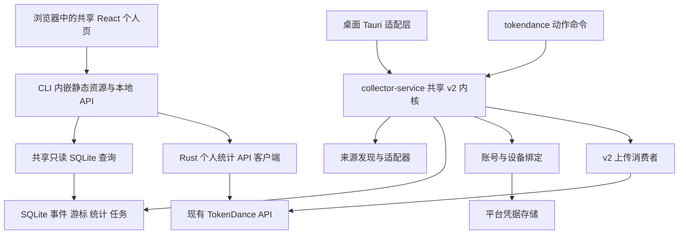

# TokenDance CLI 开发方案

状态：提案，待产品范围评审；尚未实现。

调研日期：2026-09-29。

代码基线：`f65bccb471d5da306b8ea08b527c1f01d740a85c`，仅代表当前工作区，不代表线上版本。

已确认方向：信息展示集中到 `tokendance dashboard`，参考现有 Web 个人数据页；登录只暴露 `tokendance login`。

已确认展示形式：`tokendance dashboard` 启动本地网页面板，自动打开浏览器，复用现有 Web 个人数据页的展示组件与样式。

UI 评审入口：[交互原型](ui/index.html)、[设计说明与监控内容映射](ui/README.md)。原型使用示例数据，尚未连接真实服务。

## 1. 产品定位与首版边界

提供独立可执行文件 `tokendance`，让没有桌面环境的开发机器也能接入 TokenDance；用户通过本地网页 dashboard 查看个人数据，通过少量动作命令管理采集和登录。脚本使用 dashboard 的 JSON 快照。前端在发包时预构建并嵌入二进制，用户运行不需要 Node.js、Python 或内嵌 WebView；本机数据无需登录。查看网页需要浏览器，SSH 主机可通过端口转发使用用户电脑的浏览器。

首版完成以下闭环：安装 → 检测来源 → 本地持续采集 → 查看用量 → 浏览器授权 → 绑定设备 → 同步到现有网站。后台运行交给操作系统服务管理器。

| 能力 | 首版 | 后续 |
| --- | --- | --- |
| 个人 dashboard | 过去 24 小时、今日、近 7 天、近 30 天、全部时间；指标、趋势、Agent、Skill、日历、设备与同步 | 更多详情与导出能力 |
| 监控面板迁入 | Agent 用量与费用、模型明细、订阅额度/套餐/窗口与重置时间、采集与同步运行状态 | 新来源、新平台额度能力 |
| 本地采集 | 单次执行、前台常驻、来源启停和路径配置 | 桌面端与 CLI 经 IPC 互相控制 |
| 账号同步 | 统一 `login`，自动适配本机浏览器或 SSH 跨设备授权 | 专用于 CI 的短期受限凭据 |
| 自动运行 | Linux 用户级 systemd 服务 | macOS launchd、Windows 用户级计划任务 |
| 数据范围 | 登录后默认账号全设备汇总，可切到本机；未登录可看本机 | 团队统计和完整排行榜 |
| 复杂功能 | 保留已有统计口径和隐私边界 | 团队写操作另立需求 |

Linux 首轮验收 Codex、Claude Code 的原生本地来源；Pi、OpenCode 等有可复用策略的工具按平台实测逐个开放。macOS/Windows 复用已有策略，但 CLI 对外标记的支持能力必须经过实际构建和样本验收。不能把“适配器存在”直接当成 Linux 可用。

不在首版承诺全历史导入、跨设备自动去重、导出聊天正文、代运行模型或代理 API 请求。

CLI 明确不提供悬浮球、托盘入口、桌面置顶窗口或相关设置。原监控面板的信息迁入 dashboard；后台采集由进程/系统服务运行，不依赖网页是否打开。

## 2. 仓库现状与必须补齐的缺口

以下结论来自源码检查，尚未运行 Linux 二进制或线上验证。

| 现状 | 代码依据 | 对方案的影响 |
| --- | --- | --- |
| 已有 `tokendance-collector` 二进制，但没有面向用户的子命令 | `collector/apps/service/src/main.rs`、`runtime.rs::run_headless` | 可复用装配与发现能力，不能直接包装后发布 |
| 旧 headless 使用 WAL 与 `Uploader<HttpTransport>`，发送 `/v1/telemetry/batches`；服务端将旧遥测路由指向升级错误 | `collector/apps/service/src/upload.rs`、`collector/crates/uploader/src/transport.rs`、`server/internal/httpapi/router.go` | CLI 必须接入 v2，不延续旧上传链路 |
| v2 采集、SQLite、统计查询和上传消费者仍在桌面工程内 | `collector/apps/desktop/src-tauri/src/local_store/pipeline/`、`upload_pipeline.rs` | 先抽取共享内核，防止形成两套计量规则 |
| 账号和生命周期与桌面状态、Tauri 混合 | `commands/account.rs`、`daemon/mod.rs`、`state.rs` | 业务服务与窗口、浏览器启动、UI 通知解耦 |
| Linux 有部分 XDG 路径回退，但协议身份不接受 Linux，真实凭据后端仅支持 Windows/macOS | `collector/apps/service/src/platform.rs`、`collector/crates/platform-credentials/src/lib.rs` | 路径可用不代表采集与同步可用 |
| 设备 service 有部分 Linux 判断，但协议生成源、MySQL store 校验及初始 CHECK 仍限定 Windows/macOS | `schemas/protocol/v1/spec.json`、`server/internal/device/service.go`、`server/internal/store/mysql/device.go`、`server/db/migrations/0001_tokendance_server.sql` | 必须贯通协议、存储、迁移和所有设备入口 |
| 登录交接仅允许 `127.0.0.1` 回调 | `server/internal/auth/desktop.go` | 本机可复用；SSH 需要新增设备码交接 |
| Web 个人页直接依赖账号上下文、全局 API、站内路由、导出和隐私设置导航 | `web/src/pages/me/PersonalAnalytics.tsx`、`web/src/api/client.ts` | 抽出共享展示层与数据接口，新增本地入口；不能直接打开该路由当成本地面板 |

复用基线以 v2 实际代码与[统计计量契约](../../metric-contract-v1.md)、[事件时间规则](../../event-time-admission-v1.md)为准；早期采集方案中的历史回放、WAL-only 等描述不作为 CLI 目标。

## 3. 命令设计

统一使用 `tokendance`，不默认安装容易冲突的 `td` 别名。信息集中到 dashboard；命令保留明确动作与必要的故障诊断。下表均为拟开发命令。

| 命令 | 行为 |
| --- | --- |
| `tokendance init` | 创建私有目录，选择来源，检查凭据后端；输出后续操作，不隐式登录或安装服务 |
| `tokendance dashboard` | 启动只监听本机的网页服务并自动打开浏览器；包含个人数据、来源、设备、采集与同步状态 |
| `tokendance dashboard --json` | 输出一次结构化快照后退出，供脚本使用；不启动 HTTP 服务或浏览器 |
| `tokendance sources enable codex` / `disable codex` | 调整该环境的采集设置 |
| `tokendance sources set-path codex /path/to/source` | 显式配置来源路径并检查可读性 |
| `tokendance collect --once` | 对本次发现的来源执行有界增量采集并处理对应统计；不隐式登录或上传 |
| `tokendance run` | 前台常驻采集；已登录且启用同步时独立运行上传消费者 |
| `tokendance login` | 自动选择可用的浏览器授权方式；SSH 下显示授权地址和短码，仍使用同一个命令 |
| `tokendance logout` | 立即停止当前登录上下文同步、清除本地会话，并尝试撤销服务端会话；保留本机统计 |
| `tokendance sync --timeout 60s` | 上传命令开始时已提交、仍有效且待上传的任务；不把服务端接收等同于网页聚合完成 |
| `tokendance doctor` | 只读诊断路径、权限、凭据后端、schema、网络与服务端能力；不自动重建身份或删除数据库 |
| `tokendance service install\|uninstall` | 管理 Linux 用户级后台服务；运行状态在 dashboard 展示，卸载服务保留数据 |

典型使用：

```sh
tokendance init
tokendance login
tokendance service install
tokendance dashboard

# 可选：脚本获取同一面板的数据快照
tokendance dashboard --json
```

不提供独立的 `usage`、`stats`、`trends`、`skills`、`status`、`sources list` 信息命令。周期、筛选、来源和设备详情都在面板内完成。`doctor` 保留为面板无法工作时也可执行的诊断入口。

### 3.1 Dashboard 信息与交互

参照当前 `web/src/pages/me/PersonalAnalytics.tsx`；`PersonalDashboardPage.tsx` 只是打开个人数据面板的路由入口。

| 面板区域 | 内容与 Web 对齐点 |
| --- | --- |
| 顶部 | 当前账号、账号/本机范围、周期、最后获取时间；网络与同步状态明确展示 |
| 概览 | 总 Token、预估费用、生成代码行、总消息数、会话总时长；输入上下文、输出 Token、缓存命中率、单行 Token、用户消息数共 10 项，复用 Web 卡片布局 |
| 趋势 | 复用 Token 趋势图；工具、模型筛选只作用于趋势，明确标注，沿用响应式图表布局 |
| Agent | 工具构成、Token 及占比；从相同范围 API 获得，不在 CLI 自创计量规则 |
| 用量与额度 | 保留桌面监控的工具用量、费用与模型明细；显示本机工具套餐、各额度窗口已用比例、剩余/重置时间和观测时间，区分未知/过期/未授权 |
| 活跃与 Skill | 活跃日历、连续活跃天数、Skill 排行；没有数据时展示原因 |
| 排名 | 与 Web 一致，显示过去 24 小时个人排名，独立标明周期；未上榜不显示 0 名 |
| 设备与来源 | 账号设备同步信息；本机来源开关状态、读取异常、进程占用、统计/上传积压和最后成功时间分开标记 |

周期显示“过去 24 小时 / 今日 / 近 7 天 / 近 30 天 / 全部时间”。今日保留桌面监控的 UTC+8 自然日含义；Web API 的 `range=today` 实际对应滚动过去 24 小时，不能用该参数查询新增的今日视图。实施时为自然日建立明确独立的查询契约，例如新增 `range=day`，并完成云端/本机对齐；不靠不完整客户端快照估算。趋势筛选不改变概览与 Agent 汇总；日历和排名保留各自的明确窗口。

网页保留现有周期按钮、工具/模型筛选、图表交互、设备展开和刷新操作；以总览、用量与额度、活动与技能、设备与同步四页组织。原型另提供采集暂停/恢复及立即同步的拟议操作，当前只模拟状态；正式实现须通过受控 API 委托唯一采集写进程，不能由网页服务直接写采集库。来源连接等复杂配置仍保留动作命令。

复用 `personal-analytics.css`、现有主题、字体、间距和图表配色，宽屏使用卡片网格，窄屏按现有断点折叠，支持页面缩放。新增“账号/本机”范围切换及本机来源状态区域，保持同一视觉体系。Tab 可遍历控件，焦点可见；状态配文字说明，图表提供可读标签，不仅靠颜色表达差异。

加载、空数据、无权限/登录过期、部分接口失败、离线和不支持必须分开。局部失败只影响相应面板，已有结果标出旧快照时间；本地服务结束时页面显示“连接已断开，请重新运行 tokendance dashboard”，不能把旧数据继续标成实时。

### 3.2 数据来源

- 已登录：默认展示账号全设备汇总，由 Rust 本地服务复用 Web 的 `/api/v1/me/summary`、`/trends/tokens`、`/breakdowns/agents`、`/skills`、`/calendar`、`/filter-options`、`/devices`（后六项同属 `/api/v1/me`）。页面只访问同源本地 API；云端会话与 CSRF 处理留在 Rust 账号模块，不把长期会话发给浏览器，也不要求浏览器另登录一次。
- 未登录：直接进入“本机数据”，无需强制登录；Rust 服务通过共享 SQLite 查询已提交统计。账号排名、全设备列表等云端专属内容提示运行 `tokendance login`，不按零值填充。本地网页的访问授权与 TokenDance 账号登录是两个独立边界。
- 面板内可切换账号/本机；脚本可用 `--scope account|local` 和 `--range 24h|7d|30d|all` 明确选择，避免默认值随登录状态变化影响脚本。
- 账号汇总与本机未上传数据不相加；同步积压以独立状态展示。离线不悄悄把账号统计换成本机统计：保留本次打开期间已有的账号快照并标记过期，无快照则提示不可用，用户可主动切换本机。
- 当前 Web 本身通过多个接口读取，不承诺跨接口事务快照。面板记录每块获取时间；切换周期时丢弃旧请求的迟到结果，不能拼接不同范围。只刷新必要数据，避免高频重复查询整套接口。
- 本机查询要补齐面板所需投影及滚动 24 小时窗口；使用现有小时/日/月聚合，不重新解析来源。无法由既有聚合可靠得到的字段标记不支持，不复制账号数据凑齐。
- 独立 dashboard 进程在每次云端查询前核对当前环境的登录状态/账号 generation；登出或换号后清除对应快照、取消旧请求并拒绝迟到结果，不能继续拿内存里的旧会话读上一个账号。
- 额度复用并解耦 `collector/apps/desktop/src-tauri/src/commands/quotas/`、`commands/quotas.rs` 的来源查询能力；页面从本地 API 读取限频缓存快照，不能随每个浏览器轮询重复请求上游。额度始终表示本机连接的工具账号，独立于统计周期和 TokenDance 的全设备范围，不求和、不上传凭据、不由 Token 用量推算。Linux 等平台按实际来源能力展示不支持或待授权；截图不代表这些平台已接通。

### 3.3 启动、关闭与 SSH 访问

1. `tokendance dashboard` 在 `127.0.0.1` 的可用端口启动本地 HTTP 服务，确认监听成功后自动打开浏览器，并在终端显示实际地址。默认由系统分配端口，避免占用常用开发端口。
2. 该命令在前台维持网页服务；Ctrl+C 只关闭该网页服务，不停止已运行的采集服务。关闭浏览器标签页不等同于停止 HTTP 服务，终端启动提示应说明生命周期。
3. dashboard 的启动和查询不隐式启动采集、同步或 schema 迁移，可以与桌面或 `tokendance run` 并行。它不占采集写锁；自身临时会话文件与运行端口信息独立管理。显式点击监控操作时，通过已认证的本地 API/IPC 委托现有采集进程；未运行或版本不支持时明确禁用并说明原因。
4. 无浏览器/SSH 下不尝试打开远程主机上的浏览器，显示地址和端口转发步骤。可用 `--no-open` 明确只启动服务，用 `--port` 固定转发端口；这些是可选运维参数，普通用户只需基本命令。指定端口已占用时明确报错，不静默改端口破坏隧道。
5. 首版不提供公网监听或 `--host 0.0.0.0`。SSH 通过加密隧道访问：远端运行 `tokendance dashboard --port 18765`，用户电脑建立下例隧道，再打开终端提供的本地授权链接。两端使用相同端口以保持预期 origin；18765 仅为示例。

```sh
# 在用户电脑运行；user@host 替换为采集主机
ssh -N -L 127.0.0.1:18765:127.0.0.1:18765 user@host
```

重复执行首版可创建独立只读网页会话，各用临时端口；不创建第二个采集器，不复制设备身份。固定端口冲突时提示已有服务或更换端口，不自动关闭未知进程。

### 3.4 本地 HTTP 边界

- 静态资源与 `/api/local/v1/` 由同一 Rust 服务提供；页面只请求同源接口。后端使用明确的查询路由和参数，不提供任意 URL 代理、任意文件读取、SQL 或执行命令接口。
- 每次启动生成高熵、短期、一次性的网页启动凭证，通过自动打开的 URL fragment 交给页面，再兑换仅用于本地面板的短期会话。完成兑换后移除 fragment；启动凭证不放入 query、访问日志或云端请求。SSH 时允许复制同一启动链接。
- 本地会话可以采用内存保存的随机凭据，页面仅在该标签页的 sessionStorage 保存短期本地访问凭据、通过自定义请求头发送；不用云端会话或设备私钥充当它。服务退出/过期即失效，失效后重新运行 dashboard；同一启动凭证不可重复兑换。
- 业务 API 必须验证本地会话；浏览器请求严格核验 Host 与 Origin/Fetch Metadata（适用时），不因请求来自 loopback 就跳过授权。CORS 不开放任意来源，不接纳任意 Host，防止外站读取本机数据与 DNS rebinding。访问限制不能仅依赖 CORS，参考 [MDN CORS](https://developer.mozilla.org/en-US/docs/Web/HTTP/Guides/CORS)。
- 启动页及 API 使用 `Cache-Control: no-store`，启动页设置 `Referrer-Policy: no-referrer`；静态资源仅来自发行包，配置只允许必要资源的 CSP，不加载第三方脚本、追踪器或远程字体。动态文字按文本渲染，所有路径/查询做类型和范围校验。
- 本地 HTTP 仅用于 loopback/SSH 隧道；云端通信继续使用 HTTPS。云端 session、设备密钥、上游 Cookie/Set-Cookie 和原始来源正文不得出现在浏览器响应或错误日志中。
- 监控操作新增专用 POST 接口（暂停/恢复、触发同步），要求有效本地会话、精确 Origin、自定义 CSRF 请求头、窄化动作白名单和幂等请求身份。IPC 验证同用户权限、实例/协议版本，进程重启后过期请求不得执行。查询不可通过 GET 触发写操作，不开放任意命令执行。

### 3.5 输出约定

统一交互约定：

- `--json` 输出带 `schema_version` 的稳定对象；stdout 仅放结果，进度和日志写 stderr。失败同样输出结构化 `error.code`，不需要脚本解析中文文案。
- 快照包含 `scope=account|local`、`business_timezone=Asia/Shanghai`、实际窗口、各块查询时间与积压。本机运行状态单列，不混入账号总量。
- 大整数 Token 与货币最小单位在 JSON 中使用十进制字符串，保留单位、币种、coverage 与 `null`；避免 JavaScript 精度损失。
- `--no-input` 保证不会等待提示；缺配置或登录条件时立即返回明确错误。交互式 `login` 可等待浏览器确认，但受过期时间约束；已登录时只报告登录结果。
- `collect --once` 对执行开始时的发现范围与可读长度建立边界；持续追加不会让它无限等待。超时报告剩余任务，不伪报完成。
- `sync` 的成功要求目标集合均已确认；永久拒绝、到期丢弃、超时仍积压分别报告。dashboard 查询成功不代表积压为零。
- dashboard 的网页模式不因缺少 TTY 改成数据快照；无 TTY 时只跳过自动开浏览器，仍提供 HTTP 服务并输出可用地址。`--json` 显式选择一次 JSON 快照，完成后退出。部分失败的 JSON 带 `partial=true` 和各块错误，退出码为 `4`，不伪报完整成功。
- 普通查询不修改设置、不迁移 schema、不触发上传。缺数据库时给出初始化提示；更高版本 schema 返回升级提示。
- 建议退出码：`0` 完成，`1` 内部错误，`2` 参数/配置无效，`3` 需要认证或凭据不可用，`4` 操作未完成/暂时故障，`5` 运行实例冲突，`6` 数据或版本不兼容，`130` 用户中断。

## 4. 共享内核与工程组织

推荐 Rust 独立二进制。沿用现有 Tokio、SQLite、reqwest 与适配器；新增命令解析采用 [clap](https://docs.rs/clap/latest/clap/)，具体版本在实施时按 workspace 工具链选择并锁定。

第一步把通用能力抽入已有 `collector-service` library，不为目录美观先建立多个新 crate。桌面端已经依赖它，CLI 再增加同方向依赖即可。



拟定结构：

```text
collector/
  apps/cli/                       # 新增 package 与 tokendance 二进制
    src/main.rs                   # clap、退出码和组合入口
    src/commands/                 # 命令适配
    src/dashboard/                # 本地 HTTP、静态资源、授权及只读路由
    src/output.rs                 # 启动/操作输出与 JSON 快照
    src/service.rs                # OS 服务管理适配
  apps/service/src/               # 已有共享 library，保留 package 名
    pipeline/                     # 从桌面迁入 v2 runner/store/query 等
    upload_pipeline.rs            # 从桌面迁入 v2 上传消费者
    pricing.rs                    # 与 pipeline 一起迁入
    account/                      # 会话、绑定和凭据访问业务逻辑
    analytics.rs                  # 复用现有个人数据 API，供 dashboard 调用
    client_runtime.rs             # 生命周期、采集/统计/上传调度
    detect.rs / platform.rs        # 保留并补充平台能力
  apps/desktop/src-tauri/src/      # 保留窗口、托盘、通知及 Tauri commands
web/
  dashboard.html                 # 新增本地网页构建入口
  vite.dashboard.config.ts       # 独立静态构建，无网站托管插件
  src/local-dashboard/           # 本地启动授权、范围切换与数据适配
  src/components/personal/       # 从当前个人页抽出的共享展示层
  src/pages/me/                   # 网站入口，继续接现有账号与导航
```

实施边界：

1. 抽取时保持事件身份、事实键、统计 SQL、数据库文件和现有 keychain 项目名称稳定；首个 PR 只做结构搬迁。
2. `pipeline` 与 `upload_pipeline::encode_wire_event`、`pricing` 存在交叉引用，须作为同一边界迁移，不能复制一份 decoder 到 CLI。
3. 将 `AppState` 中的业务状态拆出 `ClientRuntime`；Tauri 通过薄适配层访问。公共内核不依赖 Tauri，不直接打开窗口。
4. 浏览器启动和用户提示作为调用方适配；内部运行状态以类型化事件/快照向调用方暴露。凭据后端由显式配置注入。
5. 采集、统计与上传独立调度：断网不阻塞本地提交；统计失败不把成功上传回退；上传只使用现有 v2 租约与 ACK 语义。
6. 将原 `tokendance-collector` 接到相同 v2 runtime，或停止随发行包分发旧入口；不得继续公开一个看似可用但发送旧协议的后台程序。
7. 同步更新 collector workspace 和独立 desktop workspace 的依赖与 lockfile；移动 `blob-decoder` 的使用时检查现有 patch 是否也需作用到 collector workspace。

### 4.1 复用现有 Web 个人页

将 `PersonalAnalytics.tsx` 拆成共享展示层和宿主适配层：指标、趋势、Agent 构成、日历、Skill、同步卡片及格式化逻辑共用；网站宿主提供原有账号 API 和站内导航，本地宿主提供本地 API 与 CLI 登录状态。先在现有 Web 测试中证明抽取前后行为一致，再接入本地入口。

不能直接复用整个网站 App 或修改全局 API 单例的 baseUrl：当前个人页使用 `AuthContext`、`useNavigate`、导出任务和隐私设置跳转。新增明确的数据提供接口和能力标志，本地首次不挂团队、排行榜导航、导出写接口和网站 onboarding 重定向；对应按钮只在宿主实际支持时呈现。账号需要完善资料时提供固定官网入口，不把 Token 放进链接。

新增独立 Vite 构建入口与输出目录，例如 `web/dist-dashboard/`；复用源码、依赖 lockfile 和必要资源，独立配置静态 base 与路由。Vite 可生成静态产物并支持不同 HTML 入口，见 [构建文档](https://vite.dev/guide/build.html)。本地构建不调用现有 `build-sites.mjs`，不启用 Sites 插件、不生成托管 server，也不要求部署网站。

发布流水线先构建 dashboard，再将产物嵌入 Rust 二进制并记录前端 hash、构建 SHA 与本地 API 版本。启动无需联网下载资源；开发时可使用 Vite 联调，但发行版不启动开发服务器，不依赖用户安装 Node.js。页面与 API 来自同一发行包，旧标签页遇到不同 API 版本时提示刷新，不尝试读取不兼容数据。

## 5. 桌面与 CLI 共存、目录和身份

首版采用“同一用户、同一环境、同一采集身份、单一采集写进程”；本地 dashboard 作为独立只读进程可并行运行。

- macOS/Windows 默认使用现有 TokenDance 数据目录、installation ID、事件命名空间与设备密钥。不能为 CLI 新建身份再次上传同一来源。
- 所有可能写入本地状态的命令，包括登录、来源配置、采集、同步、迁移，必须先取得同一跨进程排他锁。锁失败返回持有者信息；不停止或杀死桌面进程。
- dashboard 的本机视图和只读诊断使用短时只读连接/状态快照；账号视图独立查询云端。不得为了查询而启动 runtime 或迁移数据库。旧桌面无法提供某些运行状态时标记 unknown。
- 首版桌面正在采集时，CLI 可查询统计，写操作返回 `INSTANCE_IN_USE`。后续确有需求再增加本地 IPC，将写操作交给现有进程。
- 上一条适用于尚未接入受控 IPC 的动作。监控面板新增的暂停/恢复与同步操作若纳入正式首版，应将对应 IPC 提前实现；仍由唯一写进程执行，旧桌面版本不支持时显示限制，不能绕开写锁。
- 首版从桌面切换到 CLI 常驻，需要先退出桌面采集进程；反向切换同样释放锁后再启动。安装后台服务时检测冲突并说明启动结果。
- macOS 正式签名 CLI 必须验收对原 keychain 条目的访问。读不到已有密钥时报告修复路径，不通过换 keychain 服务名或生成新设备绕过。
- 数据目录与密钥丢失分开处理：已有 installation 缺密钥时停止同步；不得静默补造设备种子。迁移前备份，较旧程序遇到更高 schema 拒绝写入。

Linux 新目录遵循 [XDG Base Directory Specification](https://specifications.freedesktop.org/basedir/latest/)：配置、持久数据、日志状态、缓存和运行时锁分别使用相应 XDG 目录。已有实验版 Linux 目录必须检测并显式迁移，避免重复身份。

测试与生产使用不同数据目录、凭据命名空间、installation ID 和服务配置。环境变更不能携带另一个环境的会话或上传任务；配置优先级为命令参数 > `TOKENDANCE_*` > 配置文件 > 默认值。凭据不接受普通命令行参数或写入 TOML。

## 6. 登录、授权与 Linux 凭据

### 6.1 用户只执行 `tokendance login`

设备码是登录实现中的授权方式，不是用户必须学习的命令参数。删除公开的 `--device-code`：

1. 已登录且会话有效，显示当前账号；过期则在同一命令内重新授权。
2. 本机有浏览器时自动打开登录授权页，用户在网页确认，终端显示登录成功。
3. 检测到 SSH/无浏览器时，显示授权地址和短码，用户在自己的电脑或手机浏览器确认；终端自动等到结果，不要求把 token 粘回终端。
4. 环境检测只是提示依据：本机浏览器无法打开或回调不可用时，同一命令提供“在其他设备继续”的选择，取消原等待后启动跨设备授权，不要求重输特殊参数，也不同时保留两个可兑换流程。
5. 非交互且未登录时明确返回需要交互授权；不把面向人的短码流程当成 CI 登录手段。

### 6.2 本机登录的内部实现

复用现有浏览器授权交接：随机 loopback 端口、state、verifier/challenge 和一次性短期 code。服务端将会话标记为 TokenDance CLI；CLI 自己保管会话，浏览器不把长期会话放到 URL。

当前实现是项目自有交接协议，不能仅因包含 challenge 就宣称是标准 OAuth PKCE。CLI 复用现有安全边界，并补充 client 类型白名单及浏览器打开失败提示。

### 6.3 SSH/无浏览器登录的内部实现

增加设备码授权交接，参考 [RFC 8628](https://www.rfc-editor.org/rfc/rfc8628) 的分离设备授权、过期和轮询规则；首版继续对接现有会话体系，不宣称建设完整 OAuth 授权服务器。

拟新增接口：

| 接口 | 认证与行为 |
| --- | --- |
| `POST /api/v1/auth/device/start` | 创建短期挑战；返回私有 device_code、可展示 user_code、verification_uri、expires_in、interval |
| `POST /api/v1/auth/device/approve` | 网站已登录用户 + CSRF；核对短码、目标主机、请求权限后批准或拒绝 |
| `POST /api/v1/auth/device/poll` | 用私有 device_code 换取结果；支持 pending、slow_down、denied、expired 状态 |

批准和兑换使用原子状态转换；一次兑换只能创建一个 CLI 会话，重放不得签发第二份。挑战过期建议 10 分钟、初始轮询 5 秒；最终参数需压测及登录流程验收。接口按 IP、挑战、用户限制请求与输码次数，敏感码不落日志。

挑战建议存 MySQL，跨 API 进程和重启保持一致；只存设备码 hash、短码安全摘要、有效期、必要批准上下文与状态。完成兑换前重验批准用户/会话未被撤销。短期记录定时清理，不引入新的 Redis 部署依赖。

新增表必须遵守仓库规则：标准 `id/created_at/updated_at/delete_at/extra`、业务 UNIQUE、字段 COMMENT、读路径过滤软删除。主查询和状态列独立保存；主机展示信息等非检索属性可使用有结构契约的 `client_context` JSON。凭据、挑战状态不得塞入 `extra`。此方案不修改已有表去补齐通用字段。

授权成功后，复用现有设备绑定、session Bearer 与设备签名链路。`dgt_` 设备授权不能假设为通用账号查询或 v2 遥测凭据。首版会话遵循已有失效/撤销规则，过期时继续本地采集并提示重新登录，不编造现有代码没有的 refresh-token 流程。

退出时若网络不可用，本地清除和停止同步仍须完成，并明确服务端会话尚未确认撤销。换号必须清空在途认证上下文、提升 binding generation，拒绝迟到 ACK 污染新上下文；已 ACK 的事件不因换号重传，待上传数据按既有归属规则处理并展示影响范围。

### 6.4 凭据存储

- Windows/macOS 复用现有真实系统凭据后端。
- Linux 有可用且已解锁的系统密钥服务时接入真实后端；纯 SSH 不假定存在桌面 keyring。
- 无系统密钥服务的主机，提供显式选择的 `private-file` 后端：目录 0700、文件 0600、校验 owner/权限、拒绝符号链接、原子写入，日志和导出均脱敏。它是受文件权限保护的存储，不宣称等同系统加密密钥链。
- 有更高存储要求时允许从受控凭据文件/文件描述符注入密钥；不要把长期密钥写入 systemd unit、shell 历史或可见参数。
- 初始化时明确后端；系统密钥服务失败不能静默降级到文件，更不能使用 `TOKENDANCE_ALLOW_MOCK_KEYSTORE` 支撑正式运行。

## 7. 数据语义与失败恢复

完全沿用当前[计量契约](../../metric-contract-v1.md)：

- 业务桶固定 UTC+8；主机设在其他时区不改变口径。dashboard 的“过去 24 小时”使用现有小时窗口，7/30 天使用自然日规则，两者不能混称“今天”。首版不提供可重分桶的 `--timezone`。
- 首次采集只准入当天事件；前一天合法入库的任务可在今天继续重试。因此长期断网仍运行可积累已准入任务，但关机数日后不承诺补齐漏采日期。
- 事件明细和任务遵循现有 14 天生命周期，保留汇总与来源进度；离线超过保留期不能承诺零丢失，dashboard 的本机状态显示到期丢弃量。
- Token 仅用 exact/derived；未知不等于零。金额保留已上报/按价格计算/无价格的来源和覆盖信息，并按币种展示。
- 单次采集成功以本地事务提交为准；游标与事件原子提交。重复读取、ACK 丢失重试不能重复累计，无法可靠确认修订关系时不猜测。
- 日/月会话数使用原有去重口径，不能简单相加每日唯一会话数。
- 不保存或上传提示词、回复、代码正文和凭据；绝对来源路径只用于必要的本地定位，不进入云端统计 payload 或默认诊断导出。
- 上传遇到 401/撤销进入待重新认证；429/临时网络错误退避；永久拒绝可诊断。磁盘满停止推进游标，损坏库停止写入并给出恢复路径。

优雅退出停止领取新任务，等待当前事务和有限时间的在途请求结束；超时退出后靠持久任务与租约恢复。Linux SIGTERM 与 Ctrl+C 都必须覆盖。

## 8. 后台运行与分发

首版发行候选平台：Linux x86_64/arm64、macOS arm64/x86_64、Windows x86_64。最终公开矩阵以各平台 CI 和真实运行结果为准，不承诺未经测试的发行版或 Windows ARM 原生包。

- Linux 从明确的 GNU/glibc 基线开始；记录最低运行环境。musl 静态构建、Alpine/容器独立验收后开放，不能只凭 Rust 就承诺全静态兼容。
- `run` 始终前台执行；systemd 用户服务配置 `ExecStart=... tokendance run --no-input`。不自行 fork 或另造进程守护协议。
- 没有用户级 systemd/D-Bus 时给出前台运行说明；注销后持续运行涉及 linger，需显式系统设置，不在安装流程里偷偷提权。
- 服务固定可执行文件路径与环境，升级时先停止、替换、启动，再检查状态。卸载服务不删除业务数据。
- 首发提供版本化 tar.gz/zip、SHA256、签名/公证及构建信息；Homebrew、Scoop、npm 分发后续补充。首版不做静默自更新。
- CLI 使用独立产物和清单，不覆盖桌面更新包。实际版本号在实施发布时查询占用情况后确定，本文不预占或修改版本。
- 按 AGENTS.md 在升版前及发布前检查 `desktop_releases`、所有相关平台/环境、远端标签、GitHub Releases（含草稿和预发布）及进行中发版 PR。若建立 CLI 专用发布记录，再纳入该记录；查询失败不得视为未占用。

## 9. 实施顺序、交付物与验收

估算以一名熟悉仓库的工程师为前提，为有效开发人日，未包含发布证书办理、外部审核及排队。下表 23–35 人日是加入监控内容前的基础估算；当前再纳入额度迁移、独立今日窗口及拟议监控操作/IPC，应在第 0 阶段核对后重估，不把原估算视为覆盖新范围的承诺。当前只交付 UI 评审原型。

| 阶段 | 工作与交付物 | 估算 | 退出条件 |
| --- | --- | --- | --- |
| 0：验证边界 | dependency 图、Linux 编译探针、现有来源样本与桌面共享目录探针 | 2–3 天 | 明确 Tauri/平台耦合、锁与 keychain 可复用范围，记录风险 |
| 1：抽取内核 | pipeline/pricing/upload/account 生命周期迁入共享 library，桌面接回 | 5–7 天 | 同样本统计和上传结果等价；桌面离线、登录、换号、退出回归通过 |
| 2：本地 CLI 与网页 dashboard | 动作命令、Web 展示层抽取、本地 HTTP/授权、本机查询、JSON 快照、采集与凭据 | 6–9 天 | Web 个人页回归通过；Linux 来源样本通过；无需 Node 运行；网页与采集可并行 |
| 3：账号与云端闭环 | 统一 login、设备码内部交接、个人数据 API、Linux 设备支持、v2 同步 | 6–9 天 | 同范围账号数据与 Web 对齐；本机/SSH 均只执行 login；注册/重绑与异常恢复通过 |
| 4：发布与服务 | systemd、前端内嵌打包、跨平台 CI、SSH/浏览器验收和文档 | 4–7 天 | 离线打开本机页、隧道访问、Linux 服务恢复、Mac/Windows 包冒烟、最新 head CI 全绿 |

建议 PR 按上述行为边界拆分；阶段 3 的新 API 先发布到测试环境，再联调 CLI。阶段 1 不同时重写统计算法或重置桌面数据。

必须覆盖的验收场景：

| 场景 | 预期 |
| --- | --- |
| 相同 fixtures 由桌面与 CLI 处理 | 事件身份、各粒度汇总、coverage、费用与 v2 编码一致 |
| dashboard 与 Web 同账号、同窗口、同筛选 | 指标含义和结果一致；过去 24 小时不显示成自然日，趋势筛选不改变全局汇总 |
| 未登录、离线、切换本机/账号、接口部分失败 | 范围始终明确，不混加数据、不伪造零，不展示错误周期的迟到结果 |
| 浏览器窗口缩放、键盘导航、网页服务退出 | 布局和焦点可用；页面明确显示断开，采集继续运行 |
| 首次启动、端口冲突、浏览器打开失败、SSH 隧道 | 地址准确；失败可手动访问；只绑定 loopback；固定端口不被静默替换 |
| 恶意 Origin/Host、缺本地授权、启动凭证重放、路径穿越 | 拒绝访问；不泄露账号会话，不变成通用代理或文件服务器 |
| 额度过期/未授权/平台不支持、切换日期或账号范围 | 独立快照与状态明确；不把旧值当当前，不通过 Token 或跨设备求和推算额度 |
| 今日与过去 24 小时、暂停/同步委托、实例重启 | 两种窗口正确区分；写操作只由有效实例执行，旧请求不误作用于新进程 |
| 网络断开、发行包缺资源、旧标签页、登出/换号 | 本地页无需 CDN；缺资源明确失败；版本错误提示刷新；旧账号数据和在途响应被清除 |
| 同一个 login 在本机/SSH/浏览器失败下执行 | 自动适配或在命令内选择继续；不要求额外协议参数，不留下并行有效的交接流程 |
| Linux 注册、claim/rebind、上传 | 客户端枚举、JSON schema、Go 校验、MySQL 约束全链路接受正确 Linux 身份 |
| 桌面运行时查询/写入 CLI | 查询可用；写入明确报占用，不创建第二身份 |
| 进程在提交前后崩溃、文件轮转/截断 | 游标与事实不分叉；恢复后统计无重复且进度可解释 |
| 同日离线采集后恢复网络、跨日重试 | 已准入任务继续上传；错过准入日的旧记录不补造 |
| 设备码猜测、重放、过期、拒绝、并发兑换 | 限速且状态明确；只签发一次，泄露短码不能直接兑换会话 |
| 部分 ACK、ACK 丢失、429、401、换号迟到响应 | 按原租约与绑定版本恢复；不会重复累计或跨账号确认 |
| Linux 没有 keyring、keyring 锁定、文件权限过宽 | 明确错误或用户已选择的文件后端；不静默降级 |
| JSON 管道、无 TTY、超大整数、未知值 | 无颜色和进度污染；结构稳定、精度不丢失、不会阻塞输入 |
| SIGTERM、服务重启、缺 systemd、磁盘满 | 有界退出、可恢复、错误可诊断，不丢弃未提交进度 |

CI 包含 collector 与 desktop 的适用 Rust 测试、dashboard 本地 HTTP 与查询契约测试、Web 共享组件回归、浏览器端到端及离线资源测试、协议生成检查、Go/API 与 MySQL 迁移集成测试、设备授权页测试、平台构建和安装包冒烟。文档方案阶段不运行应用测试；实施时按每个 PR 的改动执行必要检查。

遵循仓库发布规则：每次 PR 推送后等待最新 head 的所有适用 CI 成功，记录 SHA 和运行链接，合并前再核对。测试功能完成 CR 和功能测试后，从干净 `release` 工作区发布独立测试服务，使用 `tokendance_dev`。生产服务、正式桌面包以及本方案建议的正式 CLI 包均从已核对的 `origin/main` 构建，记录实际分支与完整 SHA。

## 10. 关键架构决策（ADR，均为 Proposed）

| 决策 | 背景与选择 | 收益和代价 | 备选 |
| --- | --- | --- | --- |
| ADR-CLI-01：Rust + 共享 v2 内核 | 现有解析、统计和同步主要是 Rust；抽入已有 collector-service library | 统一计量口径、无额外语言运行时；前期要承担桌面拆分回归成本 | Go/TypeScript 纯 API CLI 易做云查询，但不能覆盖本地采集；重写解析器易漂移 |
| ADR-CLI-02：单一采集身份与排他运行 | 同源双实例会造成锁、身份和上报问题 | 首版进程关系简单；桌面运行时不能从 CLI 修改状态 | 首版全面 IPC 可以并行控制，但增加协议、权限与兼容面，放后续 |
| ADR-CLI-03：设备码交接 + 现有会话 | SSH 不能依赖本机 loopback 浏览器回调 | 跨设备授权可用，复用撤销机制；需要新接口、短期存储及授权页 | 复制浏览器 Cookie、长期静态 token、输入账号密码不作为默认流程 |
| ADR-CLI-04：系统服务管理 + 显式凭据后端 | 无桌面服务器需要重启恢复和非交互运行 | 用户可审计、无需自造 daemon；Linux keyring 与 service 生命周期需要真实环境验收 | 自守护增加运维复杂度；文件与密钥同存的“加密”不能替代真实保密措施 |
| ADR-CLI-05：本地网页 dashboard，登录单入口 | 用户已选择启动本地网页，参考 Web 个人页查看数据 | 复用 React 组件和样式、统一数据入口；需维护本地 API 授权与资源打包 | 不开发 TUI，也不把 dashboard 简化为仅打开线上个人页 |

本轮已确认本地网页 dashboard 与单一 login 入口。待评审项集中为：首发平台/来源矩阵、是否接受首版桌面占用时 CLI 写操作返回冲突，以及无 keyring 主机显式采用文件凭据存储的产品入口。没有答复的事项保留为提案假设，不写入已生效 spec。

## 11. 关联资料

- 当前采集事实：[采集与本地统计](../../facts/collection.md)。
- 现行规则：[统计计量契约](../../metric-contract-v1.md)、[事件时间规则](../../event-time-admission-v1.md)。
- 工程与发布：[开发构建](../../development.md)、[桌面版本发布](../../desktop-release-publishing.md)。
- 实施完成后更新对应 facts；CLI 命令输出、退出码和设备码交接确认后再建立 `docs/spec/cli.md`，本提案不替代正式规范。
