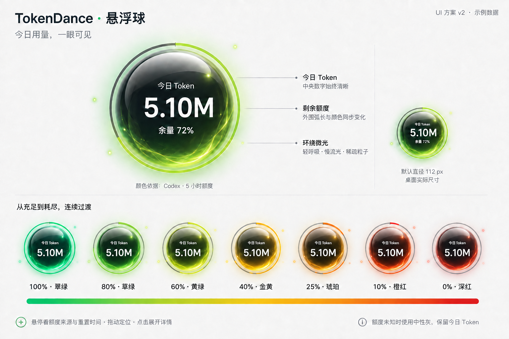

# TokenDance 圆形悬浮窗设计 v2

2026-09-06。按用户反馈，将 v1 常驻矩形条改为圆球。当前交付为 UI 方案和独立动效预览，尚未接入桌面客户端。

实现细节见：[圆形悬浮窗技术方案 v1](tokendance-floating-orb-technical-design-v1.md)。

## 核心信息

默认直径 112 DIP，中央三行：`今日 Token` / `5.10M` / `余量 72%`。大数字只代表本机今日累计 Token；颜色、外圈弧长和余量百分比只代表用户选定的一个来源、一个额度窗口。二者周期不同，不能根据今日 Token 推算套餐剩余量。

球体采用深石墨玻璃内核，中央文字区域保持暗底，白字不随额度颜色变化。球体边缘与下部带当前额度色，顶部保留轻微曲面高光。球外背景透明，无矩形底板。

悬停或键盘聚焦显示来源、窗口、更新时间与重置时间，例如 `Codex · 5 小时 · 剩余 72% · 2 小时 18 分后重置`。首次使用自动选择一个有新鲜额度的来源并明确提示；此后记住选择，不自动轮播。点击详情可更换来源。

## 连续变色

下表为设计锚点，锚点之间连续插值；不是跨阈值突然换色。

| 剩余额度 | 色彩 | 色值 |
| --- | --- | --- |
| 100% | 翠绿 | #24C88A |
| 85% | 草绿 | #48CC68 |
| 70% | 青柠绿 | #88CE46 |
| 55% | 黄绿 | #CBD33C |
| 40% | 金黄 | #F0C443 |
| 25% | 琥珀 | #F5A03C |
| 15% | 橙色 | #F47B3D |
| 5% | 珊瑚红 | #ED5546 |
| 0% | 深红 | #DE3D4B |

建议使用 OKLab 在相邻色标之间插值，避免简单 RGB 直插产生脏灰。球面染色、额度弧线、光晕与粒子统一使用同一实时色；同一个球不会同时出现一圈彩虹色。

外圈额度弧线宽约 2.5 DIP，从 12 点方向顺时针绘制；弧长 = 剩余百分比 × 360°。余量 0% 时无有效弧段，保留中性轨道及红色球体；100% 时完整一圈。表示额度的弧线始终固定，不能旋转。

UI 图展示 100%、80%、60%、40%、25%、10%、0% 等采样状态。图中的光效用于表达材质，精确弧长和颜色插值以动效预览及本文为准。

## 周围特效

| 层次 | 设计 | 默认节奏 |
| --- | --- | --- |
| 呼吸光晕 | 球外 8–12 DIP，透明度缓慢变化，轮廓不改变大小 | 6 秒一个周期 |
| 环绕流光 | 细而不闭合的装饰弧，位于额度环外，不携带数据 | 20 秒缓慢一周 |
| 微粒 | 2–3 个直径 1–2 DIP 的光点，沿外围缓慢移动 | 约 28 秒一周 |
| 用量更新反馈 | 收到新的已确认用量增量时，边缘提亮一次；相同数据刷新不触发 | 约 500ms；最多每 3 秒一次 |
| 低额度提示 | 首次进入 ≤20%、≤10% 时轻亮一次；保留余量文字和静态颜色 | 最多一次 800ms，不持续闪烁 |

默认“呼吸 + 环绕微光”。提供“仅呼吸光晕”和“关闭特效”两档。低额度不增加粒子数量、不加快旋转，不让警示变成持续干扰。系统开启减少动画时停用所有循环与更新动效，保留静态色与额度环。

独立预览展示循环光效、额度滑块和正常/待更新/未接入外观；新用量事件、自动阈值通知及原生窗口行为仍属后续实现。

## 交互与状态

- 拖动球体定位，超过 4 DIP 位移视为拖动，松开不误触详情；贴边吸附后保留完整圆球，默认不自动裁成半球。
- 单击打开已有风格的额度详情卡片，卡片位于球的内侧，避免超出屏幕；Escape 先关闭菜单/详情。
- 右键菜单提供关注额度、特效档位、暂停/恢复采集、隐藏悬浮球和设置；键盘用户可从详情进入同样操作。
- 暂停采集保留最后今日值，标记“已暂停”，所有循环光效停止；隐藏只关闭悬浮球，后台按原状态继续。
- 未接入额度：中性灰球、无有效弧线、文案“额度未接入”；今日 Token 仍正常显示。
- 额度过期或读取失败：中性灰球、无有效弧线、文案“额度待更新”；详情显示最后有效余量和原更新时间，停止低额度提醒。
- 无今日记录显示 `—` 和“暂无记录”；确认今日为零显示 `0`，不把缺失伪装成零。Token 未加载时颜色仍以独立额度状态为准。
- TokenDance 同步失败不等于套餐额度耗尽，不能因此把球变红。来源账号失效时清除其旧额度。

原有 v1 的来源缓存、额度新鲜度、登录边界、跨屏恢复、后台采集、提醒去重等规则继续适用；v2 的圆球尺寸、颜色和特效规则替代 v1 迷你条的对应规定。

## 尺寸与实现约束

- 默认球体 112 DIP，可选 128/144/160 DIP；数字 26px 左右，辅助文字 11px，长数字按 K/M/B 紧凑展示，完整值放详情。
- 在球外四边各预留至少 16 DIP 特效空间，默认原生透明窗口约 144 × 144 DIP，防止光晕裁切；命中区域只覆盖球体，透明边角和装饰光效不遮挡下层应用。
- 圆形命中与透明边缘穿透必须通过原生能力确认；仅设置 CSS `pointer-events:none` 不能保证 Windows 窗口穿透。若平台不支持，应缩小窗口并优先保留球内效果，验收后决定外扩效果。
- 原生窗口置顶、不占任务栏、后台更新不抢焦点；全屏前台应用时默认临时隐藏。
- 使用 CSS 渐变、细环与 transform/opacity 动画即可实现；无需为常驻小窗引入 3D 引擎。隐藏、全屏和系统减少动画时停止循环，避免后台持续渲染。
- 100%/125%/150%/200% DPI、浅色和深色桌面都需核对文字可读性、圆形轮廓、弧长、阴影裁切及点击穿透。

## 本次交付

- UI 概念图：`docs/ui-prototypes/24-floating-orb-design-v2.png`。
- 独立动效预览在当前会话中呈现，可拖动额度观察变色；设计选项中可切换尺寸、特效和额度状态。
- 本文为 v2 规格；v1 保留作为设计历史。

预览已用浏览器检查 72%、0%、100% 状态以及 360px 窄幅布局：余量随滑块更新，今日 Token 保持不变，零额度无有效圆环，满额为绿色完整环，文字与控件无裁切。原生拖动、窗口穿透和真实额度接入尚未验证。
