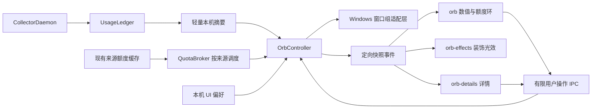

# TokenDance 圆形悬浮窗技术方案 v1

日期：2026-09-06。状态：待实现技术设计；已核对当前仓库与本机锁定依赖源码，未完成 Windows 原生验证。

产品依据：[圆形悬浮窗设计 v2](tokendance-floating-orb-design-v2.md)。本文替代初版矩形悬浮条的技术假设，不修改已有采集协议、服务端或网站。

## 1. 技术决策

采用 **Tauri 2 + React + CSS/SVG**。Rust 管理窗口、持久化、数据快照和提醒；React 渲染圆球、详情及状态；CSS 负责球面、光晕与粒子，SVG 负责精确额度环。

首发目标为 Windows。常驻显示由两个顶层窗口组成：112 DIP 的圆形交互窗 `orb`，以及 144 DIP、整体鼠标穿透的装饰窗 `orb-effects`。详情窗 `orb-details` 按需创建。特效关闭时不保留装饰 WebView。

两个常驻窗是为了同时满足“圆球可操作”和“球外光效不挡下层应用”。在原生验证前不承诺透明窗口自动穿透；如果 WebView2 合成、穿透或双窗跟随未通过验收，退回单个圆形窗口，保留球内渐变与静态额度环。该降级仍满足今日 Token 与额度变色的核心功能。

不引入 Three.js、全局鼠标钩子、独立采集进程或新的额度抓取实现。本次只新增本机桌面功能。

## 2. 现有代码与必须调整的接点

以下路径均相对 `collector/apps/desktop/`，内容以本次读取时的工作区为准。

| 现有位置 | 已有行为 | 接入要求 |
| --- | --- | --- |
| `src-tauri/tauri.conf.json` | `main` 480×780、`settings` 680×600，初始隐藏 | 保持两个现有窗口；新增窗口采用 Rust 懒创建，避免默认关闭仍启动多个 WebView。 |
| `src/main.tsx` | 只判断 `?view=settings`，其余均为统计面板 | 增加 `orb`、`orb-effects`、`orb-details` 入口；合法入口显式映射。 |
| `src/styles/base.css` | `body` 固定浅色背景 | 仅为新窗口入口设置透明根背景，不改变统计面板与设置页。 |
| `src-tauri/src/commands/window.rs` | `present()` 会调用 `set_focus()`；就绪队列只有 Panel/Settings | 新增不激活显示路径和窗口组就绪状态；悬浮球不复用 `present()`。 |
| `src/window-ready.ts` | 首屏布局完成后通知原生显示，含隐藏状态下的超时兜底 | 抽出可携带窗口实例代数的就绪通知，防止已销毁窗口的迟到回调触发显示。 |
| `src-tauri/src/lib.rs` | 只有 `main` 失焦自动隐藏；所有窗口关闭事件统一隐藏 | 按窗口角色分发；关闭球体应更新用户偏好，关闭详情只收起详情。 |
| `src/UsagePanel.tsx` | 可见时用量 3 秒轮询，额度 60 秒轮询 | 保持主面板行为兼容；悬浮球使用原生快照事件，不复制这些定时器。 |
| `src-tauri/src/daemon/mod.rs` | 后台约 5 秒采集一次，随后更新账本 | 新用量通知可接在账本更新后；不能把前端 3 秒刷新称为 3 秒一次采集。 |
| `src-tauri/src/state.rs`、`usage_ledger.rs` | `get_agents()` 读取本地日期及账本，返回完整来源统计 | 增加轻量摘要读取，避免为 112 DIP 圆球序列化每个来源 366 天明细与费用。 |
| `src-tauri/src/commands/quotas.rs` | Codex 60 秒缓存；聚合入口等待各来源结果 | 提取按来源读取的内部入口，复用缓存；悬浮球快照读取不等待网络。 |
| `commands/quotas/{zcode,connected}.rs` | 远端来源约 300 秒缓存、凭据变化清理、来源状态与超时控制 | 新功能不另建 HTTP 客户端；保留官方地址限制与原始观测时间。 |
| `src/usage-analytics.ts` | `accuracy=unknown` 不计为真实零；额度非 ready 或过期被视为陈旧 | 新 Rust 摘要采用同一语义，并用共享样例防止两端口径分叉。 |
| `src-tauri/capabilities/default.json` | 仅覆盖 `main`、`settings` | 新窗口分别配置最小权限，不能把所有窗口加入现有默认能力组。 |

锁定依赖为 Tauri **2.11.5**、tauri-runtime-wry **2.11.4**、Tao **0.35.3**、Wry **0.55.1**；前端为 React 19、TypeScript、Vite。以 `src-tauri/Cargo.lock` 为准，不能仅按 `Cargo.toml` 的主版本推断 API。

## 3. 模块与数据流



- `OrbController` 是可见性、位置、选定额度及快照的唯一写入方；窗口之间不直接控制对方。
- `QuotaBroker` 调用现有来源适配器，提供即时缓存读取与后台刷新，不从前端接受任意 URL。
- 账本锁仅用于短时读取/汇总，不持有锁等待网络、窗口操作或文件写入。
- 装饰窗只收到渲染所需的余量、状态、尺寸和动效字段，不收到来源凭据、用量明细或账号信息。

## 4. 原生窗口与鼠标穿透

### 4.1 窗口职责

| 窗口 | 尺寸 | 输入与焦点 | 内容 |
| --- | --- | --- | --- |
| `orb` | D×D，D 默认 112 DIP | 圆形区域可点击/拖动；后台显示不激活，主动打开详情时才转移焦点 | 球体、今日 Token、余量文字、静止额度环 |
| `orb-effects` | (D+32)×(D+32) DIP | 整窗忽略鼠标，不能获取焦点，无任务栏入口 | 光晕、缓慢流光、2–3 个粒子 |
| `orb-details` | 详情344×420 DIP起；悬停提示约280×96 DIP，均受工作区约束 | 提示模式不激活；用户点击球体后进入可聚焦详情模式 | 提示只含来源/时间；详情含来源选择、状态、今日来源和操作入口 |

装饰窗只绘制球体轮廓外的内容，中心区域保持透明。以球体屏幕坐标为基准，装饰窗左上角偏移 `-16 DIP`。关闭特效后销毁装饰窗；再次开启重新创建，不能依赖旧窗口的 ready 标记。

### 4.2 首选实现

1. 在 Rust/UI 线程中创建隐藏窗口，配置 `decorations(false)`、`resizable(false)`、`transparent(true)`、`shadow(false)`、`always_on_top(true)`、`skip_taskbar(true)`，并禁止初始自动聚焦。
2. `orb` 使用 HWND 与 `CreateEllipticRgn` / `SetWindowRgn` 设置圆形窗口区域，范围覆盖整个球体及额度环；CSS 圆角仍用于视觉抗锯齿。窗口区域使用最终物理尺寸，DPI/尺寸变化后重建。
3. `orb-effects` 使用 `set_ignore_cursor_events(true)`，并设置不可聚焦。已核对锁定 Tao 源码：该选项在 Windows 上使用 `WS_EX_TRANSPARENT | WS_EX_LAYERED`。仍需实测 WebView2 子窗口与透明合成是否一并符合预期。
4. 窗口按组置顶并设置相邻 Z 顺序；详情位于组上方。不要把装饰层设成只跟随主面板的子窗口。组内窗口均由控制器显隐、移动和销毁。
5. 所有 native HWND/HRGN 操作封装在 `orb/platform/windows.rs`；资源生命周期与错误检查集中处理，不把句柄暴露给 React。

`SetWindowRgn` 会裁掉区域外的绘制，因此不能在同一窗口中裁成 112 DIP 圆形后，还要求显示圆外 16 DIP 的光晕。区域设置成功后 HRGN 的所有权归系统，失败时才由调用方释放。[Microsoft：SetWindowRgn](https://learn.microsoft.com/en-us/windows/win32/api/winuser/nf-winuser-setwindowrgn)

### 4.3 不采用的穿透方式

- `pointer-events:none` 只改变 WebView 内部 DOM 命中，不能保证下面的编辑器收到鼠标。
- 不仅靠 `WM_NCHITTEST → HTTRANSPARENT` 实现跨应用穿透；官方定义涉及同线程的下层窗口，并非通用跨进程转发。[Microsoft：WM_NCHITTEST](https://learn.microsoft.com/en-us/windows/win32/inputdev/wm-nchittest)
- 不用 16ms 全局鼠标位置轮询，按光标位置反复切换整个球体是否可点；这样容易错过第一次点击并增加常驻开销。
- 分层窗口配合 `WS_EX_TRANSPARENT` 的整体穿透有官方依据，但是否兼容当前 WebView2 组合必须由小样验证。[Microsoft：Layered Windows](https://learn.microsoft.com/en-us/windows/win32/winmsg/window-features#layered-windows)

### 4.4 显示不激活与窗口组一致性

新增 `show_orb_group_without_activation()`，Windows 显示采用不激活语义，例如 `SW_SHOWNOACTIVATE` / `SW_SHOWNA`；位置/Z 顺序更新使用 `SWP_NOACTIVATE`。不能先 `show()` 抢焦点，再尝试把焦点还给编辑器。[Microsoft：ShowWindow](https://learn.microsoft.com/en-us/windows/win32/api/winuser/nf-winuser-showwindow)

不能只删除现有 `set_focus()`：锁定 Tao 的 `window_state.rs` 中，可见状态更新包含 `SW_SHOW` 路径。原生验证必须覆盖多次隐藏/显示和修改窗口属性。平台适配层统一管理新窗口显隐，避免混用 Tauri 可见状态缓存与直接 Win32 显示造成下一次更新又激活窗口；每次操作回读实际可见性。若该组合不能稳定做到不激活，则使用不可激活的球体展示窗，键盘操作统一从托盘“悬浮球详情”进入可聚焦详情窗。

球体移动时关闭详情，先隐藏装饰层，拖动结束后同步位置并恢复光效。这是首版明确行为，可避免拖动时双窗错位；后续只有通过原生同步移动测试才允许拖动过程中继续显示外部光效。

### 4.5 就绪与失败回退

- 每次新建窗口分配 `instanceGeneration`；`ready(label, generation)` 仅接受当前实例。
- 球体首屏可以是加载或错误状态，不等待额度网络请求；沿用首屏字体、布局就绪检测。
- 装饰层有独立 ready，未完成时允许球体先显示；超过 2 秒或创建失败则退为球内特效，不阻塞今日数字。
- 初始显示前先设置透明根样式、圆形区域与位置，消除矩形白闪；隐藏偏好在等待 ready 期间发生变化时取消显示。
- 不使用“失焦自动隐藏”处理球体；只对详情检查组内焦点与原生菜单是否打开。已有主面板失焦行为保持原样。

## 5. 状态模型

将用户偏好、运行环境与数据状态分开，避免一个 `visible` 或 `error` 布尔值承担所有含义。

```ts
type QuotaState =
  | 'loading' | 'fresh' | 'stale' | 'not_connected'
  | 'auth_required' | 'unavailable' | 'no_quota' | 'unlimited';

type OrbRuntimeState = {
  enabled: boolean; // 持久化偏好
  visibility: 'hidden' | 'creating' | 'visible' | 'suspended' | 'failed';
  suspendReasons: Array<'fullscreen' | 'session_locked' | 'display_off'>;
  interaction: 'idle' | 'dragging' | 'details_open' | 'menu_open';
  effectsMode: 'orbit' | 'soft' | 'off';
};
```

实际可见 = enabled 且没有环境抑制原因且球体已就绪。采集暂停不会隐藏窗口，只暂停动画并显示“已暂停”。全屏抑制不会写回 enabled；用户在全屏期间主动关闭后，退出全屏也不能自动恢复。

| 事件 | 控制器行为 |
| --- | --- |
| 设置/托盘开启 | 持久化 enabled，准备窗口，加载缓存并等待首屏就绪 |
| 用户隐藏/关闭球体 | 关闭详情与光效，更新 enabled=false；采集状态保持 |
| 点击球体 | 打开详情并按用户操作获取焦点 |
| Escape | 先关闭菜单，再关闭详情；普通球体保持显示 |
| 暂停采集 | 复用 `set_global_pause`，按原语义同时暂停自动同步 |
| 全屏/锁屏 | 临时隐藏整个窗口组，停止动画和悬浮窗独占刷新 |
| 恢复/解锁 | 校验日期、显示器、数据新鲜度后无激活恢复 |
| 关闭/崩溃的装饰窗 | 单独降级，不终止采集或隐藏球体 |
| 应用退出 | 刷出最后位置，取消调度与监听，销毁窗口组，不改用户开启偏好 |

## 6. 数据契约与一致性

### 6.1 快照结构

以下为新增 IPC DTO 草案，采用 camelCase；时间明确单位；大整数用十进制字符串。

```ts
interface OrbSnapshot {
  schemaVersion: 1;
  streamId: string;             // 进程内流实例 UUID，重启后变化
  revision: string;             // 单流递增序号，前端 BigInt 比较
  emittedAtMs: number;
  preferencesRevision: string;
  usage: {
    localDate: string;          // 原生本地日历日 YYYY-MM-DD
    state: 'known' | 'unknown' | 'error';
    todayTokens: string | null;
    knownSourceCount: number;
    hasUnmeasuredSources: boolean;
    capturedAtMs: number;
    lastRecordedChangeAtMs: number | null;
  };
  collector: {
    state: 'running' | 'paused' | 'degraded' | 'stopped';
    syncState: string;
  };
  quota: {
    selection: { agentId: string; windowId: string } | null;
    agentName: string | null;
    windowLabel: string | null;
    state: QuotaState;
    remainingPercent: number | null; // 只有 fresh 为当前有效数值
    lastKnownRemainingPercent: number | null;
    observedAtMs: number | null;
    resetsAtMs: number | null;
    staleAtMs: number | null;
    identityConfidence: 'source_verified' | 'unavailable';
  };
  effect: {
    mode: 'orbit' | 'soft' | 'off';
    reducedMotion: boolean;
    pulse: null | { id: string; kind: 'usage' | 'low_quota'; expiresAtMs: number };
  };
}
```

装饰窗对应更小的 `OrbRenderSnapshot`：仅 streamId、revision、尺寸、有效余量/中性状态、动效档位与 pulse；不发送 Token 原始统计和账号字段。详情另取 `OrbDetailsSnapshot`，只含所选来源额度窗口及今日来源汇总，不携带完整历史账本。

### 6.2 今日用量

- 新增 `AppState::get_usage_summary(local_date)` 和账本轻量读取方法。日期在采样开始时取一次，汇总规则与 `get_agents()` + `usageTokens(agent,'today')` 一致。
- 已记录来源当天没有新增数据时可以为 0；完全没有已知记录时返回 null。停用来源的已记录今日用量仍按现有面板口径纳入，不能仅合计当前启用来源。
- 来源计数在 Rust 使用整数、以 u128 合计后输出字符串；React 使用 BigInt 做单位格式化。不能先转 Number 再格式化，否则大值可能失真。
- 今日数字是本机已记录数据，并不证明所有来源采集完整。详情显示未知来源情况，不把“已记录汇总”描述为完整账单。
- 以 `localDate + todayTokens + ledgerGeneration` 判断新用量；同一数据刷新不触发脉冲，跨日归零、账本清理、历史回填也不视为新的运行中用量。
- 账本新增可返回内部变更摘要区分 live/import/reset；首轮历史扫描抑制脉冲。该字段为新增能力，不从当前 `lastActive='DETECTED'` 推断。
- 跨日、时区调整和系统唤醒重新采样；不能让前端零点定时器只改日期而保留昨日数值。

### 6.3 额度归一化

有效余量 `clamp(100-usedPercent, 0, 100)`。仅有限的有效百分比参与计算；没有额度、无限额度与读取失败不映射成 0 或 100。

`fresh` 同时要求来源 ready（Codex 当前无 status 时按其有效记录判断）、观测时间合法且不在未来、距观测不超过 30 分钟、未过 resetsAt。任一条件失效立即中性灰并隐藏有效额度弧线。`staleAtMs` 为观测时间+30分钟与有效重置时间中的较早者。

前端即使没收到新事件，也在 staleAtMs 到达时保守显示“待更新”；不因最后一个绿色快照停留而永久显示充足。使用原生 emittedAtMs 校正倒计时，并以性能时钟计算当前页经过时长；唤醒后重新取快照。网络失败保留旧观测时间，只有详情可以显示 `lastKnownRemainingPercent`。

额度窗口必须有稳定 `windowId`，不能保存数组下标。适配层从源字段生成，例如 `codex:primary:300m`、`cursor:auto`、`cursor:api`、`grok:shared_week`、`zcode:<provider>:300m`。当前 DTO 缺少完整标识，需要在 Rust 内部保留原始窗口键；拼接 provider/label/windowMinutes 只作为兼容回退，冲突时禁止自动选择。

第一次无偏好时从当前新鲜来源中按固定顺序选择；首次选定后不因排序、刷新或暂时失效自动换源。来源消失显示不可用并保留选择，用户可在详情重新选择。Grok 共享周额度、Cursor 分池等口径直接使用来源标签。

### 6.4 账号变化与缓存边界

现有 ZCode/Grok/Cursor 缓存带凭据 identity，但这些字段私有且不在 IPC DTO 内。新增 broker 应接收内部缓存失效通知/代数，失效后立刻清空自己的副本；异步请求完成时比较来源 generation 和选择 generation，过期结果不得覆盖新选择。

现有凭据散列是缓存隔离标识，**不等于稳定账号 ID**。不得把它发送到前端、记录日志或当作跨 token 轮换的账号证明。来源能提供稳定非敏感账号标识时，原生可转换成本机不透明作用域；不能提供时使用保守提醒去重。

Codex 当前只读取本地额度日志，没有可靠的当前账号身份字段。保持不读取 auth 凭据的边界；无法保证在没有新日志时立即识别账号切换。DTO 标记 `identityConfidence='unavailable'`，详情标注“来自最近本地日志”，并遵守原始时间过期，不宣称已验证当前账号。此限制不能由新建一个空的 accountId 字段掩盖。

## 7. 刷新与事件订阅

1. 原生维护最新快照。`get_orb_snapshot` 立即返回缓存或 loading，不等待 HTTP。
2. 球体/详情加载时先注册事件监听，再读取快照。仅接受当前 streamId 下更大的 revision；收到其他 streamId 时丢弃该事件并重新调用快照命令核实，只有命令响应能替换流实例，防止旧流事件迟到后反向重置。卸载或窗口销毁注销监听。
3. 用量在账本变更、暂停切换、当地日期改变时触发摘要失效；可见期间最多每 3 秒合并采样一次，打开窗口立即读取。首次实现可用原生单一 3 秒采样器，后续接账本事件，不能每个 WebView 各建一个采样器。
4. 配额 broker 按来源刷新：只显示球体时仅关注所选来源；详情需要某来源的全部窗口；主面板保留已有需求。Codex不超过每60秒读一次日志，远端来源沿用约300秒缓存。
5. 所有入口最终共用同一来源缓存与 in-flight 锁。旧 `get_agent_quotas` 仍可聚合调用，但不能为悬浮球复制一个独立网络缓存。
6. 网络刷新在后台任务中执行；按来源完成后发布，不让某个慢来源阻塞今日数据或其他来源。现有聚合入口的 `tokio::join!` 不能直接作为球体首屏依赖。
7. 隐藏且没有其他可见消费者时停止悬浮球的采样/刷新需求，后台采集与自动同步保持既有行为；暂停时只发状态变更，恢复后更新所选额度。
8. 快照内容无变化时不发事件；倒计时展示在详情内本地更新，零点与 staleAt 用单次计时器。一次性 pulse 带 id 与过期时间，订阅晚到不重播过时动效。
9. 控制器使用单一串行命令队列写状态；网络结果带 generation 入队，持久化由专用队列执行。任意任务退出都可取消，不长期持有 std::sync::Mutex 跨 await。

## 8. IPC 与窗口权限

| 命令/事件 | 作用 | 允许调用方 |
| --- | --- | --- |
| `get_orb_snapshot` | 读取球体快照 | orb、orb-details |
| `get_orb_render_snapshot` | 仅读取光效字段 | orb-effects |
| `get_orb_details` | 今日来源与可选额度窗口 | orb-details、settings |
| `get_orb_preferences` | 读取偏好及版本 | settings、orb-details |
| `patch_orb_preferences` | 白名单字段局部更新，返回已保存版本 | settings、orb-details |
| `orb_ready` | 报告当前实例首屏就绪 | 对应窗口本人 |
| `orb_action` | open_details / close_details / open_menu / hide / open_main / open_settings / set_paused | orb、orb-details；动作按窗口进一步限制 |
| `orb_begin_drag` | 窗口角色校验后调用原生拖动 | orb |
| `orb://snapshot` | 原生定向发送主快照 | orb、orb-details |
| `orb://render` | 原生定向发送渲染快照 | orb-effects |
| `orb://preferences` | 偏好 ACK 后通知 | settings、orb-details |

窗口身份从 Tauri 注入的 `WebviewWindow.label()` 获取，不接受前端传任意 windowLabel/HWND。参数校验包含额度来源 ID、允许尺寸、特效枚举和当前偏好版本；不允许前端设置任意位置到屏幕外或执行任意 shell。

新增 app command 权限定义并配置到各自 capability；同步审计现有自定义 command 的暴露方式，不能假设 `invoke_handler` 自动按窗口隔离。对缺少权限声明的旧命令补窗口角色校验或显式权限限制，确保装饰窗不能调用退出、删除、配置恢复、登录等命令。核心窗口 API 仅开放必要事件监听，拖动可经受控自定义命令实现。

新窗口只加载打包的本地页面，不能导航到远程内容；远程网站沿用系统浏览器打开。当前应用 `csp:null`，实现时为新增窗口内容配置和验证与 Vite 开发/打包资源相容的策略；不能声称现有 CSP 已经保护了新窗口。

## 9. 偏好与提醒持久化

### 9.1 本机偏好

在现有 `app_data_root()` 下独立保存 `orb-preferences.json`，Windows 通常为 `%LOCALAPPDATA%/TokenDance/collector/`。不把 UI 位置写进采集 `control.json` 的备份快照，以免恢复采集配置后窗口位置跳动。

```json
{
  "schemaVersion": 1,
  "revision": "1",
  "enabled": false,
  "diameterDip": 112,
  "effectsMode": "orbit",
  "hideOnFullscreen": true,
  "selection": { "agentId": "codex", "windowId": "codex:primary:300m" },
  "placement": {
    "monitorKey": null,
    "anchor": "right",
    "edgeGapDip": 16,
    "verticalRatio": 0.72
  }
}
```

首次未选额度时 selection 为 null。允许尺寸 112/128/144/160；普通拖放可用 `anchor='free'` 并保存工作区归一化坐标。设置和托盘共用同一控制器更新，不各自写 localStorage。

写入采用串行队列、同目录临时文件和支持 Windows 已有目标替换的原子提交；不能假设普通 rename 在所有平台都能覆盖。成功后才 ACK 和发版本事件；失败保留上一个已保存偏好，向调用界面显示错误，不写“已保存”。移动结束后去抖约500ms保存，退出尽力刷盘。坏文件保留为诊断备份并使用默认值，未知字段忽略，未知版本不直接覆盖。

`patch_orb_preferences` 接收 expectedRevision 和字段补丁；版本冲突要求重新读回，防止设置页与详情同时修改时覆盖对方。位置更新由原生合并，只修改 placement。

### 9.2 低额度与一次性动效

低额度判定只发生在原生控制器；前端插值帧不能触发业务提醒。≤20% 与 ≤10% 每周期每阈值各一次，直接从30%跳到5%时只触发10%级别。刷新来回波动不会清除去重。

去重记录独立保存 `orb-alert-state.json`，键包含来源、稳定 windowId、可用账号作用域、重置周期和阈值。无稳定账号作用域时按来源/窗口保守去重，可能抑制换账号后的同周期再次提醒，但不能复用旧账号的显示数值。无可信重置周期时每阈值最多每24小时一次。

只有来源新鲜、窗口可见、采集未暂停时显示脉冲。全屏/锁屏期间不排队弹过时提醒，恢复后根据新鲜快照决定是否需要首次提示。冷启动已低额且去重状态存在时不重复提示；无记录时允许一次。持久化失败仅做本次进程内去重并报告诊断，不能保证跨重启不重复。

## 10. 渲染和动画实现

球体 DOM 只包含背景层、高光、三行文本和 SVG 环；外部光效放装饰窗。不同入口的样式独立加载，避免主面板阴影/背景规则污染透明窗口。

颜色锚点来自产品 v2：100/85/70/55/40/25/15/5/0% 分别对应翠绿、草绿、青柠、黄绿、金黄、琥珀、橙、珊瑚红、深红。所有层使用统一颜色函数。

```ts
// 纯函数，输入必须先通过业务状态校验。
function quotaVisual(remaining: number, state: QuotaState): Visual {
  if (state !== 'fresh') return neutralVisual();
  const p = clamp(remaining, 0, 100);
  return {
    color: interpolateAdjacentStopsInOKLab(p),
    arcDegrees: p * 3.6,
    remaining: p,
  };
}
```

- 生产实现用测试过的本地 OKLab 色彩函数生成 RGB，避免数值插值、CSS 渐变和装饰窗各用不同算法；不得让绿色至红色途中经过蓝紫。
- 实际余量数字立即显示新值。视觉颜色与环长在约600ms内从上一显示值过渡到目标值；新快照到来从当前中间值重新插值，不能排队播放已过时状态。
- 数值插值用有终点的 requestAnimationFrame，在结束/隐藏/减少动画后取消；静态状态不保留每帧 JS 更新。额度变为 unknown/stale 或切换来源时立即清空旧环，不演成“额度耗尽”。
- SVG 用固定圆心、半径与 `pathLength=100`；100%完整圆，0%不绘制有效弧，避免 round linecap 留一个假额度亮点。quota 环不旋转。
- 球面与光晕渐变为静态材质；循环仅动画 transform/opacity，避免逐帧修改 blur、尺寸或大型阴影。光晕6秒、流光20秒、粒子28秒，满足整数圈首尾连续。
- 隐藏、减少动画、暂停采集、额度非新鲜均停止循环；特效 off 不创建装饰窗。低功耗模式可主动降为仅静态内光，不改变数据口径。
- 前端用 `prefers-reduced-motion` 加原生运行状态双重控制。悬浮窗是否被隐藏由原生广播，不能只依赖 WebView 的 document.hidden。
- 每次卸载清除 rAF、timer、事件监听和 CSS 长期动画。详情关闭可保留短时间缓存，长时间隐藏再销毁以回收 WebView，代数随之递增。

## 11. 位置、DPI、全屏与键盘

以球体中心/边缘锚点为唯一位置基准；存 DIP/归一化位置，操作 HWND 时转换成目标显示器物理像素。球体、装饰、详情在同一次布局计算中使用同一比例，禁止分别舍入导致光晕偏移。

工作区限制包含16 DIP外部特效空间，右侧贴边时球体不能贴到屏幕最边而裁掉光晕。拖放超出工作区立即 clamp；负坐标显示器不能转成无符号整数。显示器拔除时回主屏，保留相对垂直位置。

监听 DPI/显示器变化，按新物理尺寸重建圆形区域并同步装饰位置；不要把原始屏幕坐标直接存作永久位置。详情优先放向工作区内侧，空间不足翻转或限制高度，中部可滚动。

悬停提示不能直接放在圆球 DOM 中，否则会被原生圆形区域裁掉。复用 `orb-details` 的 `peek` 模式：停留约400ms后无激活显示来源、原观测时间和重置时间；离开球体和提示联合区域150ms后关闭。单击切换到完整详情并明确获取焦点，菜单打开、拖动和全屏抑制期间禁止自动提示。模式切换统一经过控制器的尺寸/焦点路径；托盘键盘入口直接进入完整详情，无需悬停。

全屏抑制基于原生前台窗口与所在显示器边界判断，排除桌面、任务栏、隐藏/最小化窗口与本应用窗口；普通最大化不应仅因占满工作区而被误判。首版只抑制与前台全屏应用同一显示器上的悬浮球，多屏其他显示器保持可见。采用前台变化通知加必要的边界核对，锁屏/显示器断电独立处理；100–200ms去抖防止来回闪现。

拖动阈值4 DIP，按下不立即打开详情；越过阈值调用一次原生拖动，拖动结束清除点击候选。菜单打开或拖动期间不执行自动展开/收起。键盘可从托盘“悬浮球详情”进入，详情支持Tab、Enter、Escape和可见焦点；不强制占用未配置的全局快捷键。

## 12. 文件改动计划

```text
collector/apps/desktop/
  src/
    main.tsx                         修改：入口映射
    SettingsPage.tsx                  修改：显示开关与外观入口
    window-ready.ts                  修改：支持窗口实例代数
    orb/
      FloatingOrb.tsx                新增：球体
      OrbEffects.tsx                 新增：外部光效
      OrbDetails.tsx                 新增：详情与来源选择
      OrbSettings.tsx                新增：设置区域
      bridge.ts                      新增：受控 IPC 与类型
      useOrbSnapshot.ts              新增：监听、快照和新鲜度处理
      color.ts                       新增：连续色彩映射
      format.ts                      新增：大整数紧凑格式
      orb.css                        新增：透明根、球体与动画
  src-tauri/
    src/lib.rs                       修改：注册状态、命令、托盘与事件
    src/commands/window.rs           修改：角色路由、就绪与激活策略
    src/commands/orb.rs              新增：IPC 校验
    src/commands/mod.rs              修改：导出新增命令
    src/commands/quotas*.rs           修改：按来源接口与内部失效信息
    src/state.rs                     修改：轻量摘要入口
    src/usage_ledger.rs              修改：摘要与变更类型
    src/daemon/mod.rs                修改：账本变更通知
    src/orb/
      mod.rs                         新增：控制器
      model.rs                       新增：快照/偏好/状态
      preferences.rs                 新增：持久化
      quota_broker.rs                新增：需求合并与刷新
      alerts.rs                      新增：提醒去重
      placement.rs                   新增：纯布局算法
      platform/mod.rs                新增：平台接口
      platform/windows.rs            新增：窗口组、圆形区域和环境事件
    capabilities/orb*.json           新增：分别限定窗口权限
    permissions/orb.toml             新增：应用命令权限
    build.rs                         视权限生成方式调整
    Cargo.toml / Cargo.lock          增加目标平台依赖时同步更新
```

Win32 调用使用与当前依赖兼容的 `windows` crate；仅在 `[target.'cfg(windows)'.dependencies]` 声明所需功能，不让 Windows 类型泄漏到跨平台模块。其他平台编译保留现有托盘功能，悬浮球开关显示暂不可用；macOS 透明窗口的私有 API 条件需另立方案，不为 Windows 首版自动启用。

## 13. 实施顺序与完成条件

| 阶段 | 工作 | 必须得到的结果 |
| --- | --- | --- |
| S0 原生验证 | 最小圆形窗、外部光效窗、不激活显示、拖动、跨进程穿透 | 在真实编辑器上验证首次点击、滚轮、右键；多次恢复不抢焦点；确认使用双窗或明确降级 |
| S1 数据基础 | 轻量摘要、稳定额度ID、broker、快照与版本、设置持久化 | 与现有主面板口径一致；隐藏不重复查询；旧配置正常启动 |
| S2 球体交互 | 入口、112 DIP UI、色彩/额度环、详情、托盘、位置记忆 | 正常/未知/过期/暂停都有准确显示；全屏恢复与多屏位置正确 |
| S3 光效与提醒 | 动画层、减少动画、pulse、阈值去重 | 低额度不持续打扰；重复刷新/重启不重播；性能达标 |
| S4 回归与交付 | 自动检查、Windows手工矩阵、生产构建 | 主面板/设置/采集不回归，便携版实际启动验收后再进入发布流程 |

S0 必须先于完整 UI 接入；不能先写完所有光效再发现透明区域阻挡编辑器。任何原生降级都记录在 UI 设置与构建说明中，不伪装成已支持。

## 14. 验证与性能预算

### 自动检查

- Rust：已知零/未知汇总、跨日和时区重采样、大整数合计、窗口ID冲突、新鲜度边界、来源generation过期响应、偏好并发更新、写盘失败和坏文件恢复。
- Rust：0/20/10%阈值与越级提醒、无周期24小时去重、重启/换源/无账号作用域、错误状态不触发低额度。
- Rust：窗口就绪迟到、启用后立即关闭、显示器负原点、混合DPI和工作区不足、全屏抑制期间用户关闭、装饰层创建失败。
- 前端：九个色标和中间值、大整数格式、0/100%弧长、先监听后快照竞态、旧revision/旧stream拒收、staleAt自动失效、动画卸载清理。
- 跨端共享样例：同一 Agent 输入与固定本地日期，Rust 摘要和现有 `usageTokens` 结果一致；不写“镜像实现”的脆弱快照测试。

### Windows 手工矩阵

- 100%/125%/150%/200%缩放、双屏不同DPI、负坐标屏、拔掉副屏、改变任务栏位置。
- 球体可点；球外光晕、透明角落可直接点到其他进程；滚轮/右键/拖选不被吞掉。必须在独立编辑器与浏览器窗口验证，不能只测同进程窗口。
- 首启、托盘显示、开机恢复、额度更新、全屏退出均不抢正在输入的焦点；点击详情可以正常交互。
- 断网、来源未登录、账号凭据变化、旧额度过期、重置时间到达、0%与无限额度，不出现错误红球或假满额度。
- 采集暂停、同步异常、真实零值、完全无记录分别显示；隐藏悬浮球后采集继续。
- 关闭光效、减少动画、锁屏与长时间隐藏无持续前端帧活动；应用退出无孤立窗口或后台任务。

### 初始性能预算（待实测，不是当前成绩）

- 同一设备相同场景，新增球体与默认光效的整个进程树平均 CPU 增量 ≤1 个百分点；10分钟内无持续增长。
- 新增私有工作集目标：无光效 ≤60MiB，默认双窗 ≤100MiB；统计全部 WebView2 子进程相对基线的增量，不只看 Rust 主进程。
- 正常快照目标 ≤4KiB；轻量本机采样 p95 ≤50ms；网络请求不进入首屏等待链。
- 60Hz 屏幕动画无明显掉帧；不在144/240Hz屏幕长期运行自定义JS循环；rAF只用于有限时长的数值过渡。
- 超预算时依次减少粒子/模糊、使用静态外光、回收隐藏详情、降为单窗球内光效，保留数值与额度准确性。

实施后运行桌面 `npm run build`、扩展后的 `npm run test:usage`、相关 Rust 单测及现有桌面检查；生产验证使用 `npm run build:windows` 的 `custom-protocol` 产物。当前任务只编写方案，不以文档检查冒充这些测试已通过。

## 15. 已确认依据与尚待验证项

已确认：项目窗口入口/焦点逻辑、5秒后台采集、3秒前端用量刷新、60/300秒额度缓存、现有未知/过期语义、当前大整数跨 IPC 风险、权限覆盖窗口范围，以及锁定 Tauri/Tao 提供的透明、窗口句柄和整窗穿透接口。

尚待原生验证：圆形区域与 WebView2 子窗口的实际命中、透明光效加分层样式后的合成、多个顶层窗的Z顺序、反复显示不激活、全屏识别边界与新增内存。S0负责消除这些不确定性，未完成之前不能把设计图描述为可发布悬浮窗。

技术参考以正文对应链接为准；Tauri API 另以本机锁定 crate 源码 `tauri-2.11.5/src/webview/webview_window.rs` 与 `tao-0.35.3/src/platform_impl/windows/{window,window_state}.rs` 核对，不依据未锁定的 latest 文档做兼容性承诺。
