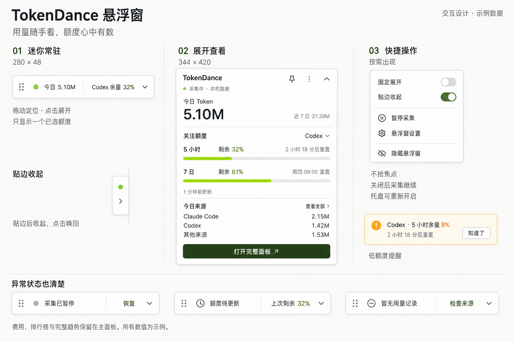

# TokenDance 悬浮窗设计 v1

日期：2026-09-06。状态：设计提案，未接入客户端。图中数值全部为示例。

## 1. 产品定位

用户在编辑器中工作时，不用打开统计面板就能知道今日用了多少 Token、关注的套餐还剩多少额度。悬浮窗是已有托盘面板的轻量入口，复用本机统计与额度来源。

视觉延续现有桌面设置的浅底、深绿和青柠色。默认展示本机数据；不混入账号多设备汇总，也不推断当前编辑器、运行中任务或实时生成速度。

## 2. 功能清单与优先级

| 优先级 | 功能 | 设计规则 |
| --- | --- | --- |
| P0 | 开启与隐藏 | 设置增加“显示悬浮窗”，默认关闭；托盘菜单提供同一开关。首次开启在当前显示器右侧工作区出现。 |
| P0 | 今日 Token | 迷你条展示本地日历日累计，使用 K/M/B 紧凑格式；展开显示精确值提示及近 7 日累计。 |
| P0 | 关注额度 | 用户选择 Agent 与一个额度窗口；记住选择。迷你条显示来源和剩余百分比，展开查看该来源所有可用额度窗口与重置时间。 |
| P0 | 来源明细 | 展开显示今日用量前两个已知来源，其余合并为“其他来源”；查看全部打开现有面板。 |
| P0 | 三种形态 | 迷你条、展开卡片、贴边把手；支持拖动、吸附、位置记忆和跨显示器恢复。 |
| P0 | 采集状态 | 区分采集中、暂停、异常、无记录；暂停时保留最后用量，可从菜单恢复。 |
| P0 | 快捷操作 | 固定展开、贴边收起、暂停/恢复采集、悬浮窗设置、隐藏悬浮窗、打开完整面板。 |
| P0 | 低额度提示 | 对选定额度在剩余 ≤20%、≤10% 时提示；阈值越级只报最严重级别。默认只在窗内提示，不弹系统通知。 |
| P0 | 基本偏好 | 关注额度、固定展开、贴边收起、全屏时隐藏；设置自动保存。 |
| P1 | 外观定制 | 深色/跟随系统、字号档位、透明度；低透明度仍需保证可读性。 |
| P1 | 快捷键与隐私 | 自定义显示/隐藏快捷键、录屏时隐藏数值；快捷键冲突必须反馈。 |
| P1 | 自定义提醒 | 阈值、静默时段、可选系统通知；额度重置提醒只依据新鲜来源数据。 |

首版不在悬浮窗放排行榜、年度热力图、完整趋势、登录表单或费用账单。费用记录可能不完整且存在多币种，继续在主面板按已有口径展示。

## 3. 窗口形态

### 迷你常驻

- 基准尺寸 280 × 48 DIP，外边距 8 DIP，圆角 12 DIP。DIP 为逻辑像素；中英文本与字号放大时允许增宽到 344 DIP。
- 顺序为拖动柄、采集状态、`今日 5.10M`、分隔线、`Codex 余量 32%`、展开箭头。
- 额度区域的提示完整显示 `Codex · 5 小时 · 剩余 32%`；多额度池或名称有歧义时优先显示窗口短名，例如 `Codex 5h 32%`，长来源名截断并提供完整提示。
- 默认不轮播数值。首次未选择来源时选择第一个有新鲜可用额度的来源，并在展开卡片清楚显示选择；之后不会因其他来源用量变化自动跳转。
- 没有任何支持的额度时显示 `额度未接入`；今日用量继续正常显示。

### 展开卡片

- 基准尺寸 344 × 420 DIP；图为布局示意，实际内容不够放时允许增高至工作区上限或中部滚动，不能压缩字体导致溢出。
- 标题栏：品牌文字、固定展开、更多、收起。保留现有品牌资产，不另造图标。
- 信息顺序：采集状态与“本机数据” → 今日 Token 与近 7 日 → 关注来源额度 → 今日来源 → 打开完整面板。
- 额度下拉在同一选择面板内列出来源与可选额度窗口，例如 Codex 5 小时、Codex 7 日、Cursor Auto、Cursor API；选择窗口同时决定迷你条和提醒的监控对象。
- 展开区域显示所选来源的各额度池，标签来自来源原始定义：Grok 为共享周额度，Cursor 分池，不能统一改成“5 小时/7 日”。
- 进度条表示剩余量，32% 剩余必须填充 32%；标签始终写“剩余”，避免与现有面板的“已用”混淆。
- 来源示例：Claude Code 2.15M + Codex 1.42M + 其他来源 1.53M = 今日 5.10M。

### 贴边把手

- 基准尺寸 32 × 64 DIP；仅在用户拖到屏幕左右边缘、启用“贴边收起”且离开窗口 800ms 后收起。
- 保留状态点和展开箭头。点击唤回迷你条；再点击展开查看详情。首版不做悬停自动展开。
- 使用操作系统工作区边缘吸附；两显示器相邻边界不自动收起，避免挡住跨屏移动。
- 低额度只增加静态琥珀色状态，不闪烁、不强制展开。

## 4. 交互规则

| 操作/事件 | 结果 |
| --- | --- |
| 点击迷你条正文或展开箭头 | 展开卡片，尽量维持靠边锚点，必要时向屏幕内偏移。 |
| 拖动拖动柄或空白标题栏 | 移动窗口；超过 4 DIP 位移后按拖动处理，不触发展开。 |
| 点击外部 / Escape | 普通展开卡片回到迷你条；固定展开时点击外部不收起，Escape 仍收起。已打开菜单优先关闭菜单。 |
| 点击固定展开 | 锁定展开状态；标题按钮与更多菜单同步。 |
| 隐藏悬浮窗 | 只隐藏该窗口，保存关闭偏好；后台工作按原采集状态继续，托盘可重新开启。 |
| 暂停采集 | 调用现有全局暂停行为，同时暂停自动同步；状态与主面板、托盘同步。菜单提示“同时暂停自动同步”。 |
| 打开完整面板 | 唤起现有托盘面板；悬浮卡片先回到迷你条，避免叠放两个详情窗。 |
| 全屏应用前台 | 默认临时隐藏悬浮窗及提示；退出全屏后恢复原形态，不改变保存的开启偏好。 |
| 重启 / 显示器拔除 / DPI 变化 | 优先恢复保存的显示器和相对锚点；显示器不存在时回主屏工作区，保证窗口完整可见。 |

窗口默认置顶、不占任务栏。后台更新、额度提醒、开机恢复都不能主动抢焦点；用户点击交互时允许获取焦点以支持键盘操作。开启偏好为开时随应用恢复悬浮窗，首次安装仍默认关闭。窗口隐藏与采集暂停相互独立。

## 5. 数据与提醒口径

- 用量复用现有本地累计，不因悬浮窗单独扫描日志。迷你条/展开可见时按现有约 3 秒节奏更新；隐藏停止前端轮询，贴边只订阅轻量状态。需要原生层事件支持时列为新增工作，不假设已实现。
- 额度复用来源缓存及其更新策略；例如 Codex 每分钟缓存、远端来源约 5 分钟刷新。前端刷新不意味着每 3 秒访问远端额度接口。
- 剩余百分比 = `clamp(100 - usedPercent, 0, 100)`；未知值不能转成 0。无限额度用来源明确支持的文字，不绘制 100% 假条。
- 倒计时由有效 `resetsAt` 计算；≤0 时显示“待刷新”，不能自行补满额度。跨日的“今日”按本地时区重新计算。
- 延续现有陈旧判定：记录超过 30 分钟、观测时间无效或在未来、已过重置时间，均显示“额度待更新”。来源报告网络失败、失效或待更新时，即使未满 30 分钟也采用其状态。
- 网络错误可以保留旧数值，但必须标注“上次剩余”和原更新时间。账号切换或授权失效应清除旧账号额度，不能继续拿旧值提醒。
- 提醒只看用户选定的单个额度窗口的新鲜数据；其他窗口可在展开卡片中按相同阈值显示颜色。首次开启就低于阈值时提示一次。
- 剩余 >20% 为绿色，10% < 剩余 ≤20% 为琥珀色，剩余 ≤10% 为警示色；颜色必须配文字。提醒样例 `Codex · 5 小时余量 8%`。
- 按“本地账号标识 + 来源 + 额度窗口 + 重置周期 + 阈值”持久化去重；不保存访问令牌。缺失周期标识时同对象同阈值最多每 24 小时一次，不从 Token 推导额度。
- “知道了”只关闭本次提示；低额度数值保持可见。重启不重复提醒，暂停或过期不触发新提醒，通知不会自动中断 Agent 工作。

## 6. 异常状态

| 状态 | 展示与动作 |
| --- | --- |
| 首次加载 | 数值位置短骨架；超时显示“读取失败 · 重试”，避免无限加载。 |
| 从未采集到记录 | `暂无用量记录`，入口“检查来源”。 |
| 已有记录且今日确为零 | `今日 0`，与无记录区分。 |
| 主动暂停 | `采集已暂停`，保留最后统计，提供“恢复”。 |
| 来源未支持额度 | `额度未接入`，不影响 Token 统计；可选择其他来源。 |
| 额度过期 / 网络失败 | `额度待更新`、`上次剩余 32%`；展开显示更新时间与原因。 |
| 来源登录失效 | `额度需重新登录`，提示回来源应用登录；不把 TokenDance 登录当作来源授权。 |
| TokenDance 未登录 | 本机用量可查看，完整面板提示登录后同步。 |
| 同步失败但采集正常 | 仍显示采集中，展开附“同步稍后重试”；不能显示整个采集停止。 |
| 采集读取异常 | `采集异常 · 查看详情`，保留最后有效值并标注更新时间。 |

## 7. 视觉与可访问性

| 项目 | 规格 |
| --- | --- |
| 背景 | 画布 #F5F7F4，窗口 #FFFFFF，描边 #E0E6E0 |
| 文字与操作 | 正文 #111512，次要文字 #5E6660，主按钮 #253517 配白字 |
| 强调色 | #B9F600 用于填充与小面积强调，不作浅底小字 |
| 字体 | Segoe UI / Microsoft YaHei；主要数值使用等宽数字 |
| 字号 | 迷你正文 12–13px，展开正文 13px，辅助说明 12px，主数值 30–32px |
| 几何 | 12px 窗口圆角、1px 边框、8px 间距体系、16px 展开内边距 |
| 点击与焦点 | 图标可视 16px、命中区至少 28 × 28 DIP；Tab 可达、可见焦点、按钮有可访问名称 |
| 动效 | 展开/收起约 160ms；系统减少动画时取消；数值更新不闪烁 |

图中菜单开关的实现沿用已有设置的青柠轨道与深绿滑块。UI 图用于审阅布局和层级，实际开发以本文的数据口径、尺寸自适应与交互规则为准。

## 8. 实现边界与验收

现有可复用：`UsagePanel.tsx` 的面板入口、`usage-analytics.ts` 的本机统计和额度新鲜度逻辑、`tauri-bridge.ts` 的采集状态与开关、`settings.css` 的颜色体系，以及已有原生额度缓存。

新增工作：独立 Tauri 悬浮窗、显示/隐藏与托盘入口、窗口形态状态机、工作区/DPI 位置恢复、偏好持久化、额度提醒去重及前后台状态订阅。设计稿不是这些能力已实现的声明。

验收重点：

1. 今日统计与完整面板同一时刻、同一口径一致，所有来源合计一致；未知数据不显示为零。
2. 32% 剩余对应 32% 填充，所选来源/窗口在迷你条、展开卡片、提醒中一致。
3. 切换账号、额度过期、超过阈值、周期重置与重启均不会显示错误余量或重复提醒。
4. 拖动不误触点击，贴边可唤回，失焦按固定状态处理，隐藏后托盘可恢复。
5. 多屏与 100%/125%/150%/200% DPI 下保持完整可见；英文和长名称无裁切，缩小工作区仍可操作。
6. 后台更新与提醒不抢焦点，全屏临时隐藏后正确恢复；暂停与隐藏的行为独立且符合现有同步语义。
7. 键盘、减少动画、低额度非颜色提示有效；额度过期、无记录、真实零值和来源失效都有明确文案。
