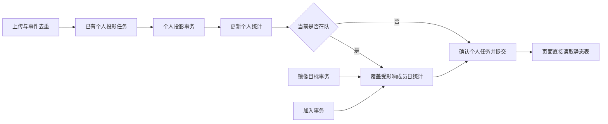

# TokenDance 团队分析静态物化技术方案

日期：2026-09-12。状态：Draft（修订 15，完整指标、成员视图与 Skill 统计版）。本次仅修订文档，不实现代码、不执行迁移、不部署。

本轮代码勘察基线：`codex/team-init`，`2a2524eff7aeaefd871325bfc827c21d8198cfe9`。仓库迁移文件目前到 `0014_team_legacy_summary_source.sql`，`TeamAnalysisRuleVersion="5"`。这只说明仓库文件，不代表本轮验证了云端实际迁移状态。下文规则 `"6"`、迁移 0015、事务帮助函数均为拟议实现，实施前重新核对编号与环境。

产品依据：[团队功能与交互方案](tokendance-teams-product-design-v1.md)、[团队模块技术方案](tokendance-teams-technical-design-v1.md)；本轮界面依据：[团队总览 UI v2](ui/team-overview-v2.md)、[交互原型](ui/team-overview-v2.html)。与旧文冲突时，以用户后续明确要求及本文 §15 的决策状态为准，不把早期草案写成用户已确认的规则。

**修订 14 范围**：完善技术文档，不修改业务代码，不执行数据库迁移，不部署；仅检查本方案涉及的表，不重构其他现有表。保留个人与团队同事务更新、单张静态统计表与属性 JSON 的方向。新增 §15–23 为实施合同。用户已确认离队保留统计及必要内部去重记录，修订 14 用稳定贡献者身份替代不可逆的匿名合并桶。

## 1. 本次决定

**个人日统计更新时，直接在同一数据库事务内更新该成员的团队日统计，不再增加独立的团队重建队列。页面只读静态结果。**

撤销 `team_member_rebuild_queue` 和 `team_member_rebuild_days` 两张拟议表，以及配套的团队领取、租约、dirty/applied 版本、确认消费和独立 `ProcessTeamMemberMetrics` 循环。既有个人同步任务、个人脏日任务、删除任务及其重试机制保留，不为团队重复建设一套。

“直接更新”指**个人投影处理事务内直接更新**，不是收到未经去重的上传请求就对团队总量 `+Token`。原始事件接收成功仍可先返回，随后由现有个人投影任务处理；该任务不能在团队更新失败时标记成功。

新增一张业务统计表 `team_member_day_metrics`，另加一张最小内部身份表 `team_usage_contributors`，用于用户已确认的离队保留、重入去重与删除定位；后者不是任务队列。按成员和受影响日期覆盖写入，不重扫全队，不为今天、7 天、30 天分别生成统计结果。

## 2. 已确认产品规则

- 一人一队；每次加入创建新的 membership，`user_current_teams` 保持一人一队占位。
- 在队即自动共享全部用量维度；不增加个人 base/named/classification/cost 开关。
- 以 occupancy `joined_at` 为下界：只计入加入时刻及之后的个人用量，不回填加入前个人历史。加入当天 v2 按小时/事件 `occurred_at >= joined_at` 投影，旧日汇总仅当该 UTC 日 00:00 ≥ `joined_at`。
- 退出或移除后立即撤销团队访问权和具名展示；团队保留退出时已经提交的统计。
- **用户本轮确认：离队保留历史量，并保留必要的内部去重记录。** 同 team/user 对应稳定 contributor_key，重入后覆盖同一份统计，不再复制并累加。
- 历史贡献者不进入当前成员榜、活跃成员数、成员选择器；总量及占比包含其保留量，统一显示“历史成员”，不暴露离队成员姓名或旧 membership。
- 离队期间的新上传不更新旧团队。重入后允许用现存合格全历史覆盖该贡献者原有量，历史桶不再另外保留一份。
- 全量删除/账号删除通过内部身份定位所有相关团队统计并删除；历史留量不是忽略隐私删除的理由。
- 暂停账号保留关系与已提交统计，恢复时补齐；解散删除团队统计和内部身份记录，个人用量保留。
- 默认今天；7 天、30 天包含今天；自定义最多 90 个自然日、含首尾、不允许未来、不限制最近 90 天。
- 移除 UI 中“私密团队”概念标签及“总览 / 成员表现 / 用量构成”页内导航；不因此擅自删除现有存储字段或创建公开团队功能。

## 3. 当前问题与目标架构

当前 `GetAnalysis` 缺少范围快照时触发 `GetOrQueueAnalysis`，Worker 扫描当前全体成员事实，再写 `team_analysis_rows`。一人同步、切换日期范围都可能引发全员重算。

目标流程：



团队表只是同一处理流程多写的一份结果，不是第二个异步消费系统。更新失败时复用原任务重试；不通过 detached goroutine、提交后回调或新 outbox 弥补事务缺口。

## 4. 事务边界、并发和幂等

### 4.1 普通个人投影

拟议入口 `RefreshCurrentTeamDaysTx(ctx, tx, userID, changeSet)` 接收调用方的 `*sql.Tx`，不自行 Begin/Commit。`changeSet` 是内存中的受影响事件、日期和费用 scope，不落新表。

```text
现有个人任务领取（保留原有租约机制）
BEGIN
  按统一顺序锁用户、必要设备、团队、当前成员关系
  验证个人任务所有权、输入资格和幂等状态
  更新个人投影，标记该输入在当前事务内已应用
  如果当前仍在队且账号允许更新：
    根据团队时区、有效输入和输入变化确定受影响日期（不使用 joined_at 截断）
    更新该成员这些日期的团队静态行
  在同一事务内确认原个人任务/脏日处理结果
COMMIT
任一步失败：ROLLBACK，由原任务机制重试
```

“先标记已应用”只允许发生在尚未提交的同一事务；不得先提交任务成功，再尝试写团队表。重复请求、个人消费者重复执行均不得累计第二次。团队采用覆盖写入，重复覆盖不改变总量。

### 4.2 统一锁顺序

所有会改变同一成员静态行的路径使用一致的成员栅栏：

1. `users`（变更多名用户时按 ID 排序）。
2. 需要校验设备时锁 `installations`；成员退出路径不额外锁设备。
3. `teams`，多团队按 ID 排序。
4. `user_current_teams`，校验当前 `membership_id` 与 `joined_at`。
5. 锁定 team_usage_contributors，按 contributor_key 排序；核对当前绑定或历史冻结状态。
6. 在上述栅栏内锁定/读取必要事实、投影和任务行，完成写入。

当前 `executeTelemetryTask` 先锁事件/任务、再锁用户，不可直接在末尾追加相反锁序并声称安全；实施时须调整相关事务，个人不同 consumer 也不得形成反向锁。用户元数据可先非锁读取用于定位，进入写事务后重新校验任务和事件归属。不能把个人事务持有的用户共享锁随意升级为独占锁。

与 leave 的竞态有且只有两种可见结果：

- 投影先提交：leave 随后把这次已提交的量一起并入历史桶。
- leave 先提交：投影再次校验 occupancy 已不存在，继续个人处理但跳过团队写入。

若已重入队，必须重新读取当前 membership，不能使用任务领取时记下的旧团队身份；历史数据覆盖同一个稳定 contributor_key；新 membership 不产生第二份历史用量。

### 4.3 失败及可见性

| 情况 | 行为 |
| --- | --- |
| 团队 SQL 失败、死锁、锁超时 | 回滚本次个人投影与团队更新，沿用原任务重试；不得吞错后确认任务 |
| 进程提交前退出 | 数据库回滚，原任务租约过期后重试 |
| 提交后响应丢失 | 原任务的幂等状态阻止重复应用，团队覆盖写不双计 |
| 原任务重试耗尽 | 使用既有失败状态和告警；不新增团队任务表或伪装已同步 |
| 当前不在队 | 个人处理成功，团队不写；不是失败 |
| 账号暂停 | 保留已有团队行；按原个人管线处理策略暂停/跳过团队写，恢复操作负责补齐 |

GET 只看到上一个已提交结果或新的完整结果，不看到该事务删除后尚未插回的中间状态。代价是团队更新耗时进入个人投影事务；不能再承诺“团队失败不影响个人投影进度”。

## 5. 写入触发与计算范围

### 5.1 v2 个人投影

接入 `executeTelemetryTask` 的 **day consumer** 成功处理事务，不在 hour/month consumer 重复触发。不直接在 `CommitTelemetryEventsV2` 对团队累计；该入口继续去重并创建现有个人投影任务。

团队刷新与个人日投影、`MarkEventConsumerAppliedTx` 在同一事务内提交。不得只依据 `changed=true` 决定刷新：一个金额为零但改变账单来源、覆盖率或替换关系的事实也可能影响团队。

同一处理批次尽可能合并同成员、同日期的刷新；不持久化这些待处理日期。团队读取的 v2 事实范围应与个人 day consumer 已应用范围一致，包含当前事务刚应用的输入，不提前纳入尚未处理的个人输入。使用现有逐事件 consumer 状态，不把新增表 `id` 或事件最大 ID 当同步水位。

### 5.2 旧协议与个人日汇总

`usage_events` ingest 不直接更新团队。`rebuildUserAggregates` 写完 `daily_user_agent_metrics` 后，在其调用方事务内执行团队刷新。

个人日汇总不一定能表达团队时区、小时分布、模型维度和费用来源。因此可复用已解析事实/聚合内核，但不能无条件复制全部指标并宣称粒度完整。

- v2 按团队本地日与查询历史范围计算，且必须 `occurred_at >= joined_at`。
- 旧日汇总允许纳入加入前的日期；只使用实际提供的指标，不能由日总量推测小时数据或未知字段。
- 旧汇总保留原始 UTC 日期，不凭空重分配为团队本地小时。
- exact + derived Token 计入，estimated 不计入；不伪造事件、费用来源、模型或覆盖率。
- v2 已覆盖的 user/harness/UTC 日不再用旧汇总补回；删除标记的防复活语义保留，并与删除屏障测试联动。

### 5.3 内存中的受影响日期集合

日期集合不是表，也不维护 dirty/applied 版本。若模型/费用/实体修正影响多日，必须包含旧日与新日；对实体时长还需加载同一session/turn的相关有效事实，不仅扫描结束事件所在日。

| 变化 | 需要覆盖的物理日期集合 `L` |
| --- | --- |
| 普通 v2 用量 | 发生时间对应的团队本地日；若改变旧日汇总的排重资格，同时包含该旧汇总的原始 UTC 日期标签 |
| 旧 UTC 日 D 被改写或删除 | D 的原始日期标签，加上与该 UTC 日重叠的团队本地日期（上海通常为 D、D+1） |
| 费用、模型或分类修正 | 原行和新行涉及的日期；费用还需包含被替换估算所在日及关联用量日 |
| 删除 | 删除前记录受影响日期与 scope，删除后按剩余合格事实覆盖；不能删除完再靠缺失事件定位旧行 |

对每个 `L`，始终合并合格的 v2 与旧汇总后写入。同一事实族 `row_key` 只有一行；`quality.legacy_aggregate` 不是拆行维度。不只更新新出现的分类，旧分类消失的行也要清除。

### 5.4 有界读取与费用替换

共享内核使用 `readTeamTelemetryForDays` 风格的有界读取器：先读 `L` 内合格用量和费用，收集实际出现的 scope，再加载这些 scope 的相关账单及估算，不为每一天扫描全部历史费用。

scope 身份沿用 installation、harness、cost_scope_key；无 scope 的费用独立处理。正式账单替换关联估算时，受影响集合必须包含**旧估算日**，不仅是账单日和用量日。已记录与估算分开，币种不混加，覆盖率保留现有事实口径。

优先复用个人处理已经得到的事实与费用解析结果；个人汇总缺少团队资格信息时，才查询该成员受影响范围的原始事实。禁止扫描全队。

### 5.5 覆盖写合同

`ReplaceTeamMemberDaysTx` 仅覆盖当前稳定 contributor_key 的 `metric_date ∈ L`：

1. 对当日不再出现的旧 row_key 写 `delete_at=now_ms`、`updated_at=now_ms`；新结果为空时也须清除该范围旧行。
2. 批量 UPSERT 新行，全部指标 `col=VALUES(col)`，恢复 `delete_at=NULL`；`created_at` 保持首次值。
3. 旧汇总与 v2 在同一事实族撞 key 时先按来源去重并在内存合并，不存两行。
4. 不修改 `L` 外的日期、其他贡献者或离队保留量；使用大整数和十进制金额，不使用 float。

一般同步**禁止** `col=col+VALUES(col)`；退出也不对统计行相加；相加仅用于内存汇总不同事实，不用于重放式更新。

单次读取按最多约 90 个日历日分页，写入批量建议 200 行；这是内存/SQL 批次边界，不是新的后台任务或跨事务“已完成”游标。大量跨日费用使事务超预算时须回滚重试/告警，不能偷偷拆成先确认个人、后补团队的两个事务。

### 5.6 加入、退出、重入和暂停

**创建 / 加入**：持有统一栅栏，创建新 membership 与 occupancy；按 `(team_id,user_id)` 查询或创建 `team_usage_contributors`，将其 membership_id 绑定到本次关系并清空 retired_at。同事务只投影 `joined_at` 及之后的合格个人日/小时，不回填加入前历史。失败整次加入回滚；90 天是单次查询范围，不是历史保存上限。

**退出 / 移除**：持有用户、团队、occupancy、contributor 栅栏；将 contributor.membership_id=NULL、retired_at=now_ms；删除旧 grants、occupancy 与当前 membership；更新 auth revision 后一起提交。统计行不复制、不累加、不删除。读路径从本事务起只将其归入“历史成员”。重复请求用原幂等结果返回，不重复修改统计。

**重入同队**：创建新 membership，但复用原 contributor_key。刷新日范围为“现存合格源数据日期 ∪ 该 contributor 已存日期”，以清理已不存在的源记录；使用覆盖写。原 100 Token，重入时源数据为 140，团队该贡献者变为 140，不是 240。不得将原数据留在历史组后再写一份具名量。

**加入别队**：新 team/user 获得不同 contributor_key；旧队留量冻结，新队可计入合格历史。因此不同团队历史总量不可当作全站唯一使用量相加，这是团队归属视图而非平台结算账本。

**暂停 / 恢复**：暂停不改变 contributor 与 membership 绑定；恢复在恢复事务补齐范围，不能创建另一个 contributor。若历史规模不能满足同步事务预算，整次操作失败并给出可重试错误；不得返回成功后默默不补历史。

内部身份记录见 §7/17。对外“历史成员”只是展示分组，内部仍是各用户独立可修正的统计，不再使用 `histKey`、dummy membership 或跨用户不可逆 SUM。

### 5.7 镜像

`teamSummaryDigest` 是整体摘要，不能从哈希反推出修改日期。镜像目标事务读取并保留选中成员日汇总的前后键/值集合，比较新增、修改和删除日期，再逐当前成员调用同一刷新函数。

- 目标个人汇总替换、团队静态行更新和镜像状态提交在同一事务；任一步失败整体回滚，镜像下次运行重试。
- digest 不变时不刷新；digest 变化时须有真实前后差异，不能只改个版本号后等待队列。
- 初始化目标表缺少数据的情况由显式初始化命令覆盖，不依赖 digest 必须变化。
- 当前仍在队才更新，允许同步加入前的合格历史；不要求 base grant；离队贡献者不被普通镜像更新；重入复用其稳定统计身份。
- 不复制生产密码/会话/邮件身份或原始事件；保留已有测试登录绑定。
- 五分钟同步间隔沿用现有服务，**不是**额外的团队定时消费器。

镜像二进制与 API/Worker 同一 release commit 构建，安装路径 `/opt/token-dance/tools/grayscale-sync/token-dance-grayscale-sync`。发布前备份正在运行的二进制和 build-info，失败时一起恢复；只切换 API/Worker symlink 不足以回滚镜像行为。

### 5.8 隐私删除与解散

- 按 user_id 定位 `team_usage_contributors` 中的全部团队身份，包含当前与已离队团队。身份记录是处理删除所需的最小内部关联，不对 Web、CSV、普通日志输出。
- all_usage / account 删除清除所有相关静态行；账号删除在团队统计清理、引用解除后才删除内部身份与账号。不能先删关联导致历史数据无法定位。
- installation / time_range 删除先记录受影响 contributor、日期与 scope，再清理事实并覆盖剩余合格结果。当前成员可从现存投影重建；离队贡献者必须限定在其冻结的来源范围，不能重建时引入离队后上传。
- 离队局部删除若缺少能证明原保留量来源的依据，采用保守清除：清空受影响贡献者的相关日全部统计，并记录覆盖下降，不猜测扣减值、不保留可能命中的敏感数据。局部精确删除需要更细来源记录，当前不新增完整事件账本。
- 删除任务跨事务时保留现有删除屏障；团队修复与屏障释放同事务，失败复用原删除任务重试。屏障期间 GET 不返回旧数据，前端清理旧图表。
- 解散删除全队静态行、内部身份及关系，先子表后父表；撤销句柄/导出访问。个人事件和个人看板不受影响。

## 6. 读路径和接口

historical 是内部身份记录中 membership_id=NULL 的保留贡献者，不是单个不可逆汇总桶。详细 DTO 与 UI 合同见 §18。

无删除屏障时 GET 返回 200 `state=ready`，仅按 team、日期、分类从静态表查询，所有读过滤 `delete_at IS NULL`，不触发事实扫描或范围构建任务。

- 团队总量、趋势、工具、模型、费用：当前 occupancy 具名行 + historical 行。
- 成员列表、抽屉、贡献榜、activeMembers：仅当前 occupancy，暂停成员仍在；剔除流浪具名行，不输出空姓名鬼行或内部 contributor 标识作为榜单条目。
- `currentSharingMembers=currentMembers` 是兼容字段，停止 N+1 `GetMySharing`。当前成员 `canOpenDetail=true`；删除依赖 `!sharing.Base` 的详情 403 分支。
- 含历史桶时 `quality.includesHistoricalUsers=true`；用匿名脚注说明总量包含退出成员，贡献榜只有当前成员。
- CSV 来自同一静态表；daily/agents/models 含历史桶，members 至多一条匿名“历史用户”小计，不输出前用户标识。
- `snapshot.refreshing=false` 为默认兼容值；不查询不存在的团队队列，也不新增 `quality.rebuildFailed`。既有个人任务未完成时可显示最新已提交值和更新时间，不伪称本次上传已完成统计。若要显示个人同步进度，使用既有同步状态，另行明确接口。
- empty 是没有符合条件的数据，不伪造数字 0，不用首次 202 骨架等待团队计算。权限失效或删除屏障仍必须立即清除不该再展示的旧 DTO；正常切日期可保留上一帧并标记切换中。

### 6.1 稳定范围句柄

保留 `snapshotId` 作为权限与范围元数据，**不再代表冻结的统计内容**。详情、成员周期值、filter-options、导出从句柄取得 `[from,to)`，随后直接读静态表；不回读 `team_analysis_rows`。CSV 是导出任务实际读取时的静态值，若要点击时冻结的数据则是另一个需求。

规则 6 ready 句柄唯一键：`team_id|YYYY-MM-DD(from)|YYYY-MM-DD(toExclusive)|十进制auth_revision|6`。ID 为 `tas_` 加该串 SHA-256 前 26 个 hex 字符。rule_version 不写死到共享旧快照内核。

UPSERT 须填完整旧表必需列：snapshot_id、team_id、范围、auth_revision、source_revision、rule_version、status、active_request_key、as_of、next_attempt_at、expires_at。ready 的 active_request_key=NULL；同 tuple 连续请求同 id，已 expired 同 PK 时可复活。数据更新时间不要用每次 GET 的请求时间伪装，应反映静态数据实际提交时间。

句柄每次访问续期 48h；清理需保护 queued/running 和文件尚未过期的 completed 导出引用（文件 TTL 24h）。导出仍校验 requester 当前 membership，重入不能访问旧任期导出。

## 7. 数据模型与迁移

本方案只新增一张静态统计表和一张内部稳定身份表。旧表仅做方案必需的 FK/兼容改动，不按新规范重建全库。两个新表都必须有统一的 id、created_at、updated_at、delete_at、extra 和逐列 COMMENT。

### 7.0 字段组织与拟议 DDL

| 属性 | 决定 |
| --- | --- |
| team/user/contributor/membership、日期、事实族、分类 | 独立列，参与身份、授权、索引、分组或清理 |
| Token、费用金额、用量事件数 | 独立 DECIMAL，支撑高频 SUM、排名、趋势 |
| 输入输出、缓存配对与覆盖计数 | resources JSON，按所选静态行一起解码；不对子键建立索引 |
| 代码、时长、消息与覆盖 | activity JSON；成员扩展排序在有界汇总结果中执行 |
| 小时 Token 分布 | hourly JSON，一日最多 25 个实际小时；读取无新队列、无第二张小时表 |
| Skill调用次数/身份 | skill_use_count与skill_id独立，支持SUM、排行和过滤；成功、失败、时长等附属属性放skill_stats JSON |
| 质量和来源信息 | quality JSON；schemaVersion、字段范围、缺值和更新合同见 §17 |
| 可选扩展 | extra；不塞上述必需业务数据，也不存用户凭据或原始事件 |

选择 JSON 不是认为这些指标“不需要聚合”，而是当前查询按 team/day 有界读出后一次性在服务层聚合，未要求 SQL 子键索引；§20 超出预算时再按实测提升热点字段，不预先平铺几十列。

以下为拟议迁移 0015 的两张新表；实际编号须重新核对，实施时同时维护 `server/db/migrations` 与 `server/internal/migrate/migrations`。

```sql
CREATE TABLE team_usage_contributors (
  id BIGINT UNSIGNED NOT NULL AUTO_INCREMENT COMMENT '代理主键；不作同步水位',
  created_at BIGINT UNSIGNED NOT NULL COMMENT '创建时的UTC毫秒；重试不改',
  updated_at BIGINT UNSIGNED NOT NULL COMMENT '最近实际变更UTC毫秒',
  delete_at BIGINT UNSIGNED NULL COMMENT '软删除UTC毫秒；NULL为有效；隐私清理可硬删',
  extra JSON NOT NULL DEFAULT (JSON_OBJECT()) COMMENT '可选扩展对象；不承载身份、状态、凭据或事件正文',
  team_id CHAR(30) CHARACTER SET ascii COLLATE ascii_bin NOT NULL COMMENT '所属团队ID',
  user_id CHAR(30) CHARACTER SET ascii COLLATE ascii_bin NOT NULL COMMENT '内部用户关联；仅用于重入去重、删除和授权，不对外暴露历史身份',
  contributor_key CHAR(30) CHARACTER SET ascii COLLATE ascii_bin NOT NULL COMMENT '首次加入时生成tco_加26位随机标识；同队重入复用，不由membership派生',
  membership_id CHAR(30) CHARACTER SET ascii COLLATE ascii_bin NULL COMMENT '当前成员关系ID；离队为NULL，不保留旧任期引用',
  retired_at BIGINT UNSIGNED NULL COMMENT '退出冻结时间UTC毫秒；在队为NULL，不作为joined_at统计截断',
  PRIMARY KEY (id),
  UNIQUE KEY uk_tuc_team_user (team_id, user_id),
  UNIQUE KEY uk_tuc_contributor (contributor_key),
  UNIQUE KEY uk_tuc_membership (membership_id),
  KEY idx_tuc_user (user_id, delete_at),
  KEY idx_tuc_team (team_id, delete_at),
  CONSTRAINT fk_tuc_team FOREIGN KEY (team_id) REFERENCES teams(team_id),
  CHECK ((membership_id IS NULL AND retired_at IS NOT NULL)
      OR (membership_id IS NOT NULL AND retired_at IS NULL)),
  CHECK (JSON_TYPE(extra) = 'OBJECT')
) ENGINE=InnoDB DEFAULT CHARSET=utf8mb4 COLLATE=utf8mb4_0900_bin
COMMENT='团队稳定统计身份；支持退出保留、重入覆盖与隐私删除，不是任务队列';

CREATE TABLE team_member_day_metrics (
  id BIGINT UNSIGNED NOT NULL AUTO_INCREMENT COMMENT '代理主键；不作为同步或消费水位',
  created_at BIGINT UNSIGNED NOT NULL COMMENT '首次创建UTC毫秒；覆盖不改',
  updated_at BIGINT UNSIGNED NOT NULL COMMENT '最近实际更新UTC毫秒；无变化重试不刷新',
  delete_at BIGINT UNSIGNED NULL COMMENT '软删除UTC毫秒；NULL为有效；范围覆盖清除旧行时设置',
  extra JSON NOT NULL DEFAULT (JSON_OBJECT()) COMMENT '可选扩展对象；不放必需业务属性、任务状态或事件正文',
  team_id CHAR(30) CHARACTER SET ascii COLLATE ascii_bin NOT NULL COMMENT '所属团队ID；必须与contributor所属团队一致',
  contributor_key CHAR(30) CHARACTER SET ascii COLLATE ascii_bin NOT NULL COMMENT '稳定统计身份；关联内部身份表，重入不改变',
  metric_date DATE NOT NULL COMMENT '日历标签；v2为团队本地日，旧日汇总保留来源日历并由quality标识',
  row_key CHAR(64) CHARACTER SET ascii COLLATE ascii_bin NOT NULL COMMENT '规范维度元组SHA256；见第17节；不含统计值',
  metric_kind VARCHAR(16) CHARACTER SET ascii COLLATE ascii_bin NOT NULL COMMENT 'usage/activity/cost/skill事实族；防止跨模型币种拆分重复计数',
  agent_id VARCHAR(64) CHARACTER SET ascii COLLATE ascii_bin NULL COMMENT '工具标识；NULL表示未知，不与空串混用',
  provider_id VARCHAR(64) CHARACTER SET ascii COLLATE ascii_bin NULL COMMENT '模型提供商；活动事实族为NULL，未知为NULL',
  model_id VARCHAR(128) CHARACTER SET ascii COLLATE ascii_bin NULL COMMENT '模型标识；活动事实族为NULL，不猜测归属',
  currency VARCHAR(8) CHARACTER SET ascii COLLATE ascii_bin NULL COMMENT 'cost行的真实币种；usage/activity为NULL',
  token_exact_total DECIMAL(30,0) NOT NULL DEFAULT 0 COMMENT 'usage行可信exact Token整数；其他事实族为0',
  token_derived_total DECIMAL(30,0) NOT NULL DEFAULT 0 COMMENT 'usage行derived Token整数；不含estimated',
  usage_event_count DECIMAL(30,0) NOT NULL DEFAULT 0 COMMENT 'usage事实数；旧汇总无法推断时为0并由quality说明',
  reported_cost_amount DECIMAL(30,8) NOT NULL DEFAULT 0 COMMENT 'cost行已记录费用；以currency计价，其他族为0',
  estimated_cost_amount DECIMAL(30,8) NOT NULL DEFAULT 0 COMMENT 'cost行尚未被账单替换的估算；不跨币种相加',
  skill_id BIGINT UNSIGNED NULL COMMENT 'skill事实族的telemetry_skills内部身份；其他族为NULL；不以公开名称去重',
  skill_use_count DECIMAL(30,0) NOT NULL DEFAULT 0 COMMENT 'skill有效调用事实数；用于排行与总量SUM；其他事实族为0',
  skill_stats JSON NOT NULL COMMENT 'Skill属性v1；成功失败和时长覆盖等附属计数；非skill为空对象；见第24节',
  resources JSON NOT NULL COMMENT '资源属性v1；输入输出和缓存配对的十进制字符串与known/observed；非usage为空对象',
  activity JSON NOT NULL COMMENT '活动属性v1；代码、时长毫秒、消息与覆盖计数；非activity为空对象',
  hourly JSON NOT NULL COMMENT '小时Token属性v1；UTC毫秒桶与exact/derived整数；不伪造旧日汇总的小时分布',
  quality JSON NOT NULL COMMENT '质量属性v1；来源日历、已知样本计数及旧汇总标记；禁止缺必填键',
  max_received_at DATETIME(3) NULL COMMENT '来源最晚入库UTC时间；来源未知为NULL，不是页面请求时间',
  rule_version VARCHAR(32) CHARACTER SET ascii COLLATE ascii_bin NOT NULL COMMENT '投影规则版本；拟议为6，实施前核对',
  PRIMARY KEY (id),
  UNIQUE KEY uk_tmdm_identity (contributor_key, metric_date, row_key),
  KEY idx_tmdm_team_date (team_id, metric_date, delete_at, metric_kind),
  KEY idx_tmdm_contributor (contributor_key, metric_date, delete_at),
  CONSTRAINT fk_tmdm_team FOREIGN KEY (team_id) REFERENCES teams(team_id),
  CONSTRAINT fk_tmdm_contributor FOREIGN KEY (contributor_key)
    REFERENCES team_usage_contributors(contributor_key),
  CHECK (metric_kind IN ('usage','activity','cost','skill')),
  CHECK (JSON_TYPE(skill_stats) = 'OBJECT'),
  CHECK (JSON_TYPE(resources) = 'OBJECT'),
  CHECK (JSON_TYPE(activity) = 'OBJECT'),
  CHECK (JSON_TYPE(hourly) = 'OBJECT'),
  CHECK (JSON_TYPE(quality) = 'OBJECT'),
  CHECK (JSON_TYPE(extra) = 'OBJECT')
) ENGINE=InnoDB DEFAULT CHARSET=utf8mb4 COLLATE=utf8mb4_0900_bin
COMMENT='团队贡献者静态日指标；有效读必须过滤delete_at IS NULL';
```

user/membership 不建额外 FK，避免既有账号删除顺序被隐式阻断；所有创建、解绑和删除走统一事务服务并校验归属，不代表允许悬空身份。静态表 FK 仅保证 contributor 存在，team 一致性由写入公共入口验证。首次上线必须有清理/检查孤儿记录的只读对账项。

软删除 contributor 不能绕过 `(team,user)` 唯一键创建第二份；重入复用旧 key。账号清理先删静态行、再删 contributor。解散按同样顺序清理。

稳定句柄直接采用 §6.1 确定性 snapshot_id 的现有主键实现 UPSERT，不再新增旧稿的 DATE_FORMAT 生成列/handle_key 索引。实施前验证旧表全部必填列与碰撞处理；如需额外约束，另附实测 DDL，不把未验证的生成表达式当成已可执行迁移。

### 7.1 现有关系与 FK

| 表/引用 | 处理 |
| --- | --- |
| team_memberships | 只保留当前关系，leave/remove 删除，不新增身份历史台账 |
| user_current_teams | 一人一队占位，仍按 user_id 唯一 |
| team_sharing_grants | 静态资格不使用；不 DROP 整表，删 membership 前先删其引用 |
| team_invite_link_joins | DROP membership FK，保留 (link_id,user_id) 消费记录；同链接离队后再 accept 返回 410，不能重新使用 |
| accepted_membership_id / requester_membership_id | 既有无 FK 的旧任期引用保留；权限判断仍须匹配 current membership |
| team_analysis_snapshots | 保留元数据句柄与旧数据兼容，使用确定性snapshot_id，不新增生成列 |
| team_analysis_rows | 切换后停止读写，后续按原清理机制退役 |
| team_source_revisions | 可作为读缓存失效/诊断标记，但不能代替团队静态行实际写入 |

若清理迁移残留的 ended memberships，先解除 FK 并删引用 grants；不要为了 FK 留 dummy 历史成员。移除 `TEAM_REINVITATION_REQUIRED` 的 removed-history 判断（mysql、memory、Web 同步），新链接可以再次加入，已消费旧链接仍不可用。

本次切换不把旧范围快照拼成历史桶，不回溯恢复切换前已退出成员的贡献。历史保留量从新稳定身份解绑路径上线后开始产生。

### 7.2 本方案涉及表的字段组织检查

检查对象以本文为边界：包含新建静态表、范围句柄、成员关系、旧表退役，以及同步/导出/删除依赖。已有表作为依赖核对其字段用途，不因本次检查额外重构。下表中的“保留”指沿用其字段组织，不撤销本文已明确的稳定句柄约定或 FK 兼容变更。

| 表 | 本方案用途 | 字段聚合结论 |
| --- | --- | --- |
| `team_usage_contributors` | 离队保留、重入去重与删除定位 | team/user、contributor、membership、retired_at是必需身份与状态字段，需唯一约束/授权/删除查询，保留独立；不存任务队列属性或多余用户资料 |
| `team_member_day_metrics` | 当前及历史贡献者的成员日静态结果 | 质量用 quality，资源用 resources，活动用 activity，小时用 hourly；身份、日期、事实族、分类、热点 Token/金额和版本独立；JSON 字段合同见 §17 |
| `team_analysis_snapshots` | §6.1 的范围/授权句柄 | from/to、team、auth_revision、rule_version、status、snapshot_id 参与定位、唯一约束或有效性校验，不能合成范围 JSON；source_revision/as_of 等继续兼容旧接口，不为少量元信息新增 JSON；旧领取字段按退役兼容处理 |
| `team_analysis_rows` | 被静态表替代的旧结果 | 不再做字段聚合改造；质量属性的收敛在新表完成，按本文停止旧表读写并退役 |
| `teams` | 团队身份、时区、所有者和授权版本 | 时区用于日期计算、owner/status/auth_revision 用于权限；头像对象有 FK。名称/简介列少且语义清晰，未发现需合并的属性组 |
| `team_memberships` | 当前成员关系与授权任期 | membership/team/user、角色、joined_at 参与关系与任期判断；joined_at 同时是用量下界；已取消的 sharing/ended 语义不打包成 JSON 延续 |
| `user_current_teams` | 一人一队占位 | user/team/membership 的唯一键及复合引用、joined_at 均有明确关系用途，无可合并的附属属性组 |
| `team_sharing_grants` | 旧资格路径兼容及关系清理 | 本方案停止使用其授权维度，不重新设计 grants JSON；删除成员前处理引用即可 |
| `team_invite_link_joins` | 同链接消费防重与结果引用 | link/user 是消费唯一身份，membership 是幂等结果引用，joined_at 是消费时间，保持独立；仅执行本文原定解除 membership FK |
| `team_source_revisions` | 缓存失效/诊断兼容 | team、source_revision、changed_at 结构已小，版本不与时间打包，也不能用它替代静态结果写入 |
| `team_invitations` | §7.1 accepted_membership_id 的所属表 | 旧任期引用保留以校验接受结果；收件人查找、状态和有效期不收进 JSON，不追加邀请表改造 |
| `team_export_jobs` | §6 导出与 requester_membership_id 的所属表 | filter_json 已按筛选属性聚合；任期/句柄/授权版本、状态/租约/到期字段须独立。file_sha256/file_size 属文件属性，但不是本方案需重做的内容，本次沿用已有列 |
| `team_deletion_barriers` | §5.8 删除期间阻止返回旧结果 | 请求/团队身份及 released_at 参与屏障判断，保留独立，无需新 JSON |
| `users`、`installations` | §4 锁顺序、账号与设备资格 | 仅复用身份、状态和并发保护；本方案不调整资料或设备描述字段 |
| `telemetry_events` | 个人投影输入及删除范围 | payload_json/status_json 已分别组织事实属性和消费状态；事件身份、关联键与时间用于去重和范围过滤，保持独立 |
| `telemetry_tasks`、`aggregate_dirty_days` | §4–5 复用个人任务与重试 | 状态、日期、版本、claim/lease 与重试时间用于领取和原子确认，保留独立，不另建团队任务 JSON 或队列表 |
| `usage_events` | 旧个人事实输入 | 只核对旧链路与新链路衔接，不对旧宽表实施属性聚合 |
| `daily_user_agent_metrics` 及旧模型/技能日汇总、`device_daily_aggregates` | §5 旧投影与测试镜像输入 | 现有日指标/设备 payload 作为输入复用；日期、成员和指标不因团队方案重新设计，整日数据不得伪装为小时或模型明细 |
| `data_deletion_requests` | §5.8 原删除任务及重试 | 沿用 scope_filter_json；阶段、进度、租约与状态用于恢复/并发控制，保持独立 |
| `team_member_rebuild_queue`、`team_member_rebuild_days` | 已撤销的拟议表 | 不创建、不设计字段，不把两表任务信息挪入 extra/quality |

结论：本方案当前需要落实的字段聚合是静态表的 `quality/resources/activity/hourly`，其余表按上述用途保留、复用或退役，没有理由机械增加 JSON 包装。本文没有提出对上传媒体、设备资料、个人隐私偏好或桌面采集诊断等方案外属性的改造。

## 8. 方案比较及事务成本

| 方案 | 结论 |
| --- | --- |
| 页面请求时扫描全队生成范围快照 | 否决，读请求仍触发计算 |
| 原始上传直接对团队总量相加 | 否决，重复、删除、账单替换和加入边界不安全 |
| 独立团队队列、日期子表、专用消费者 | 本修订撤销；与现有个人任务重复维护重试和调度 |
| 个人投影事务内直接维护成员日静态行 | 采用；结果与原任务完成状态原子提交 |

每次普通同步增加该成员受影响日期的计算与写入，不增加全队扫描。它可能延长个人任务事务、产生同团队行锁竞争，这个代价必须测量，不宣称“完全没有额外计算”。优先复用投影结果、合并同批受影响日、建立查询索引和批量写入。

同一更新里的成员所有受影响日期应原子替换；大更新不能仅为了缩短事务而漏掉跨日估算清理。超预算时让原任务可诊断地失败，不重新偷偷引入团队队列。

## 9. 初始化、发布和回滚

文档本次不执行发布。未来功能实现完成 CR 与测试后，按 AGENTS 立即发布测试服务，不等待用户再次要求；测试发布使用包含完整读写链路的干净 release commit，不能把只含切读的中间提交独立上线。

拟议初始化入口 `RebuildCurrentTeamMetrics` 是同步 CLI，不是常驻 Worker，也不创建任务表：按 current occupancy 遍历，每个成员按 `joined_at` 及之后的合格个人历史重建；每次读取最多约 90 日分片，但同一成员更新在其事务内完成，失败回滚该成员。可重跑覆盖，不依赖最大 id 作水位。首次大数据初始化须提前演练，超预算就停止切换，不以空表重启新 API。

`activate.py` 需要明确扩展，现有脚本尚不包含下列初始化步骤：

1. 拉取远端，确认干净 release 工作区，构建同 commit 的 API、Worker、Web、镜像和初始化工具，记录完整 SHA。
2. 停测试 API、Worker、镜像；备份 tokendance_dev、当前发布指向以及旧镜像二进制/build-info。
3. 执行迁移，然后在服务仍停止时**同步运行初始化工具**，从现存合格历史生成静态表；对账通过才继续。
4. 安装同版本镜像二进制，切换发布目录，重启测试 API/Worker/镜像，验证真实页面。
5. 任一步失败停止切换，保留日志并按下述回滚处理；不运行“先起新 Worker 抽干团队队列”的流程。

初始化跨成员事务仅限这个停止写入的发布窗口；运行中的镜像和个人更新仍必须保持各自目标事务原子性。无事实成员生成空结果也算初始化成功。

回滚恢复旧 API/Worker/Web 指向及旧镜像二进制，必要时恢复对应配置及句柄兼容行为（本修订不新增 handle_key 列）。静态表可留存，不能误读成旧快照源。**删除成员关系及启用新身份模型不具备简单的代码级逆操作**：首次重启前失败可恢复本次备份；已接收新流量后回滚必须先评估期间写入并制定数据恢复方案，不能盲目恢复旧备份丢失新数据，也不能声称切回旧快照可保留新历史身份模型的语义。

生产/桌面正式发布仅 main 且 HEAD=origin/main；本方案实施验证仅对 tokendance_dev，禁止连接生产库执行迁移、初始化或回归。

## 10. 可观测性

沿用个人任务、个人脏日及镜像原有状态和告警。增加事务内阶段耗时：个人投影耗时、团队计算/写入耗时、总事务耗时、受影响日数、写入行数、回滚原因；不记录事件正文、凭据或逐用户明细。

建议低基数指标：`team_projection_duration_ms`、`team_projection_rows`、`team_projection_rollback_total`，标签仅 source=telemetry_day/legacy/mirror/join/restore/delete 与 result。观察原任务积压、失败耗尽、死锁、锁等待与删除屏障年龄；不增加团队队列深度、租约或重建失败 API。

## 11. 验证计划

| 编号 | 必须验证 |
| --- | --- |
| S01 | GET 不扫描原始事实，不创建范围构建任务；今天/7d/30d/custom 均直接读静态表 |
| S02 | 重复上传和个人任务重放不双计；个人任务幂等状态与团队结果一致 |
| S03 | 个人 day 投影提交后该成员受影响日已更新，不需要另一次团队消费；hour/month 不重复触发 |
| S04 | 跨日正式账单替换估算，旧估算日、账单日、相关用量日均更新；金额、分类、覆盖率正确 |
| S05 | 加入成功即完成有界初始化，包含加入前合法历史，未知粒度与指标不伪造 |
| S06 | leave 后立即榜上没人、总量不变、occupancy/membership 已删除，contributor解绑且原统计行保留；并发投影在两种锁顺序下均不能复活前成员 |
| S06b | 同维度两人退出内部仍是两个稳定contributor，对外历史小计求和正确；重复leave不改总量 |
| S06c | CSV 匿名小计不泄露旧身份，贡献榜无历史桶或空姓名鬼行 |
| S06d | 解散后全队静态行为空、团队 404，个人事实不变 |
| S07 | 重入产生新身份和加入时间；复用稳定contributor覆盖历史量，不允许历史量与新关系重复计入 |
| S08 | 创建/加入携带 sharing=false 也按全维度自动共享；Web 无个人用量开关 |
| S09 | 镜像改写/删除个人日汇总后，在同一次目标事务提交时团队数据已正确；无变化不写团队；登录绑定保留 |
| S10 | 当前成员各类删除及 time_range 的 v2 事实被清理；团队修复失败时屏障不释放、原删除任务可重试 |
| S10b | 前成员个人删除能定位并清除相关历史贡献者统计，且不引入离队后新量 |
| S11 | 暂停保留具名行；恢复补齐失败整体回滚，成功后无需团队后台任务 |
| S12 | 非最近 90 日的合法 custom 范围正确，含相应历史桶；91 日拒绝 |
| S13 | 正常 GET 200 ready，空态不伪造 0；权限撤销/屏障立即隐藏旧敏感 DTO |
| S14 | 同 tuple 句柄 ID 稳定、expired 可复活；新增静态行不要求新范围快照 |
| S15 | 超过 30 分钟的导出仍有效，引用句柄受保护，CSV 从静态表读取 |
| S16 | 团队写入 failpoint：个人投影、团队行、原任务成功标记都回滚；解除故障后原任务重试成功且只计一次 |
| S17 | 提交前进程退出与提交后响应丢失两种故障不漏计/双计；不创建任何独立团队消费任务 |
| S18 | 非 UTC 团队：UTC 日变更包含全部受影响物理日期；旧分类清除，v2/legacy 同 key 合为一行 |
| S19 | 已用邀请链接离队后仍为 410；新链接可加入，无 removed-history 再邀请限制 |
| S20 | 无 occupancy 时个人同步成功但原团队与历史桶不变 |
| S21 | 0015 在现有规则 ready/queued 重复五元组上可迁移，每个新增字段带 COMMENT |
| S22 | 停服务后同步初始化、重复初始化和中途失败；未完成不得启动新读路径，无需常驻新 Worker |
| S23 | 并发同成员两次投影不互相覆盖丢失；个人不同 consumer、镜像、leave、删除遵守锁序 |
| S24 | 真实批量同步测原个人任务延迟、团队阶段耗时及锁等待；避免逐事件重扫全日/全队的放大 |

新增 JSON 验证：大整数无精度损失、缺键/null/类型错误拒绝、同日覆盖、重入整体覆盖与质量计数合并、API/CSV 结果等价，以及最大范围读取性能。

保留原费用、时区、身份鉴权、范围、幂等与删除测试。旧方案的团队队列行数、full 游标、claim/confirm 断言全部被本表的事务原子性与原任务重试验证替代。

## 12. PR 实施拆分

以下是一个功能的审查拆分，不授权单独部署缺少配套读写链路的中间状态。全部必要项完成验证后立即发布测试服务。

| PR | 范围 | 依赖 |
| --- | --- | --- |
| PR1 | 静态日表、稳定贡献者身份表、确定性句柄、关系 FK 调整；不含任何重建队列表或队列 seed | 无 |
| PR2 | 抽共享内核及资格适配器；事务内日期覆盖函数、有界费用读取、统一锁序；旧快照路径保持兼容 | PR1 |
| PR3 | 个人 day、旧日重建、镜像事务接入；原任务成功标记与团队更新原子提交；幂等/回滚/竞态测试 | PR2 |
| PR4 | 加入同步初始化、leave稳定身份解绑和重入覆盖、解散、恢复、删除屏障；mysql 与 memory 同步调整 | PR2–PR3 |
| PR5 | GET/成员/详情/filter-options/CSV 改读静态表；Web 自动共享、当前成员贡献榜、匿名脚注和空态 | PR3–PR4 |
| PR6 | 同步初始化 CLI 与 activate/rollback 扩展；退役旧范围扫描、停写旧聚合行及非必要 grants | PR5 |
| PR7 | 从完整 release 构建发布、迁移/初始化/对账、真实浏览器验收及发布记录 | PR1–PR6 |

不新增 `EnqueueMemberStintRebuildTx`、`EnqueueMemberDaysTx`、`ClaimMemberMetricJob`、`ConfirmMemberMetricRebuild` 等接口。事务函数放到可由个人 Worker、成员 store、镜像共同调用的内层包，依赖外部传入的 tx；避免 mysql store 与 worker 包相互导入。纯计算内核保持独立。

## 13. 修订摘要与实施状态

修订 13 增加通用的属性聚合原则：将六个质量计数和旧汇总标记从七个独立列收敛为一个 `quality` JSON，补齐精度、校验、历史桶合并和访问方式约束；个人与团队同事务架构不变。

修订 12 取代修订 11 的团队队列架构，连同相关 DDL、流程图、API refreshing 判定、队列指标、发布 seed、PR 拆分和验证断言一起移除。保留一张新的团队静态统计表；修订14另有已确认的内部稳定身份表，不用于任务调度。

新增的明确代价是个人投影与团队写入的事务耦合；失败回滚并依赖**已有**任务重试，不能再声称团队异步失败与个人完全隔离。首次初始化改为停服务期间同步执行，加入成功也不再等待后续团队 Worker。

当前仍是技术方案，未声称上述新函数、静态表或部署步骤已经实现。本轮只修订本文及直接引用的 UI 说明，不恢复撤回的迁移 WIP。修订 14 的决策状态和新增完整合同见后续章节。

## 14. 参考与现有组件

- `server/internal/worker/telemetry_aggregation.go`：个人消费者事务、apply、标记 applied、原任务重试。
- `server/internal/worker/aggregation.go`：旧日汇总重建。
- `server/internal/worker/team_analysis.go`、`team_telemetry.go`、`team_legacy.go`：可复用的计算语义，不直接复用其旧资格判断。
- `server/internal/store/mysql/teams.go`、`team_lifecycle.go`、`privacy.go`：成员、账号及删除流程，实施时核对实际文件位置。
- `server/internal/grayscale/mirror.go`、`team_summaries.go`：镜像目标事务与输入对账。
- `server/internal/teams/service.go`、`server/internal/worker/team_exports.go`：静态读适配。
- `deploy/test/activate.py`、`deploy/token-dance-grayscale-sync.service`：需要扩展的发布与镜像安装路径。
- [CR 报告](tokendance-teams-cr-report.md)、[测试发布记录](test-service-release-2026-09-12.md)。


## 15. 决策清单与实现差距

### 15.1 本轮已确认

| 决策 | 实施要求 |
| --- | --- |
| 日期在顶部，默认今天 | 所有卡片、图、明细共享同一范围；不删除团队管理入口 |
| 个人页 10 项指标要完整纳入 | 不能只增加 Token、人数和费用；详见 §16 |
| 成员维度更突出 | 趋势对比、贡献占比、成员明细紧随指标面板 |
| 删除截图中的页内导航 | 取消总览/成员表现/用量构成这一排锚点，不解释为删除成员管理和团队设置功能 |
| 没有“私密团队”产品概念 | 不展示该标签，不引入公开/私密切换；旧 visibility 字段暂兼容，不作全库清理 |
| 只统计加入时刻起的用量 | 写路径与旧 Worker 分析均以 joined_at 为下界；测试断言加入前为 0 |
| 离队保留历史，并保留必要内部去重记录 | 稳定 contributor 身份、历史具名信息不可见、重入覆盖、隐私删除可定位 |
| 不额外建团队任务表 | 新内部身份表没有任务状态、lease、dirty、applied、重试字段 |

### 15.2 历史保留的精确定义

“历史成员”是展示分组，不是不可逆匿名化承诺。内部只保存必要的 team/user/contributor 对应关系及当前绑定/退出时间，不保存每一次退出/加入的详细行为台账。

- 保留的是退出事务开始前已经提交的该贡献者统计；待投影事件不保证在离队时补入。
- 历史贡献者仍占团队总量、工具、模型、日期趋势和费用；其个人卡片、榜单、选择器、详情 API 不向团队成员开放。
- 当前成员贡献百分比的分母是含历史保留量的团队总量。若当前 A=60、B=30、历史=10，则占比 60%/30%/10%，不能显示 66.7%/33.3%。
- 重入绑定同一个 contributor，保留量不另外相加；返回具名后对应量从历史分组转到当前成员分组。
- 历史记录仍受删除政策约束；不把去重信息写入日志、CSV、头像 URL、客户端缓存。
- 数据修正与局部删除：无法证明原被冻结行来源时，宁可清除其受影响日，不能通过扫描最新个人事实把离队期间数据补进旧团队。

### 15.3 当前代码与设计不得混淆

| 能力 | 本轮勘察状态 | 下一步 |
| --- | --- | --- |
| 成员总量占比、按日趋势 | 已有当前范围快照 API 和前端实现 | 改成静态表读取，保留前端交互 |
| 10 项完整团队指标 | 团队 DTO/快照行未完整携带 | 增加资源、活动统计及 DTO 适配 |
| 今天小时图 | 独立 HTML 原型有模拟值，业务接口仅日趋势 | 实现 hourly 属性和粒度合同 |
| 无队列同事务静态写 | 文档方案，尚未落地 | 写链路全覆盖后才切读 |
| 稳定贡献者及重入覆盖 | 本轮确认的新方案 | 迁移、生命周期、删除与对账联动实现 |
| UI 原型 | docs/ui/team-overview-v2.html，合成数据 | 不得将 mock 数据迁入生产组件 |
| 测试上线 | 早前 release 构建存在，SSH 认证曾失败 | 上线时重新验证连接与实际 SHA，不能声称本方案已部署 |

## 16. 10 项指标的计算合同

### 16.1 通用样本、数值与缺失

所有指标先限定团队、稳定贡献者、日期、来源版本和事件有效性，再按各指标自己的支持条件聚合。不能因为一个指标缺失而丢弃整条合法用量，也不能把缺失列当作已采集的零。

- Token/次数/行数/毫秒：存储 DECIMAL 或 JSON 十进制整数字符串，Go 用 big.Int；Web 精确值保留字符串，仅绘图比例使用经过缩放的 Number。
- 金额：DECIMAL(30,8) 或十进制定点；禁止 float 累计；每个币种独立。
- `available` 表示有可用样本，真实 0 可展示为 0；`empty` 表示该周期无有效数据；`unavailable` 表示未提供或当前过滤粒度不支持；`partial` 是 coverage 属性，不另当成 0。
- 每项含 knownCount/observedCount/coverage。observed 为可观察的候选样本数，known 为字段/配对完整的样本数，必须同一分母定义；旧日汇总无事件覆盖计数时为 null，而非编造 1 个事件。
- 比率分母为 0 时 value=null；不能显示 NaN、Infinity 或 0%。未完整覆盖的合计仅表示已知样本合计，UI 提供“部分数据”状态。
- 来源未提供数据时显示“—”；不能从缺少旧字段推断“无人使用”。首次静态初始化完成且已确认整个区间无事实时可返回 empty。

### 16.2 指标逐项定义

| UI 指标 / DTO key | 计算与来源 | 缺失、重复和特殊情况 |
| --- | --- | --- |
| 总 Token / totalTokens | 可信 model_usage 的 exact + derived total，复用现有 Token 规则；旧合格日总量可补入 | estimated 不计；不可从 input/output/cache 任意拼总量，缓存含义可能重叠 |
| 预估费用 / estimatedCosts | 按 cost scope 的有效估算合计，正式账单替换估算时撤回旧估算；DTO 同时保留 reportedCosts | 不把已记录费用冒充估算；多币种分别列出，不自行换汇；未定价为未知 |
| 生成代码行 / generatedCodeLines | 可信 exact/derived code.generated，按当前有效事实版本计入 | correlated 单列质量信息，不冒充可信生成量；缺少 generated 不能由 added 推导 |
| 单行 Token / tokensPerCodeLine | 同一范围可信总 Token / 可信生成代码行 | 行数为 0 或范围/覆盖不可比较则 null；不平均成员个人比值 |
| 输入上下文 / inputContextTokens | usage.input_context_tokens 的已知样本合计，复用个人字段语义 | 不再叠加已包含在输入里的 cache_read；样本缺失标 coverage |
| 输出 Token / outputTokens | usage.output_tokens 的已知样本合计 | reasoning 是否包含由协议定义；不擅自再相加 |
| 缓存命中率 / cacheHitRate | Σ有效配对 cache_read / Σ同一配对 input_context | 两字段都已知且 0≤read≤input 才进入配对；不平均个人百分比；分母0返回null |
| 总时长 / activeDurationMs | 复用 telemetryagg 的有效 session/turn 时长选择后按成员累计 | session最终时长替换turn回退量，不能二者相加；不同成员同时使用分别计入；不叫团队墙钟时长 |
| 总消息数 / messageCount | 沿用个人页当前口径：去重后的 turn_started_count + turn_completed_count | 这是事件/交互口径，不代表聊天正文条数；不再加模型请求数或tool调用数 |
| 用户消息数 / userMessageCount | 去重后的 user_turn_started_count | trigger=user 才纳入；未知trigger不默认为user；不能用总消息数除2推测 |

这些字段应抽出个人/团队共用的纯聚合函数。当前个人实现中的精度、可信度、覆盖或空态行为如与上述合同不一致，必须在 CR 中逐项说明并加对账用例；不能悄悄改个人口径，也不能声称现在所有代码已完全一致。

### 16.3 额外团队指标

- currentMembers：当前 occupancy 且关系有效的成员数，和历史人数分开。
- activeMembers：所选期间存在可信正 Token 或有效使用/交互事实的当前成员去重数。纯费用修正不使人变活跃，历史成员不计入。
- 活跃成员人均 Token：**当前活跃成员的 Token 小计 / activeMembers**，不能用含历史的团队总量除以当前人数。人数0时null。人均时长同理。
- 单日峰值：所选范围按日可信团队 Token 最大值；今天仍是本日累计，不把小时峰值标为单日峰值。
- 成员贡献份额：当前成员 Token / 全团队含历史 Token；分母0时null。
- 活跃天数：具名成员有正用量或有效交互的自然日去重。若 UI 仅按 Token>0 统计，标签必须改为“有用量天数”。

### 16.4 筛选与归属

usage 由 member/day/agent/provider/model 归属；activity 通常只有 member/day/agent；cost 由实际费用 scope 决定币种和分类。不得为了模型表整齐，把一次活动复制到多个模型行。

选择 provider/model 后：Token、资源和可归属费用按该维度过滤；无法归属模型的代码/时长/消息返回 unavailable + reason=unsupported_dimension。UI 显示“当前筛选不支持”，不能显示全队活动值让用户误以为已过滤。工具筛选只有在事实提供 harness 时适用；unknown 使用独立桶。

## 17. JSON、日/小时与身份合同

### 17.1 行键和事实族

row_key = SHA256(UTF-8 JSON 数组 `["tmdm-v1", contributor_key, metric_date, metric_kind, agent_id, provider_id, model_id, currency, skill_id]`) 的小写64位hex。数组顺序固定，null 是 JSON null，空字符串标准化为 null；标识保留大小写且不做显示名称归一化。两个语言实现必须用黄金向量验证相同字节。row_key 不包含可变指标、known、rule_version、membership 或当前/历史状态。

usage 行 currency=NULL，仅写 Token/资源/hourly；activity 行 provider/model/currency=NULL，仅写活动；cost 行仅写其币种金额与费用质量计数。无关专用属性写 `{}`；不能把非空对象放错事实族。工具/模型变更时同时清除旧 key，不能仅 upsert 新 key。

历史/具名由 contributor 与当前 occupancy 的 JOIN 计算，不在统计行重复存 contributor_kind/membership/visibility_mask。全维度自动共享不需要每行固定 mask=7。

### 17.2 专用属性示例

```json
{
  "resources": {
    "schemaVersion": 1,
    "inputContextTokens": {"sum":"1700000","known":"100","observed":"100"},
    "outputTokens": {"sum":"140000","known":"100","observed":"100"},
    "cachePairs": {"input":"1700000","read":"1615000","known":"100","observed":"100"}
  },
  "activity": {
    "schemaVersion": 1,
    "generatedCodeLines": {"sum":"9200","known":"20","observed":"20"},
    "activeDurationMs": {"sum":"3600000","known":"8","observed":"8"},
    "messageCount": {"sum":"128","known":"128","observed":"128"},
    "userMessageCount": {"sum":"64","known":"64","observed":"64"}
  },
  "hourly": {
    "schemaVersion": 1,
    "coverage":"complete",
    "unbucketedTokenTotal":"0",
    "buckets":[{"startMs":"1789171200000","exact":"12000","derived":"0"}]
  }
}
```

上例并列展示结构，不代表这些对象应同时写进一条行；实际必须遵守 metric_kind。计数单位由字段固定：tokens/lines/messages为整数，activeDurationMs为毫秒，known/observed为候选样本数。有效族必填完整键；真实未知 sum/known/observed 可为 null，字符串 "0" 只用于已知零；不使用空字符串。缺 schemaVersion、未知主版本、负值、超出 DECIMAL(30,0) 的值、read>input 都拒绝提交。known/observed均非null时必须0≤known≤observed；sum=null时不能给出complete覆盖。

quality 保留旧稿六个质量计数、legacy_aggregate，并增加 schemaVersion=1、calendarBasis (`team_local`/`legacy_utc`/`mixed`) 和 legacyCoverage (`known`/`unknown`)。质量计数仍为非负十进制字符串；旧汇总无法推导的覆盖不能通过这些0值宣称完整，必须结合 legacyCoverage=unknown。公共解码器进行字段校验，不能 JSON 错误后退化为全0。

quality 完整基础结构如下；所有计数均以事件条数为单位，范围为0至10^30−1。写入时必填，资源/活动更细的known/observed不与费用覆盖计数混用。

```json
{
  "schemaVersion":1,
  "token_supported_event_count":"0",
  "reported_cost_event_count":"0",
  "estimated_cost_event_count":"0",
  "reported_covered_usage_count":"0",
  "estimated_covered_usage_count":"0",
  "unattributed_cost_count":"0",
  "legacy_aggregate":false,
  "calendarBasis":"team_local",
  "legacyCoverage":"known"
}
```

同一行混合旧UTC日和本地日来源时 calendarBasis=mixed；仅为兼容保留原标签，不声称这些值已精确换算到同一时区。API需给出calendarCoverage，旧来源跨时区的比较只能标部分覆盖；精确小时数据依赖原始时间戳。前端不展示误导性的“全量小时曲线”。

覆盖写整体替换同一物理行的资源/活动/小时/质量属性。内存合并不同事实时，sum与known/observed精确相加，布尔OR；null表示未知覆盖，不能以零稀释。禁止 JSON_MERGE_PATCH 代替累计，也不维护新队列版本在 extra 内。

### 17.3 小时趋势不新增表

- day consumer 计算当前成员受影响日时，同步产生该日小时 Token 桶并写入 hourly；hour/month consumer 不重复维护团队。
- 桶身份是 UTC 起点毫秒，显示标签依据团队时区；不能只用字符串“01:00”作主键，DST重复小时必须带 offset。
- 自然日可以23/24/25小时，按时区库计算边界，不使用“起点+24小时”推算第二天。
- 今天默认 `grain=hour`，7/30/custom默认 `grain=day`。仅单个自然日允许主动选择hour；服务端返回实际粒度，不让前端猜测。
- 只对覆盖完整的过去时间桶补真实0；未来小时不画0；当前小时标记 incomplete=true。
- 旧日总量没有小时信息时，日总量照常计入，hourly.unbucketedTokenTotal记录其量，小时图明确“部分用量暂无小时明细”；完全没有小时依据时展示空态，不把日总量平均摊到24小时。
- 核对公式：Σ小时可信量 + unbucketedTokenTotal = 当日可信总Token。筛选、成员和团队三层都必须成立。
- 比率、代码和活动目前只要求周期卡片/成员明细，不为未要求的小时活动曲线增加数据结构。

## 18. API 合同、查询与授权

### 18.1 入口和兼容

沿用 `GET /api/v1/teams/:teamId/analysis`，不再通过 GET 创建计算任务。参数：range=today/7d/30d/custom、from/to（custom必需）、grain=hour/day、agent/provider/model、collection/cursor/limit。范围解析使用团队时区，to是包含的日期，内部统一转 `[from,toExclusive)`。

新增参数 names 以实际路由映射为准；现有 snapshotId 字段仅为兼容范围句柄，不代表冻结数值。新增 summary.metrics 与 member.metrics，原 summary.tokens、contributions、trend 等先保留一个兼容周期，由同一聚合结果生成，禁止两套计算。

```json
{
  "state":"ready",
  "schemaVersion":2,
  "dataVersion":"42",
  "range":{"timezone":"Asia/Shanghai","from":"2026-09-11T16:00:00Z","toExclusive":"2026-09-12T16:00:00Z","grain":"hour"},
  "asOf":"2026-09-12T08:53:00Z",
  "summary":{
    "tokens":{"value":"1840000","state":"available"},
    "currentMembers":"4","activeMembers":"3",
    "currentMemberTokens":"1800000","historicalTokens":"40000",
    "metrics":{
      "inputContextTokens":{"value":"1700000","state":"available","coverage":"complete","knownCount":"100","observedCount":"100"},
      "cacheHitRate":{"value":"0.9500","state":"available","coverage":"complete"},
      "activeDurationMs":{"value":null,"state":"unavailable","coverage":"none","reason":"not_collected"}
    }
  },
  "costs":{"reported":[],"estimatedUncovered":[{"currency":"USD","amount":"12.34000000"}]},
  "contributions":{"items":[],"nextCursor":null,"historical":{"tokens":"40000","share":"0.021739"}},
  "quality":{"includesHistoricalUsers":true,"hourCoverage":"partial","unbucketedTokenTotal":"40000"}
}
```

这是字段结构示例，不是可直接当整套数据夹具的完整响应；生产必须按 §16 返回全部10项及实际图表数据。新增比率统一0–1十进制字符串，UI乘100显示；旧 share 若使用0–100，要在边界适配，不能静默改旧字段单位。错误码和原有 DecimalMetric state 枚举需明确版本映射。

### 18.2 图表和分页

- 初次analysis返回团队指标、总趋势、成员Token榜前20名及这些成员的趋势、工具/模型前20桶、匿名历史小计；不要首次拉全队×90天×所有模型明细。
- `memberIds` 最多5个，作为 analysis 的按需趋势请求；必须是当前队内有效 membership，不接受历史 contributor_key。切换成员只发一次批量请求，不N+1访问详情。
- 排名基于整个筛选范围的 Token DESC、membership_id ASC；百分比分母固定为同响应全队总量，不能用当前页小计。
- 成员分页游标包含 range/filter/grain/dataVersion/order 的签名或校验摘要；数据版本变化返回409 CURSOR_STALE并让前端从第一页重拉，不能静默重复/漏行。
- 环图显示前5成员、其他当前成员、历史成员三个类别的实际合计；“其他”可下钻当前列表，历史不下钻人员。图例、精确值表、SVG标签均能区分。
- 多成员趋势使用同一Y轴；成员开关只改变可见曲线，不改变团队总量、环图、排名或范围。
- 明细返回 Token、share、代码行、费用数组、时长、用户消息、日趋势和覆盖状态；未共享/无权限不可通过hidden字段提前下发。

### 18.3 查询形状与一致性

1. 验证登录、团队有效性、current occupancy、authRevision、删除屏障。
2. 开启短的只读一致性事务，固定本次source/dataVersion与日期；按 `(team_id,metric_date,delete_at)` 读必要静态行。
3. JOIN有效 contributor；与occupancy/membership匹配的为当前，否则只允许明确retired的历史身份。流浪具名记录不对外输出并触发诊断。
4. 高并发常用Token/费用可以用独立列SQL SUM；JSON只取当前查询需要的列，批量解码一次后复用各卡片和图表，不为每张卡重查。
5. 返回前检查授权版本/屏障是否改变；发生变化丢弃本次DTO，避免退出/删除与读事务竞态返回旧内容。
6. 使用 max(updated_at) 及提交时更新的 team_source_revisions 作为数据版本依据。updated_at只在实际结果变化时修改，不能每次GET伪装新鲜。

禁止从请求参数直接拼SQL字段；排序与filter列用白名单。所有静态表和内部身份读均过滤 delete_at IS NULL。解码后JSON体积有上限，不允许恶意维度膨胀造成无限内存。

### 18.4 返回状态

| 场景 | API / 前端 |
| --- | --- |
| 正常有数据 | 200 ready，更新时间为实际提交时间 |
| 合法空范围 | 200 ready，empty指标及空图；不进入持续“正在汇总” |
| 指标未采集或维度不支持 | 200，指标unavailable及reason，其他指标照常显示 |
| 参数非法、91天或未来日期 | 400稳定业务错误，保留上次合法视图但标明当前编辑未应用 |
| 个人任务尚未处理 | 返回最新已提交静态数据；不假装该次上传已纳入 |
| 删除屏障 | 沿用现有202/受限状态，不返回旧值，前端立即清除敏感DTO |
| 退出/无权限/团队解散 | 403或404按现有防枚举约定，清理缓存并离开团队页 |
| 静态表未初始化或版本不匹配 | 503 METRICS_NOT_READY，告警；不回退扫事实或创建团队队列 |
| SQL/JSON失败 | 5xx可重试，不回成功全0 |

## 19. 前端布局、交互和精度

### 19.1 页面组成

- 团队头部保留名称、头像、成员数与必要操作入口；取消“私密团队”标签。成员管理/设置通过明确入口进入，不靠已移除的页内锚点导航。
- 日期条在团队信息下方。今天默认小时趋势；完成后才更新范围，选择自定义未填完时保留上一次有效数据并显示原数据范围。
- 核心4卡：总Token（副指标活跃成员人均）、费用（明确已记录/估算）、活跃成员、代码行（副指标单行Token）。
- 效率面板：输入上下文、输出Token、缓存命中率；活动面板：总时长、总消息、用户消息、活跃成员人均时长。
- 成员趋势占主列，贡献环图占辅列；下方成员明细；末尾团队趋势、工具和模型构成。
- UI只展示可信已知的值；多币种费用折行/展开，不使用单个美元符号覆盖所有来源；partial显示低干扰标记及可访问解释。

### 19.2 状态与请求管理

每次应用范围生成 requestKey=(team,authRevision,range,grain,filters)。AbortController取消旧请求，返回时再比较key，旧响应不得覆盖新页面。403/404/屏障与换队必须清除旧data；正常切日期可保留上一帧并显示“更新中”，不能显示新日期标题配旧值且无提示。

当前选择成员随range变化保留仍有效的id；换队/权限变化清空；默认前3人，最多5人，无选择时显示提示。成员颜色在当前响应/成员身份上稳定，不能因排序改变而换色，也不能每第6人复用第1人的颜色导致无法区分。

数字：卡片使用K/M/B缩写，hover/focus提供原始整数；百分比按十进制四舍五入，图宽可以Number但不把Number结果回写API。表排序用BigInt/十进制比较，禁止parseFloat比较大整数。

### 19.3 响应式与无障碍

1440/1280桌面双列图；约800以下单列；手机核心卡2列、活动指标2列。成员表内部横向滚动，页面自身不得溢出。日期输入有label和错误关联；按钮有aria-pressed；图表有标题、单位、日期、同数据的可展开精确表；不只靠颜色表达系列。清除成员选择、空数据、25小时日和长姓名都纳入截图检查。

## 20. 性能预算、锁竞争和初始化

### 20.1 预算是验收目标，不是已测结果

| 项目 | 拟议验收目标 / 测试条件 |
| --- | --- |
| 今天/7天analysis服务端 | 测试服务同区域热连接，p95≤300ms |
| 90天analysis服务端 | 100成员，每人每日10分类基准，p95≤800ms；必须报告实际扫描行数和JSON字节 |
| 首次页面可见有效数据 | 正常测试网络p95≤1.5s；包括请求、数据库、序列化、网络和渲染，不能只报纯聚合时间 |
| 团队附加投影 | 普通1成员1日增量，p95附加≤100ms；另测大scope修正，不强行套同指标 |
| 返回体积 | 常规首页压缩前目标≤500KB；分页/最多5人趋势限制；超限优化查询形状 |
| 原子初始化 | 以用户实际历史规模演练，事务时长/锁等待不超过服务预算；超预算禁止切换，不能伪装完成 |

记录连接池等待、SQL执行、行扫描与传输、JSON解码、服务聚合、响应编码、浏览器request/paint。日志按requestId关联，不打印用户明细与正文。不能把“1.1s计算”与用户实际等待混为一谈。

### 20.2 避免热点和无限事务

已有统一锁顺序使同队更新可能串行；这不是零成本。实施时测试100成员并发上传、退出、删除，量化team锁等待。若需要降低团队锁粒度，单独证明与解散/退出/数据版本的顺序，不随意删锁。

刷新集合在内存合并，批次200行起步，通过EXPLAIN验证team/date及contributor索引。90000行的最坏范围不能无条件拉全部JSON再无限扩表；按实际响应需求先筛选事实族/分类。读缓存只使用(team,authRevision,dataVersion,range,filters,grain)键，权限变化不能命中旧缓存。

加入需要完整历史，不能靠“只初始化最近90天”降低成本。优先利用已有个人日投影的完整日，事实只补不能表达的边界或关系；历史初始化总工作量仍需测量。如同步加入在现实规模下无法达到预算，应提交明确的异步初始化产品状态设计供确认，当前不得偷偷建队列或返回空白成功。

### 20.3 初始化完成的证明

发布窗口停止写入；逐贡献者执行可重跑覆盖初始化；CLI输出每队人数、日期范围、输入/输出行数、可信Token/各币种费用、JSON覆盖与失败数。证明所有当前关系均有成功结果（无事实也算完成），无源数据日期被静默跳过；测试库镜像输入缺字段时应出现partial/unavailable，不算强行补全失败。

旧静态表尚不存在时不把多个重叠范围快照拼接；历史贡献仅从新方案上线后的退出保留产生，不能恢复无法证明的旧历史身份。

## 21. 代码落点与发布顺序

### 21.1 模块拆分

| 工作包 | 文件/层 | 交付 |
| --- | --- | --- |
| 纯计算 | internal/telemetryagg与独立团队投影内核 | 资源配对、代码可信度、实体去重、时长替换、小时桶、大数聚合；无DB/HTTP依赖 |
| 静态写 | store/mysql公共Tx帮助函数 | 稳定身份、受影响日集合、整体替换、JSON校验、版本更新；调用者拥有事务 |
| 生命周期 | teams store/lifecycle | create/join/leave/remove/rejoin/suspend/delete/dissolve；权限与身份绑定原子提交 |
| 输入链 | worker个人day、旧聚合、grayscale目标事务 | 每个来源写完个人后同步更新团队；任务确认不能先提交 |
| 静态读 | teams/service.go与mysql read | 同响应聚合、范围句柄、分页、权限复核；没有queue fallback |
| 导出 | team_exports.go | 同静态口径、匿名历史小计、覆盖说明、币种分列 |
| Web | TeamOverviewPage/TeamMemberInsights/TeamUsageDetails/api types | 原型布局迁移、真实字段适配、小时与缺失状态；移除模拟数据 |

严禁让mysql包import worker包形成循环；共享计算下沉到无基础设施依赖的包。新DTO需契约测试，不能只写可编译的TS接口。

### 21.2 分阶段交付与合并条件

1. 先固定口径、JSON黄金样本和稳定身份迁移；加入/重入/离队/删除测试先行。
2. 写链路接全：个人day、旧日、镜像、初始化、恢复、删除；仅做shadow对账时不得让正式页读未完成表。
3. 完成读API、导出、版本游标、静态一致性；移除旧GetOrQueueAnalysis入口依赖。
4. 接真实Web并做UI/接口/跨成员对账；不把暂缺指标mock成数据发布。
5. CR通过后从干净release构建同SHA的Web/API/Worker/migrate/grayscale/init工具，执行测试发布；不存在只切前端、不升级写链路的发布。

### 21.3 发布与回滚细节

迁移前必须核对运行数据库为tokendance_dev，实际迁移编号、现网SHA、镜像二进制路径；连接凭据只从文档指定用户级环境变量读取，不进入仓库或命令输出。

备份→暂停测试写入→迁移两张表与必要FK兼容→同步初始化→只读对账→切同SHA全部二进制→恢复服务→真实账号登录及同步烟测。build-info记录branch=release、完整SHA、构建时间、schema版本和projection规则。生产/桌面正式发布仍只允许main，本文不授权生产迁移。

上线前失败：保留旧目录并恢复旧版本、备份及镜像二进制。上线后已有新写入：先停止写入再评估前后模型差异，禁止盲目恢复旧备份；新contributor与旧membership历史语义不能靠简单symlink完整逆转。优先修复向前；删除敏感数据不可因回滚复活。

## 22. 验收用例补充

下列用例与§11共同作为发布门槛；§11覆盖事务与基础生命周期，本节进一步固定数值与新UI合同。

| 编号 | 数据与操作 | 必须断言 |
| --- | --- | --- |
| M01 | A缓存90/100，B缓存0/900 | 团队9%，不是45% |
| M02 | 输入未知、缓存已知；输入0；read>input | 不进入有效配对；分母0为null，非法数据拒绝 |
| M03 | 两成员Token/代码比例不同 | 用合计相除，不平均个人比值；生成0行不除0 |
| M04 | session结束覆盖多个turn时长 | 旧turn回退量撤回，不双计；跨日受影响桶全部更新 |
| M05 | 同turn重复started/completed及user/system trigger | 总消息和用户消息按实体去重，与个人口径对齐 |
| M06 | exact/derived/estimated/correlated代码与usage | 可信总量正确、未知和0分开、coverage按真实样本 |
| M07 | 超过2^53的整数和多币种小数 | Go/JSON/Web/CSV往返精度不丢；币种不混加 |
| M08 | 先估算后正式账单，包含跨日scope | 估算撤回且账单生效；不会都计入预估费用 |
| L01 | 加入前100，加入后40 | 团队可显示140，不按joined_at截断 |
| L02 | 离队时140；离队后个人新增60 | 旧队保留140，成员榜无此人，访问立即失败 |
| L03 | 上例重新加入同队 | 复用contributor，更新为200，不是340；旧历史份额消失转具名 |
| L04 | 多次leave/join和响应丢失 | 同team/user始终最多一稳定身份；累计量不因操作次数膨胀 |
| L05 | A=60、B=30、历史=10 | 总100、具名90、活跃人数不含历史、占比分母100 |
| L06 | 离队后all_usage/account删除 | 所有相关队的保留量清理；不漏历史且不复活旧数据 |
| L07 | 离队后局部删除且来源不完整 | 受影响贡献者日保守清空，不能引入离队后新量 |
| T01 | DST 23/25小时日 | UTC桶唯一，标签带offset，小时+未分桶=日总量 |
| T02 | 旧UTC日总量，无小时 | 总卡有值、小时图partial/empty，禁止平摊 |
| T03 | 自定义单日/90日/91日/未来/过去远期 | 单日可选小时；90合法；91和未来拒绝；过去远期合法 |
| A01 | 切范围旧响应后到、退出并发GET | 不覆盖新结果、不展示已撤销数据 |
| A02 | 数据更新期间翻页 | 游标版本不匹配时409重拉，不漏/重复排名 |
| A03 | 模型过滤但活动无模型归属 | 活动unavailable，不返回未过滤全队时长 |
| A04 | 个人投影已写但团队写入failpoint | 同事务全回滚，原任务重试后只计一次 |
| A05 | 镜像改写、删除与重放 | 个人和团队同时生效；缺扩展字段不伪装为0 |
| A06 | 无变更重放 | 数值、dataVersion、新鲜度不无故刷新 |
| U01 | 桌面/390/360，长姓名、多币种、全空、partial | 无页面溢出，数字不被遮挡，滚动仅表内部 |
| U02 | 成员开关、精确表、无选择、键盘操作 | 图例/曲线/明细一致；占比不随曲线开关变 |

## 23. 文档检查结果与下一步

- 已将加入时间限制从规范路径移除，保留joined_at仅用于关系信息。
- 已按用户本轮确认改成稳定内部贡献者身份；撤销不可逆匿名桶、退出SUM和重入双份数据的旧假设。
- 新增完整指标、小时桶、JSON合同、成员分页与同响应一致性、缺失/部分覆盖、性能预算和发布清单。
- 新表审查仅覆盖本方案：统一字段、逐列COMMENT、业务UNIQUE、专用JSON、读过滤与删除顺序；没有对其他现有表做字段重构。
- 当前提交对象是技术文档与直接引用的UI说明；没有执行迁移或业务代码实现。性能数值为待实测门槛，不是测量结果。
- 实施时优先验证：全历史同步加入的事务预算、个人实体时长/消息口径复用、历史局部删除的保守清理行为，以及迁移在测试MySQL版本上的兼容性。


## 24. Skill 使用统计（修订 15 新增）

### 24.1 面板与交互

在团队面板的用量构成之后增加 Skill 使用区，与顶部日期、工具筛选同步。展示：

1. 调用次数：含历史保留量的有效 Skill 调用总数。
2. 使用成员：当前期间调用过 Skill 的当前成员去重数 / 当前成员数；离队者不计人数。
3. Skill 展示分组数：符合筛选的公开名称+工具分组数，不能标成“真实 Skill 实现种数”。
4. Skill 排行：展示名称、工具、调用次数、全队调用占比、当前使用成员数。默认前10组，可分页；同次数按稳定分组键排序。
5. 成员使用分布：点击一项，右侧展示该组当前成员次数/占比；历史量单列“历史成员”，不开放具名详情。默认第一项；范围变化后保留仍存在的选择，否则选择新第一项。

分组排行和成员分布是独立选择，不跟随上方 Token 趋势的成员开关改变分母。只改变选中 Skill 时，不重新请求所有团队卡片。手机纵向排列，排行表内部滚动；按钮有aria-pressed，空态不显示虚构榜单。

未采集 Skill 事实时显示“暂无 Skill 调用记录”与未知指标，不使用模型请求数、tool_invoked或聊天消息推导。确认范围内没有调用但来源支持时可返回empty。部分旧日输入无Skill字段时标partial/unavailable，Token卡有值不代表Skill统计必然完整。

### 24.2 事实来源、身份与重复处理

本轮核对：个人页 `SkillRanking.tsx`/`SkillItem` 已有 useCount/activeDays 等展示；`telemetry_aggregation.go` 的 skill_invoked 分支调用 accumulateSkill，维护现有个人 Skill 投影。团队复用相同有效事实与去重版本，不创建第二套调用事件。

`telemetry_skills` 业务唯一键为 `(installation_id,skill_key)`；public_name 是隐私白名单展示标签，不参与身份。静态行用 skill_id 关联内部注册身份，row_key包含skill_id；多次重放同一事实不能增加次数，事实版本修正、删除须覆盖受影响日期。

同名跨设备/成员可能是不同实现。因此定义两层：

- 底层统计：按真实skill_id分开，绝不用名称去重调用事实。
- 团队展示：按 `(harness_id, public_name)` 的安全展示标签分组求和。这是使用观察分组，不承诺内容相同；成员数跨组内真实ID去重。public_name区分大小写，展示时转义，不做模糊匹配。
- 无可公开名称：返回“未命名 Skill”分组；不输出本地路径、技能正文、原始key、设备标识；内部仍按各skill_id独立记录。
- 注册元数据删除/不可见时历史计数仍可进入未命名分组，不能因INNER JOIN元数据而悄悄丢量；隐私删除请求则按§5.8清理对应统计。

有效 skill_invoked 事实贡献1次；按当前个人 use_count 口径统计，并保留accuracy分类，不将estimated/correlated伪装为exact。success缺失不等于成功，duration缺失不等于0。Skill没有可信Token/费用关联时不展示“Skill Token消耗”或按调用次数摊费用。

### 24.3 静态存储与更新

继续使用 `team_member_day_metrics`，不新增Skill队列或独立统计表。修订15在拟议DDL中补充：

- `metric_kind='skill'`，`skill_id`、`skill_use_count`独立：身份、过滤、SUM、排行确实需要。
- `skill_stats` 专用JSON：附属成功/失败/时长及其覆盖信息整体读写，不塞extra、不为每个属性平铺一列。
- skill行provider/model/currency=NULL，resources/activity/hourly为空对象，Token/费用/usage_event_count均0，不能把一次调用同时算成model_usage。
- 其他事实族skill_id=NULL、skill_use_count=0、skill_stats={}。公共序列化层校验族与字段，迁移前有相应用例。

```json
{
  "schemaVersion":1,
  "exactCount":"8",
  "derivedCount":"1",
  "correlatedCount":"1",
  "estimatedCount":"0",
  "unknownAccuracyCount":"0",
  "successCount":"7",
  "failureCount":"1",
  "durationMs":"42000",
  "durationKnownCount":"6"
}
```

整型均非负十进制字符串；accuracy分类之和等于skill_use_count；success+failure≤调用数；durationKnownCount≤调用数。无任何时长样本时durationMs=null、durationKnownCount="0"。未来若展示成功率，分母为success+failure，且附覆盖说明；平均时长分母为durationKnownCount，不能除以全部调用次数。

活跃天数不落每日重复累计字段，读端COUNT DISTINCT有效metric_date；当前使用成员按当前occupancy对应的contributor去重。离队绑定转历史、重入覆盖、账号/时间范围/设备删除均沿用稳定贡献者规则；不能让Skill有一套不同的重复累计行为。

个人day consumer处理skill_invoked时，把对应日纳入同事务团队刷新；旧日或镜像只有真实Skill投影且满足身份映射时才迁入。跨库镜像不直接复制源数据库skill_id，必须映射目标注册身份；没有对应输入时返回部分覆盖，不为测试好看伪造调用。

### 24.4 API 与查询

analysis新增 `skills` 集合，和Token分析使用同一个range/authRevision/dataVersion。例：

```json
{
  "skills":{
    "state":"available",
    "coverage":"complete",
    "totalUseCount":"100",
    "currentUsingMembers":"3",
    "displayGroupCount":"4",
    "items":[{
      "groupId":"opaque-team-scoped-group",
      "publicName":"code-review",
      "harnessId":"codex",
      "useCount":"40",
      "share":"0.4000",
      "currentUsingMembers":"2",
      "activeDays":"3"
    }],
    "nextCursor":null
  }
}
```

上例省略其他组，不是整份可对账fixture。groupId使用团队范围的不可逆标识/服务端安全查找映射，不能把设备原始身份编码返回客户端。详情沿用analysis集合参数扩展 `collection=skillMembers&skillGroupId=...`，只返回当前具名成员、历史小计及相同范围版本。API契约测试固定参数名与错误码。

首次只返回Skill总计和前10组，可同时返回首组分布；其余点击按需获取，避免每个Skill再逐成员N+1。provider/model过滤不支持Skill时返回unavailable/reason=unsupported_dimension，不返回未过滤的全队值。工具过滤按真实harness生效。

Skill分页绑定数据版本和筛选；组消失或版本过期清空旧分布并重拉，不能显示上一组成员数据配新标题。share统一为0–1字符串，全队分母含历史量，不是当前页之和。无权限或删除屏障同样清除缓存、DTO和图表。

### 24.5 验收与实施边界

- 重复上传/修订/撤回：个人与团队调用数一致，不重复累计。
- 同名不同skill_id保留独立底层身份，展示组求和、使用成员去重；不同harness不误合并。
- A当前6次、历史4次：组总10，A占60%，历史40%，当前使用成员=1。
- 同一成员多天调用：调用数相加，成员数只算1，活跃天数按日期去重。
- 退出/重入只改变展示归属与覆盖结果，不增加一份历史调用；隐私删除能定位历史统计。
- success/时长未知、只有估计调用、无Skill源、镜像源目标ID不同、未公开标签均有测试。
- 日期变更/选组快速切换/403/屏障：旧响应不覆盖新组，不泄露历史成员身份。
- 桌面和360/390px：Skill区不导致页面横向溢出，按钮和空态可访问。

当前仅更新UI原型与技术文档；业务API、数据库和部署尚未实现本节。实现时按§21整套读写链路验证后再发布，不把原型的示例Skill名称/次数接入业务数据。
