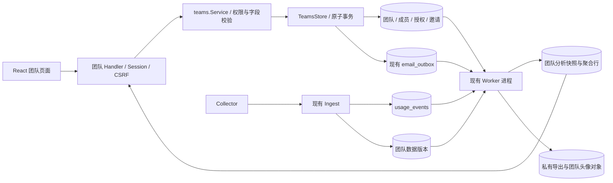

# TokenDance 团队模块技术方案 v1

日期：2026-09-06。状态：开发设计稿，尚未实现或执行数据库迁移。代码勘察基线：`e0103e3`。

本次修订将可直接分享、多人使用的成员邀请链接纳入首版，与定向邮箱邀请并列；两种方式都经过本人确认和单团队事务。

产品依据：[团队功能与交互方案](tokendance-teams-product-design-v1.md)。本文中的新增表、接口、配置和文件均为待实现项；引用的现有文件是本次实际检查过的接入位置。

## 1. 确定的边界与核心决策

1. **每个账号同时最多属于一个团队。** 创建、接受邀请共用一个数据库名额；所有者、管理员、成员均计入。退出后可重新加入，历史成员关系不占名额。
2. 使用现有 Go API / Worker / MySQL / React 网站，不新增微服务、消息中间件或 Collector 协议。
3. 团队私有，使用固定三级角色。所有者由团队唯一的 `owner_user_id` 决定，成员关系只保存 `admin/member` 基础角色，避免两个所有者字段相互漂移。
4. 公开隐私与团队授权完全独立；不使用 `users.leaderboard_visibility='team'` 作为团队鉴权依据。
5. 授权按维度记录生效时间，统计只读取事件时间落在授权范围内的数据。新增授权不回填，撤回使对应历史数据不可再访问。
6. 团队分析使用独立、可失效的统计快照。单次响应返回同一版本的指标、趋势与构成，避免页面分别读取到不同统计版本。
7. 同时支持定向邮箱邀请与可分享邀请链接。邮箱邀请要求验证邮箱匹配；分享链接持有者登录后可确认加入为 member，不绑定指定邮箱。打开 / 预览不写成员关系；两种方式都需要本人选择共享范围。
8. 团队导出通过 API 鉴权下载，不向浏览器返回对象存储直链。

首期实现创建页、邀请与加入、总览、成员管理、Agent / 模型分析、共享设置、资料与头像、导出、审计、退出与解散。预算、公开团队榜、自定义角色、项目层级、SSO 不纳入本方案；多团队不是后续开关。

## 2. 现有代码核对与接入点

| 现有位置 | 已确认事实 | 团队模块处理 |
| --- | --- | --- |
| `server/go.mod` | Go 1.25、chi/v5、MySQL driver、Redis、S3 SDK 已存在 | 沿用依赖；不照搬旧用户技术稿的“服务尚未实现”描述 |
| `server/internal/httpapi/router.go` | 用户 API 位于 `/api/v1`，Collector 位于 `/v1` | 增加受保护的 `/teams`、`/team-invitations` 与 `/me/team*` |
| `httpapi/middleware.go` | Session、CSRF、账户状态、建档与 IP 限流已有实现 | 团队写接口沿用；业务事务再次验证当前权限 |
| `httpapi/response.go` | 成功响应直接 JSON；错误是 `error.code/messageKey/requestId/details` | 不新增不兼容的成功外壳 |
| `store/store.go`、`store/mysql/mysql.go` | 聚合 Store 接口、MySQL 与 memory 实现 | 新增 `Teams()` 子接口；事务由 Store 完整执行 |
| `store/mysql/ingest.go` | Ingest 按 installation → user 加锁，以设备 + event ID 去重 | 只在有新事件落库时写团队数据版本；不信任客户端 teamId |
| `usage_events` | 存在 `occurred_at`、`received_at`、Token 分项、费用来源，索引 `(user_id, occurred_at, event_pk)` | 作为团队授权时间切片的事实源 |
| `worker/aggregation.go` | 个人聚合按 UTC 日期；旧 team scope 依赖历史榜单与可见性枚举 | 不能作为新团队汇总或成员隔离依据；新分析单独建表 |
| `worker/pricing.go` | 会原地补写已有事件的费用，不产生新 event_pk | 补价同事务增加团队源数据版本，否则快照会永久漏更新 |
| `worker/worker.go`、`email/content.go` | 已有加密 outbox、租约发送、验证码模板 | 新增团队邀请模板和邀请有效性检查，禁止落到原始 JSON 回退模板 |
| `export/service.go`、`provider/provider.go` | 个人导出发放 60 秒直链；ObjectStorage 已有 OpenObject / DeleteObject | 团队导出单独鉴权，用现有存储适配器读取私有对象 |
| `store/mysql/privacy.go`、`worker/deletion.go` | 已有注销、设备 / 时间范围清理和租约代次 fencing | 扩展团队撤权、统计失效、对象清单及最终残留核对 |
| `internal/migrate/runner.go` | 实际使用自研迁移 Runner、嵌入 SQL、checksum 与 dirty 恢复 | 不引入旧稿提议的 goose；保持三处迁移一致 |
| `web/src/api/client.ts` | 已携带 Session、CSRF，API 基于 `BASE_URL` | 复用；支持 AbortSignal、团队错误码和二进制下载 |
| `web/src/pages/teams/TeamDashboardPage.tsx` | 当前占位页 | 替换为真实入口，新增 `/teams/new` 独立创建页 |

注意：旧用户技术方案的架构描述有历史内容；本次以代码为实现基线，不修改既有个人统计的语义来迁就团队。

## 3. 模块结构与数据流



- Handler：身份提取、DTO、长度与请求体上限、HTTP 状态映射，不直接执行 SQL。
- Service：角色决策、字段规范化、时间范围、授权变化计算、结果 DTO；数据库状态相关检查必须在事务内复核。
- Store：以 `CreateTeamTx` 等用例级接口封装锁顺序、唯一键、审计、幂等及版本变更，禁止 Service 拼接多个独立提交来模拟事务。
- Worker：邀请邮件、分析快照、团队导出、过期对象清理；网络发送和对象上传不发生在成员管理事务内。
- Memory Store：使用互斥锁模拟用例原子性；不能替代 MySQL 并发测试。

## 4. 数据模型

### 4.1 通用约定

- 业务 ID 沿用 30 字符 ASCII 二进制排序形式，示例前缀 `tem_`、`tmb_`、`tiv_`、`tgr_`、`tas_`、`tex_`；由服务端密码学随机数生成。
- 分享链接使用独立的 `tln_` ID 与 32 字节随机 token。ID 只定位记录，token 是加入凭证，两者不可混用；token 不进入日志或业务审计。
- 时间使用 UTC `DATETIME(3)`；有效时间均为左闭右开 `[from, to)`。授权时间在事务获得业务锁后读取数据库当前时间一次，不能使用客户端时间或排队前时间。
- 版本使用 `BIGINT UNSIGNED`。JSON 中 ID、版本号和大整数计数为字符串；费用用十进制字符串，不使用 float64 累加金额。
- 文本使用 utf8mb4；名称去首尾空白后按字素计数 2–40，简介 0–120；额外设置 UTF-8 字节上限 1024 / 4096，避免异常长组合字符。前后端必须共用字素测试样本。
- 团队时区通过 Go `time.LoadLocation` 验证并随程序打包 tzdata。名称不是唯一键，时区创建后不可 PATCH。

### 4.2 表清单

| 表 | 关键字段 | 键、索引与约束 |
| --- | --- | --- |
| `teams` | team_id、name、description、timezone_name、owner_user_id、status、profile_version、auth_revision、avatar_object_id、created_at、dissolved_at | PK(team_id)；owner FK users；status=active/dissolved；active 必须有 owner；每个 active 团队 owner 必须在当前成员中，由事务保证 |
| `team_memberships` | membership_id、team_id、user_id、base_role、sharing_version、joined_at、ended_at、end_reason | PK(membership_id)；UNIQUE(team_id,user_id,membership_id) 供组合 FK；索引(team_id,ended_at,user_id)；base_role=admin/member；重新加入创建新 ID |
| `user_current_teams` | user_id、team_id、membership_id、joined_at | **PK(user_id)**；UNIQUE(membership_id)；组合 FK(team_id,user_id,membership_id) → memberships；索引(team_id,user_id) |
| `team_sharing_grants` | grant_id、membership_id、dimension、starts_at、ends_at、revoked_at、active_dimension | dimension=base/named/classification/cost；UNIQUE(membership_id,active_dimension)；有效授权 active_dimension=dimension，撤销后为 NULL；索引(membership_id,dimension,starts_at) |
| `team_invitations` | invitation_id、team_id、inviter_user_id、invited_role、recipient_lookup_hash、lookup_key_version、recipient_ciphertext、encryption_key_version、status、active_recipient_hash、created_at、expires_at、accepted_by_user_id、accepted_membership_id、version | PK；UNIQUE(team_id,active_recipient_hash)；索引(recipient_lookup_hash,status,expires_at)；status=pending/accepted/revoked/expired；接受角色只有 admin/member |
| `team_invite_links` | link_id、team_id、creator_user_id、token_hash、token_ciphertext、encryption_key_version、status、version、max_uses、used_count、created_at、expires_at、revoked_at | PK(link_id)；UNIQUE(token_hash)；索引(team_id,created_at,link_id)；status=active/revoked；固定 role=member，不接受客户端指定角色 |
| `team_invite_link_joins` | link_id、user_id、membership_id、joined_at | PK(link_id,user_id)；UNIQUE(membership_id)；FK 到 link / user / membership；每个账号同一链接最多产生一次新成员关系，退出不删除该消费记录 |
| `team_command_receipts` | actor_user_id、operation_scope、idempotency_key_hash、request_hash、result_type、result_id、created_at、expires_at | PK(actor_user_id,operation_scope,idempotency_key_hash)；有效期 7 天；只存结果引用，不缓存邮箱或统计响应 |
| `team_source_revisions` | team_id、source_revision、changed_at | PK(team_id)；团队内新事件、补价与数据删除同事务递增；不以 MAX(event_pk) 充当提交顺序 |
| `team_analysis_snapshots` | snapshot_id、team_id、from_date、to_date_exclusive、auth_revision、source_revision、rule_version、status、active_request_key、as_of、lease_token、lease_generation、published_generation、lease_expires_at、attempt_count、next_attempt_at、error_code、expires_at | PK；UNIQUE(active_request_key)；查询索引(team_id,from_date,to_date_exclusive,auth_revision,status,as_of)；领取索引(status,next_attempt_at,lease_expires_at) |
| `team_analysis_rows` | snapshot_id、build_generation、row_key、membership_id、metric_date、visibility_mask、agent_id、provider_id、model_id、currency、Token / 有效事件 / 费用 / 覆盖计数 | PK(snapshot_id,build_generation,row_key)；row_key 是分组元组稳定 hash；索引(snapshot_id,build_generation,membership_id,metric_date)；对 snapshot FK CASCADE；不保存邮箱、Prompt 或原始扩展 JSON |
| `team_export_jobs` | export_id、team_id、requester_user_id、requester_membership_id、snapshot_id、auth_revision、filter_json、status、lease_token、lease_generation、lease_expires_at、attempt_count、next_attempt_at、object_key、file_sha256、file_size、created_at、expires_at、error_code | PK；索引(team_id,requester_user_id,created_at)、(status,next_attempt_at,lease_expires_at)；status=queued/running/completed/revoked/failed/expired |
| `team_audit_events` | audit_id、team_id、actor_user_id、action、target_type、target_id、safe_details_json、created_at | PK；索引(team_id,created_at,audit_id)；只存允许字段，昵称与邮箱不做长期快照 |
| `team_upload_objects` | object_id、team_id、uploader_user_id、object_key、content_type、byte_size、image_width/height、sha256、status、expires_at | PK；UNIQUE(object_key)；复用头像校验代码，归属团队，不借用个人头像对象的用户权限 |
| `team_deletion_barriers` | deletion_request_id、team_id、blocked_at、released_at | PK(deletion_request_id,team_id)；索引(team_id,released_at)；关联现有 data_deletion_requests；released_at=NULL 即阻止分析发布，失败或租约过期不自动解除 |

团队创建同时插入 `team_source_revisions`，source_revision 初值 0。`teams.auth_revision` 初值 1。资料单独使用 profile_version；成员自己的共享版本由 membership 关联记录的 `sharing_version BIGINT` 保存，默认 1。

快照状态为 `queued/building/ready/obsolete/failed/expired`；只有 queued/building 的 active_request_key 非空，成功、失败或撤销时置 NULL。key 由 team、日期范围、auth_revision 和统计规则版本组成，用于合并正在进行的同一构建任务。

迁移中增加明确的 CHECK：active 团队 owner 非空；成员 ended_at/end_reason 成对存在；grant 的有效状态必须同时满足 revoked_at/ends_at 为空、active_dimension=dimension，撤销状态则两时间非空且 active_dimension 为空；ends_at 不早于 starts_at；pending 邀请 active_recipient_hash 非空且等于 lookup hash，终态必须为空；快照活动 key 与状态一致。涉及可空字段时显式使用 IS NULL / IS NOT NULL，不能依赖 SQL UNKNOWN 自动拒绝。

链接额外 CHECK：`1<=max_uses<=100`、`0<=used_count<=max_uses`、`expires_at>created_at`、revoked 状态与 revoked_at 成对。effectiveState=revoked/expired/exhausted/active 按状态、数据库当前时间和计数计算，不依赖清理 Worker 及时把到期写回。version 只随撤销等配置变化增加，成功加入只增 used_count；不能让每次入队都导致其他正常预览版本冲突。有效期与人数限制创建后不改，修改走重新生成。

聚合行最小指标：`token_exact_total`、`token_derived_total`、`usage_event_count`、`token_supported_event_count`、`reported_cost_amount`、`estimated_cost_amount`、`reported_cost_event_count`、`estimated_cost_event_count`、`reported_covered_usage_count`、`estimated_covered_usage_count`、`unattributed_cost_count`、`max_received_at`。Token 与计数用 `DECIMAL(30,0)`，金额用 `DECIMAL(30,8)`；可用性计数区分“没有数据”和“数值为零”。活动人数 / 天数对有效成员和 metric_date 去重计算，不能累加每日人数。

当前成员名单的姓名、Handle 从 users 即时读取，禁止通过 public_user_profiles 间接读取，否则私密用户会丢失。未公开的个人头像不能借用 `/public/avatars/:id`：首版成员列表使用团队内默认字母头像；只有本来公开且授权展示的头像才复用公开 URL。

`email_outbox` 增加可空 `team_invitation_id` 与 `team_invitation_version`，供发送前校验。新增索引(team_invitation_id,delivery_status)。这不是 email_challenges，challenge_id 保持 NULL。

### 4.3 单团队关键 DDL 片段

以下为约束设计片段，完整建表须在实现阶段与迁移 Runner 一起验证，不能直接当作生产迁移运行。

```sql
CREATE TABLE user_current_teams (
  user_id       CHAR(30) CHARACTER SET ascii COLLATE ascii_bin NOT NULL,
  team_id       CHAR(30) CHARACTER SET ascii COLLATE ascii_bin NOT NULL,
  membership_id CHAR(30) CHARACTER SET ascii COLLATE ascii_bin NOT NULL,
  joined_at     DATETIME(3) NOT NULL,
  PRIMARY KEY (user_id),
  UNIQUE KEY uk_current_membership (membership_id),
  KEY idx_current_team_user (team_id, user_id),
  CONSTRAINT fk_current_team_user FOREIGN KEY (user_id) REFERENCES users(user_id),
  CONSTRAINT fk_current_membership FOREIGN KEY (team_id, user_id, membership_id)
    REFERENCES team_memberships(team_id, user_id, membership_id)
) ENGINE=InnoDB;
```

不能用 `UNIQUE(user_id, is_active)`，因为这也只允许一条非活跃历史；不能只依赖 `SELECT COUNT(*)=0`，两个并发请求会同时通过。

`team_memberships.base_role` 永远不保存 owner。对外角色：当 `membership.user_id=teams.owner_user_id` 时为 owner，否则读取 base_role。转移时只原子切换 owner 指针并把原所有者基础角色设为 admin。

## 5. 事务、锁顺序与并发

### 5.1 统一规则

团队写事务采用 READ COMMITTED、显式行锁与唯一约束。凡涉及用户名额，先锁 users，即使尚无 current 行也有可锁对象。

业务锁顺序：已需要的 installation（现有 Ingest / 设备删除）→ 相关 users 按 ID 排序 → teams 按 ID 排序 → current / history / invitation / invite_link → grants / link_joins → source revision / jobs / audit / receipts。不得先拿 teams 再等待用户锁。

纯快照任务的短领取事务只锁 job；在此事务提交后才开始源数据读取。发布事务按 teams → job 加锁。现有聚合 / 删除 advisory lock 只能在这些行锁之前获取，不得拿着团队行锁再等待该全局锁。

涉及全体成员的解散：先无锁读成员 ID 集合，锁这些用户，再锁 team，重读成员集合和 auth_revision；集合变化则回滚重新规划。不能锁 team 后逐个等待尚未锁定用户。死锁 / 锁超时最多重试 3 次，沿用同一个幂等键，超过后返回可重试错误。

### 5.2 创建团队

```text
字段与时区校验；生成业务 ID、规范化请求 hash
BEGIN
  SELECT user FROM users WHERE user_id=:actor FOR UPDATE
  校验账户 active、建档完成
  查询同操作幂等回执：存在则检查 request_hash 并重用 result_id
  查询 user_current_teams；存在则 409 TEAM_MEMBERSHIP_EXISTS
  取一次数据库当前时间 T
  INSERT teams(owner=:actor, auth_revision=1, profile_version=1)
  INSERT team_memberships(base_role='admin', sharing_version=1, joined_at=T)
  INSERT user_current_teams(user_id=:actor, team_id, membership_id)
  INSERT team_source_revisions(source_revision=0)
  按本人选择插入 grants；未勾选时不写任何有效 grant
  INSERT audit + command receipt
COMMIT
返回 201、Location 和团队身份；无数据不得填假统计
```

唯一键冲突必须回滚整个事务，不留下团队孤儿。幂等命中应先于名额冲突判断，否则“已成功但响应丢失”的重试会被错误当作新建失败。

### 5.3 接受定向邮箱邀请

无锁读取邀请的 teamId、inviterId 用于规划；随后锁接收者和邀请者 users（排序）、team、invitation，重新检查这些引用未变化。

事务内先检查账户、验证邮箱、team active 与幂等回执。已 accepted 的邀请单独按 accepted_by_user_id / accepted_membership_id 判断结果重放，不要求它仍是 pending，也不因邀请者后来降权而否定已经生效的成员关系。对尚未接受的新动作，再检查邀请 pending、`expires_at>T`、版本匹配及邀请者当前授予权限。管理员邀请在接受时仍必须由现任所有者授权；邀请者被移除 / 降权时旧 pending 邀请不能继续扩权。

- 当前名额属于其他团队：409，不改变邀请状态。
- 当前名额属于同团队且邀请仍有效：将邀请标记 accepted、关联现有 membership、释放 active_recipient_hash 并记录回执，返回 alreadyMember；不增加成员，不覆盖现有角色 / 共享范围。
- 邀请已被同一用户接受：仅在其仍属于 accepted_membership_id 时返回已有结果；已退出则 410，禁止旧邀请复活。
- 正常接受：写 history + current + 本人 grants，标记 accepted、记录 accepted_membership_id，释放 active_recipient_hash，增加 auth_revision、写审计 / 幂等回执，同一事务提交。

若申请人在本团队最近一次关系以 removed 结束，定向邮箱邀请的 created_at 必须晚于该次 ended_at，才能表达管理者重新邀请；移除前留下的 pending 邮件不具备恢复资格。两者同一毫秒时保守拒绝并要求重发。移除事务同时撤销该用户当前验证邮箱匹配的本团队 pending 邀请，减少残留旧入口。

### 5.4 角色、移除、退出、转移与解散

| 用例 | 事务内必须满足 | 结果 |
| --- | --- | --- |
| 改角色 | 当前 actor 为 owner；目标有效且不是 owner | 更新 base_role；auth_revision++；审计；相关邀请重新校验或撤销 |
| 管理员移除 | actor 为 admin，目标有效且 base_role=member，目标不是 owner | 关闭 history、删除 current、撤销 grants / 目标发出的 pending 邀请；auth_revision++ |
| 所有者移除 | 目标有效且不是自己 | 同上 |
| 主动退出 | 当前用户不是 owner | 同上；提交后名额释放 |
| 转移所有权 | actor 是 owner，目标为有效、active 账号成员；expectedAuthRevision 匹配 | 切换唯一 owner 指针，旧 owner 基础角色改 admin；双方都仍属于原团队 |
| 解散 | actor 是 owner；团队名确认与版本匹配 | team=dissolved；关闭所有 history、清除 current、撤销 grants / 邀请 / 导出；auth_revision++ |

解散后的 owner 字段可保留内部历史 ID，但任何访问必须先判断 status；后续注销该用户时清空或去标识。HTTP 确认团队名只是防误触，权限仍以 Session 与数据库状态为准。

### 5.5 通过分享链接加入

无锁读取 link 对应 teamId / creatorId 规划锁；验证 token 的域隔离 SHA-256 hash，使用恒定时间比较。随后锁申请人和创建者 users（按 ID 排序）→ team → link，重读并检查引用。业务处理顺序：

1. 校验申请人 active、已建档、邮箱已验证及团队 active。邮箱无需匹配指定收件人。重放幂等回执 / 已消费记录时，只返回仍有效的原 membership；已退出的原关系返回 410 TEAM_INVITE_LINK_ALREADY_USED，不重新加入、不重复扣次数。
2. 新加入动作复查 token、link active、未过期、expectedLinkVersion、创建者仍为 active 的当前 owner/admin。只有可信 token 持有者可以获得具体过期 / 撤销状态；错误 token / 未知 ID 统一 404。
3. 当前属于其他团队返回 409 TEAM_MEMBERSHIP_EXISTS。当前已在本团队则返回 alreadyMember，不改变角色 / grants、不插入消费记录、不扣次数。
4. 当前无团队时，检查该账号在目标团队最近一段成员历史；end_reason=removed 时拒绝分享链接加入，返回 403 TEAM_REINVITATION_REQUIRED。由管理者发定向邮箱邀请后才能重新加入，避免被移除者凭另一条活动链接立即返回。
5. 对本链接已有历史消费但原关系已结束者返回 410；否则校验 used_count<max_uses，并在同一事务创建 history + current、写本人 grants、登记 link_joins、used_count++、auth_revision++、审计与幂等回执。为该用户仍在运行 / 未核对完成的数据删除补登记屏障。
6. 提交后返回 200 TeamContext。任意错误回滚成员、授权、消费计数和审计，禁止先扣次数再调用另一个独立入队事务。

链接次数代表累计成功新增成员，不随退出 / 移除回补；预览、复制、失败、已在队和重试不计。最后一次可用额度由 team / link 行锁串行裁决。邮箱接受、链接接受、创建团队都复用同一个占用 current 的内部事务步骤，数据库 user_id 主键继续作为最终约束。

创建 / 撤销 / 重新生成链接也遵守 users → team → link 的锁顺序；重新生成在同一事务撤销旧 link、清理其 token 密文、插入新的 ID / token / 有效期与上限，并写幂等回执。与接受并发时按事务提交顺序生效：先成功加入的人保留，撤销先提交则后续加入失败。

创建者退出、被移除、注销、暂停，或从 owner/admin 降为 member，必须使其活动链接失效；仅从 owner 转为 admin 仍保留 member 邀请权限。解散撤销全队链接。撤销只影响未来加入，不移除既有成员或撤回他们自行开启的 grants。

## 6. 共享授权与时间语义

### 6.1 四个独立维度

| 维度 | 对应控件 | 生效要求 |
| --- | --- | --- |
| base | 将基础用量计入团队 | 当前成员、本维度 grant 有效 |
| named | 展示我的成员贡献 | base 与 named 在该事件时刻均有效 |
| classification | 共享 Agent / 模型分类 | base 与 classification 均有效 |
| cost | 共享费用 | base 与 cost 均有效；费用必须可用 |

任意带个人关联的 Agent / 模型 / 费用明细还需要 named。管理员身份不能跳过这套过滤。

只有 false→true 创建新的 starts_at；true→true 不更改原 starts_at。true→false 将该维度有效 grant 的 ends_at、revoked_at 设为 T，active_dimension 置 NULL，并增加 sharing_version 与 team.auth_revision。关闭 base 同时撤销其他三个维度。

不能将“每次保存设置”实现为重新创建整份授权：只改费用开关不应截断已有 Token 共享历史。重新开启旧维度创建新 grant；旧 revoked 记录永不再次用于统计。

```text
09:00 入队，未共享
10:00 base 开启                  → 10:00 之后的 Token 可计入汇总
11:00 named 开启                 → 11:00 之后的 Token 才能关联姓名
12:00 classification 开启        → 12:00 之前仍归入“未共享分类”
13:00 named 关闭                 → 全部个人关联历史撤回；团队总量仍在
14:00 named 再开启               → 仅 14:00 之后重新显示个人关联数据
15:00 base 关闭                  → 本成员全部团队历史贡献不可见
```

### 6.2 授权判定

事件 e 的基础资格：`team active AND current.membership_id=m.id AND m.ended_at IS NULL AND user.active AND e.user_id=m.user_id AND e.occurred_at>=m.joined_at`，并存在未撤销 base grant，满足 `starts_at<=occurred_at<ends_at`（无结束时间视作开放）。其余维度逐一取交集。

- 延迟上传按 occurred_at 判断；收到旧个人历史不会因“此刻已经共享”而入队。
- 浏览器和 Collector 不提供可信 teamId / grantId，服务器根据事件归属及授权记录判断。
- visibility_mask 按事件分别编码 named / classification / cost。关闭某维度后旧快照整体失效，不能只从成员表隐藏一行。
- 未共享分类的贡献使用 `unshared_classification` 桶；已允许分类但来源没提供名称使用 `unknown` 桶，二者区别对待。
- 聚合也可能让小团队成员推断彼此规模，因此不承诺数学意义的匿名；只保证未授权字段与姓名关联明细不会由 API 返回。

## 7. 团队分析与统计快照

### 7.1 为什么单独做快照

个人 UTC 日聚合已丢失授权时刻与多维授权交集，不能把加入日整天加进团队。团队快照从索引限定的 usage_events 读取，最终只向 Web 返回聚合数据。

首期采用**按请求日期范围构建**的快照：每个范围最多 90 个团队本地自然日，但可以查询更早的历史窗口；不偷偷限制只能查最近 90 天。一个范围快照包含全部可授权的 Agent / 模型，后续筛选由聚合行完成，不为每个筛选组合再扫事实表。

### 7.2 一致性与构建过程

1. 每次新事件落库、补价、费用修正，在同一业务事务递增对应 team_source_revisions；重复 Ingest 不递增。查询当前成员关系必须与使用者状态锁一致。
2. 查询先检查当前团队访问和 auth_revision，再找日期范围一致、rule_version 一致的 ready 快照；30 秒内沿用。普通新增数据可用旧快照并标记 refreshing；授权版本不同则绝不能回退旧值。
3. 无可用快照时合并创建 queued 任务，返回 202、`state=updating`、Retry-After；前端显示骨架。不要返回 200 的零数组伪装真实统计。
4. Worker 以 `FOR UPDATE SKIP LOCKED` 领取任务，赋新 lease_token 和递增 lease_generation，领取事务立即提交。
5. 另开 REPEATABLE READ 一致性读事务；在同一快照读取团队 auth_revision、source_revision、有效成员 / grants 和范围内事实。不能先读一个 MAX(event_pk) 再在多个 READ COMMITTED 查询中拼出混合状态。
6. 在服务端按团队时区归日、授权 mask 与维度聚合；使用独立连接分批写本次 snapshot + build_generation 的 rows，构建中行不被 API 读取。租约接管使用新 generation，旧 Worker 的迟到写入只能落入旧代次，不能覆盖新代次行。
7. 发布事务按 teams → snapshot 加锁，检查团队 active、auth_revision 未变、无删除屏障、lease_token/generation 匹配且租约未过期，再原子设置 published_generation 并标记 ready。API 只读取该 published_generation；版本不匹配则 obsolete，排队构建新版本。
8. 构建期间 source_revision 增长不必丢弃已有结果：它是 as_of 时刻的一致快照，正常发布并触发后续刷新；auth_revision 改变必须丢弃。读取时选同授权版本下 source_revision / as_of 最新者，旧 Worker 不能覆盖新快照。

不使用仅内存通知或自增 ID 最大值作为唯一“已处理”游标，避免事务提交乱序与进程重启漏处理。费用补写 source_revision 时，Worker 也须遵循 users → teams/source 的锁顺序，不能在已锁 usage_events 后逆序补锁用户；应先规划批次用户再按顺序加锁、重读待补价行。

### 7.3 日期与数据口径

- `range` 缺省或为 `today` 时使用团队当天；`7d/30d` 含今天，以团队本地日历计算起点。custom 接收 `from/to` 日期，to 在请求中含当天，服务端转换成下一本地午夜的 exclusive end；最多 90 个自然日，起止日期均不可晚于团队当地今天。
- 不沿用现有个人 custom 的 “减一纳秒” 边界；SQL 统一 `>= start AND < endExclusive`。DST 用 AddDate / 日历日，不以 24 小时乘天数。
- 今日的数据截至 as_of；未来事件不参与。日期跨度按本地日期计数不超过 90，未来日期请求返回 400。
- Token 首版统计 `model_usage_recorded` 且 accuracy=exact/derived 的事件。优先采用标准化 token_total；缺失时只有适配器分项语义明确才派生。缓存 / reasoning 是否已含在 input/output 不能全局一律相加。
- 分项语义不明的事件不冒充零 Token，返回 unsupportedEvents 与覆盖说明；estimated/correlated 另记质量计数，默认不混入精确用量。
- 活跃成员：周期内至少有一条符合条件的有效 model_usage 事件，且属于当前有效成员；分母为读取时当前成员数。共享成员表示当前 base grant 开启的人数。
- 贡献榜排序当前有效 base 共享范围内的 Token；named 不再作为单独开关，加入或开启基础共享后自动计入。贡献榜数值之和可能小于团队总量（未共享分类等），不能强制重标到 100%。并列使用 DENSE_RANK，稳定次序按 userId。
- Agent / 模型筛选只作用于已授权分类的行；选全部时仍含 unshared_classification。所有指标、分布、成员周期数据及导出绑定同一个 snapshotId / filtersHash。
- 同比只有同一成员集合、足够的授权历史与可比时间覆盖才计算；否则 comparison=null、reason=membership_changed / insufficient_history / no_baseline。

### 7.4 费用单独核算

现有事件费用来源为 provider_reported / estimated_price_table。分别累计并分币种返回，绝不将估算与已记录费用相加显示为总账单。

统一费用规范化函数在授权过滤后的事件集合内工作：同一可靠关联组出现 provider_reported 的 cost_recorded 与 model_usage 费用时，只选择一套费用表示。适配器能证明 cost_recorded 是该组最终总额时选最终总额；否则只汇总已证明互不重叠的增量费用。无法证明总额 / 增量语义时，该组金额标记 potentiallyOverlapping 并从可加总小计排除，保留质量计数，不任意挑一条。存在已记录费用的可关联组不再重复计入估算小计。关联至少包含 user、installation、agent、session / turn 与币种，不能只用 turn_hash 跨设备匹配。缺少足够关联信息时标记 unattributed / potentiallyOverlapping，不能凭相似金额猜测去重。

覆盖率细化为：可可靠关联已记录费用的已授权有效 model_usage 事件数 / 全部已授权有效 model_usage 事件数；估算覆盖率单独返回。未共享费用的 usage 事件仍在分母，独立 cost_recorded 不充当额外分母。只有费用而无可关联 usage 时，金额可标记“来源记录”，覆盖率为 null，并展示 unattributedCostCount。

P0 页面优先显示已记录费用；无已记录且有估算时显示估算费用。没有可用费用时 amount=null；provider 明确记录了 0 才显示 0。不同币种不折算；如未来需要汇率，另行确定价格来源、版本和时间。

现有个人统计查询中的费用混合与缓存回退公式不能直接复制到团队。实现时为上述规范化函数补充实际适配器 fixture，版本号写入 snapshot.rule_version；关联能力不足应明确降级，不能用测试样例之外的假设补齐数据。

物化时先产生每个有效 model_usage 事件唯一的一条用量贡献，再关联可证明归属的费用；费用币种展开不能重复累计 Token 或 usage 分母。只有独立费用的贡献行，其 Token / usage 计数为 0。金额可以精确关联到单条 usage 时才进入对应分类和成员细分；不能拆分的跨分类费用留在“未分配费用”，不按 Token 占比伪造分摊。已记录覆盖与估算覆盖对 usage ID 去重，二者不重叠。费用事件及其关联信息也必须满足相应授权，不能用未授权事件修正可见结果。

## 8. HTTP API 契约

### 8.1 通用约定

- 下表均相对于 `/api/v1`，全部要求 Session。写操作还要求 X-CSRF-Token。客户端不得指定 actorUserId、ownerUserId、joinedAt 或授权时间。
- JSON 请求上限 16 KiB，拒绝未知字段；头像内容另设上限。管理接口增加按用户 + 团队的限流，不能只依赖当前按 path + IP 的全局限流。
- 创建、接受两种邀请、邮箱发送 / 重发、邀请链接生成 / 撤销 / 重新生成、转移、移除、退出、解散、导出使用 `Idempotency-Key`。前端以 UUID 创建，一次用户动作的网络重试复用同一个值；服务端保存 hash。
- 同键同规范化请求重用结果引用；同键不同请求返回 409 IDEMPOTENCY_KEY_REUSED。幂等响应重新验证当前权限，不原样回放旧敏感数据；若已退出且不再有权读取原结果，返回 410 COMMAND_RESULT_UNAVAILABLE，不再次执行创建。
- 成功的 leave / remove / revoke / dissolve 回执只需返回原 204：确认当前登录 actor 与回执一致后可重放，不要求已删除的成员关系仍存在；不得借重放读取旧团队详情。幂等范围包含 HTTP 操作与目标资源 ID，权限变化后不能借同键执行新的动作。
- PATCH 和危险操作携带对应的 expectedVersion 字段，所有版本均为十进制字符串；版本缺失返回 400，冲突返回 409 并要求刷新。
- 非成员访问团队 ID、跨团队成员 ID / 导出 ID 均返回统一 404 TEAM_NOT_FOUND 或 RESOURCE_NOT_FOUND，不说明该私有资源是否实际存在。当前有效成员缺少管理权限时返回 403。
- 团队与邀请响应、头像内容和下载都设置 `Cache-Control: private, no-store`；不能让 CDN / service worker 缓存。内部缓存另行遵守 auth_revision，不对浏览器直接依赖 304。

### 8.2 路由清单

| 方法与路径 | 返回 / 操作 | 权限 / 特殊要求 |
| --- | --- | --- |
| GET `/me/team` | `{team:null}` 或当前 TeamContext | 当前账号 |
| GET `/me/team-invitations` | 本验证邮箱的邀请，游标分页 | 当前账号；返回与本人匹配的邀请 |
| POST `/teams` | 201 TeamContext，Location | 无当前团队；幂等 |
| GET `/teams/{teamId}` | 团队资料、当前成员身份、权限、版本 | 有效成员 |
| PATCH `/teams/{teamId}` | 更新 name / description，返回 TeamContext | owner/admin；expectedProfileVersion |
| GET `/teams/{teamId}/members` | 当前成员，q / cursor / limit；可携带 snapshotId 附周期统计 | 有效成员；普通成员无邀请邮箱 |
| GET `/teams/{teamId}/members/{membershipId}` | 该成员获授权的周期详情 | 有效成员；逐维度检查 named 授权；snapshotId 必填 |
| PATCH `/teams/{teamId}/members/{membershipId}/role` | 修改基础角色 | owner；expectedAuthRevision |
| POST `/teams/{teamId}/members/{membershipId}/remove` | 204 | owner，或 admin 管理普通成员；expectedAuthRevision、幂等 |
| GET `/teams/{teamId}/invitations` | 管理侧邀请与投递状态 | owner/admin |
| POST `/teams/{teamId}/invitations` | 201 invitation，deliveryState=pending | owner/admin；管理员只能授予 member；幂等 |
| POST `/teams/{teamId}/invitations/{invitationId}/revoke` | 204 | 有权管理该邀请；expectedInvitationVersion、幂等 |
| POST `/teams/{teamId}/invitations/{invitationId}/resend` | 201 新 invitation，旧记录撤销 | 有权管理拟授予角色；expectedInvitationVersion、幂等 |
| GET `/team-invitations/{invitationId}` | 邀请预览或本人可见的状态说明 | 登录且验证邮箱匹配；不是公共详情 API |
| POST `/team-invitations/{invitationId}/accept` | 200 TeamContext 与 alreadyMember 标记 | 邮箱匹配；expectedInvitationVersion、sharing、幂等 |
| GET `/teams/{teamId}/invite-links` | 链接元信息列表、使用次数和 effectiveState；不含 token | owner/admin，游标分页 |
| POST `/teams/{teamId}/invite-links` | 201 link + shareUrl | owner/admin；expiresInDays、maxUses、幂等；固定 member |
| POST `/teams/{teamId}/invite-links/{linkId}/share-url` | 200 shareUrl，供复制 | 当前 owner/admin；只返回仍可用链接，记录访问审计 |
| POST `/teams/{teamId}/invite-links/{linkId}/revoke` | 204；阻止后续加入 | owner/admin；expectedLinkVersion、幂等 |
| POST `/teams/{teamId}/invite-links/{linkId}/regenerate` | 201 新 link + shareUrl，旧链接撤销 | owner/admin；expectedLinkVersion、新有效期 / 次数、幂等 |
| POST `/team-invite-links/{linkId}/preview` | 200 团队名、邀请人、member 角色、有效状态与本人能否加入 | 已登录；body.token 验证；无成员写入，不要求指定邮箱匹配 |
| POST `/team-invite-links/{linkId}/accept` | 200 TeamContext 与 alreadyMember | active 已验证账号；body.token、expectedLinkVersion、sharing、幂等 |
| GET `/teams/{teamId}/my-sharing` | 本人成员关系、sharingVersion、开关与生效时间 | 有效成员 |
| PATCH `/teams/{teamId}/my-sharing` | 更新授权后返回版本 | 本人；expectedSharingVersion |
| GET `/teams/{teamId}/analysis` | 200 一致分析结果；无有效快照时 202 | 有效成员；日期 / Agent / provider / model / snapshotId |
| GET `/teams/{teamId}/filter-options` | 当前快照可见分类，不含私有原始目录 | 有效成员；snapshotId 必填 |
| POST `/teams/{teamId}/exports` | 202 团队导出任务 | owner/admin；snapshotId、过滤条件、导出类型、幂等 |
| GET `/teams/{teamId}/exports` | 自己创建的任务列表 | 当前 owner/admin |
| GET `/teams/{teamId}/exports/{exportId}` | 任务状态 | 创建者仍有导出权限且 membershipId 未变 |
| GET `/teams/{teamId}/exports/{exportId}/content` | CSV 字节流 | 同上，重新检查 auth_revision；不返回对象存储 URL |
| POST `/teams/{teamId}/leave` | 204 | 非 owner；expectedAuthRevision、幂等 |
| POST `/teams/{teamId}/transfer-ownership` | 新 TeamContext | owner；targetMembershipId、confirmTeamName、expectedAuthRevision、幂等 |
| POST `/teams/{teamId}/dissolve` | 204 | owner；confirmTeamName、expectedAuthRevision、幂等 |
| GET `/teams/{teamId}/audit-events` | 操作记录游标分页 | owner/admin |
| POST `/teams/{teamId}/avatar-upload-intents` | 上传意图 | owner/admin |
| PUT `/teams/{teamId}/avatar-upload-intents/{objectId}/content` | 上传图片内容 | 意图创建者仍有管理权限 |
| POST `/teams/{teamId}/avatar-upload-intents/{objectId}/complete` | 校验并关联团队头像 | 当前管理权限与 expectedProfileVersion |
| DELETE `/teams/{teamId}/avatar` | 清空头像 | owner/admin；expectedProfileVersion |
| GET `/teams/{teamId}/avatar/content` | 当前团队头像内容 | 有效成员，无公共访问 |

首版不再分别开放 summary / trends / breakdowns 三套可漂移请求，统一由 analysis 返回；members 和详情引用 snapshotId。页面只读所需字段，可在之后经测量再拆分。

analysis 首次返回每个构成列表的前 20 条及 nextCursor；同接口携带 snapshotId、collection=agents/models/contributions、cursor 获取对应列表后续页，保持同一范围与筛选。趋势最多 90 个日点，无需分页。分类 ID 以 provider + model 等稳定组合区分，不能只按显示名合并；未共享和未知分类使用保留的桶类型，不伪造真实 model ID。

分页 limit 默认 20、最大 100。游标为签名的不透明值，包含 teamId、排序键、查询 hash 和相应版本；不得拼接 SQL 字符串。成员搜索采用显示名 / Handle 参数化查询，LIKE 通配符转义；排序字段用服务端白名单。

### 8.3 创建与共享示例

```json
{
  "name": "星河开发组",
  "description": "一起探索 AI 编程",
  "timezone": "Asia/Shanghai",
  "sharing": {
    "base": false,
    "named": false,
    "classification": false,
    "cost": false
  }
}
```

sharing 可省略，等价于四项 false；base=false 而其余 true 是无效请求，返回 400，不静默扩大权限。成功响应：

```json
{
  "team": {
    "id": "tem_0123456789abcdefghijklmnop",
    "name": "星河开发组",
    "description": "一起探索 AI 编程",
    "timezone": "Asia/Shanghai",
    "visibility": "private",
    "status": "active",
    "profileVersion": "1",
    "authRevision": "1"
  },
  "membership": {
    "id": "tmb_0123456789abcdefghijklmnop",
    "role": "owner",
    "sharingVersion": "1",
    "joinedAt": "2026-09-06T08:00:00.000Z"
  },
  "permissions": {
    "inviteMembers": true,
    "assignAdmins": true,
    "editProfile": true,
    "exportAnalytics": true,
    "transferOwnership": true,
    "dissolve": true,
    "leave": false
  }
}
```

权限字段用于 UI 控件显示；每次请求服务端重新计算，不能接受客户端传回的 permissions。

PATCH my-sharing 使用完整目标状态，避免部分开关含义不清：

```json
{
  "expectedSharingVersion": "3",
  "sharing": {
    "base": true,
    "named": true,
    "classification": false,
    "cost": false
  }
}
```

响应返回新的 sharingVersion、authRevision 与各开启维度的 effectiveFrom。无变化的保存不增加版本，也不重建快照。

### 8.4 分析响应

查询例：`GET /teams/{teamId}/analysis?range=7d&agent=codex`。查询参数不接受 userId；不能通过筛选某个未授权成员推断其明细。

以下数字仅说明契约结构：

```json
{
  "state": "ready",
  "snapshot": {
    "id": "tas_0123456789abcdefghijklmnop",
    "authRevision": "12",
    "sourceRevision": "47",
    "ruleVersion": "1",
    "asOf": "2026-09-06T08:00:00.000Z",
    "refreshing": false
  },
  "range": {
    "timezone": "Asia/Shanghai",
    "from": "2026-08-30T16:00:00.000Z",
    "toExclusive": "2026-09-06T16:00:00.000Z",
    "dataToExclusive": "2026-09-06T08:00:00.000Z"
  },
  "filters": { "agent": "codex", "provider": null, "model": null },
  "summary": {
    "tokens": { "value": "120000", "state": "available" },
    "activeMembers": "3",
    "currentMembers": "5",
    "currentSharingMembers": "4",
    "comparison": null,
    "comparisonReason": "insufficient_history"
  },
  "costs": {
    "reported": [{ "currency": "USD", "amount": "12.34000000" }],
    "estimatedUncovered": [],
    "coverage": { "reportedUsageEvents": "40", "eligibleUsageEvents": "100" },
    "unattributedCostCount": "0"
  },
  "trend": [],
  "agents": { "items": [], "nextCursor": null },
  "models": { "items": [], "nextCursor": null },
  "contributions": { "items": [], "nextCursor": null },
  "quality": { "unsupportedEvents": "0", "estimatedEvents": "0" }
}
```

示例的 trend 数组与 agents / models / contributions.items 省略了实际行；正式响应必须与 summary 同源。用量值采用 value + state，状态为 available / empty / unsupported / not_shared；null 与 0 不互换。费用列表为空表示无该类可加总费用，来源缺失与未共享原因由 quality / 授权状态说明；费用分母为 0 时比例=null。range.toExclusive 保留所选完整日期边界，dataToExclusive 是本次快照实际截断时刻。

无当前授权版本快照：

```json
{
  "state": "updating",
  "authRevision": "13",
  "retryAfterMs": 2000,
  "messageKey": "teams.analytics.updating"
}
```

页面拿到新 authRevision 或 409 TEAM_SNAPSHOT_OBSOLETE 后先清除旧团队数据，再加载新快照，不能在重建提示背后继续显示撤回的数字。

### 8.5 错误码

| HTTP / code | 条件 | 前端行为 |
| --- | --- | --- |
| 400 API_INVALID_ARGUMENT | 名称、时区、日期、开关组合不合法 | details.fieldErrors 定位输入，保留表单 |
| 401 AUTH_REQUIRED | 未登录或 Session 失效 | 登录后回到原路由 |
| 403 TEAM_PERMISSION_DENIED | 已加入但无此操作权限 | 更新角色，关闭失效操作面板 |
| 403 ACCOUNT_ACTION_NOT_ALLOWED | 账号待注销等 | 沿用账户状态页 |
| 404 TEAM_NOT_FOUND | 团队不存在、已解散或当前人非成员 | 清空团队上下文，回入口 |
| 404 TEAM_INVITATION_NOT_FOUND | ID 不存在或邮箱不匹配 | 通用提示，可切换账号；不展示目标邮箱 |
| 404 TEAM_INVITE_LINK_NOT_FOUND | 分享链接 ID 不存在、token 缺失 / 错误或 team 不可用 | 通用邀请不可用；不暴露私有团队 |
| 403 TEAM_REINVITATION_REQUIRED | 最近一次被该团队移除，尝试经分享链接返回 | 联系管理者发定向邮箱邀请 |
| 409 TEAM_MEMBERSHIP_EXISTS | 已属于另一个团队 | 展示当前团队入口；不自动退出 |
| 409 TEAM_VERSION_CONFLICT | 角色 / 资料 / 授权版本过期 | 保留草稿并刷新当前状态 |
| 409 TEAM_OWNER_TRANSFER_REQUIRED | owner 退出或注销前未处理团队 | 转移 / 解散入口 |
| 409 TEAM_INVITATION_PENDING | 同团队同邮箱已有有效邀请 | 跳到已有邀请管理；仅管理者获得 invitationId |
| 409 TEAM_SNAPSHOT_OBSOLETE | 请求旧授权版本快照 | 清旧值，重新请求 analysis |
| 409 IDEMPOTENCY_KEY_REUSED | 同键不同请求体 | 不自动换键重试危险操作 |
| 410 TEAM_INVITATION_EXPIRED / REVOKED | 本人可见邀请已失效 | 联系邀请人重发 |
| 410 TEAM_INVITE_LINK_EXPIRED / REVOKED / EXHAUSTED | 正确凭证下的链接到期、撤销或次数用尽 | 关闭加入操作，联系邀请人；不自动重新生成 |
| 410 TEAM_INVITE_LINK_ALREADY_USED | 本账号曾经用此链接加入，但原成员关系已结束 | 说明需新的邀请，不重复占用名额 |
| 410 TEAM_EXPORT_REVOKED / EXPIRED | 权限变化或到期 | 不提供下载，允许重新生成 |
| 429 API_RATE_LIMIT_EXCEEDED | 限流 | 遵循 Retry-After |
| 503 TEAM_TEMPORARILY_UNAVAILABLE | 构建失败、任务不可用、依赖失败 | 显示可重试状态；不展示越权旧快照 |

错误详情仅包含安全字段，不放 SQL、邮箱明文、邀请载荷或对象 key。

## 9. 邀请、邮件与密钥

### 9.1 定向邮箱邀请 ID 与登录回跳

定向邮箱邀请 URL 使用网站实际 base path，例如 `/token-dance/teams/invitations/{invitationId}`。随机 ID 是定位符；这类邀请的详情和接受都检查登录用户验证邮箱。可转发给其他人的通用成员邀请另走第 9.4 节的分享链接，不复用邮箱接口或取消邮箱校验。

未登录先进入现有登录 / 注册，并保留相对 `return_to=/teams/invitations/{id}`；完成建档后回邀请页。现有 return_to 校验继续禁止外站 / 协议相对路径。首次打开不自动接受，不在 GET 请求产生成员关系。

邮箱邀请不需要 bearer token；产品稿与实现路由统一使用 `:invitationId`。两类邀请都不在 GET、登录回跳或预览阶段自动添加成员。

### 9.2 邮箱绑定与重复邀请

- 沿用 `auth.NormalizeEmail`，保持既有大小写归一化规则，不私自去除 `+tag` 或 Gmail 点号。
- 查询 hash 使用现有 EmailLookupKeys，保存 key_version；邮箱正文沿用 AEAD 加密，AAD 使用团队邀请专用域并包含 invitationId。已有用户验证邮箱从安全身份服务比较，不交给 Web 决定匹配。
- 轮换期间支持旧版本 hash 查找；对 pending 邀请重加密 / 重 hash 时锁对应 team，创建邀请时在同一 team 锁下检查所有有效 key 版本，避免跨版本产生重复 pending 邀请。
- active_recipient_hash 在 pending 时等于 recipient_lookup_hash，否则必须 NULL；到期但尚未被 Worker 标记的记录，在邀请事务内先转 expired 再插入新邀请。
- 不向邀请者透露收件人是否注册、当前在哪个团队；只反馈邀请记录与邮件投递状态。收件人在接受时自行处理单团队限制。
- 默认有效期 7 天，服务端控制；重发从新邀请创建时起重新计算。管理员仅能管理 member 邀请，owner 可管理全部邀请；接受时以当前角色再次核对。

### 9.3 Outbox

邀请记录与 outbox 同事务写入。新增 `teams.invitation` 中英文模板，payload 仅包括邀请 ID、拟授予角色、团队名、邀请人展示名、站内 URL、expiresAt；收件地址与载荷加密保存。模板不能接受任意外链或 HTML，邮箱主题去除 CR/LF。

重发生成新 invitationId，旧记录 revoked、旧 active key 清空；旧 pending/sending outbox 标记 cancelled，新 outbox 单独幂等。旧 sent 邮件不改为 cancelled，以免违反既有 sent_at 状态约束。`retry delivery` 若只处理未送达失败可复用原邀请，在原有效期内重试，不延长期限。

发送前检查 invitation pending、未到期、team active、邀请者仍有授予权限、outbox 关联版本匹配。发送中恰逢撤销，外部 SMTP 可能已经接受邮件；允许用户收到失效链接，但接受接口必须拒绝，不能承诺能召回邮件。

投递成功指 Provider 接受，不承诺送达收件箱。发送失败 / 重试不会增加成员数。活动密钥必须保留到所有待投递邮件与有效邀请过期，未知 key version 或解密失败 fail closed，禁止像通用兼容回退一样把 ciphertext 当作明文继续发送。

### 9.4 分享链接凭证与回跳

首版创建参数为 `expiresInDays=7`、`maxUses=50`，允许天数 1 / 7 / 30、使用人数 1–100。链接固定 member；不设置收件邮箱、不写 email_outbox、不主动发送任何外部消息。完整链接为站点配置的可信 origin + base path + `/teams/join/{linkId}#key={token}`，token 使用 32 字节密码学随机数的 base64url 编码。

数据库保存域隔离 SHA-256 token_hash，查验不需解密；另沿用现有 AEAD 保存 token_ciphertext，AAD 包含团队链接专用域、teamId、linkId，以支持管理者稍后再次复制，以及创建响应丢失后的幂等结果恢复。只在创建 / 重新生成结果或专门的 share-url 接口解密返回，列表、审计、普通 TeamContext 都不带完整链接。密钥轮换保留所有仍有效密文需要的版本，不能在链路有效期内提前销毁旧密钥。

链接凭证只位于 URL fragment；浏览器在页面入口读取后立即用 replaceState 清除地址栏 fragment，向 API 的 preview / accept POST JSON body 传 token。禁止放进 URL path / query、return_to、日志、错误采集或埋点；这两个 POST 也要求 CSRF，并沿用 Session / 账号校验。页面使用 Referrer-Policy: no-referrer，不加载第三方分析脚本。

登录前页面仅显示“你收到一份团队邀请”和登录 / 注册入口；团队信息须在登录并验证 token 后展示。为跨登录 / 注册 / 建档及刷新保留邀请，允许此流程专用的 sessionStorage 暂存 linkId、token 与客户端过期时刻，最长 15 分钟，按 linkId 隔离；不存 localStorage，不与团队统计缓存混用。登录回跳仅包含 `/teams/join/{linkId}`。每次读写检查 TTL，成功、取消、退出登录、失效或到时清除；存储不可用或超时后提示从原始分享链接重新打开。这个临时载体只用于浏览器回跳，服务端仍每次验证实际链接有效期和权限。

预览只返回 token 授权查看的团队名、邀请者展示名、固定角色、到期时间、linkVersion、effectiveState，以及当前账号是否已在队 / 被移除；不返回成员名单、成员邮箱、用量、私有头像或内部对象地址。次数上限及管理详情只向管理者返回。错误 token 无论 ID 是否存在均为相同 404；正确 token 的到期 / 撤销 / 用尽可以返回相应 410。

创建 / regenerate 的幂等命中先查原 result_id，当前管理权限与链接仍可用时才重建 shareUrl。若原链接已撤销 / 到期 / 用尽则返回其终态，不生成第二条链接。share-url 本身不延长有效期、不扣次数；界面实际复制成功后才显示“已复制”。

凭证密文在链接撤销、到期或用尽后进入清理，不再允许新复制；为识别终态保留 hash 与最小元信息。link_joins 的防重放记录至少保留到链接永久失效，之后按终态 30 天清理；不得仅因幂等回执 7 天到期或某成员离开就清掉仍有效链接的消费记录。注销时清除该账号身份关联，已被注销的 userId 不再作为可恢复账号使用；used_count 是累计事实，不因清理个人记录回补。

### 9.5 分享链接 API 示例

生成请求 `POST /teams/{teamId}/invite-links`，携带 Idempotency-Key：

```json
{
  "expiresInDays": 7,
  "maxUses": 50
}
```

201 响应包含 `link.id/version/role/expiresAt/maxUses/usedCount/effectiveState` 与 shareUrl。role 恒为 member、初始 usedCount 为 "0"；次数在 JSON 中沿用精确整数字符串。shareUrl 仅由服务端可信站点配置构造，不接受客户端传入域名。

接受请求 `POST /team-invite-links/{linkId}/accept`：

```json
{
  "token": "example-only-not-a-valid-token",
  "expectedLinkVersion": "1",
  "sharing": {
    "base": false,
    "named": false,
    "classification": false,
    "cost": false
  }
}
```

示例 token 不是实际凭证。成功复用第 8.3 节 TeamContext，附 alreadyMember；客户端不能传 role、teamId、已使用次数或授权时刻。token 格式错误与校验错误使用相同不可用提示，不能由字段错误泄露合法 ID。

## 10. 导出、头像与操作记录

### 10.1 导出

- 创建导出时记录 requester_membership_id、snapshotId、authRevision、filtersHash。只允许当前 owner/admin，默认仅创建者查看自己的导出任务。
- 导出类型为 daily / agents / models / members；成员导出只包含 named 授权的周期字段。未共享分类可以汇总到一个桶，不能输出其内部 membershipId 或原始分类。
- Worker 领取任务使用 token + generation + 到期租约；读取前、对象上传后发布前均重新检查当前身份、角色、membershipId、team status 和 authRevision。
- 对象 key 含 exportId + claim generation，防止过期 Worker 覆盖新对象。上传成功但发布失败，进入待清理对象清单，不暴露 URL。
- 下载通过 `/content`，利用现有 ObjectStorage.OpenObject，读取前和发送响应前复查权限。下载响应 Content-Disposition 使用服务端固定前缀与日期，避免用户文本污染 header。
- 成员离开后重新加入，即使恢复管理员角色也不能读取旧 membershipId 创建的导出。
- CSV 文本列统一转义，针对 `= + - @` 与前导控制字符的公式文本做防护；Token / 金额按精确十进制文本输出，不使用 JS Number 中转。
- 默认导出对象 24 小时过期；任务元信息保留 30 天。撤销先让下载接口拒绝，再异步删除对象。private bucket 禁止公共读取，API 不发放可绕过授权的直链。

一致性边界：撤销提交后新发起的读取 / 下载必须失败；撤销前已经返回或发送的字节无法追回。流式下载中定期复核 authRevision，发现变化立即终止后续发送，不跨整个网络传输长期持有数据库事务。不要对已经保存在用户设备上的文件承诺即时删除。

### 10.2 团队头像

首屏默认以团队名首字生成头像，不要求上传。设置页可以上传 PNG / JPEG / WebP，初始上限 2 MiB、4096×4096 像素，服务端解码、重编码为安全静态图片并去除元信息；SVG / 动图不接受。

复用现有 media 的内容检测与对象存储接口，但新增团队归属和鉴权，不能通过改个人 user_id 来模拟团队对象。创建意图、上传、完成关联都重新检查团队管理权限；完成时 CAS profile_version。旧对象进入异步清理，解散与团队资料删除覆盖全部团队对象。

成员能读私有团队头像，邀请收件人预览默认字母头像，避免新增未鉴权媒体路径。个人头像的团队内共享扩展不纳入这一版。

### 10.3 审计

覆盖 create、invite、resend、revoke、accept、invite_link_create / copy / revoke / regenerate / accept、role_change、sharing_change、remove、leave、transfer、dissolve、export_create / download / revoke、avatar_change。管理动作与审计同事务提交；审计写失败则管理事务失败。invite_link_copy 记录服务端发放 shareUrl 的动作，不声称已获知客户端剪贴板实际写入结果。

safe_details 只记录角色前后值、授权开关名、资源 ID、版本、结果码，不记录 Prompt、设备路径、原始邮箱、密钥、下载地址或完整请求体。默认团队管理审计保留 180 天；账号注销时对 actor / target 的身份引用与可能含个人内容的 details 去标识，保留无 PII 的动作类型和时间。

## 11. 撤权、删除与生命周期

### 11.1 失效的事务边界

所有成员进入 / 离开、角色变化、授权变化、影响该团队的数据删除都增加 teams.auth_revision；新事件和补价只增加 source_revision。把角色变化也纳入 auth_revision 是首版保守策略，会触发额外重建，但降低导出与权限分版本的复杂性。

事务提交后，以数据库当前 auth_revision 为每个请求的访问闸门。内部 Redis key 必须包含 teamId、authRevision、snapshotId、range 与 filtersHash；任何缓存命中前先查数据库当前访问关系和版本，Redis 不能成为授权事实源。普通 JSON 响应完成数据组装后、写出响应前再以新读检查成员身份与版本；变化则丢弃结果，返回更新或无权限。该最终检查是请求的授权判定时点，检查后与撤销并发的在途响应按第 10.1 节的已发送边界处理，不承诺跨网络的原子撤回。

旧 rows / 对象清理允许异步，但 API 立即停止引用。后台发布依赖 authRevision 与任务代次条件更新，旧 Worker 即使继续运行也无法重新发布撤销数据。

已经打开的另一个浏览器页可能仍有先前收到的内容：前端每 15 秒及重新获得焦点时检查上下文版本，版本变化立即清空。该时间是 UI 刷新窗口，不等于服务端仍开放旧权限；不声称可以召回已读内容。

### 11.2 账号注销

- 活跃团队 owner 发起账号注销时返回 409 TEAM_OWNER_TRANSFER_REQUIRED；先转移并退出或解散，不暗中把所有权转给不相关成员。
- 普通成员 / 管理员：在 RequestDeletionTx 设置 deletion_pending 的同一事务里关闭当前团队关系、撤销全部 grants、撤销其发出的有效邮箱邀请和分享链接并增加团队 authRevision。
- 取消注销只恢复账号，不自动恢复团队关系、共享或已撤销邀请；用户需重新受邀并授权。
- Worker 在 deleting_objects 阶段处理该用户创建的团队导出对象及失效头像上传意图；在 deleting_identity / reconciling 阶段去标识邀请邮箱、链接消费身份、审计引用及结束的个人关系信息，保持既有删除代次校验。
- 解散后的团队 owner 引用在其账号匿名化时清空；active 团队不能出现无 owner 状态。关系历史可保留去标识记录用于故障审计，不能保留可还原的邮箱副本。

### 11.3 设备 / 时间范围数据删除与账号暂停

installation / time_range / all_usage 删除同样会影响团队快照。领取现有 deletion claim 的短事务先提交，再在实际删事件前的新事务中按 installation（若有）→ user → team → deletion request 顺序锁定，复核 claim token / generation，登记 team_deletion_barriers 并增加 authRevision。屏障提交后才允许进入分批删除；此阶段新快照只能返回 updating。删除请求尚在可撤销等待窗口且尚未执行时，现有授权数据仍按既有语义显示。

删除屏障不只是一把锁：快照查询和发布检查持久的 request→team 关联，不通过用户此刻的 teamId 猜测受影响团队。删除失败、Worker 崩溃和租约接管都保持 blocked；接管复用同一关联。事件、聚合和对象核对通过后，在带有效 claim 代次的完成事务中设置该请求的 released_at 并再次增加版本。多个删除任务并行时，只有该团队全部屏障解除才允许发布；不得使用一个简单布尔值被其中一个任务提前清除。

用户可能在删除过程中退出或加入另一团队。离开会让旧关系贡献全部失效；创建 / 接受邀请事务在用户锁下检查该用户尚未核对完成的删除请求，为新团队补登记屏障。删除完成事务同样先锁 user，再锁其全部屏障 team，防止漏掉并发加入。新团队可以正常创建或加入，但在有关删除完成前不发布分析。解除关联后才允许清理原 deletion request，避免外键悬挂或错误提前解除。

账号 suspended 时现有 RequireAuth 阻断其访问；同事务撤销该用户贡献的快照引用及其创建的活动分享链接，authRevision++，源查询排除其数据。恢复 active 后不自动恢复已经显式撤销的 grants 或链接。暂停不释放其团队名额，也不自动转移所有权。

### 11.4 后台清理

- ready 分析快照默认 30 分钟保留，最长不超过关联导出任务完成所需时间；导出中快照被引用时延迟物理清理。授权撤销不受保留期影响，逻辑上立即失效。
- obsolete / expired 快照及 rows 批量删除，避免长事务；完成后任务只留摘要，不留个人指标。
- 待接受邀请到期后立即逻辑失效，邮箱密文及邮件载荷在终态 30 天后清理；账号注销可以更早要求清理。幂等回执 7 天后清理。
- 分享链接的 token 密文、hash、元信息与消费记录按第 9.4 节分别清理；消费记录清理不得恢复链接可用次数。
- 解散团队清除 current、grants、快照、导出、头像；审计按去标识保留策略处理，不删除成员个人 usage_events。

## 12. 前端页面与状态管理

### 12.1 路由与组件边界

沿用现有 AppLayout、AuthContext、LocaleContext 和状态组件；新增 TeamContext，只在内存保存当前团队及授权版本，不持久化团队统计。网站 basename 仍由 `import.meta.env.BASE_URL` 提供，禁止硬编码根站 `/api/v1` 或重复拼接 `/token-dance/`。

| 页面路由 | 职责 | 初始请求 |
| --- | --- | --- |
| `/teams` | 未登录介绍；无团队入口及本人邀请；有团队进入总览 | 已登录后 GET me/team；无团队再加载 me/team-invitations |
| `/teams/new` | 创建表单，已有团队时给出当前团队入口 | GET me/team；加载账号默认时区 |
| `/teams/invitations/:invitationId` | 邮箱绑定的邀请预览、本人共享选择、接受结果 | 邀请详情 + me/team |
| `/teams/join/:linkId` | 读取分享凭证、登录回跳、预览、本人确认加入 | 登录后 POST link preview + me/team；仅点击加入才 POST accept |
| `/teams/:teamId` | 总览、首次使用提示、趋势与贡献列表 | TeamContext + analysis |
| `/teams/:teamId/members` | 已加入成员、管理侧邮箱邀请 / 分享链接、成员抽屉 | members；有权限时 invitations / invite-links；周期数据绑定 snapshotId |
| `/teams/:teamId/analytics` | 日期 / 分类筛选、趋势、分布和导出 | analysis + 同 snapshotId 的 filter-options |
| `/teams/:teamId/settings` | 资料、头像、本人共享、操作记录及退出 / 解散 | TeamContext + my-sharing；管理者按需 audit-events |

路由声明把 new / invitations / join 与动态 teamId 明确分开，不把这些字面量交给团队查询。Tab 使用路由表达，日期与 Agent / provider / model 筛选使用 URL query；切换 Tab 保留适用筛选。用户离开团队后清掉该团队的 query 缓存和成员抽屉。

不引入新的全局状态库；首版用现有 React hooks、Context 与 API client。请求函数增加 AbortSignal，离开页面、快速切换日期或授权版本变化时中止旧请求；另用 request sequence + teamId + authRevision 检查迟到响应，不能只靠 AbortController。

### 12.2 创建页的完整交互

```text
checkingMembership
  ├─ 已有团队 → alreadyMember（显示当前团队入口）
  ├─ 查询失败 → checkFailed（重试；不开放未经检查的表单）
  └─ 无团队 → editing
                 ├─ 字段错误 → editing + fieldErrors
                 └─ 提交 → submitting
                             ├─ 成功 → created → 邀请弹窗 / 进入总览
                             ├─ 网络失败 → editing（保留内容与本次幂等键）
                             └─ 名额冲突 → alreadyMember（刷新当前团队）
```

- 表单包含名称、简介、固定统计时区、本人的四项共享选择；默认全部 false。基础共享关闭时清空三个子项；重新打开不恢复旧勾选。
- 名称与简介在失焦或提交时校验；提交错误聚焦第一个字段。时区默认账号设置，无有效默认值时显示明确的 UTC 回退并允许修改。
- submitting 禁用重复提交，按钮显示创建中；服务端唯一键仍是最终保证。双击防抖不能代替名额约束。
- 返回 / 取消的草稿只在当前登录会话内暂存；不把邮箱或共享草稿写入 localStorage。退出登录、换账号、创建成功时清除。
- 超时后按钮提供“重试创建”，内容不变时复用原幂等键。用户编辑成新请求时须先查询 me/team 以确认前次是否已成功，再使用新键；仍不确定则保持重试 / 状态查询，避免把未知结果当作失败。
- created 首次使用区显示真实团队名、owner、1 位成员、共享状态；邀请是后续独立动作，不通过一次大请求创建团队并发送多个邮件。
- 刷新成功页依赖 GET me/team 恢复已创建身份，不重新 POST。首次使用引导用 router state 或可关闭提示表达，不增加长期流程状态表。

已有团队的 GET 检查只改善体验。检查后另一个标签页可能已加入团队，POST 仍可能返回 TEAM_MEMBERSHIP_EXISTS；此时刷新身份并进入冲突状态，不自动退出当前团队。

### 12.3 邀请、设置与成员操作

两类邀请在登录后展示团队名、邀请人、角色、有效期和默认关闭的共享选择，由本人点击接受。未登录保留回跳；只有定向邮箱邀请执行收件邮箱匹配，分享链接执行 token 验证。已有其他团队时显示当前团队入口和单团队说明，不提供自动替换团队按钮。

共享设置保留 serverState / draftState 两份状态；新增授权仅在保存成功后生效。关闭 base 或减少维度，确认框说明将移除哪些历史团队指标；取消确认保留草稿。409 时刷新服务器状态，提示重新核对，不将旧草稿自动覆盖保存。保存成功返回新授权时间，并清空旧版本分析结果。

邀请对话框有“分享链接 / 邮箱邀请”两个 Tab，默认分享链接。链接页先选择有效期和最多可加入人数，再点击“生成链接”；成功后显示链接、有效期、已加入次数、复制按钮。仅真正生成 / 重新生成时写链接，打开弹窗或切换 Tab 不生成。管理侧列表支持复制、撤销、重新生成；重新生成前确认旧链接将失效，失败保留旧状态，成功再替换。

邮箱页一次一个邮箱，默认 member；owner 才能选择 admin。响应区分“邀请已创建、邮件待发送”和“投递失败”，待接受数可变、已加入数不变。分享链接不计入邮箱待接受数量。批量导入不属于首版。

分享链接加入页状态：读取凭证 → 登录 / 建档 → 验证链接 → 待确认 → 提交 → 已加入；旁路状态为凭证丢失、已在本队、已有其他团队、到期、撤销、次数用尽或需要定向再邀请。网络重试复用 Idempotency-Key 与共享选择，成功只导航一次。链接凭证按第 9.4 节暂存和清除，错误上报必须主动过滤 fragment 与 token 字段。

成员详情抽屉约 420 px，小屏占满可用宽度；打开后移动焦点、Esc 关闭、关闭后回到来源行。无 named 授权的用户仍可出现在成员名单，但不允许打开用量详情。团队同步状态只来自该成员已授权且 named 可见事件的 max_received_at，不暴露个人设备在线状态或未共享活动。

角色修改、移除、转移和解散不做乐观提交；等待事务成功再更新名单。确认框显示目标用户 / 团队名及具体影响；转移后明确原 owner 仍是成员，退出入口按返回权限更新。版本冲突保持对话框说明，但要求重读角色后再次确认。

### 12.4 分析状态、精度与可访问性

| 服务端状态 / 数据 | 页面表达 |
| --- | --- |
| 首次请求、没有 ready 快照 | 骨架，不出现模拟数字 |
| 202 updating，新 authRevision | 立即清旧值，显示“共享范围已变化，正在更新统计” |
| ready + refreshing，authRevision 未变 | 可显示截至 asOf 的旧值与更新时间，后台刷新 |
| 无人开启 base | “尚未共享”，链接到本人共享设置 |
| 已共享，但无有效数据 | “等待首次同步”或“此周期暂无数据”，与真实 0 区分 |
| 部分费用 / 分类不可用 | 保留有效用量，费用显示 —、覆盖率或未共享分类桶 |
| 当前成员无 named 授权 | 名单显示身份和共享状态，不显示 0 用量、名次或隐含个人趋势 |
| 权限失效 / 非成员 / 解散 | 清空页面数据、关闭抽屉与下载入口，返回团队入口 |
| 源构建失败或超出处理上限 | 明确失败与重试；超限时建议缩短范围，不伪装成空数据 |

Token 与版本保留字符串；排序和加总在服务端完成。展示精确值用 BigInt / 十进制格式化，图表坐标可对数值缩放后转换 Number，tooltip 保留原始精确字符串；金额不做前端浮点汇总。百分比先确定分母与舍入规则，不能用格式化后的 K / M 文本反算。

analysis 未指定 snapshotId 时取得最新有效快照；指定 snapshotId 时固定该快照并核对团队、范围、版本、TTL。新快照替换页面时一并刷新筛选项、成员周期数据与导出参数，不能将旧 snapshotId 的抽屉拼在新总览上。费用导出与页面采用相同 filtersHash。

手机、平板、桌面验收宽度为 360 / 736 / 1024 px。复用中英文词典，新增 teams.* message key；日期用团队时区格式化。抽屉 / 对话框焦点约束、输入错误关联、图表文字替代、非颜色状态提示与减少动画偏好共同验收。

## 13. 实现文件与用例接口

以下为新增 / 修改计划，不代表这些文件已经存在：

| 位置 | 计划内容 |
| --- | --- |
| `server/internal/domain/teams.go` | Team、Membership、Sharing、Invitation、Snapshot、Export DTO 与枚举 |
| `server/internal/teams/service.go` | 团队用例、字段与角色校验、时间范围、错误映射 |
| `server/internal/teams/metrics.go` | 授权维度判定、Token 规范化、费用去重与覆盖率；配套 fixture 测试 |
| `server/internal/store/store.go` | 新 TeamsStore 子接口，以及用例输入 / 输出约定 |
| `server/internal/store/mysql/teams.go` | 关系、邮箱邀请、授权、角色、幂等回执的事务实现 |
| `server/internal/store/mysql/team_invite_links.go` | 链接创建 / 复制 / 撤销 / 重新生成，消费防重、额度与成员写入事务 |
| `server/internal/store/mysql/team_analysis.go` | 快照查询、排队、版本校验与聚合行读取 |
| `server/internal/store/memory/` | 与 MySQL 同契约的内存实现，供 HTTP / Service 测试 |
| `server/db/queries/teams.sql` | 参数化查询、锁定与条件更新；生成 sqlcgen，不手改生成文件 |
| `server/internal/httpapi/teams.go`、`router.go` | Handler、路由、Session/CSRF/字段上限、下载鉴权 |
| `server/internal/worker/team_analysis.go` | 快照领取、读取、分代物化与条件发布 |
| `server/internal/worker/team_exports.go` | 导出、对象清理、发布前复核 |
| `server/internal/worker/team_cleanup.go` | 过期邀请、快照、对象、回执和去标识清理 |
| 既有 ingest / pricing / privacy / deletion / email 文件 | 源版本、删除屏障、注销团队撤权、邮件模板与投递状态联动 |
| `web/src/api/teams.ts`、`client.ts` | 类型化团队请求、错误、AbortSignal、二进制下载 |
| `web/src/context/TeamContext.tsx` | 当前团队、版本检查、授权失效清理 |
| `web/src/pages/teams/` | 入口、创建、邀请、总览、成员、分析、设置及公共控件 |
| `web/src/App.tsx`、`i18n/locales/` | 路由和中英文文案 |

Store 的事务接口以业务命名：CreateTeamTx、CreateInvitationTx、AcceptInvitationTx、CreateInviteLinkTx、RevokeInviteLinkTx、RegenerateInviteLinkTx、AcceptInviteLinkTx、UpdateSharingTx、ChangeMemberRoleTx、RemoveMemberTx、LeaveTeamTx、TransferOwnershipTx、DissolveTeamTx、QueueTeamExportTx。输入包含 actor、目标、期望版本、规范化请求与幂等信息；输出明确 Changed / Replay / AlreadyMember，不让 Handler 猜 RowsAffected 的业务含义。两种接受方式调用同一内部成员写入步骤，但不能通过调用两个独立 Tx 嵌套来实现。

分析侧分为 ResolveTeamRange、GetOrQueueAnalysis、ClaimAnalysis、BuildAnalysis、PublishAnalysis；发布要求显式提供 claim token / generation、capturedAuthRevision、capturedSourceRevision 与 publishedGeneration。共享函数只接收已检查的授权事实，不能通过某个调用方忘记传 filter 就默认允许全量数据。

## 14. 迁移、发布与回退

### 14.1 数据库迁移

本次勘察已有 0001–0004。实施前再次确认最新序号，新增 `0005_tokendance_teams.sql` 或届时下一个未占用序号；不得修改已经应用的迁移和 checksum。

维护同一迁移的三处副本：`server/db/migrations/`、`server/internal/migrate/migrations/`、`docs/ddl/mysql/`。更新 server/sqlc.yaml 的显式 schema 清单并重新生成查询代码，沿用现有 Runner 的迁移锁、dirty 恢复和部署命令。

建表顺序：teams（头像先不关联外键）→ memberships → current → grants / invitations / invite_links → invite_link_joins → receipts / revisions → snapshots / rows → exports / audit / upload_objects / deletion_barriers → 补头像 FK → 扩展 email_outbox。跨 users / installations / deletion requests 的 ID 类型、字符集、排序规则与既有表完全一致。

这批表初始为空；**不从 leaderboard_visibility=team 推断成员，不自动创建团队或打开授权**。仅对既有 outbox 增加可空字段及索引，已有认证邮件保持可处理。MySQL DDL 会隐式提交，不能把多条建表包在 BEGIN 中就认为可以整体回滚；失败依照现有 Runner 的实际状态和校验恢复，禁止直接清 dirty 标记跳过。

### 14.2 交付顺序与门槛

| 阶段 | 交付内容 | 完成条件 |
| --- | --- | --- |
| A：关系与创建 | 迁移、角色权限、单团队事务、邮箱与分享链接、创建 / 接受页 | 并发唯一性、邮箱绑定、链接防重与最后次数竞争通过；共享默认关闭 |
| B：授权与数据 | grants、源版本、快照、费用口径、全部删除屏障与撤权 hooks | 撤回、退出、租约接管和数据删除不返回旧贡献 |
| C：可用页面 | 总览、成员、分析、设置、同步状态与 i18n | 真实接口联调、三种宽度和全部主要错误状态通过 |
| D：管理与交付 | 导出、头像、审计、清理、监控和发布演练 | 端到端与实际 MySQL 检查通过，可开启功能 |

阶段表示依赖拆分，不允许在 B 未完成时向真实用户开放 A 的共享授权。开发环境可用测试账号逐段验收，公开启用必须同时具备撤权、数据删除与任务发布保护。

### 14.3 灰度与回退

新增服务端功能开关，初始关闭；迁移后先部署包含全部版本 / 撤权 hooks 的 API 和 Worker，再部署 Web，最后对测试账号启用。仅把按钮隐藏不能控制 API，创建与接受入口也要受服务端开关约束。

读取、新建 / 加入、导出可分别停用，但已有成员的共享撤回、退出、所有者处理与账号删除路径必须保持可用；停用分析时返回明确不可用状态，不转读个人表或旧 team 榜单。所有写入 usage 的进程都升级后才能开放团队，否则旧补价 / Ingest 路径可能漏增源版本。

应用回退保留新增表和数据，不执行 DROP。团队一旦有真实成员，不能直接回退到完全不认识团队权限 / 删除 hooks 的旧 API 或 Worker；应部署兼容修复版本，或关闭团队读取及新建并保留安全生命周期服务。恢复后按当前授权重建快照，不恢复旧 grants。

## 15. 性能、配置与可观测性

以下数值是首版工程初值与验收目标，尚未压测，不是现网能力承诺。

- 分析日期上限 90 日；队列去重、每团队同时 1 个构建、Worker 全局并发初始 2。不同日期任务公平排队，避免一个团队占满 Worker。
- 构建租约初始 120 秒，每 30 秒续租；任务读取有上下文期限、批量落库和内存上限。接管 / 取消只认可有效 generation，超过重试次数置 failed 并返回可重试状态。
- 事实读取走 user + occurred_at 索引；按成员 / 日期分段流式处理但共享同一个 RR 读事务，不能每段重新开启快照。数据库读事务上限初始 60 秒，超过后返回明确处理上限并提示缩短范围，不静默截断数据。
- 高基数行采用有界分批聚合与数据库暂存，不能将 90 天所有原始事件装入单个 Go map。Top 列表默认 20 条，另有完整分页；其余贡献用“其他”桶保持总和一致，不丢掉未共享分类桶。filter-options 同样分页 / 搜索。
- 管理请求初始按用户每分钟 30 次；邮件发送按团队每小时 50 次、同收件人重发间隔 60 秒；限流按实际投递行为计数，命中的幂等回执不重复扣配额。范围与阈值配置化，不增加“每个账号可多团队”的配置。
- 分享链接 preview / accept 按账号 + IP 限流，初始每分钟 30 / 10 次；不能只按 linkId 限流让一个人阻断整组加入。生成链接沿用管理限流，加入计数与邮件配额独立；管理复制只记录审计，不消耗链接使用次数。
- 目标测试规模：100 位成员、范围内 100 万有效事件；非媒体管理接口 p95 < 500 ms，ready 分析读取 p95 < 800 ms，普通构建 30 秒内完成。达不到时先看查询计划、授权联接和暂存开销，再决定是否引入增量物化；不通过削弱授权时刻换性能。

metrics 记录请求延迟 / 错误码、TEAM_MEMBERSHIP_EXISTS 次数、事务重试、队列等待、构建时间 / 行数、租约接管、authRevision 冲突、删除屏障年龄、导出撤销、邮件失败与孤立对象清理数。指标标签不使用邮箱、userId、teamId，避免泄露与高基数；受控结构化诊断日志可含内部资源 ID 和 requestId。

告警关注队列持续积压、删除屏障长时间未解除、未知密钥 / 邮件模板失败和被旧代次拒绝的发布激增。日志不记录请求体、邀请邮箱密文载荷、原始事件、认证 Cookie 或对象直链。

## 16. 验证计划与交付验收

### 16.1 必测场景

| 编号 | 场景 | 核心断言 |
| --- | --- | --- |
| T01 | 同用户并发 create/create、create/accept、accept/accept（不同团队） | 至多 1 条 current、1 个有效身份；失败事务不留孤儿 team / grants / accepted 邀请 |
| T02 | 创建已提交但响应丢失、相同幂等键重试、同键换请求 | 原结果可恢复；不重复创建或发邮件；同键不同请求 409 |
| T03 | 退出 / 解散后旧创建回执或旧已接受邀请重放 | 不恢复名额、不恢复共享；204 动作可安全重放 |
| T04 | 任意用户访问其他团队、成员 ID、快照、头像或导出 | 同一安全 404，不泄露邮箱、存在性或内部分类 |
| T05 | 管理员提升自己、移除 owner、降权与接受邀请并发 | 事务时权限生效；不产生越权管理员或双 owner |
| T06 | 转移与解散 / 接受邀请并发 | 每个 active 团队恰有有效 owner；转移不释放原 owner 名额 |
| T07 | 定向邮箱邀请：错误邮箱、未登录、7 天边界、撤销、重发、旧链接 | 只有验证邮箱匹配者可接受；GET 不写成员；旧邮箱邀请不可复活 |
| T08 | 基础共享关闭创建 / 加入，公开隐私切换 | 不产生隐式授权；个人公开配置不影响团队 grants |
| T09 | 授权前后 1 ms、延迟上传、named 单独开关、保存不变 | 无历史回填；撤回移除历史维度；未变化维度时间不重置 |
| T10 | 退出后再加入同团队并重新授权 | 新 membershipId；旧授权 / 导出不可恢复；历史个人事件不带入 |
| T11 | 构建中撤回、租约过期接管、旧 Worker 迟到写 / 发布 | 旧代次不污染新行；旧 authRevision 无 ready 响应 |
| T12 | Ingest 事务乱序提交、重复 event、已有 event 原地补价 | 无事件漏更新、重复不增量；补价更新 source_revision |
| T13 | time_range / installation / all_usage 删除失败重试、同时两个删除 | 屏障不提前释放；中间态不可发布；新加入团队也登记屏障 |
| T14 | owner 注销、普通成员注销 / 取消、suspended | owner 先处理团队；普通用户立即撤权；取消不自动重新入队 |
| T15 | 导出上传中撤回、完成后降权、退出重进、已开始流式下载 | 旧对象不能新下载；过期 Worker 不能发布；中途复核按约定终止 |
| T16 | 缓存命中后角色变化、双标签页、乱序响应 | 服务端验证当前版本；前端不把迟到旧值重新画回页面 |
| T17 | 上海午夜、DST、闰日、90 / 91 日、较早历史窗口 | 左闭右开边界；自然日计数；允许任意合规的旧 90 日窗口 |
| T18 | 缓存 Token 已含于输入、缺总量、真实 0、费用缺失与多币种 | 不重复相加；null 与 0 区分；无汇率混加 |
| T19 | reported 与 estimated 同组、跨设备重复 turn、cost-only | 正确去重或明确降级；费用展开不重复 Token / 分母 |
| T20 | 一人仅汇总、一人仅部分时段 named / classification | 总量、贡献列表、其他 / 未共享桶及覆盖率口径一致 |
| T21 | SMTP 超时 / 撤销中投递、旧密钥、未知模板、重复请求 | 成员数不变；邮件可失效但接受必拦；不发送明文回退载荷 |
| T22 | 头像超限 / 伪扩展、上传后降权、CSV 公式文本 | 内容验证与完成时授权生效；下载不执行恶意单元格公式 |
| T23 | 创建页错误、并发名额冲突、取消、成功后刷新 | 输入保留；默认不共享；成功恰 1 个成员；刷新不重复创建 |
| T24 | 所有角色、空 / 更新 / 失败态、中英文、360 / 736 / 1024 px | 控件与权限一致；无横向溢出；键盘与焦点操作可用 |
| T25 | 多个不同邮箱账号使用同一分享链接；与邮箱接受 / 创建并发 | 无需指定邮箱匹配；仍一人一队；固定 member，默认无共享 |
| T26 | 链接仅剩一次额度，同时两名新用户接受 | 至多一人成功；成员、grants、消费记录与计数原子一致 |
| T27 | 预览、复制、响应丢失重试、已在队、退出后重试、回执过期 | 不重复扣次数；仍有效链接的消费记录不能因 7 天回执清理而丢失 |
| T28 | 接受与撤销 / 重新生成 / 创建者降权、暂停、解散并发 | 提交顺序裁决；旧链接不再新加成员，已加入关系保留 |
| T29 | 被移除用户改用另一条活动链接 / 移除前旧邮件，再经新定向邮箱邀请 | 旧入口拒绝返回；移除后管理员明确再次邀请可以建立新关系 |
| T30 | fragment 读取清除、登录 / 注册 / 刷新、15 分钟超时、复制失败 | 凭证不进请求 URL / return_to / 日志；回跳可恢复或明确要求重开；复制反馈真实 |
| T31 | linkId 枚举、错误 token、密钥轮换、创建幂等恢复、篡改 role / usedCount | 不泄露团队；可用密文正确恢复；终态不重生；不能提升角色或改配额 |

并发测试使用屏障 / 可控事务步骤安排交错，不靠 sleep 猜顺序；至少对 T01、T05、T06、T11–T15、T25–T29 使用真实 MySQL。Memory Store 通过不代表数据库约束、隔离级别、锁顺序已经验证。

### 16.2 实施时应执行的检查

1. Go 领域与 Service 单测覆盖授权时间、角色、Token / 费用 fixture、日期边界；Handler 测试覆盖真实错误结构、CSRF、no-store 与跨团队访问。
2. 新建空库运行全部迁移；另在已有 0001–0004 的脱敏库增量升级，校验三份 SQL checksum、索引、FK、CHECK、Runner dirty 恢复与既有认证邮件。
3. 使用专用测试 MySQL 执行事务和 Worker 集成测试，按项目现有约定设置 `TOKENDANCE_TEST_MYSQL_DSN`。未设置该变量导致测试 skip，必须报告“未验证”，不能计为通过。
4. 在 server 目录运行 `go test ./...`；更新 sqlc 后执行 `server/scripts/verify-sqlc.ps1` 检查生成结果与生产引用。若环境支持 race，再对并发相关包运行 race 检查。
5. 在 web 目录运行 `npm run typecheck`、`npm test`、`npm run build`；新增团队 E2E 覆盖真实创建 → 邮箱 / 分享链接邀请 → 接受 → 授权 → 撤回 → 退出，两种路径分别验证。邮件使用测试 Provider，不向真实用户发送验收邮件。
6. 联调在实际 `/token-dance/` 子路径验证登录回跳、页面刷新、API、私有头像、CSV 下载与错误恢复；压测记录数据规模、机器配置、SQL 计划及 p95，核实第 15 节目标。

最终上线门槛：单团队唯一性、所有权不变量、本人授权、不回填、撤回与退出失效、删除屏障、后台任务分代保护和导出鉴权全部通过；页面交互完成且没有用 0 或旧数据掩盖不可用状态。

本文交付仅包含技术设计和产品稿口径同步。尚未创建业务表、改写业务服务、执行上述实现测试或部署团队功能。


## 2026-09-12：团队历史日汇总兼容（规则版本 4）

- v2 事实继续按团队时区计算。对于同一成员、工具、UTC 日不存在 v2 用量事实的分区，直接读取 `daily_user_agent_metrics` 的 exact + derived Token；estimated 不纳入，也不将日汇总伪造成事件。已有 v2 用量事实（含删除标记）的分区以 v2 为准，避免重复累计和删除后复活。跨协议混用同一工具同一天时不相加，可能无法补计只有旧协议记录的那部分；需统一客户端协议后获得完整事件级分析。
- 旧日汇总缺少事件时间，保留原始 UTC 日期，无法精确转换成其他时区的日界。只提供 Token 和工具分布；不从旧汇总推断费用来源、模型明细、事件数或覆盖率。API `quality.hasLegacyAggregates`、页面说明和 CSV `data_source` 明示该边界；有旧汇总的 CSV 行标记为 `includes_legacy_daily_utc`，事件及费用列仅包含可验证的 v2 部分。
- 当前成员、账号有效性、base/named/classification/cost 授权、撤回和删除屏障继续生效。不恢复加入或开启共享之后才计入的限制。新旧来源经权限掩码合并时以同一行键去重，使用大整数累计。
- 小规模前 10 名测试镜像每轮在目标事务内完整替换选中成员的旧日汇总表与设备日汇总，修复历史缺口并跟随源端删除；不复制原始事件、生产密码或邮件身份。比较实际团队输入摘要，仅在变化时推进团队 source revision。默认时间字段保持源值，避免每次同步制造更新。
- 0014 迁移增加行来源标识及用户/工具/事件类型/发生时间索引；旧规则快照和导出失效。成员页补充与总览一致的日期选择、缺日期提示及统计错误状态。

## 2026-09-12：贡献榜随团队共享自动计入（规则版本 5）

- 成员贡献不再要求单独的 named 授权。当前有效 base 共享即计入贡献榜、成员周期 Token、成员详情和成员导出中的姓名关联明细。classification / cost 仍为独立开关。
- 创建团队和加入团队默认开启 base（named 随 base 生效），加入流程不再展示个人贡献开关。设置页仍可关闭基础共享。
- 总览不再展示团队时区和历史日汇总说明条。规则版本升为 5，旧快照和导出失效。
