# TokenDance 用户系统后端技术方案与验收标准

> 文档更新时间：2026-08-30
> 文档状态：详细设计稿
> 后端技术栈：Go 1.25+、MySQL 8.0.34+、Redis 7（可选）
> 主状态轴：`users.account_status`
> 子状态轴：`email_challenges.challenge_status`、`user_sessions.session_status`、`users.leaderboard_visibility`、`device_binding_challenges.challenge_status`、`installations.installation_status`、`data_export_jobs.job_status`、`data_deletion_requests.request_status`
> 核心既有表：`users`、`installations`、`usage_events`、`daily_user_agent_metrics`、`daily_user_agent_model_metrics`、`daily_skill_metrics`、`leaderboard_snapshots`、`leaderboard_entries`、`data_deletion_requests`
> 核心新增表：`user_password_credentials`、`user_sessions`、`email_challenges`、`email_outbox`、`user_privacy_settings`、`public_user_profiles`、`user_handle_history`、`user_upload_objects`、`device_binding_challenges`、`user_security_events`、`data_export_jobs`
> 覆盖范围：邮箱注册登录、Session、首次建档、用户资料、个人数据查询、公开主页、搜索、排行榜查询、设备绑定、隐私、导出和注销
> 排除范围：Collector 本地采集、Adapter 解析、WAL、事件标准化、Ingest 幂等和排行榜聚合算法本身；这些能力沿用采集系统方案

## 1、方案目标与系统边界

### 1.1 目标

用户系统不是第二套采集服务。它在既有采集事实之上补齐账户、权限和查询闭环：

1. 用邮箱账户把 Web Session、Collector installation 和 `usage_events.user_id` 绑定为同一身份。
2. 向登录用户提供十项核心指标、Token 趋势、Agent/模型构成、Skill 排行榜、活跃日历和最近同步状态。
3. 以默认私密、显式公开为原则提供公开主页、搜索和排行榜查询。
4. 提供可审计的设备撤销、数据导出和账户注销流程。
5. 保持 Web API 契约稳定，使当前 Mock UI 可以逐页替换为真实 Repository。

### 1.2 与数据采集系统的所有权边界

| 对象/能力 | 事实源与写入方 | 用户系统的权限 | 本方案是否建表 |
| --- | --- | --- | --- |
| `users` | 用户系统负责账户和公开资料；Collector 只读取状态 | 读写并做兼容扩展 | 否，只 `ALTER` |
| `installations` | `internal/device` | 查询、改名、撤销、绑定时写入 | 否 |
| `installation_adapter_status` | Collector/设备状态上报 | 只读 | 否 |
| `ingest_batches` | `internal/ingest` | 只读最近同步和异常摘要 | 否 |
| `usage_events` | `internal/ingest` | P1 明细只读；禁止 Web 直连 | 否 |
| 三张 `daily_*_metrics` | `internal/aggregate` | 个人分析与高级查询只读 | 否；缺失指标由采集侧扩列 |
| `leaderboard_*` | `internal/leaderboard` | 公共 API 只读已发布快照 | 否 |
| `data_deletion_requests` | `internal/privacy` | 发起、查询、取消和展示 | 否，只做兼容扩展 |
| 认证、Session、邮箱、隐私、Public Profile 投影、上传对象、绑定挑战、导出任务 | 用户系统 | 事实源 | 是 |

用户系统迁移禁止出现 `CREATE TABLE users`、`CREATE TABLE usage_events` 或其他 `0001` 已建表。对既有表的扩列必须是可回填的 expand migration，并由表 owner 共同评审。

### 1.3 当前仓库事实

| 事实 | 结论 |
| --- | --- |
| 当前仓库只有 `web/`、`docs/` 和 `docs/ddl/mysql/0001_tokendance_server.sql` | Go `server/` 尚未实现；本文中的 package、handler 和 worker 名称是落地目标，不是现存代码 |
| Web 首页已经使用 TokenDance 和 “Let Token Dance” | 项目、服务、数据库、迁移、配置前缀、缓存 key、指标和 Adapter 标识统一使用 TokenDance |
| `0001` 已建立用户、设备、事件、日聚合、排行榜和删除请求表 | 本方案复用这些表，不再复制数据事实 |
| 采集方案规定 Web 只能访问聚合 API | 浏览器永远不能获得 MySQL 凭据，也不直接查询 `usage_events` |

### 1.4 P0、P1 与非目标

| 优先级 | 能力 |
| --- | --- |
| P0 | 邮箱验证码注册、密码登录/重置、Session、首次建档、中英文偏好、个人总览、Token 趋势、Agent/模型构成、个人 Skill 排行榜、活跃日历、公开主页、用户搜索、排行榜高级筛选、设备绑定/撤销、隐私开关 |
| P1 | 安全聚合明细、CSV 导出、公开用户比较、Skill 公共搜索、里程碑和分享卡 |
| P2 | 团队、关注、收藏、动态和第三方登录 |

以下明确不在本方案中：支付、充值、订阅、真实账单扣款、Prompt/回复/Reasoning/代码正文查询、团队 RBAC、运营后台和搜索引擎集群。

### 1.5 技术决策

| 层 | 选择 | 约束 |
| --- | --- | --- |
| Runtime | Go 1.25+ | 与采集服务端统一一个 Go module |
| HTTP | `net/http` + `chi/v5` | Handler 只做协议、认证、校验和超时，不写 SQL |
| SQL | `go-sql-driver/mysql` + `sqlc` | 所有 SQL 静态生成；业务层禁止字符串拼 SQL |
| Migration | `goose` | 单一 migration job；expand/backfill/contract |
| Primary DB | MySQL 8.0.34+ / InnoDB | UTC、`utf8mb4_0900_ai_ci`、严格 SQL mode |
| Cache/限流 | Redis 7，可选 | 不是 Session、隐私、排行榜或任务的唯一事实源 |
| 密码 | Argon2id（`golang.org/x/crypto/argon2`） | PHC 字符串落库；参数版本化 |
| 邮件 | Provider adapter + MySQL outbox | HTTP 请求不直接依赖邮件提供商成功 |
| 文件导出 | S3 兼容对象存储 | 数据库只存 object key 和摘要，不存永久下载 URL |

### 1.6 TokenDance 统一命名规范

| 对象 | 统一名称 |
| --- | --- |
| 项目/产品 | `TokenDance` |
| API 二进制/OTel service | `tokendance-api` |
| Worker 二进制/OTel service | `tokendance-worker` |
| MySQL schema | `tokendance` |
| 基线迁移 | `0001_tokendance_server.sql` |
| 用户系统迁移 | `0002_tokendance_user_system.sql` |
| 聚合兼容迁移 | `0003_tokendance_analytics_extensions.sql` |
| 环境变量前缀 | `TOKENDANCE_` |
| Redis key 前缀 | `tokendance:` |
| 指标前缀 | `tokendance.` |
| Adapter ID | `dev.tokendance.adapter.<agent>` |
| Schema 域名 | `https://schemas.tokendance.dev/` |
| Web Session Cookie | `__Host-tokendance_session` |

旧品牌名不作为别名继续写入新配置或协议。由于当前尚无生产 Go 服务和正式数据迁移，采用 greenfield 统一，不设计双写兼容层；若后续发现已有外部 Collector 使用旧 Adapter ID，必须单独增加显式 alias migration，不能静默混用。

## 2、总体架构与模块职责

### 2.1 整体架构图

<whiteboard type="blank"></whiteboard>

### 2.2 飞书画板绘制提示词

> 本节仅作为本地制图提示，不同步到飞书。画布从上到下分为前端层、API 层、服务端层、中间件层、存储层和外部依赖层，不画节点连线。前端层放置 `TokenDance web`；API 层放置 `/api/v1/auth/*`、`/api/v1/me/*`、`/api/v1/public/*`、`/v1/installations/*`；服务端层放置同一 Go module 内的 `internal/auth`、`internal/profile`、`internal/privacy`、`internal/analytics`、`internal/search`、`internal/leaderboard`、`internal/device`、`internal/export`、`internal/email`、`internal/media`；中间件层放置 Redis 7 和 Worker Scheduler；存储层放置 MySQL `tokendance` schema 内的账户表、`public_user_profiles`、`user_upload_objects`、采集事实表、聚合表、排行榜表和任务表；外部依赖层放置 Email Provider、S3-compatible Object Storage、Windows/macOS Collector。

### 2.3 Go 模块职责

| 模块 | 职责 | 明确禁止 |
| --- | --- | --- |
| `cmd/api` | 依赖装配、HTTP server、健康检查、优雅退出 | 在启动时自动改表 |
| `cmd/worker` | 邮件发送、导出、删除、聚合通知和过期数据清理 | 与 API 共用无上限连接池 |
| `internal/httpapi` | 路由、DTO、错误码、请求上限、Session middleware | 直接访问 `sql.DB` |
| `internal/auth` | 注册、登录、密码、Session、CSRF、邮箱归一化 | 返回可区分“邮箱不存在”的错误 |
| `internal/profile` | 首次建档、Handle、昵称、头像、时区、locale | 将邮箱派生为公开昵称 |
| `internal/privacy` | 公开字段、榜单可见性、删除申请 | 先返回成功再异步落隐私事实 |
| `internal/analytics` | 个人摘要、趋势、构成、Skill 和日历查询 | 把 Prompt 或原始扩展字段传给 Web |
| `internal/search` | 公开用户、Agent；P1 Skill 搜索 | 查询私密用户后在 Handler 删字段 |
| `internal/leaderboard` | 复用已发布快照和受控高级查询 | 在用户请求中现场重建全榜快照 |
| `internal/device` | 绑定挑战、installation 注册、改名、撤销 | 接受客户端提交的任意 `user_id` |
| `internal/export` | 导出任务、CSV、对象存储、过期清理 | 导出 Prompt/回复/代码正文 |
| `internal/email` | 模板、outbox、发送重试 | 日志记录验证码或完整邮箱 |
| `internal/media` | 头像上传意图、对象校验、当前头像切换和旧对象清理 | 接受任意 URL 作为头像或绕过 MIME/尺寸校验 |
| `internal/store/mysql` | `sqlc` query、事务 helper、分页 | 在业务层暴露通用 `Exec(string)` |

### 2.4 进程与部署边界

- `api` 与 `worker` 从同一 Go module 构建为两个二进制，初期可部署在同一集群，但必须分开进程、连接池、CPU/内存限制和扩缩容策略。
- `api` 负责短事务和只读聚合查询；默认请求 deadline 3 秒，登录/注册的 Argon2 计算 deadline 5 秒，导出只创建任务。
- `worker` 负责 `email_outbox`、`data_export_jobs`、`data_deletion_requests` 和过期记录；任务使用 MySQL `FOR UPDATE SKIP LOCKED` 抢占。
- Redis 故障时，登录限流降级到更保守的进程内/IP 限制，Session 仍查 MySQL，任务仍从 MySQL 拉取，公开查询回源 MySQL。

### 2.5 目标目录

```text
TokenDance/
  web/
  server/
    go.mod
    cmd/
      api/
      worker/
    api/openapi/
      tokendance-user-v1.yaml
    db/migrations/
      0001_tokendance_server.sql
      0002_tokendance_user_system.sql
      0003_tokendance_analytics_extensions.sql
    internal/
      httpapi/
      auth/
      profile/
      privacy/
      analytics/
      search/
      leaderboard/
      device/
      export/
      email/
      media/
      store/mysql/
      clock/
      crypto/
  docs/
```

依赖只能从入口指向领域、再指向接口和 store 实现。`analytics` 可以读取聚合 Repository，但不能依赖 `ingest` 私有实现；`httpapi` 不能反向成为领域依赖。

### 2.6 核心数据关系

#### 身份、资料与隐私 ER

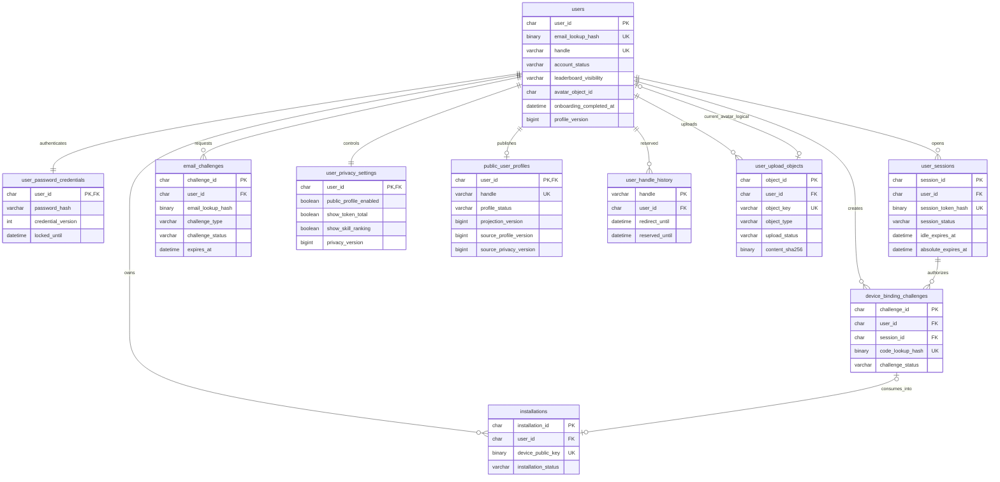

`users.avatar_object_id -> user_upload_objects.object_id` 是受 Repository 事务维护的逻辑关系，不建数据库 FK，避免与 `user_upload_objects.user_id -> users.user_id` 形成循环删除路径。切换头像时必须锁 user 和新对象，验证 owner/status 后更新指针；删除账户时先清指针再清对象。`public_user_profiles` 是唯一允许公共 API 和公开搜索读取的用户资料投影。

#### 分析与排行榜 ER

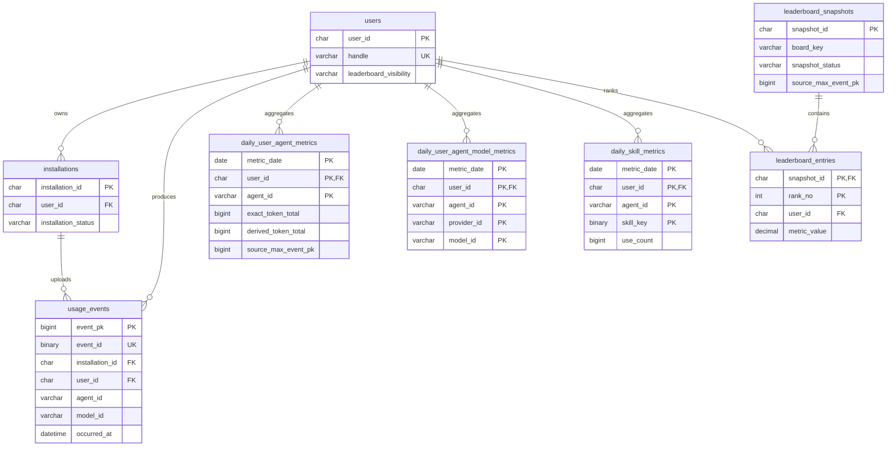

#### 任务与审计 ER

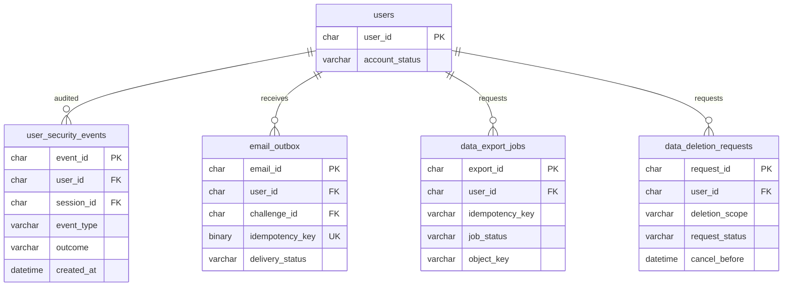

## 3、状态模型

### 3.1 状态字段口径

| 字段 | 作用 | 枚举来源 | 读法 |
| --- | --- | --- | --- |
| `users.account_status` | 账户能否认证、绑定设备、上传和公开 | 既有 `0001`，本方案扩展 `deletion_pending` | 账户主状态 |
| `email_challenges.challenge_status` | 邮箱验证码生命周期 | `0002` 新表 | 注册/重置子状态 |
| `user_sessions.session_status` | Web Session 生命周期 | `0002` 新表 | 登录子状态 |
| `users.leaderboard_visibility` | 排行榜参与范围 | 既有 `0001` | 公开子轴，不代替账户状态 |
| `device_binding_challenges.challenge_status` | 一次性绑定码生命周期 | `0002` 新表 | 设备绑定子状态 |
| `installations.installation_status` | Collector 是否允许继续上传 | 既有 `0001` | 设备子状态 |
| `data_export_jobs.job_status` | 导出任务执行进度 | `0002` 新表 | 异步任务子状态 |
| `data_deletion_requests.request_status` | 删除任务进度 | 既有 `0001`，本方案扩展 `cancelled` | 注销/删除子状态 |

### 3.2 `users.account_status`：账户主状态

| 枚举值 | 中文含义 | 允许登录 | 允许新绑定/上报 | 允许公开 |
| --- | --- | --- | --- | --- |
| `active` | 正常账户 | 是 | 是 | 取决于隐私设置 |
| `suspended` | 风控或运营暂停 | 仅允许查看状态说明 | 否 | 否 |
| `deletion_pending` | 注销撤销窗口 | 仅允许查看/取消注销和退出 | 否 | 否 |
| `deleted` | 已完成去标识化 | 否 | 否 | 否 |

产品展示状态不是额外数据库枚举，按以下规则派生：

| 产品状态 | 持久化条件 |
| --- | --- |
| `email_unverified` | 尚无 `users` 行；存在 `email_challenges(type=register,status=pending)` |
| `new` | `account_status=active AND onboarding_completed_at IS NULL` |
| `active_private` | `account_status=active AND onboarding_completed_at IS NOT NULL AND leaderboard_visibility=private` |
| `active_public` | `account_status=active AND onboarding_completed_at IS NOT NULL AND leaderboard_visibility=public` |
| `suspended` | `account_status=suspended` |
| `deletion_pending` | `account_status=deletion_pending` |

这样不需要把首次建档、隐私和注销进度挤进一个字段，也避免 `email_unverified` 产生半成品用户。

### 3.3 `email_challenges.challenge_status`

| 枚举值 | 中文含义 | 当前主线作用 |
| --- | --- | --- |
| `pending` | 已创建且可验证 | 注册/重置等待输入验证码 |
| `consumed` | 已成功使用 | 终态，禁止再次创建账户或改密 |
| `expired` | 已过期 | Worker 或读取时惰性转换 |
| `locked` | 尝试次数超限 | 终态，必须重新申请 |
| `cancelled` | 被新挑战替换或账户操作取消 | 终态 |

### 3.4 `user_sessions.session_status`

| 枚举值 | 中文含义 | 当前主线作用 |
| --- | --- | --- |
| `active` | 有效 Session | 同时满足空闲和绝对过期时间才可认证 |
| `revoked` | 主动退出、退出其他设备、改密或风控撤销 | 终态 |
| `expired` | 已超过过期时间 | 终态，可由读取惰性标记 |

### 3.5 公开、设备与任务子状态

| 字段 | 枚举值 | 说明 |
| --- | --- | --- |
| `users.leaderboard_visibility` | `private` / `team` / `public` | P0 UI 只开放 private/public；team 是枚举层支持，当前主线不经过 |
| `device_binding_challenges.challenge_status` | `pending` / `consumed` / `expired` / `cancelled` | consumed 后关联唯一 installation |
| `installations.installation_status` | `active` / `disabled` / `revoked` | revoked 终态；disabled 可恢复但 P0 Web 仅展示 |
| `data_export_jobs.job_status` | `pending` / `running` / `completed` / `failed` / `expired` / `cancelled` | completed 文件过期后转 expired |
| `data_deletion_requests.request_status` | `pending` / `running` / `completed` / `failed` / `cancelled` | account scope 的 pending 处于撤销窗口 |

### 3.6 主状态流转图

本图的主轴是 `users.account_status`；注册挑战发生在用户行创建之前，隐私和任务状态作为明确标注的子轴出现。

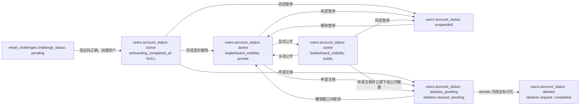

### 3.7 状态不变量

1. `email_unverified` 不建立 `users` 行，防止未验证邮箱占用 Handle 和榜单身份。
2. `onboarding_completed_at IS NULL` 时，`leaderboard_visibility` 必须保持 `private`。
3. `account_status <> active` 时，同一事务把 `public_user_profiles.profile_status` 置为 hidden；公开 API 必须返回 404，Ingest 必须拒绝新批次。
4. `deletion_pending` 只允许注销状态、取消注销和退出接口；不能创建 Session、绑定码或导出任务。
5. `user_sessions.status=active` 仍需同时校验用户状态、idle expiry、absolute expiry 和 credential version。
6. 隐私从 public 改 private 必须先提交 MySQL，再返回成功；缓存清理和榜单重建不能成为阻止泄露的唯一防线。

## 4、邮箱注册、登录与账户安全

### 4.1 邮箱与密码存储口径

#### 邮箱归一化

`internal/auth.NormalizeEmail` 执行以下步骤：去除首尾空白、校验 UTF-8 和总长度、将域名转为 IDNA ASCII 并小写、将本产品账户语义定义为整址大小写不敏感。P0 不做 Gmail 点号或 `+tag` 等提供商特化，避免把不同地址错误合并。

归一化后生成两份数据：

- `email_lookup_hash = HMAC-SHA256(email_lookup_key_vN, normalized_email)`：用于唯一查找，密钥不入库。
- `email_ciphertext = AEAD-KMS(normalized_email, key_version, aad)`：仅发送邮件、账号设置页读取时解密。

日志、指标、审计事件只记录 lookup hash 的短前缀或独立 `subject_lookup_hash`，不记录明文邮箱。

#### 密码

- 使用 Argon2id PHC 字符串，初始参数 `m=65536 KiB, t=3, p=2, salt=16 bytes, output=32 bytes`。
- 上述参数是上线初值，必须在生产同规格容器基准测试后调整到单次校验 P95 150–300 ms；不允许把参数写死在 Handler。
- `user_password_credentials.credential_version` 每次改密加一；Session 保存签发时版本，版本不一致立即失效。
- 登录查不到邮箱时仍计算一份固定 dummy Argon2 hash，响应始终为 `AUTH_INVALID_CREDENTIALS`，避免账户枚举和明显计时差。

### 4.2 注册和邮箱验证流程

注册拆为“申请验证码”和“验证并创建账户”两个 API。用户行只在验证码正确后创建。

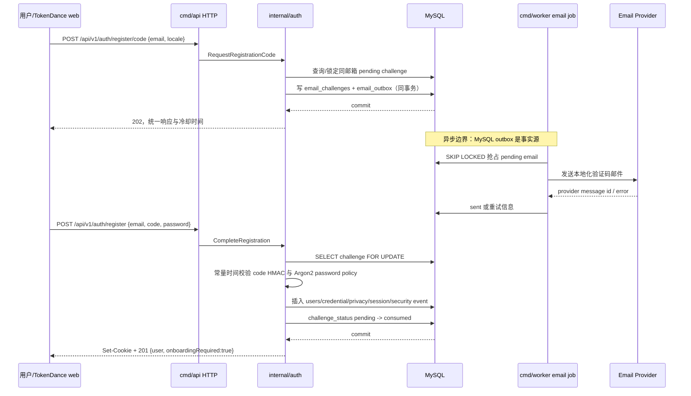

关键事务不变量：

1. `email_challenges` 同一 `challenge_type + email_lookup_hash` 最多一个 pending 行，由生成列唯一键保证。
2. 验证码使用随机 6 位数字；落库为 `HMAC-SHA256(code_key_vN, challenge_id || code)`，不是可逆明文，也不使用昂贵密码哈希。
3. 验证码默认 10 分钟、最多 6 次；每次失败在锁行事务内增加 `attempt_count`，达到上限转 `locked`。
4. 创建 `users`（写入 `email_verified_at=consumed_at`）、`user_password_credentials`、默认全私密 `user_privacy_settings`、首个 `user_sessions` 和 challenge consumed 必须在同一事务。
5. `users.display_name` 在首次建档前写入非邮箱占位值 `Token Dancer`，`handle=NULL`，不会进入公开接口。
6. 同一邮箱并发注册依靠 `uk_users_email_lookup_hash` 收敛；唯一键冲突返回统一 `AUTH_ACCOUNT_EXISTS`，不覆盖已有凭据。
7. 客户端丢失创建成功响应时可直接登录；consumed challenge 不再次创建账户或签发第二个 Session。
8. 申请验证码时若邮箱已注册，仍返回相同 202、冷却时间和响应体，但不创建 register challenge，也不发送可被滥用的重复邮件。

### 4.3 注册阶段的异步、锁、幂等、配置

| 类型 | 说明 |
| --- | --- |
| 异步 | 邮件通过 `email_outbox` 发送；API 事务成功即返回 202，不等待 Provider |
| 锁 | `SELECT ... FOR UPDATE` 锁当前 pending challenge；粒度是 email hash + purpose |
| 幂等 | pending challenge 生成唯一键、用户邮箱唯一键、outbox `idempotency_key` 唯一；验证码 consumed 后不可重放 |
| 配置 | `AUTH_CODE_TTL=10m`、`AUTH_CODE_MAX_ATTEMPTS=6`、`AUTH_CODE_RESEND_COOLDOWN=60s`、每邮箱 5 次/小时、每 IP 20 次/小时 |

### 4.4 登录和 Session 流程

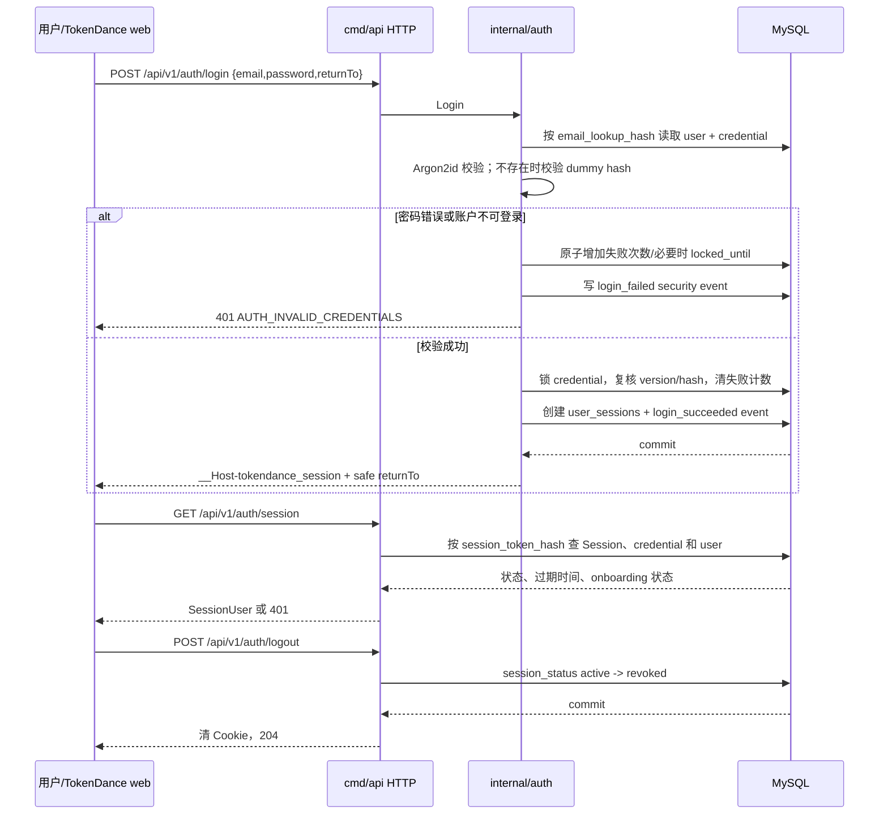

Session 使用 32 字节 CSPRNG opaque token，浏览器只持有明文，MySQL 保存带独立服务端 key 的 HMAC hash。Cookie 固定为：

```text
Name: __Host-tokendance_session
Secure: true
HttpOnly: true
SameSite: Lax
Path: /
Domain: omitted
Idle expiry: 14 days
Absolute expiry: 30 days
```

认证 middleware 每个受保护请求从 MySQL 校验 Session，不以 Redis 为正确性依赖。`last_seen_at` 最多每 5 分钟异步合并更新一次，避免每请求写库。后续若加入 Session cache，TTL 不得超过 60 秒，所有 revoke 路径必须主动删缓存；P0 建议先不缓存。

### 4.5 `return_to` 和受保护页面

`flux_port/app/chatgpt-auth.ts` 的可复用点是“读取当前身份、未登录重定向、严格校验相对 return path”，不是 ChatGPT header 身份本身。TokenDance 使用自己的 Session middleware，并保留同等安全规则：

1. 只接受以单个 `/` 开始的相对路径，拒绝 `//`、绝对 URL、反斜杠和控制字符。
2. 使用固定本地 origin 构造 URL 后复核 origin，最大长度 2048。
3. 拒绝 `/login`、`/register`、`/logout`、`/auth/callback` 等认证保留路径，避免重定向循环。
4. 服务端返回校验后的 `returnTo`；前端不能自行把未校验 Query 传给 `location.href`。
5. 未完成首次建档时，除注销和建档接口外统一重定向 `/onboarding?return_to=...`。

### 4.6 CSRF、并发 Session 和退出其他设备

- 所有 Cookie 认证的 `POST/PATCH/DELETE` 同时校验 `Origin`、`Sec-Fetch-Site` 和 `X-CSRF-Token`。CSRF token 是独立随机值，MySQL 存 hash，由 `/auth/session` 返回给同源页面内存。
- 登录成功后旋转 Session；不接受 URL、localStorage 或 Authorization bearer 作为 Web 登录凭据。
- `POST /api/v1/auth/sessions/revoke-others` 在事务中把同一用户除当前 Session 外的 active 行改为 revoked，并写一条审计事件。
- 单用户默认最多 20 个 active Session；第 21 个创建时按 `last_seen_at` 撤销最旧 Session。
- 账户进入 suspended/deletion_pending/deleted 后，即使 Session 行仍 active，middleware 也必须按路由白名单拒绝。

### 4.7 登录阶段的异步、锁、幂等、配置

| 类型 | 说明 |
| --- | --- |
| 异步 | 仅 `last_seen_at` 合并更新和审计清理异步；签发/撤销 Session 同步提交 |
| 锁 | 成功路径锁 credential 防止与密码重置并发；失败计数使用单行原子更新 |
| 幂等 | logout/revoke 对终态重复执行返回 204；Session token hash 唯一 |
| 配置 | 每邮箱 10 次/15 分钟、每 IP 30 次/15 分钟；连续 10 次失败锁 15 分钟；最大 20 active Sessions |

### 4.8 忘记密码与重置

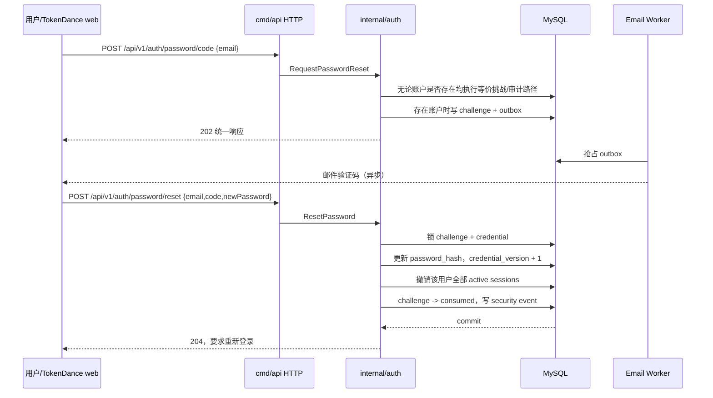

密码重置不自动登录，避免重置链接被他人截获后直接得到有效 Session。新密码不得等于当前密码；P0 不保存可逆历史密码，后续若要求最近 N 次不可重复，只保存独立 Argon2 历史摘要并设置短期保留。

### 4.9 邮件发送稳定性

| 关注点 | 设计/边界 |
| --- | --- |
| 数据一致性 | challenge 与 outbox 在同一 MySQL 事务；Provider 成功结果不是注册事实源 |
| 幂等防重 | `email_outbox.idempotency_key` 唯一；Provider request id 使用 `email_id` |
| 并发控制 | Worker 使用 `FOR UPDATE SKIP LOCKED`，`locked_at/locked_by` 支持超时接管 |
| 异步健壮性 | 退避 1m/5m/30m/2h，最多 5 次；验证码过期后不再发送 |
| 失败语义 | Provider 永久失败时 challenge 可继续存在但 UI 可重新申请；错误不暴露 Provider 细节 |
| 对账修复 | Worker 扫描 pending、超时 sending 和缺少 sent_at 的记录；支持按 email_id 管理员重放 |
| 可观测性 | send latency、delivery status、provider error class、队列深度；禁止验证码和明文邮箱标签 |

## 5、首次建档、个人资料与隐私

### 5.1 字段与校验规则

| 字段 | 存储位置 | 规则 | 公开规则 |
| --- | --- | --- | --- |
| 昵称 `display_name` | 既有 `users` | 1–80 个 Unicode 字符；trim 后非空；拒绝控制字符 | 公开主页启用时公开 |
| Handle `handle` | `users` 扩列 | 归一化为小写；`^[a-z][a-z0-9_]{2,31}$`；保留词禁用 | URL 和搜索主键，公开 |
| 头像 `avatar_url` | 既有 `users` | 只保存受信对象存储 URL 或空值；禁止任意 `javascript:`/data URL | 由公开主页总开关控制 |
| 简介 `bio` | `users` 扩列 | 0–280 字符；纯文本输出，前端转义 | `show_bio=true` 才公开 |
| 时区 `timezone_name` | 既有 `users` | 必须是 Go `time.LoadLocation` 可解析的 IANA 名称 | 不对外展示 |
| 语言 `locale` | `users` 扩列 | P0 仅 `zh-CN`、`en-US` | 不对外展示，不改变统计口径 |
| 首次建档时间 | `users.onboarding_completed_at` | 第一次完成时写入，后续修改不覆盖 | 不公开 |
| 排行榜范围 | 既有 `users.leaderboard_visibility` | P0 仅 private/public，默认 private | public 才参加榜单 |
| 公开字段开关 | `user_privacy_settings` | 默认全部 false | 公共 DTO 逐字段白名单投影 |

Handle 保留词至少包含 `admin`、`api`、`auth`、`login`、`logout`、`register`、`settings`、`me`、`leaderboard`、`explore`、`compare`、`support`、`tokendance`。保留词清单由版本化配置加载，但最终唯一性仍由 MySQL 保证。

### 5.2 首次建档流程

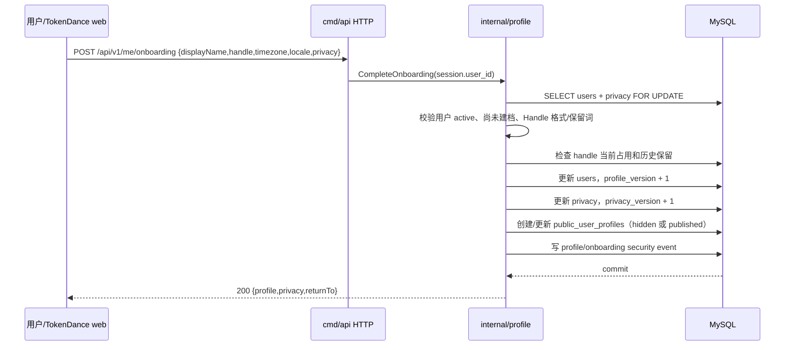

首次建档是一次事务。即使用户选择公开，服务端也必须同时确认 `public_profile_enabled=true` 和 `leaderboard_visibility=public`；只设置字段开关不能隐式参加排行榜。

### 5.3 Handle 修改与历史保留

修改 Handle 时锁 `users` 当前行，在同一事务中：

1. 校验 `If-Match: profile_version`，防止多个页面互相覆盖。
2. 检查新 Handle 不在 `users.handle`，且不在仍处于 `reserved_until` 的 `user_handle_history`。
3. 把旧 Handle 写入 `user_handle_history`：`redirect_until=now+7d`、`reserved_until=now+30d`。
4. 更新 `users.handle`、`profile_version` 和 `public_user_profiles.handle/source_profile_version`。
5. 公共路由在 7 天内对旧 Handle 返回 308 到新 URL；7–30 天返回 404 且不允许他人注册；30 天后 Worker 删除历史记录。

同一用户改回自己的历史 Handle时允许提前认领，但必须锁定历史行并删除后再更新。Handle 冲突统一返回 `PROFILE_HANDLE_TAKEN`，不依赖先查结果保证唯一性。

### 5.4 隐私模型

公共接口只从 `public_user_profiles` 和允许公开的聚合表构造 `PublicProfile` DTO，不允许读取完整 `users/user_privacy_settings` 后再通过 JSON tag 或前端隐藏字段。`public_user_profiles` 是强类型、最小字段、同步更新的安全投影，不使用任意 JSON payload。

| 公开内容 | 必要条件 |
| --- | --- |
| 公开主页存在 | `account_status=active`、已建档、`public_profile_enabled=true` |
| 排行榜出现 | 上述条件 + `leaderboard_visibility=public` |
| 简介 | `show_bio=true` |
| 总 Token | `show_token_total=true` |
| Token 趋势 | `show_trends=true` |
| 活跃日历 | `show_activity_calendar=true` |
| Agent 构成 | `show_agent_breakdown=true` |
| Skill 排行榜 | `show_skill_ranking=true`，且 `skill_public_name IS NOT NULL` |
| 成就 | `show_achievements=true`，P1 |

公开主页关闭时，其他字段开关保留但全部失效。重新开启前，前端必须再次展示将公开字段清单。邮箱、设备名、installation ID、session/turn hash、私有 Skill、项目/仓库标识始终没有公开开关。

### 5.5 隐私变更流程

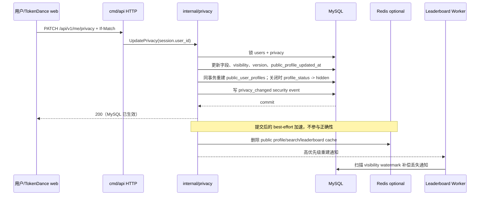

公共查询 SQL 以 `public_user_profiles.profile_status='published'` 为入口，并联结 `users.account_status='active'` 做第二道防线。Privacy 事务同步隐藏投影，因此即使 Redis 删除或榜单重建通知丢失，也不会泄露已关闭的用户。旧排行榜快照可能暂时出现名次空洞，新的 published 快照在目标 75 秒内替换；API 不为填洞而返回私密用户。

### 5.6 头像上传与对象生命周期

头像不能只保存一个外部 URL。`user_upload_objects` 记录上传意图、对象 key、MIME、大小、SHA-256、图片尺寸和状态；`users.avatar_object_id` 指向当前对象，既有 `avatar_url` 只保存由受信 CDN/object key 生成的稳定展示 URL。

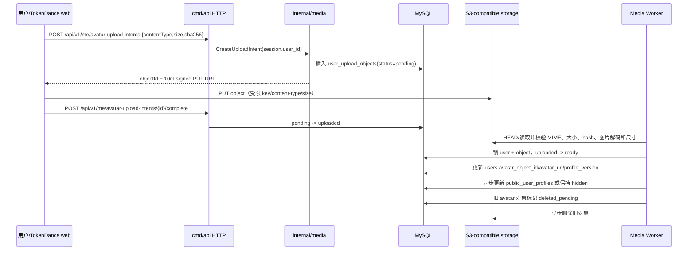

P0 只允许 `image/png`、`image/jpeg`、`image/webp`，最大 5 MiB、最大边长 4096、解码后像素数不超过 16M。客户端声明不可信；Worker 必须按 magic bytes 和真实解码结果复核。pending intent 10 分钟过期，失败/未完成对象 24 小时内清理。任何对象只有 `status=ready AND user_id=当前用户` 才能成为头像。

### 5.7 资料、隐私与媒体阶段的异步、锁、幂等、配置

| 类型 | 说明 |
| --- | --- |
| 异步 | 头像校验/旧对象清理、缓存清理、榜单重建；隐私事实提交是同步事务 |
| 锁 | 用户行 + privacy/projection 行；Handle 历史命中时额外锁目标历史行；切头像锁 object |
| 幂等 | `profile_version`/`privacy_version` 乐观并发；上传 complete 和对象删除按 object id 幂等 |
| 配置 | Handle 跳转 7 天/保留 30 天；头像 5 MiB/4096px/16M pixels；公开默认全部关闭 |

## 6、个人数据页与查询设计

### 6.1 查询事实源

| 页面能力 | 首选表 | 降级/补充 | 写入 owner |
| --- | --- | --- | --- |
| 核心指标、Agent 构成 | `daily_user_agent_metrics` | 时间边界用 `usage_events` 修正 | `internal/aggregate` |
| 模型/Agent Token 趋势 | `daily_user_agent_model_metrics` | 无模型筛选时用 agent 表 | `internal/aggregate` |
| Skill 排行榜 | `daily_skill_metrics` | 无 | `internal/aggregate` |
| 排名和变化 | `leaderboard_entries/snapshots` | 私密用户只返回可见性状态 | `internal/leaderboard` |
| 活跃日历 | 日聚合表 | 当日边界可查事件 | `internal/aggregate` |
| 最近同步 | `installations`、`ingest_batches`、`installation_adapter_status` | 无 | `internal/device/ingest` |
| P1 活动明细 | `usage_events` 的安全列 | 禁止返回 `safe_extension_json` 原值 | `internal/ingest` |

所有 `/api/v1/me/*` 查询的 `user_id` 只来自 Session context。请求体和 Query 中出现 `user_id` 一律忽略或返回 `API_FIELD_NOT_ALLOWED`。

### 6.2 十项核心指标口径

默认个人指标只纳入 `accuracy IN (exact, derived)` 的权威或可确定派生事件。UI 不展示“数据可信度”字段，但后端仍保留 accuracy 以防重复和错误合并；`estimated/correlated` 不静默混入主数值。

| 指标 | 公式 | 空值/边界 | 事实列 |
| --- | --- | --- | --- |
| 预估费用 | 同一模型请求优先 provider reported cost，否则使用已落事件的 estimated price cost；跨币种先按 USD 口径聚合 | 无可用价格返回 `null`，不显示 `$0` | `cost_amount/cost_currency/cost_source` |
| 总 Token | `exact_token_total + derived_token_total` | 无数据为 0 | 日聚合既有列 |
| 生成代码行 | `SUM(code_generated_lines)` | 只含 exact/derived；0 合法 | 日聚合既有列 |
| 单行 Token | `total_token / generated_code_lines` | 行数为 0 返回 `null` | 计算字段 |
| 输入上下文 | `token_input_total + token_cache_read_total` | 不支持分项时返回 `null`，不能用总 Token 代替 | 聚合扩展列 |
| 输出 Token | `SUM(token_output_total)` | 不支持时返回 `null` | 聚合扩展列 |
| 缓存命中率 | `cache_read / (uncached_input + cache_read)` | 分母为 0 返回 `null`；百分比保留 1 位 | 聚合扩展列 |
| 总时长 | 顶层 session active duration；缺失 session end 时按同一 session 的 turn duration fallback，二者不重复累加 | 返回毫秒和格式化值 | 聚合扩展列 |
| 总消息数 | 用户触发 `turn_started` 数 + 对应最终 `turn_completed` 数 | 工具调用和模型内部请求不算消息 | 聚合扩展列 |
| 用户消息数 | `turn_started` 且 `turn_trigger=user` 的去重 `turn_hash` 数 | 不把系统触发、重试、resume 算为用户消息 | 聚合扩展列 |

Token 归一化约定：`token_input_total` 只表示未命中缓存的输入，`token_cache_read_total` 单列；因此输入上下文等于两者之和。若上游 Provider 的 input 已包含 cached tokens，Adapter 必须先拆分或把分项置为 unknown，不能重复相加。

### 6.3 采集聚合兼容扩展

当前 `0001` 已有总 Token、成本、代码、会话、轮次和请求数，但不足以直接回答输入/输出、缓存、时长和消息数。以下是**采集/聚合 owner 的 schema 依赖**，不在用户系统迁移中重复建表：

| 既有表 | 需要扩展的列 | 目的 |
| --- | --- | --- |
| `usage_events` | `turn_trigger VARCHAR(16)` | 区分 user/system/automation/resume/unknown |
| `daily_user_agent_metrics` | `token_input_total`、`token_output_total`、`token_cache_read_total`、`token_cache_write_total`、`token_reasoning_total` | 十项指标和无模型趋势 |
| `daily_user_agent_metrics` | `active_duration_ms`、`message_count`、`user_message_count` | 时长和消息卡片 |
| `daily_user_agent_model_metrics` | 上述五个 Token 分项 | Agent + 模型组合筛选趋势 |

这些列初始 `NOT NULL DEFAULT 0` 只表示聚合尚未回填并不安全，因此 API 还必须根据 `aggregation_version` 判断支持度。迁移过程是：先 nullable 扩列 → Worker 双写 → 回填 → 提升 `aggregation_version` → API 开启字段 → 再按容量决定是否改为 NOT NULL。旧版本期间对应指标返回 `supported=false,value=null`。

### 6.4 时间范围与时区

- `today`、`7d`、`30d` 按 `users.timezone_name` 在 Go 中计算半开区间 `[startUTC,endUTC)`；SQL 统一使用 UTC 参数。
- 既有日聚合面向公共榜单，以 UTC 日期为稳定基础。个人查询先汇总完整 UTC 日，再对区间首尾不完整日期从 `usage_events` 修正，避免跨时区重复或漏算。
- 最近 31 天的本地日趋势允许在 `idx_usage_events_user_time` 限定范围后按已加载的 MySQL timezone table 分组；如果 `CONVERT_TZ` 不可用，服务启动健康检查失败，不能悄悄退回服务器时区。
- `all` 卡片使用日聚合；趋势按月下采样，首尾月做边界修正。单次自定义查询最长 366 天。
- 用户修改时区只影响之后的查询分桶，不改事件 UTC 时间，也不重写排行榜历史快照。

### 6.5 Token 趋势筛选

请求参数：

```text
range=today|7d|30d|all|custom
from=YYYY-MM-DD
to=YYYY-MM-DD
agent=all|<agent_id>
provider=all|<provider_id>
model=all|<model_id>
mode=total|structure
```

查询路由：

1. 没有 model/provider 筛选：读取 `daily_user_agent_metrics`；agent 可选。
2. 有 model/provider：读取 `daily_user_agent_model_metrics`；如果 agent=all，按日期汇总多个 Agent。
3. `mode=total` 返回 `tokenTotal`；`mode=structure` 返回 input/output/cacheRead/cacheWrite/reasoning。
4. 所有维度值必须来自用户自己已有数据的 distinct 列表；拒绝任意超长字符串和通配符。
5. 返回 `from/to/timezone/granularity/dataWatermarkAt/aggregationVersion`，使前端可解释刷新时间。

### 6.6 Skill 排行榜、构成和活跃日历

- 个人 Skill 排行榜按 `SUM(use_count) DESC, skill_key ASC` 排序，返回 `skillPublicName`、调用次数、成功次数、使用天数、总时长和上一等长周期变化。
- 登录用户可以看到自己的 `skill_public_name`；若名称为空，显示本地化占位符 `Private Skill` 和不可逆短 ID，不返回 `skill_key` 原值。
- Agent 构成按总 Token 计算占比；分母为 0 时所有占比返回 0，不制造 NaN。
- 活跃日历以本地日期存在任一合格事件为 active；强度按当天 Token 的用户自身分位数分 0–4 档，而不是跨用户绝对阈值。
- 最近同步取每个 active installation 的 `last_seen_at`、最近 committed/partial batch 和 adapter health；“待同步数量”只存在 Collector 本地 spool，服务端无事实时返回 unknown，不伪造 0。

### 6.7 个人查询泳道

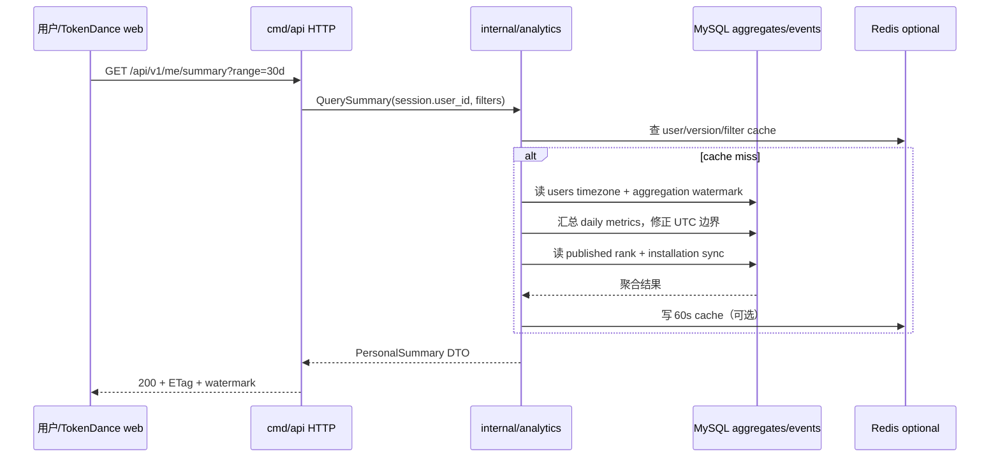

### 6.8 查询阶段的异步、锁、幂等、配置

| 类型 | 说明 |
| --- | --- |
| 异步 | 聚合和排行榜由既有 Worker 完成；个人 API 不触发同步重算 |
| 锁 | 纯查询不加业务锁；只读取 published snapshot 和已提交 aggregate watermark |
| 幂等 | GET 由规范化 filter hash 和 ETag 保证可重放；相同快照分页稳定 |
| 配置 | summary 60s、trend 120s、breakdown 300s cache；自定义范围 ≤366 天；page size ≤100 |

### 6.9 预估费用的稳定性与一致性

本系统只展示历史使用的预估成本，不扣款、不记账，也不是 Provider 发票。

| 关注点 | 设计/边界 |
| --- | --- |
| 数据一致性 | `usage_events.cost_amount/cost_source` 是展示事实；provider reported 优先，price table 估算不得与其重复相加 |
| 幂等防重 | 沿用 `(installation_id,event_id)` 和 aggregate watermark；重扫不重复增加费用 |
| 并发控制 | 聚合 Worker 的 `source_max_event_pk` 保证重算可重复；查询只读已提交版本 |
| 异步健壮性 | 价格缺失返回 null；补齐价格后通过新 `aggregation_version` 重算，不就地篡改旧榜快照 |
| 失败语义 | 混合币种、未知价格或精度不足时不返回伪造美元 0；响应携带 `costStatus` |
| 对账修复 | 可按 user/date/model 重算并对比事件 cost 合计；差异超过阈值告警 |
| 可观测性 | unknown price model、cost source 分布、重算差异、currency mismatch 指标 |

## 7、公开主页、搜索与排行榜

### 7.1 公共 DTO 白名单

`PublicProfile` 的资料字段只来自 `public_user_profiles`，指标字段再按投影中的公开开关从聚合表选择：

```text
handle, displayName, avatarUrl, bio,
rank, rankDelta, percentile,
tokenTotal, activeDays, currentStreak,
tokenTrend[], activityCalendar[], agentBreakdown[], skillRanking[],
dataWatermarkAt, generatedAt
```

公共接口永不包含：`user_id`、邮箱、timezone、locale、installation、session/turn/tool hash、真实 `skill_key`、设备贡献、事件明细、`safe_extension_json`、内部 accuracy 或风控原因。公开主页的 model/agent 筛选只能作用于已经允许公开的 Token 趋势，不扩大字段集合。

### 7.2 公开主页查询

`GET /api/v1/public/users/{handle}` 流程：

1. 将 Handle 归一化为小写并做格式校验。
2. 精确查询 `public_user_profiles.handle`；无当前记录时查询仍在 `redirect_until` 的 `user_handle_history` 并返回 308 到新的公开投影。
3. SQL 要求 `public_user_profiles.profile_status=published`，并联结 `users.account_status=active` 做防御性复核。
4. 读取投影中的公开开关，只查询允许公开的聚合分支；例如 `show_skill_ranking=false` 时不执行 Skill SQL。
5. 公开 Token 趋势支持 `range/agent/provider/model`，但自定义范围最长 366 天。
6. ETag 使用 `projection_version:aggregate_watermark:filter_hash`，关闭公开或修改资料后投影版本递增，旧 ETag 不可命中。

不存在、已关闭、suspended、deletion_pending 和 deleted 均返回同一 `404 PUBLIC_PROFILE_NOT_FOUND`，避免暴露账户状态。

### 7.3 全站搜索

P0 搜索分组为 Users 和 Agents，P1 增加 Skills；不会把不同实体混成一张列表。

| 分组 | 查询 | 公开过滤 | 排序 |
| --- | --- | --- | --- |
| Users | `public_user_profiles` 的 Handle 精确/前缀、昵称前缀 | `profile_status=published` + user active | Handle 精确、Handle 前缀、昵称前缀、公开 rank |
| Agents | 已知 `agent_id` catalog | 只返回系统支持项 | 匹配度、近 30 天公开活跃 |
| Skills（P1） | `skill_public_name` 前缀 | 用户允许公开 + 名称非空 + 最少 5 个公开用户/3 个活跃日 | 匹配度、公开 use count |

P0 使用 MySQL 索引和前缀搜索，不承诺任意子串、拼音或模糊纠错。达到任一阈值后再引入专用搜索引擎：公开用户超过 100 万、P95 搜索超过 200 ms、或产品要求中日韩分词/模糊搜索。搜索索引只能接收 Public DTO，不得复制完整用户行。

### 7.4 排行榜高级查询

最新产品要求已经移除用户可见的“数据可信度”，因此高级查询不再暴露 Accuracy 筛选；服务端仍使用内部 accuracy 口径生成权威数据。

允许参数：

```text
window=today|7d|30d|all|custom
metric=tokens|sessions|turns|tools|skills|code_lines
agent=all|<agent_id>
q=<handle-or-display-name-prefix>
from/to=<custom only>
snapshot=<optional immutable snapshot id>
cursor=<opaque>
limit=1..100
```

查询分两类：

- 标准窗口 + all agents + 标准 metric：复用 `leaderboard_snapshots/entries`，只读 `snapshot_status=published`。
- 自定义日期或单 Agent：从 `daily_user_agent_metrics` 受控聚合，强制公共隐私联结、范围 ≤366 天、结果上限 10,000，Redis 缓存规范化 filter hash 60 秒。

标准榜分页 cursor 固定包含 `snapshot_id + rank_no`，新快照发布不改变正在浏览页面。高级实时榜 cursor 包含 `metric_value + user_id + filter_hash + watermark`，watermark 变化时返回 `409 QUERY_WATERMARK_CHANGED`，前端从第一页刷新，避免翻页重复。

### 7.5 隐私变化与榜单发布泳道

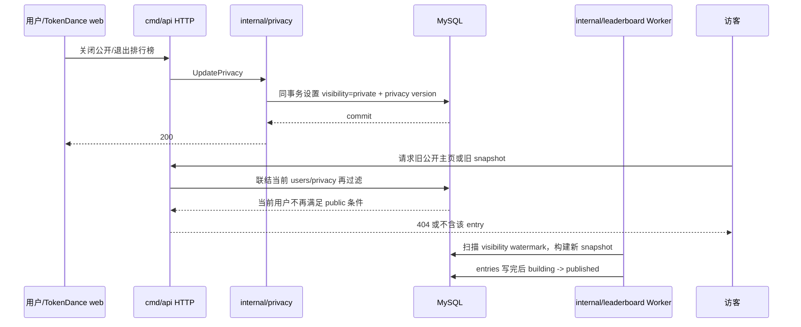

### 7.6 用户比较（P1）

- 最多 3 个公开 Handle，统一 range、metric、agent/model 口径。
- 每个用户独立应用隐私设置；隐藏项返回 `{visible:false}`，不能返回 0。
- 比较请求不会暴露某用户关闭的维度列表，也不允许通过差分查询推断私密值。
- 响应包含每个用户自己的 data watermark；差异超过 5 分钟时前端提示数据更新时间，不做伪同步。

### 7.7 公开查询阶段的异步、锁、幂等、配置

| 类型 | 说明 |
| --- | --- |
| 异步 | 榜单标准快照由既有 scheduler 发布；搜索热度统计异步且不影响结果 |
| 锁 | GET 不加业务锁；快照发布沿用 building→published 的 MySQL 原子事务 |
| 幂等 | snapshot cursor 不变；高级查询由 filter hash + watermark 确定 |
| 配置 | 用户搜索 limit 20/组；榜单 limit 100；自定义范围 366 天；Skill 公共阈值 P1 开启 |

## 8、Collector 设备绑定与管理

### 8.1 复用 `installations`

设备身份继续使用既有 `installations`：Collector 本地生成 Ed25519 密钥对，私钥只在 OS 密钥库，服务端保存 32 字节公钥。用户系统不创建另一张 device 表。

设备页读取：

- `installation_id` 仅在登录用户自己的设备 API 内作为 opaque id 返回，公共接口永不返回。
- `device_name`、`os_type`、`os_version`、`architecture`、`collector_version`。
- `installation_status`、`registered_at`、`last_seen_at`。
- `disabled_at`、`disabled_reason` 和 `status_version`，用于明确区分用户暂停、策略禁用和永久撤销。
- `installation_adapter_status` 的汇总健康状态。
- 最近 committed/partial `ingest_batches` 的接收时间和安全错误码。

### 8.2 两种注册入口

1. 既有 `POST /v1/installations/register`：Collector 已能打开系统浏览器并拿到短期用户授权时，使用受限 bearer token 绑定公钥。
2. 新增 `POST /v1/installations/claim`：用户在 Web 创建 8 位绑定码，Collector 只提交绑定码、公钥和设备元数据；适合桌面端无 Web Session 的场景。

两种入口最终调用同一个 `internal/device.RegisterInstallationTx`，执行相同的用户状态、公钥唯一性、OS 枚举和版本校验。

### 8.3 一次性绑定流程

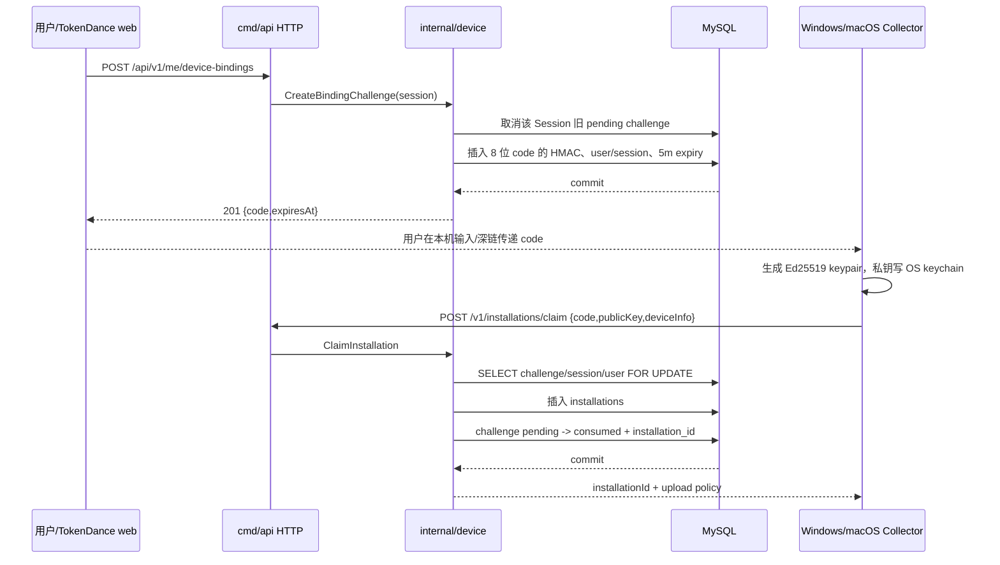

绑定码使用不易混淆的 Crockford Base32 8 字符，约 40 bit 熵；服务端存 `HMAC(binding_key, normalized_code)` 并做全局唯一。默认 5 分钟有效、单次使用、同一 Session 只有一个 pending code。claim 端按 IP 和 code hash 限流，连续 10 次失败冻结该 IP 15 分钟。

如果同一公钥已经绑定当前用户且 installation active，重复 claim 幂等返回原 installation；若绑定其他用户或已经 revoked，返回 `DEVICE_PUBLIC_KEY_CONFLICT`，绝不转移归属。

### 8.4 改名、暂停、恢复与撤销

- 改名：`PATCH /api/v1/me/devices/{id}`，只允许当前 Session 用户拥有的 installation，`device_name` 1–120 字符。
- 暂停：`POST /api/v1/me/devices/{id}/pause` 在事务中执行 `active -> disabled`，写 `disabled_at`、`disabled_reason=user_paused`、`status_version+1`。Ingest 返回 403 `DEVICE_DISABLED`，但历史数据和设备记录保留。
- 恢复：`POST /api/v1/me/devices/{id}/resume` 只允许 `disabled + disabled_reason=user_paused` 且账户 active，执行 `disabled -> active` 并清空 disabled 字段；策略禁用必须由策略 owner 解除。
- 撤销：`DELETE /api/v1/me/devices/{id}` 在事务内设置 `installation_status=revoked` 和 `revoked_at`，并清理 Redis nonce/session cache。
- Ingest 验签后、写 batch 前必须重新校验 installation active 和 user active；已撤销设备返回 403 `DEVICE_REVOKED`。
- 撤销不自动删除历史事件。用户需要删除设备历史时另建 `deletion_scope=installation` 的既有删除请求；Worker 只删除目标 installation 的事件与 ingest/device 残留，并从其他 installation 的存活事件确定性重建该用户聚合，不得删除其他 installation 的事实或聚合贡献。

设备状态语义固定如下，Web 不再用“离线”代替暂停：

| `installation_status` | 含义 | 能否恢复 | Ingest |
| --- | --- | --- | --- |
| `active` | 正常注册，可上传；是否在线由 `last_seen_at` 派生 | 不适用 | 接受 |
| `disabled` | 明确暂停/策略禁用 | 按 `disabled_reason` 决定 | `DEVICE_DISABLED` |
| `revoked` | 凭据永久撤销 | 否，只能重新注册新 installation | `DEVICE_REVOKED` |

### 8.5 设备阶段的异步、锁、幂等、配置

| 类型 | 说明 |
| --- | --- |
| 异步 | 撤销后的 nonce/cache 清理 best-effort；Ingest 每次查事实状态保证正确性 |
| 锁 | claim 锁 challenge；插入 installation 依赖公钥唯一键；pause/resume/revoke 锁目标 installation |
| 幂等 | code consumed、public key unique；重复 pause/resume/revoke 返回当前状态，不重复递增 version |
| 配置 | code TTL 5m；每 Session 一个 pending；claim body ≤16 KiB；Collector version 最小值来自既有 policy |

## 9、数据导出、删除与注销

### 9.1 CSV 导出范围（P1）

导出仅包含当前用户可在产品页看到的安全聚合：日期、Agent、Provider、模型、Token 分项、会话/轮次/消息数、Skill 公共显示名、代码行、时长和预估费用。禁止导出 Prompt、回复、Reasoning、代码正文、工具参数、真实路径、环境变量、session/turn/tool hash 和 `safe_extension_json`。

`POST /api/v1/me/exports` 必须带 `Idempotency-Key`，请求体包含 scope、range、filters、format。API 规范化请求后写 `request_hash`；同一用户和 idempotency key：

- hash 相同：返回原任务。服务端在插入前用当前 idempotency keyring 的全部 active 版本计算紧凑 `v<version>:<base64url-hmac>` 候选，并在同一用户行锁内比较，因此跨密钥轮换的重试仍返回原任务；数据库只保存命中的单个紧凑值。
- hash 不同：返回 409 `IDEMPOTENCY_KEY_REUSED`。

### 9.2 导出泳道

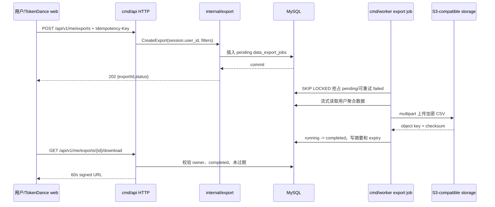

导出文件默认 24 小时过期，Worker 删除对象后把任务改为 expired。数据库永远不存签名 URL，只存不可公开的 object key。

### 9.3 删除请求与账户注销

复用 `data_deletion_requests`，不创建第二张删除任务表。三种流程：

| scope | 行为 | 账户状态 |
| --- | --- | --- |
| `installation` | 删除指定设备产生的事件并重算聚合/榜单 | 不变 |
| `time_range` / `all_usage` | 删除对应 usage，保留账户 | 不变，但公开相关数据先隐藏至重算完成 |
| `account` | 进入 7 天撤销窗口，随后去标识化账户并删除数据 | active → deletion_pending → deleted |

账户注销发起事务必须：创建 pending request、写 `cancel_before=now+7d`、将账户设 deletion_pending、visibility 设 private、将 `public_user_profiles` 同步置 hidden、撤销其他 Sessions 和所有 pending binding challenge。当前 Session 仅允许读取/取消注销和退出。

### 9.4 注销泳道

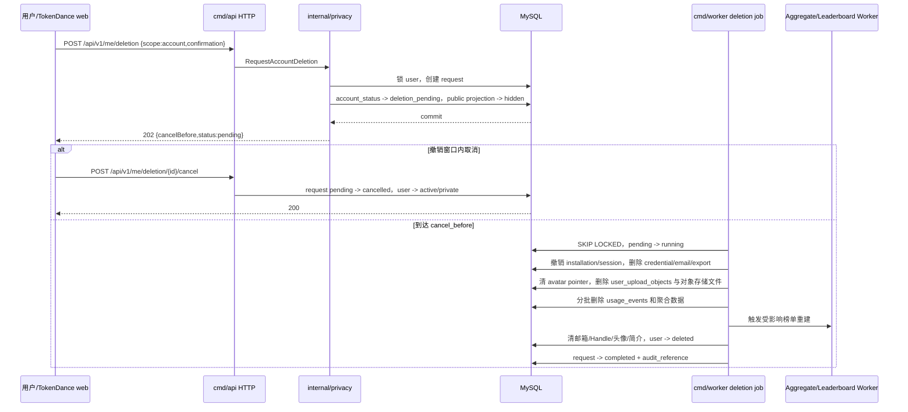

删除大表不使用一个覆盖全部事件的长事务。Worker 以 `event_pk` 每批 5,000 行删除，记录安全进度，并在每批后重试可恢复；对外状态在所有明细、聚合、榜单、导出文件和凭据处理完成前保持 running。用户行保留为无 PII tombstone 以维持 FK 和删除审计：邮箱 hash/cipher、Handle、头像、简介清空，昵称改为 `Deleted user`，状态 deleted。

Handle 历史最多保留 30 天用于防链接劫持，公开路由对 deleted 用户始终 404；保留期到达后删除历史明文。安全审计按策略去除 user FK 或哈希化后最多保留 180 天。

### 9.5 删除与导出的异步、锁、幂等、配置

| 类型 | 说明 |
| --- | --- |
| 异步 | 导出、对象删除、usage 批量删除、聚合重算、榜单发布均由 Worker |
| 锁 | 创建 account deletion 时锁 user；Worker 使用 `FOR UPDATE SKIP LOCKED` 条件抢占；`claim_token + claim_generation + locked_by` 对所有 phase/cursor/完成写入做 fencing |
| 租约 | `lease_expires_at` 与重试时间全部由 MySQL `CURRENT_TIMESTAMP(3)` 计算；仅 pending 到期、failed 到重试时间或 lease 过期的 running 可被接管 |
| 幂等 | 每用户最多一个 active account deletion；删除步骤按 `phase + progress_cursor` 重放；对象 key 先持久化到 `deletion_object_keys`，删除成功后才清源记录 |
| 配置 | 注销撤销 7d；删除 lease 2 分钟并在对象操作前续租；失败保留 failed checkpoint、退避后在原 request 重试 |

### 9.6 数据资产稳定性与一致性

| 关注点 | 设计/边界 |
| --- | --- |
| 数据一致性 | MySQL request 是任务事实源；对象存储只保存导出物；account 状态先阻断公开和新写入 |
| 幂等防重 | active deletion 生成唯一键；export idempotency 唯一；每个删除 phase 保存 checkpoint |
| 并发控制 | user 行锁阻止重复注销/公开变更；取消与 claim 锁同一 request 行；所有 worker 写入携带 claim fence；Ingest 同步校验 user/installation 状态 |
| 异步健壮性 | Worker 可接管 lease 过期的 running；旧 worker 的 phase/cursor/completed 写入影响 0 行；删除和对象清理分阶段重试 |
| 失败语义 | 任一 DB 或对象存储操作失败都不得标 completed；保持 running 至租约接管，或条件写 failed 并从原 cursor 重试；账户继续不可公开 |
| 对账修复 | credentials、sessions、challenge/outbox、device/event、三类 aggregate、leaderboard、export/upload 对象与 key、public projection 和 PII 的 required residual 全为 0 后才能 completed |
| 可观测性 | job age、phase latency、remaining rows、object deletion failure、stuck deletion 告警 |

## 10、HTTP API 设计

### 10.1 通用协议

- Base path：用户 Web API 使用 `/api/v1`；Collector 设备协议沿用 `/v1`。
- Content-Type：`application/json; charset=utf-8`；上传头像和导出下载使用专门 URL。
- 时间：RFC 3339 UTC，例如 `2026-08-30T12:00:00.000Z`；用户日期为 `YYYY-MM-DD`。
- 大整数：Token、代码行、消息数、时长在 JSON 中使用十进制字符串，防止 JavaScript 53 bit 精度丢失。
- 金额：`{"amount":"1428.60000000","currency":"USD","status":"estimated"}`，禁止 float。
- Request ID：接收合法 `X-Request-Id` 或生成 ULID，响应和结构化日志都返回。
- 写请求：JSON body 默认 ≤64 KiB；设备 claim ≤16 KiB；未知字段返回 400，避免客户端拼错后静默忽略。
- 版本并发：Profile/Privacy PATCH 使用 `If-Match: "<version>"`，冲突返回 412。
- Idempotency：异步创建接口使用 1–64 字符 `Idempotency-Key`，只允许 ASCII 字母、数字、`-_.:`。

成功响应直接返回资源；错误统一为：

```json
{
  "error": {
    "code": "AUTH_INVALID_CREDENTIALS",
    "messageKey": "auth.invalidCredentials",
    "requestId": "req_01...",
    "details": {}
  }
}
```

后端返回稳定 `messageKey`，Web 根据 `locale` 渲染中英文；后端不通过自然语言消息传递业务分支。

### 10.2 Authentication API

| 方法 | 路径 | 认证 | 主要输入 | 成功 |
| --- | --- | --- | --- | --- |
| POST | `/api/v1/auth/register/code` | 无 | email、locale | 202 |
| POST | `/api/v1/auth/register` | 无 | email、code、password、returnTo | 201 + Cookie |
| POST | `/api/v1/auth/login` | 无 | email、password、returnTo | 200 + Cookie |
| GET | `/api/v1/auth/session` | 可选 | 无 | 200 SessionUser / 204 |
| POST | `/api/v1/auth/logout` | Session+CSRF | 无 | 204 + 清 Cookie |
| GET | `/api/v1/auth/sessions` | Session | cursor、limit | Session 列表 |
| DELETE | `/api/v1/auth/sessions/{id}` | Session+CSRF | 目标 Session | 204 |
| POST | `/api/v1/auth/sessions/revoke-others` | Session+CSRF | 无 | 204 |
| POST | `/api/v1/auth/password/code` | 无 | email | 202 |
| POST | `/api/v1/auth/password/reset` | 无 | email、code、newPassword | 204 |

`GET /auth/session` 返回：

```json
{
  "authenticated": true,
  "user": {
    "handle": "maxbauer",
    "displayName": "Max Bauer",
    "avatarUrl": null,
    "locale": "en-US",
    "onboardingRequired": false,
    "productState": "active_private"
  },
  "csrfToken": "opaque",
  "idleExpiresAt": "2026-09-13T12:00:00.000Z",
  "absoluteExpiresAt": "2026-09-29T12:00:00.000Z"
}
```

### 10.3 Profile 与 Privacy API

| 方法 | 路径 | 用途 |
| --- | --- | --- |
| POST | `/api/v1/me/onboarding` | 首次建档，一次性完成资料与默认隐私 |
| GET | `/api/v1/me/profile` | 当前用户完整可编辑资料 |
| PATCH | `/api/v1/me/profile` | 昵称、Handle、头像、简介、时区、locale |
| GET | `/api/v1/me/privacy` | 公开主页和字段开关 |
| PATCH | `/api/v1/me/privacy` | 乐观并发更新隐私和排行榜参与 |
| GET | `/api/v1/me/public-preview` | 用当前或待提交隐私生成本人可见预览 |
| POST | `/api/v1/me/avatar-upload-intents` | 创建头像直传意图和短期 PUT URL |
| POST | `/api/v1/me/avatar-upload-intents/{id}/complete` | 标记上传完成并进入服务端校验 |
| DELETE | `/api/v1/me/avatar` | 清除当前头像并异步删除对象 |

Privacy PATCH 示例：

```json
{
  "publicProfileEnabled": true,
  "leaderboardVisibility": "public",
  "showBio": true,
  "showTokenTotal": true,
  "showTrends": true,
  "showActivityCalendar": true,
  "showAgentBreakdown": true,
  "showSkillRanking": false,
  "showAchievements": false
}
```

### 10.4 Personal Analytics API

| 方法 | 路径 | 用途 |
| --- | --- | --- |
| GET | `/api/v1/me/summary` | 十项卡片、排名、最近同步 |
| GET | `/api/v1/me/trends/tokens` | 按日期、Agent、模型 Token 趋势 |
| GET | `/api/v1/me/breakdowns/agents` | Agent 构成 |
| GET | `/api/v1/me/breakdowns/models` | 模型构成 |
| GET | `/api/v1/me/skills` | 个人 Skill 排行榜 |
| GET | `/api/v1/me/calendar` | 活跃日历 |
| GET | `/api/v1/me/activity` | P1 安全聚合明细 |
| GET | `/api/v1/me/filter-options` | 当前用户可选 Agent/provider/model |

`GET /me/summary?range=30d` 示例：

```json
{
  "range": {
    "key": "30d",
    "from": "2026-08-01T16:00:00.000Z",
    "to": "2026-08-30T16:00:00.000Z",
    "timezone": "Asia/Shanghai"
  },
  "metrics": {
    "estimatedCost": {"amount": "1428.60000000", "currency": "USD", "supported": true},
    "totalTokens": {"value": "325700000", "supported": true},
    "generatedCodeLines": {"value": "864200", "supported": true},
    "tokensPerCodeLine": {"value": "376.88", "supported": true},
    "inputContextTokens": {"value": "184600000", "supported": true},
    "outputTokens": {"value": "78300000", "supported": true},
    "cacheHitRate": {"value": "0.386", "supported": true},
    "activeDurationMs": {"value": "1737360000", "supported": true},
    "messageCount": {"value": "42800", "supported": true},
    "userMessageCount": {"value": "18400", "supported": true}
  },
  "ranking": {"visibility": "private", "rank": null, "delta": null, "percentile": null},
  "sync": {"lastCommittedAt": "2026-08-30T15:59:22.000Z", "pendingLocalCount": null},
  "dataWatermarkAt": "2026-08-30T15:59:30.000Z",
  "aggregationVersion": 2
}
```

`supported=false` 与 `value=null` 表示采集源或 aggregate version 尚不支持；真正的零值使用字符串 `"0"`，前端必须区分。

### 10.5 Device、Export 与 Deletion API

| 方法 | 路径 | 用途 |
| --- | --- | --- |
| GET | `/api/v1/me/devices` | 当前用户设备及安全同步状态 |
| POST | `/api/v1/me/device-bindings` | 创建 5 分钟一次性绑定码 |
| DELETE | `/api/v1/me/device-bindings/{id}` | 取消未使用绑定码 |
| PATCH | `/api/v1/me/devices/{id}` | 修改设备名 |
| POST | `/api/v1/me/devices/{id}/pause` | 用户暂停同步，状态变为 disabled |
| POST | `/api/v1/me/devices/{id}/resume` | 恢复 user_paused 设备 |
| DELETE | `/api/v1/me/devices/{id}` | 撤销设备 |
| POST | `/v1/installations/claim` | Collector 使用绑定码注册 |
| POST | `/v1/installations/register` | 沿用短期用户授权注册 |
| POST | `/api/v1/me/exports` | P1 创建导出 |
| GET | `/api/v1/me/exports` | P1 导出列表 |
| GET | `/api/v1/me/exports/{id}` | P1 导出状态 |
| GET | `/api/v1/me/exports/{id}/download` | P1 生成短期下载 URL |
| POST | `/api/v1/me/deletion-requests` | 创建 usage/installation/account 删除请求 |
| GET | `/api/v1/me/deletion-requests/{id}` | 查询状态 |
| POST | `/api/v1/me/deletion-requests/{id}/cancel` | 仅 pending account deletion 可取消 |

### 10.6 Public API

| 方法 | 路径 | 用途 |
| --- | --- | --- |
| GET | `/api/v1/public/users/{handle}` | 公开主页 |
| GET | `/api/v1/public/users/{handle}/trends` | 允许公开的 Token 趋势 |
| GET | `/api/v1/public/users/{handle}/skills` | 允许公开的 Skill 排行榜 |
| GET | `/api/v1/public/search` | 分组搜索 |
| GET | `/api/v1/public/leaderboards` | 标准/高级排行榜 |
| GET | `/api/v1/public/compare` | P1 最多三个公开用户 |

Public API 使用 IP/token bucket 限流、响应缓存和参数白名单，不使用浏览器 Session 作为可见性扩大依据；登录用户访问他人公开页与访客结果相同。

### 10.7 分页与错误码

Cursor 是 base64url 编码、服务端 HMAC 签名的 JSON，至少包含 `kind/filterHash/watermark/sortValue/tieBreaker/exp`。客户端不得构造或修改；签名错误返回 400 而非 500。

| HTTP | 错误码 | 场景 |
| --- | --- | --- |
| 400 | `API_INVALID_ARGUMENT` | 格式、范围、未知字段错误 |
| 401 | `AUTH_REQUIRED` | 无 Session 或已过期 |
| 401 | `AUTH_INVALID_CREDENTIALS` | 邮箱/密码不正确，统一响应 |
| 403 | `ACCOUNT_ACTION_NOT_ALLOWED` | suspended/deletion pending 路由受限 |
| 403 | `CSRF_VALIDATION_FAILED` | CSRF/Origin 检查失败 |
| 404 | `PUBLIC_PROFILE_NOT_FOUND` | 公共用户不存在或不可见 |
| 404 | `RESOURCE_NOT_FOUND` | 当前用户不拥有目标设备/任务，同样避免越权枚举 |
| 409 | `PROFILE_HANDLE_TAKEN` | Handle 唯一冲突 |
| 409 | `IDEMPOTENCY_KEY_REUSED` | 同 key 不同 body |
| 409 | `QUERY_WATERMARK_CHANGED` | 高级榜翻页期间数据版本变化 |
| 412 | `VERSION_CONFLICT` | If-Match 版本落后 |
| 429 | `RATE_LIMITED` | 发送、验证、登录、公开查询限流 |
| 503 | `DEPENDENCY_UNAVAILABLE` | MySQL/必要时区数据不可用；带 Retry-After |

## 11、MySQL 数据模型详细设计

### 11.1 基线与命名

- 数据库使用统一后的 `tokendance` schema；0001、0002、0003 迁移均显式选择该 schema。
- 新业务 ID 沿用 4 字符前缀 + 26 字符 ULID、ASCII `CHAR(30)`：`ses_`、`ech_`、`eml_`、`dbc_`、`sev_`、`exp_`。
- 所有时间写 UTC `DATETIME(3)`；连接强制 `SET time_zone='+00:00'`。
- 用户输入文本使用 schema 默认 `utf8mb4_0900_ai_ci`；token、状态、Handle、对象 key 等协议字段显式使用 ASCII collation。
- 所有 bool 使用 `BOOLEAN NOT NULL`；CHECK 作为数据库最后防线，业务枚举仍由 Go 类型校验。
- 认证密钥版本、KMS key version 和 Argon2 参数必须可轮换，不把密钥或验证码明文放入 JSON。

### 11.2 既有 `users` 的扩展

| 新列 | 类型 | 说明 |
| --- | --- | --- |
| `handle` | `VARCHAR(32) ascii_bin NULL` | 首次建档前为空；归一化小写；唯一 |
| `email_verified_at` | `DATETIME(3) NULL` | 邮箱验证完成时间；存量未知来源用户允许为空，邮箱注册用户必须非空 |
| `bio` | `VARCHAR(280) NULL` | 纯文本简介 |
| `avatar_object_id` | `CHAR(30) ascii_bin NULL` | 当前 ready 头像对象的逻辑引用；与 `user_upload_objects` 由事务校验 |
| `locale` | `VARCHAR(10) ascii_bin NOT NULL DEFAULT 'en-US'` | `zh-CN/en-US` |
| `onboarding_completed_at` | `DATETIME(3) NULL` | 产品 new 状态判定 |
| `profile_version` | `BIGINT UNSIGNED NOT NULL DEFAULT 1` | Profile 乐观并发和 cache key |
| `public_profile_updated_at` | `DATETIME(3) NULL` | 公开投影/榜单补偿扫描 watermark |

同时把 `account_status` CHECK 从 `active/suspended/deleted` 扩展为 `active/suspended/deletion_pending/deleted`。迁移先允许 `handle=NULL`，现有用户通过离线任务补建档；不能用邮箱自动生成 Handle。

### 11.3 `user_password_credentials`

| 字段 | 约束 | 说明 |
| --- | --- | --- |
| `user_id` | PK、FK `users ON DELETE CASCADE` | 一用户一个本地密码凭据 |
| `password_hash` | NOT NULL | Argon2id PHC 字符串 |
| `password_algorithm` | CHECK `argon2id` | 为后续算法迁移保留 |
| `credential_version` | NOT NULL | 改密递增，Session 签发时快照 |
| `failed_login_count` | NOT NULL | 连续失败计数 |
| `locked_until` | nullable | 临时锁定，不等于账户 suspended |
| `password_changed_at` | NOT NULL | 安全页展示和审计 |

密码校验成功后若当前参数低于配置，登录事务内 CAS 更新为新 hash，但不改变用户密码语义。

### 11.4 `user_sessions`

| 字段 | 关键约束 | 说明 |
| --- | --- | --- |
| `session_id` | PK | 对外设备会话 ID |
| `user_id` | FK、查询索引 | Session owner |
| `session_token_hash` | UK BINARY(32) | Cookie token HMAC |
| `csrf_token_hash` | BINARY(32) | 同源写请求 CSRF |
| `credential_version` | NOT NULL | 与 credential 当前版本比对 |
| `session_status` | active/revoked/expired | 生命周期 |
| `device_label` | nullable | 安全页可读标签，不可信输入需转义 |
| `user_agent_hash`、`ip_prefix_hash` | nullable | 风控哈希，不存原始 UA/IP |
| `idle_expires_at`、`absolute_expires_at` | 索引 | 双过期时间 |
| `revoked_at/revoke_reason` | nullable | 撤销审计 |

`revoke_reason` 允许 `logout/logout_others/password_reset/security/admin/account_deletion/session_limit`。

### 11.5 `email_challenges` 与 `email_outbox`

`email_challenges` 在用户创建前也存在，所以 `user_id` 可空；注册成功或密码重置时关联用户。`active_email_lookup_hash` 是生成列，仅 pending 时等于 lookup hash，配合 `(challenge_type, active_email_lookup_hash)` 唯一键保证每种用途只有一个活动挑战。

`email_outbox` 中收件人和模板变量使用 KMS envelope encryption。Worker 解密只存在内存，发送后尽快清空 `payload_ciphertext`；保留 provider message id、状态和安全错误码用于对账。

### 11.6 `user_privacy_settings` 与 `user_handle_history`

`user_privacy_settings` 与 `users` 一对一，所有开关默认 false。`users.leaderboard_visibility` 是既有排行榜事实，不能在 privacy 表重复一份可冲突字段；Privacy service 在同一事务更新两表。

`user_handle_history.handle` 是归一化旧 Handle 主键。其 plaintext 只为短期跳转/保留所需；`redirect_until <= reserved_until`，过期由 Worker 删除。

### 11.7 `public_user_profiles`

这是公共资料的强类型安全投影，而不是另一份账户事实：

| 字段 | 说明 |
| --- | --- |
| `user_id` | PK/FK，投影 owner |
| `handle` | 唯一公开路由和搜索 key |
| `display_name/avatar_url/bio` | 仅已允许公开的资料；`show_bio=false` 时 bio 必须为 NULL |
| `profile_status` | `published/hidden`；公共 API 只读 published |
| 七个 `show_*` | 指标公开开关的公共副本，只控制聚合分支是否可读 |
| `source_profile_version/source_privacy_version` | 证明投影对应的私有事实版本 |
| `projection_version` | 每次重建递增，用于 ETag/cache key |

Profile、Privacy、Suspend 和 Deletion 路径必须在同一 MySQL 事务同步更新/隐藏投影。异步 Worker 只做对账修复：扫描 `source_*_version` 不一致并重建，不能承担“关闭公开”的第一道防线。

### 11.8 `user_upload_objects`

记录用户头像上传对象的完整生命周期：

| 字段 | 说明 |
| --- | --- |
| `object_id/user_id` | 对象 ID 和 owner；user FK 使用 RESTRICT，注销流程先清对象 |
| `object_type` | P0 仅 `avatar` |
| `object_key` | 由服务端生成并唯一，格式 `users/<user_id>/avatars/<object_id>` |
| `content_type/byte_size/content_sha256` | 服务端 HEAD/解码后的真实值 |
| `image_width/image_height` | 解码尺寸，阻止像素炸弹 |
| `upload_status` | `pending/uploaded/ready/rejected/deleted_pending/deleted` |
| `expires_at` | pending/uploaded 清理时间 |
| `last_error_code` | 安全错误码，不保存第三方响应正文 |

`users.avatar_object_id` 不建反向 FK，避免循环删除路径；Repository 必须验证 object owner + ready 后才能切换当前头像。

### 11.9 `device_binding_challenges`

表保存一次性 code HMAC、创建用户、授权 Session、过期时间和最终 installation。`active_session_key` 是由事务显式维护的唯一槽：pending 时等于 `session_id`，进入终态时置空，CHECK 校验状态映射，唯一键确保同一 Session 只有一个活动码。这里不使用依赖 FK 列的生成列，因为 MySQL 会限制其与 `ON DELETE CASCADE` 组合。Session 失效、账户状态非 active 或首次建档未完成都不能 claim。

### 11.10 `user_security_events`

这是追加写审计，不是通用日志：

- `event_type` 示例：`registration_completed/login_succeeded/login_failed/password_reset/session_revoked/onboarding_completed/profile_changed/privacy_changed/device_bound/device_revoked/export_created/deletion_requested/deletion_cancelled`。
- `outcome` 仅 `success/denied/failure`。
- `metadata_json` 只允许注册过的低敏标量，例如 revoke reason、目标 session 短 ID；禁止邮箱、验证码、token、IP、UA、密码参数和请求 body。
- `user_id/session_id` 使用 `ON DELETE SET NULL`，使去标识化后仍可保留有限安全事实。

### 11.11 `data_export_jobs`

| 字段 | 说明 |
| --- | --- |
| `idempotency_key` + `user_id` | 复合唯一，保证 API 重试 |
| `request_hash` | 规范化 scope/filter/format 的 SHA-256 |
| `filter_json` | 仅允许服务端验证后的筛选 DTO，不允许任意 SQL 或字段名 |
| `job_status` | pending/running/completed/failed/expired/cancelled |
| `attempt_count/next_attempt_at/locked_at/locked_by` | Worker 抢占和重试 |
| `object_key/file_sha256/file_size` | 完成后对象事实；不存签名 URL |
| `expires_at` | 文件过期时间 |

### 11.12 既有 `data_deletion_requests` 扩展

增加：

- `cancel_before`：account scope 撤销窗口。
- `cancelled_at`：取消时间。
- `scope_filter_json`：time_range 等经过校验的安全范围。
- `phase`、`progress_cursor`：大表分阶段/分批恢复。
- `claim_token`、`claim_generation`、`locked_by`、`lease_expires_at`：durable claim 与 fencing；running 必须同时持有完整 claim，非 running 必须全部为空。
- `attempt_count`、`next_attempt_at`、`last_error_code`、`updated_at`：失败保留 checkpoint 并按数据库时间重试。
- `deletion_object_keys`：持久化 export/upload object key、对象删除状态和错误；源 DB 行仅在所有 key 已成功删除后清理。
- `active_account_key` 显式唯一槽：仅 account + pending/running/failed 时写 `user_id`，终态置空；failed 继续视为未完成并在原 request 上修复。CHECK 强制活动/终态下的非空映射，唯一键负责并发防重。它不使用生成列，也不在 CHECK 中直接比较 `user_id`，因为 MySQL 会限制这两者与既有 `user_id ON DELETE SET NULL` 外键动作组合；Repository 事务必须维护 `active_account_key=user_id`。
- CHECK 增加 `cancelled`，并允许 `deleting_objects` 与 `reconciling` running phase。

现有 `audit_reference` 继续作为最终审计引用，不新建重复删除表。

### 11.13 既有 `installations` 的暂停语义扩展

增加 `disabled_at`、`disabled_reason`、`status_version`。`disabled_reason` 允许 `user_paused/policy/admin/security`；只有 `user_paused` 可由用户恢复。`last_seen_at` 继续表示在线新鲜度，不作为暂停状态。

### 11.14 索引与典型查询

| 查询 | 索引 |
| --- | --- |
| 邮箱登录 | 既有 `uk_users_email_lookup_hash` |
| Handle 路由 | `uk_users_handle` |
| 公开用户前缀 | `public_user_profiles.idx_public_profiles_handle/name`；不扫描私有 users |
| 当前头像/对象清理 | `users.idx_users_avatar_object`、`user_upload_objects.idx_upload_objects_user_status/expiry` |
| Session 鉴权 | `uk_user_sessions_token_hash` |
| 用户 Session 列表 | `idx_user_sessions_user_status_seen` |
| challenge cleanup | `idx_email_challenges_status_expiry` |
| outbox worker | `idx_email_outbox_dispatch` |
| binding claim | `uk_device_binding_code_hash` |
| export worker | `idx_data_export_jobs_dispatch` |
| 删除 worker | `idx_deletion_requests_claim(request_status,next_attempt_at,lease_expires_at,cancel_before,requested_at)` |
| 设备暂停/恢复 | 既有 owner/status 索引 + `status_version` 条件更新 |
| 个人趋势 | 既有 `idx_daily_user_date`、`idx_daily_model_user_date` |
| 个人明细 | 既有 `idx_usage_events_user_time`；P1 压测后再决定 agent/model 复合索引 |

昵称前缀查询只在 public 过滤后返回，`LIKE CONCAT(escaped_q,'%')`；禁止前置 `%` 导致全表扫描。Handle 精确命中单独查询并排在最前。

## 12、Go 实现设计

### 12.1 Entrypoint 到领域方法

| HTTP entrypoint | Handler | 领域方法 | 关键事务 |
| --- | --- | --- | --- |
| `POST /auth/register/code` | `AuthHandler.RequestRegisterCode` | `auth.Service.RequestRegistrationCode` | challenge + outbox |
| `POST /auth/register` | `AuthHandler.Register` | `auth.Service.CompleteRegistration` | user + credential + privacy + session + challenge |
| `POST /auth/login` | `AuthHandler.Login` | `auth.Service.Login` | credential counters + session + audit |
| `POST /auth/password/reset` | `AuthHandler.ResetPassword` | `auth.Service.ResetPassword` | credential version + revoke sessions + challenge |
| `POST /me/onboarding` | `ProfileHandler.Onboarding` | `profile.Service.CompleteOnboarding` | users + privacy + audit |
| `PATCH /me/privacy` | `PrivacyHandler.Update` | `privacy.Service.Update` | users + privacy + audit |
| `POST /me/avatar-upload-intents` | `MediaHandler.CreateAvatarIntent` | `media.Service.CreateAvatarUploadIntent` | upload object intent |
| `POST /me/avatar-upload-intents/{id}/complete` | `MediaHandler.CompleteAvatar` | `media.Service.MarkUploaded` | object pending -> uploaded |
| `GET /me/summary` | `AnalyticsHandler.Summary` | `analytics.Service.Summary` | 只读一致 watermark |
| `POST /me/device-bindings` | `DeviceHandler.CreateBinding` | `device.Service.CreateBindingChallenge` | 取消旧码 + 新码 |
| `POST /v1/installations/claim` | `InstallationHandler.Claim` | `device.Service.ClaimInstallation` | challenge + installation |
| `POST /me/exports` | `ExportHandler.Create` | `export.Service.CreateJob` | idempotent job insert |
| `POST /me/deletion-requests` | `PrivacyHandler.RequestDeletion` | `privacy.Service.RequestDeletion` | request + account/public state |

### 12.2 Repository 接口

领域层依赖窄接口，不依赖 `*sql.DB`：

```go
type AuthRepository interface {
    CreateOrReplaceEmailChallenge(ctx context.Context, in ChallengeInput) (Challenge, error)
    CompleteRegistration(ctx context.Context, in RegistrationTx) (Session, error)
    FindLoginSubject(ctx context.Context, emailHash [32]byte) (LoginSubject, error)
    RecordLoginFailure(ctx context.Context, in LoginFailure) error
    CreateLoginSession(ctx context.Context, in LoginSessionTx) (Session, error)
    ResetPassword(ctx context.Context, in ResetPasswordTx) error
    ResolveSession(ctx context.Context, tokenHash [32]byte, now time.Time) (SessionPrincipal, error)
}

type AnalyticsRepository interface {
    QuerySummary(ctx context.Context, userID string, r TimeRange) (SummaryRows, error)
    QueryTokenTrend(ctx context.Context, userID string, q TrendQuery) ([]TrendPoint, error)
    QuerySkillRanking(ctx context.Context, userID string, q SkillQuery) ([]SkillRow, error)
    QuerySyncState(ctx context.Context, userID string) (SyncState, error)
}
```

`internal/store/mysql` 为每个复杂事务提供一个明确方法；不要创建“通用 Repository”或让领域层自行组合 `Begin/Commit`。`sqlc` 生成的行类型在 store 内转换为领域类型，不能直接成为 HTTP DTO。

### 12.3 事务规则

1. 默认 isolation `READ COMMITTED`；事务内不调用 Email Provider、Redis、S3、头像处理或其他网络。
2. 锁顺序统一：`users` → credential/privacy/session/challenge → installation/job，避免不同流程反向锁导致 deadlock。
3. 对 deadlock 和 lock wait timeout 只在确认事务可重放时最多重试 2 次，并加入 10–50 ms 抖动。
4. 所有写方法接收 `now` 和生成好的 ID，便于测试；ID 和随机 token 由 `crypto/rand` 驱动。
5. 事务提交失败绝不 Set-Cookie、发榜单通知或返回创建成功。
6. 提交后加速通知失败只记指标；Worker watermark/任务扫描负责最终补偿。

### 12.4 Worker 任务

| Worker | 扫描条件 | 抢占/幂等 | 周期 |
| --- | --- | --- | --- |
| Email | pending 或超时 sending，`next_attempt_at<=now` | `FOR UPDATE SKIP LOCKED` + email id | 连续拉取，空闲 1s |
| Media validate | uploaded user object | `FOR UPDATE SKIP LOCKED` + object id | 1s |
| Media cleanup | expired pending/rejected/deleted_pending | object delete idempotent + status | 5m |
| Export | pending/可重试 failed | `FOR UPDATE SKIP LOCKED` + phase | 2s |
| Deletion | pending 且到 cancel_before，或可恢复 running | `FOR UPDATE SKIP LOCKED` + phase/cursor | 5s |
| Challenge cleanup | pending 且 expires_at<now | 状态条件更新 | 1m |
| Session cleanup | expired/revoked 且超过保留期 | 主键批删 | 1h |
| Handle cleanup | reserved_until<now | 主键批删 | 1h |
| Export object cleanup | completed 且 expires_at<now | object delete idempotent | 5m |
| Privacy watermark scan | public_profile_updated_at 前进 | existing leaderboard rebuild dedupe | 10s |

任务必须写 `locked_at/locked_by` 或 phase checkpoint；进程崩溃后其他实例可以接管。不要使用无限 goroutine，每类 Worker 固定并发并由配置限制。

### 12.5 配置

| Key | 默认 | 说明 |
| --- | --- | --- |
| `TOKENDANCE_HTTP_ADDR` | `:8080` | API 监听地址 |
| `TOKENDANCE_MYSQL_DSN_FILE` | 无 | 从文件/secret mount 读取，不把 DSN 放日志 |
| `TOKENDANCE_REDIS_ADDR` | 空 | 空表示禁用 Redis |
| `TOKENDANCE_AUTH_SESSION_IDLE_TTL` | `336h` | 14 天 |
| `TOKENDANCE_AUTH_SESSION_ABSOLUTE_TTL` | `720h` | 30 天 |
| `TOKENDANCE_AUTH_CODE_TTL` | `10m` | 邮箱验证码 |
| `TOKENDANCE_AUTH_BIND_CODE_TTL` | `5m` | 设备绑定码 |
| `TOKENDANCE_AUTH_ARGON2_MEMORY_KIB` | `65536` | 基准测试后调整 |
| `TOKENDANCE_AUTH_ARGON2_TIME` | `3` | 同上 |
| `TOKENDANCE_AUTH_ARGON2_PARALLELISM` | `2` | 同上 |
| `TOKENDANCE_DELETION_CANCEL_WINDOW` | `168h` | 7 天 |
| `TOKENDANCE_EXPORT_OBJECT_TTL` | `24h` | 导出文件 |
| `TOKENDANCE_PUBLIC_SKILL_MIN_USERS` | `5` | P1 Skill 搜索阈值 |
| `TOKENDANCE_MEDIA_AVATAR_MAX_BYTES` | `5242880` | 头像 5 MiB |
| `TOKENDANCE_MEDIA_AVATAR_MAX_PIXELS` | `16000000` | 解码像素上限 |
| `TOKENDANCE_OBJECT_BUCKET` | 无 | 用户上传和导出对象 bucket |

密钥类配置使用 Secret/KMS 注入并带版本：email lookup HMAC、auth subject HMAC、session token HMAC、CSRF HMAC、验证码 HMAC、绑定码 HMAC、envelope encryption。缺少任何当前版本密钥时服务启动失败。

## 13、缓存、一致性与性能

### 13.1 缓存键

| 数据 | Key | TTL | 正确性边界 |
| --- | --- | --- | --- |
| 个人 summary | `tokendance:me:summary:<user>:<profileV>:<filterHash>:<watermark>` | 60s | 只对本人；登出不需清，因为 key 不含 Session 数据 |
| 个人 trend | `tokendance:me:trend:<user>:<filterHash>:<watermark>` | 120s | watermark 变化自然换 key |
| 公开主页 | `tokendance:public:user:<handle>:<projectionV>:<watermark>` | 60s | SQL 回源先检查 published 投影；关闭公开主动删除 |
| 标准排行榜 | `tokendance:leaderboard:<snapshotId>:<page>` | 90s/5m | 只缓存 published snapshot |
| 搜索 | `tokendance:search:<normalizedQuery>:<publicWatermark>` | 30s | 不含私密对象 |

Redis 不可用只影响延迟，不改变权限、Session、任务和榜单事实。禁止 `cache miss -> 返回空`。

### 13.2 性能预算

| API | P95 | P99 | 备注 |
| --- | --- | --- | --- |
| Session resolve | ≤30 ms | ≤80 ms | 同地域 MySQL，单次索引查询 |
| 登录（含 Argon2） | ≤350 ms | ≤700 ms | 不含网络邮件 |
| 个人 summary | ≤200 ms | ≤500 ms | 30d、缓存 miss |
| Token trend | ≤300 ms | ≤800 ms | 30d、model/agent filter |
| 公开主页 | ≤200 ms | ≤500 ms | 缓存 miss |
| 搜索 | ≤200 ms | ≤500 ms | prefix P0 |
| 标准榜单 | ≤150 ms | ≤400 ms | published snapshot |
| 高级榜单 | ≤500 ms | ≤1200 ms | 366d 上限 |

默认 API MySQL pool 初值 `MaxOpenConns=CPU*4`、`MaxIdleConns=CPU*2`，Worker 使用独立更小池。最终按压测调整。查询超过 deadline 必须取消 context，不能继续占连接。

### 13.3 一致性级别

- 账户、Session、隐私、设备撤销：强一致 MySQL 事务。
- 个人聚合：最终一致，响应显式带 `dataWatermarkAt/aggregationVersion`。
- 标准排行榜：不可变 published snapshot；绝不返回 building。
- 搜索：最终一致，但公共 SQL/索引必须基于当前隐私投影；私密变化的安全性强一致，排序新鲜度最终一致。
- 导出/删除：MySQL durable job 最终一致，状态可查询。

## 14、安全与隐私设计

### 14.1 权限矩阵

| 资源 | 访客 | 当前用户 | 其他登录用户 |
| --- | --- | --- | --- |
| `/me/*` | 401 | 仅 Session user | 不能通过 user_id 切换 |
| 公开主页 | 仅公开字段 | 与访客相同；预览走专门私有接口 | 与访客相同 |
| 设备 | 无 | 仅 owner | 404 |
| 导出/删除任务 | 无 | 仅 owner | 404 |
| usage 明细 | 无 | 仅安全列和当前用户 | 无 |
| 邮箱/Session | 无 | 设置页最小展示 | 无 |

### 14.2 防护清单

1. IDOR：所有 owner 资源 SQL 都包含 `WHERE user_id=:session_user_id`，不能先按 ID 查询再在 Go 中比较。
2. SQL 注入：筛选列通过枚举映射到固定 SQL；排序字段不接受原始字符串。
3. XSS：昵称、简介、设备名、Skill 名按纯文本处理；禁止后端返回未经注册的 HTML。
4. CSRF：Origin + Fetch Metadata + synchronizer token；GET 无副作用。
5. Session fixation：登录、注册和改密后生成新 token；旧匿名/登录 Session 不复用。
6. Account enumeration：发送码、忘记密码和登录错误采用统一响应、dummy hash 和相近时延。
7. Secrets：Cookie/session/code 只出现一次；应用日志字段 denylist + 单测扫描。
8. SSRF：头像不接受任意 URL 抓取；只允许客户端直传受信对象存储后提交 object key。
9. Open redirect：沿用并加强 `flux_port` 的相对 return path 校验。
10. 数据最小化：公共查询用白名单 DTO，活动明细不返回 `safe_extension_json`。

### 14.3 数据保留

| 数据 | 默认保留 |
| --- | --- |
| active Session | 到 absolute expiry；revoked 后 30 天清理 |
| 邮箱 challenge | 终态 30 天后清理；验证码 payload 发送/过期后尽快清空 |
| email outbox 元数据 | 90 天；收件人/模板密文最迟 7 天清除 |
| security events | 180 天，删除账户后去关联/哈希化 |
| handle history | 最多 30 天 |
| export job 元数据 | 90 天；文件 24 小时 |
| deletion audit | 按合规策略长期保留无 PII 流程事实 |

### 14.4 威胁模型重点

- 撞库和验证码爆破：多维限流、短 TTL、尝试锁定、统一响应。
- Session 窃取：Secure/HttpOnly、opaque token hash、绝对过期、设备列表和一键撤销。
- 绑定码枚举：40 bit code、5 分钟、单次、IP/code 限流、数据库只存 HMAC。
- 隐私缓存泄露：公共 SQL 当前态联结，缓存只是加速，private 立即成为查询条件。
- 差分推断：隐藏指标返回 visible=false，公共 Skill 最小样本，查询范围和速率受限。
- 内部越权：数据库账号分 `api_readwrite/worker_readwrite/readonly/migration`，API 账号无 DROP/ALTER。

## 15、可观测性与运维

### 15.1 结构化日志

公共字段：`timestamp,level,service,component,request_id,route,status_code,latency_ms,error_code,user_id_hash,session_id_short`。禁止字段：email、password、code、Cookie、Authorization、CSRF、完整 IP/UA、导出 URL、DSN、KMS ciphertext 明文解密结果。

### 15.2 指标

| 域 | 指标 |
| --- | --- |
| Auth | register code rate、verify outcome、login outcome、Argon2 latency、locked users、active sessions |
| Email | pending depth、oldest age、send latency、retry count、provider errors |
| Profile/Privacy | onboarding completion、privacy transitions、cache invalidation failures |
| Analytics | query latency/rows/cache hit、watermark lag、unsupported metric count |
| Public | profile/search/leaderboard latency、filtered-private count、snapshot age |
| Device | binding create/claim outcome、revoke count、rejected revoked ingest |
| Jobs | pending/running age、retries、stuck jobs、export bytes、deletion remaining rows |
| MySQL | pool wait、query latency、deadlock、lock wait、replica lag、slow query |

### 15.3 告警

- Email oldest pending >5 分钟或永久失败率 >2%。
- 聚合 watermark lag >5 分钟；Today 榜 publish lag P99 >120 秒。
- 隐私关闭后 5 秒内公共探测仍命中（安全 P0 告警）。
- deletion running 24 小时无 cursor 推进。
- Session 401 比例突增 3 倍、login failed 突增 5 倍或单 IP 高频 claim。
- MySQL pool wait P95 >100 ms、deadlock >10/分钟、磁盘剩余 <20%。

## 16、测试策略与验收标准

### 16.1 测试分层

| 层 | 工具/方式 | 重点 |
| --- | --- | --- |
| Unit | `go test`、fake clock/random/provider | 邮箱归一化、Handle、returnTo、状态派生、指标公式、cursor |
| Repository | MySQL 8.0.34+ container | CHECK/UK/FK、事务、锁、`SKIP LOCKED`、sqlc 查询 |
| HTTP Contract | OpenAPI + golden JSON | 中英文 messageKey、字段类型、未知字段、状态码 |
| Security | fuzz/property/race | open redirect、CSRF、IDOR、枚举、code replay、Session revoke |
| Worker | 故障注入 | Provider/S3 超时、崩溃接管、重复执行、删除 cursor |
| E2E | Web + API + Collector fixture | 注册到榜单、私密到公开、绑定到上报、撤销到拒绝 |
| Performance | k6/Go benchmark | Argon2 容量、summary/trend/search/榜单预算 |

所有状态机测试使用 fake clock 覆盖刚好过期、时区 DST、撤销窗口边界和并发修改。Repository 测试不能用 SQLite 代替 MySQL。

### 16.2 P0 验收矩阵

| ID | 验收项 | 操作 | 预期 |
| --- | --- | --- | --- |
| USR-001 | 未验证不建用户 | 申请验证码但不验证 | 只有 pending challenge/outbox，无 users 行 |
| USR-002 | 注册原子性 | credential insert 后故障注入 | user/credential/privacy/session/challenge 全部回滚 |
| USR-003 | 邮箱唯一并发 | 同邮箱并发 20 次正确注册 | 只创建一个 user，不出现 500 |
| USR-004 | 验证码防重放 | 同 challenge 验证两次 | 首次成功，第二次不创建用户/Session |
| USR-005 | 登录防枚举 | 不存在邮箱和错误密码各 1,000 次 | 错误码一致，响应时延分布无显著可利用差异 |
| USR-006 | Session 撤销 | 退出其他设备后复用旧 Cookie | 立即 401，不依赖 Redis TTL |
| USR-007 | returnTo | 传绝对 URL、`//evil`、auth path | 一律回 `/`，合法相对路径保留 query/hash |
| USR-008 | 首次建档 | 未建档访问 `/me` | 只允许 onboarding/logout；完成后回原 returnTo |
| USR-009 | Handle 并发 | 两用户并发抢同 Handle | 唯一一个成功；另一个 409 |
| USR-010 | 中英文 | 切换 locale 后访问全部用户页 | 数据口径不变，只改变 messageKey 映射和 UI 文本 |
| USR-011 | 十项指标 | 注入已知事件 fixture | 十项公式与 expected golden 一致，unsupported 与 0 可区分 |
| USR-012 | 趋势筛选 | 同时写多 Agent/模型事件 | agent/model 组合筛选无串数；总和与 summary 对齐 |
| USR-013 | 消息口径 | user/system turn 和重试混合 | user messages 只计 user trigger，总消息不计工具/模型内部请求 |
| USR-014 | Skill 排行榜 | 同 Skill 多日多 Agent | use count、active days、趋势稳定，私有 key 不泄露 |
| USR-015 | 隐私即时关闭 | 命中缓存后关闭公开并并发请求 | 成功响应提交后公共主页/搜索/榜单均不再返回用户 |
| USR-016 | 公共白名单 | 抓取所有 public JSON | 不含 email、user_id、installation、hash、private skill、安全扩展 |
| USR-017 | 绑定码 | 并发 claim 同一 code | 只绑定一个 installation；重复同公钥幂等，其他公钥失败 |
| USR-018 | 设备撤销 | 撤销后重放合法签名批次 | Ingest 返回 DEVICE_REVOKED，不写 batch/event |
| USR-019 | 标准榜快照 | entries 构建中并发读取 | 始终返回上一个 published 完整快照 |
| USR-020 | Redis 故障 | 停止 Redis 后登录、隐私、查询、任务 | 正确性不变，仅限流/性能降级且有告警 |
| USR-021 | Public Profile 投影 | 修改资料、隐私、暂停/注销账户并并发读取 | projection version 单调递增；关闭路径同事务 hidden，无私有字段 |
| USR-022 | 头像对象 | 上传伪造 MIME、超限/像素炸弹、他人 object id | 全部拒绝；只有 owner 的 ready 对象可切为当前头像 |
| USR-023 | 设备暂停 | active→pause→resume→revoke 并持续上传 | disabled 返回 DEVICE_DISABLED，可恢复；revoked 返回 DEVICE_REVOKED 且不可恢复 |

### 16.3 P1 验收矩阵

| ID | 验收项 | 预期 |
| --- | --- | --- |
| USR-101 | 导出幂等 | 同 key/同 body 返回同任务；同 key/不同 body 409 |
| USR-102 | 导出越权 | 其他用户访问任务/下载均 404；signed URL 60 秒过期 |
| USR-103 | 注销撤销 | 7 天内取消恢复 active/private，不自动恢复 public |
| USR-104 | 注销去标识化 | 完成后无邮箱/Handle/凭据/Session/事件/导出对象，审计仍可查 |
| USR-105 | Worker 崩溃接管 | 任意 phase 崩溃后另一实例继续，不重复发送/累计/删除错误用户 |
| USR-106 | Skill 最小样本 | 未达阈值的 Skill 不出现在公共搜索，个人页仍可见 |
| USR-107 | 用户比较隐私 | 某用户隐藏指标时返回 visible=false，不返回可差分推断值 |

## 17、实施顺序与发布计划

### 17.1 Phase A：Schema 与骨架

- 建立 `server/` Go module、`cmd/api`、`cmd/worker`、配置、日志、健康检查和 migration job。
- 对 `0001` 做 checksum/干净建库验证。
- 评审并落 `0002_tokendance_user_system.sql`，生成 sqlc。
- Collector owner 单独落聚合扩列；用户 API 在 aggregation version 未升级时返回 unsupported。

### 17.2 Phase B：认证和首次建档

- 邮箱 challenge/outbox、Argon2id、Session/CSRF、returnTo、密码重置。
- Profile、Handle/history、locale、Privacy 默认值。
- Web 先接 `/auth/session`、注册/登录、onboarding；保留 Mock feature flag 便于回退。

### 17.3 Phase C：个人数据和设备

- summary/trend/breakdown/Skill/calendar Repository。
- 十项指标 golden fixtures 和跨时区测试。
- 设备绑定挑战、claim、列表、改名和撤销，与 Ingest 状态校验联调。

### 17.4 Phase D：公开查询

- PublicProfile 白名单、Handle redirect、用户/Agent 搜索。
- 标准快照读取和高级聚合查询。
- 隐私关闭安全探针、Redis 故障验证、性能压测。

### 17.5 Phase E：P1 任务

- CSV 导出、对象存储、删除撤销窗口和分阶段清理。
- Skill 公共搜索、compare、成就。

### 17.6 数据库发布策略

1. 备份并验证 PITR；migration 账号独占 advisory lock。
2. Expand：新增 nullable/有默认值列和新表，不删除旧索引/约束。
3. 部署兼容旧 schema 的 API/Worker，开始双写。
4. Backfill：现有用户创建默认 private privacy 行；Handle 不从邮箱生成。
5. 验证行数、唯一键、外键、慢查询和聚合 version。
6. 开启真实 Repository feature flag，按 1%→10%→50%→100% 放量。
7. Contract 仅在至少一个稳定版本后执行；回滚只回应用，不逆向删除已有新列和数据。

### 17.7 发布门禁

- `go test ./...`、`go test -race ./...`、OpenAPI lint、sqlc generate diff、migration clean/upgrade test 全通过。
- 认证、隐私、媒体和设备状态用例 USR-001–023 P0 全通过。
- 日志敏感字段扫描无 email/password/code/Cookie/DSN。
- Redis、Email Provider、S3（P1）故障注入符合降级语义。
- MySQL 备份恢复演练完成；rollback/runbook/告警负责人明确。

## 18、数据库迁移定义

### 18.1 用户系统 `0002_tokendance_user_system.sql`

以下 SQL 是详细设计基线，目标是应用在现有 `0001_tokendance_server.sql` 之后。它不会重复创建采集方案已有表。MySQL DDL 会隐式提交，生产执行必须由受控 migration job 完成，不能把整段当作可回滚事务。

```sql
-- TokenDance user system schema expansion
-- Target: MySQL 8.0.34+
-- Prerequisite: 0001_tokendance_server.sql

SET NAMES utf8mb4 COLLATE utf8mb4_0900_ai_ci;
SET time_zone = '+00:00';
USE tokendance;

-- Preflight before any persistent DDL: duplicate unfinished account-deletion
-- requests indicate dirty baseline data and must be resolved explicitly.
CREATE TEMPORARY TABLE migration_0002_active_account_guard (
  user_id CHAR(30) CHARACTER SET ascii COLLATE ascii_bin NOT NULL,
  PRIMARY KEY (user_id)
) ENGINE = InnoDB;

INSERT INTO migration_0002_active_account_guard (user_id)
SELECT user_id
FROM data_deletion_requests
WHERE deletion_scope = 'account'
  AND request_status IN ('pending', 'running', 'failed');

DROP TEMPORARY TABLE migration_0002_active_account_guard;

ALTER TABLE users
  DROP CHECK chk_users_account_status,
  ADD COLUMN handle
    VARCHAR(32) CHARACTER SET ascii COLLATE ascii_bin NULL
    AFTER email_ciphertext,
  ADD COLUMN email_verified_at
    DATETIME(3) NULL
    AFTER email_ciphertext,
  ADD COLUMN avatar_object_id
    CHAR(30) CHARACTER SET ascii COLLATE ascii_bin NULL
    AFTER avatar_url,
  ADD COLUMN bio
    VARCHAR(280) NULL
    AFTER avatar_object_id,
  ADD COLUMN locale
    VARCHAR(10) CHARACTER SET ascii COLLATE ascii_bin NOT NULL DEFAULT 'en-US'
    AFTER timezone_name,
  ADD COLUMN onboarding_completed_at
    DATETIME(3) NULL
    AFTER locale,
  ADD COLUMN profile_version
    BIGINT UNSIGNED NOT NULL DEFAULT 1
    AFTER onboarding_completed_at,
  ADD COLUMN public_profile_updated_at
    DATETIME(3) NULL
    AFTER profile_version,
  ADD UNIQUE KEY uk_users_handle (handle),
  ADD KEY idx_users_avatar_object (avatar_object_id),
  ADD KEY idx_users_public_handle
    (account_status, leaderboard_visibility, handle),
  ADD KEY idx_users_public_name
    (account_status, leaderboard_visibility, display_name),
  ADD CONSTRAINT chk_users_account_status
    CHECK (account_status IN ('active', 'suspended', 'deletion_pending', 'deleted')),
  ADD CONSTRAINT chk_users_locale
    CHECK (locale IN ('zh-CN', 'en-US')),
  ADD CONSTRAINT chk_users_handle
    CHECK (handle IS NULL OR REGEXP_LIKE(handle, '^[a-z][a-z0-9_]{2,31}$', 'c'));

ALTER TABLE installations
  ADD COLUMN disabled_at
    DATETIME(3) NULL
    AFTER last_seen_at,
  ADD COLUMN disabled_reason
    VARCHAR(24) CHARACTER SET ascii COLLATE ascii_bin NULL
    AFTER disabled_at,
  ADD COLUMN status_version
    BIGINT UNSIGNED NOT NULL DEFAULT 1
    AFTER disabled_reason,
  ADD CONSTRAINT chk_installations_disabled_reason
    CHECK (disabled_reason IS NULL OR disabled_reason IN
      ('user_paused', 'policy', 'admin', 'security')),
  ADD CONSTRAINT chk_installations_disabled_state
    CHECK (
      (installation_status = 'disabled' AND disabled_at IS NOT NULL AND disabled_reason IS NOT NULL)
      OR
      (installation_status <> 'disabled' AND disabled_at IS NULL AND disabled_reason IS NULL)
    );

CREATE TABLE user_password_credentials (
  user_id                  CHAR(30) CHARACTER SET ascii COLLATE ascii_bin NOT NULL,
  password_hash            VARCHAR(255) CHARACTER SET ascii COLLATE ascii_bin NOT NULL,
  password_algorithm       VARCHAR(16) CHARACTER SET ascii COLLATE ascii_bin NOT NULL DEFAULT 'argon2id',
  credential_version       INT UNSIGNED NOT NULL DEFAULT 1,
  failed_login_count       SMALLINT UNSIGNED NOT NULL DEFAULT 0,
  locked_until             DATETIME(3) NULL,
  last_failed_login_at     DATETIME(3) NULL,
  password_changed_at      DATETIME(3) NOT NULL DEFAULT CURRENT_TIMESTAMP(3),
  created_at               DATETIME(3) NOT NULL DEFAULT CURRENT_TIMESTAMP(3),
  updated_at               DATETIME(3) NOT NULL DEFAULT CURRENT_TIMESTAMP(3)
                            ON UPDATE CURRENT_TIMESTAMP(3),
  PRIMARY KEY (user_id),
  KEY idx_user_credentials_locked (locked_until),
  CONSTRAINT fk_user_credentials_user
    FOREIGN KEY (user_id) REFERENCES users (user_id) ON DELETE CASCADE,
  CONSTRAINT chk_user_credentials_algorithm
    CHECK (password_algorithm IN ('argon2id'))
) ENGINE = InnoDB;

CREATE TABLE user_sessions (
  session_id               CHAR(30) CHARACTER SET ascii COLLATE ascii_bin NOT NULL,
  user_id                  CHAR(30) CHARACTER SET ascii COLLATE ascii_bin NOT NULL,
  session_token_hash       BINARY(32) NOT NULL,
  csrf_token_hash          BINARY(32) NOT NULL,
  credential_version       INT UNSIGNED NOT NULL,
  session_status           VARCHAR(16) CHARACTER SET ascii COLLATE ascii_bin NOT NULL DEFAULT 'active',
  device_label             VARCHAR(120) NULL,
  user_agent_hash          BINARY(32) NULL,
  ip_prefix_hash           BINARY(32) NULL,
  last_seen_at             DATETIME(3) NOT NULL DEFAULT CURRENT_TIMESTAMP(3),
  idle_expires_at          DATETIME(3) NOT NULL,
  absolute_expires_at      DATETIME(3) NOT NULL,
  revoked_at               DATETIME(3) NULL,
  revoke_reason            VARCHAR(32) CHARACTER SET ascii COLLATE ascii_bin NULL,
  created_at               DATETIME(3) NOT NULL DEFAULT CURRENT_TIMESTAMP(3),
  updated_at               DATETIME(3) NOT NULL DEFAULT CURRENT_TIMESTAMP(3)
                            ON UPDATE CURRENT_TIMESTAMP(3),
  PRIMARY KEY (session_id),
  UNIQUE KEY uk_user_sessions_token_hash (session_token_hash),
  KEY idx_user_sessions_user_status_seen (user_id, session_status, last_seen_at),
  KEY idx_user_sessions_expiry (session_status, idle_expires_at, absolute_expires_at),
  CONSTRAINT fk_user_sessions_user
    FOREIGN KEY (user_id) REFERENCES users (user_id) ON DELETE CASCADE,
  CONSTRAINT chk_user_sessions_status
    CHECK (session_status IN ('active', 'revoked', 'expired')),
  CONSTRAINT chk_user_sessions_expiry
    CHECK (absolute_expires_at >= idle_expires_at),
  CONSTRAINT chk_user_sessions_revoke_reason
    CHECK (revoke_reason IS NULL OR revoke_reason IN
      ('logout', 'logout_others', 'password_reset', 'security', 'admin',
       'account_deletion', 'session_limit')),
  CONSTRAINT chk_user_sessions_revoke_state
    CHECK (
      (session_status = 'revoked' AND revoked_at IS NOT NULL AND revoke_reason IS NOT NULL)
      OR
      (session_status <> 'revoked' AND revoked_at IS NULL AND revoke_reason IS NULL)
    )
) ENGINE = InnoDB;

CREATE TABLE email_challenges (
  challenge_id                   CHAR(30) CHARACTER SET ascii COLLATE ascii_bin NOT NULL,
  user_id                        CHAR(30) CHARACTER SET ascii COLLATE ascii_bin NULL,
  email_lookup_hash              BINARY(32) NOT NULL,
  email_ciphertext               VARBINARY(1024) NOT NULL,
  email_key_version              SMALLINT UNSIGNED NOT NULL,
  challenge_type                 VARCHAR(24) CHARACTER SET ascii COLLATE ascii_bin NOT NULL,
  code_hash                      BINARY(32) NOT NULL,
  code_key_version               SMALLINT UNSIGNED NOT NULL,
  challenge_status               VARCHAR(16) CHARACTER SET ascii COLLATE ascii_bin NOT NULL DEFAULT 'pending',
  attempt_count                  SMALLINT UNSIGNED NOT NULL DEFAULT 0,
  max_attempts                   SMALLINT UNSIGNED NOT NULL DEFAULT 6,
  send_count                     SMALLINT UNSIGNED NOT NULL DEFAULT 1,
  requested_ip_prefix_hash       BINARY(32) NULL,
  expires_at                     DATETIME(3) NOT NULL,
  consumed_at                    DATETIME(3) NULL,
  created_at                     DATETIME(3) NOT NULL DEFAULT CURRENT_TIMESTAMP(3),
  updated_at                     DATETIME(3) NOT NULL DEFAULT CURRENT_TIMESTAMP(3)
                                  ON UPDATE CURRENT_TIMESTAMP(3),
  active_email_lookup_hash       BINARY(32)
    GENERATED ALWAYS AS (
      CASE WHEN challenge_status = 'pending' THEN email_lookup_hash ELSE NULL END
    ) STORED,
  PRIMARY KEY (challenge_id),
  UNIQUE KEY uk_email_challenges_active
    (challenge_type, active_email_lookup_hash),
  KEY idx_email_challenges_status_expiry (challenge_status, expires_at),
  KEY idx_email_challenges_user_time (user_id, created_at),
  CONSTRAINT fk_email_challenges_user
    FOREIGN KEY (user_id) REFERENCES users (user_id) ON DELETE SET NULL,
  CONSTRAINT chk_email_challenges_type
    CHECK (challenge_type IN ('register', 'password_reset', 'email_change')),
  CONSTRAINT chk_email_challenges_status
    CHECK (challenge_status IN ('pending', 'consumed', 'expired', 'locked', 'cancelled')),
  CONSTRAINT chk_email_challenges_attempts
    CHECK (max_attempts > 0 AND attempt_count <= max_attempts),
  CONSTRAINT chk_email_challenges_expiry
    CHECK (expires_at > created_at),
  CONSTRAINT chk_email_challenges_consumed_state
    CHECK (
      (challenge_status = 'consumed' AND consumed_at IS NOT NULL)
      OR
      (challenge_status <> 'consumed' AND consumed_at IS NULL)
    )
) ENGINE = InnoDB;

CREATE TABLE email_outbox (
  email_id                  CHAR(30) CHARACTER SET ascii COLLATE ascii_bin NOT NULL,
  user_id                   CHAR(30) CHARACTER SET ascii COLLATE ascii_bin NULL,
  challenge_id              CHAR(30) CHARACTER SET ascii COLLATE ascii_bin NULL,
  idempotency_key           BINARY(32) NOT NULL,
  template_key              VARCHAR(64) CHARACTER SET ascii COLLATE ascii_bin NOT NULL,
  locale                    VARCHAR(10) CHARACTER SET ascii COLLATE ascii_bin NOT NULL,
  recipient_ciphertext      VARBINARY(1024) NOT NULL,
  payload_ciphertext        VARBINARY(4096) NOT NULL,
  encryption_key_version    SMALLINT UNSIGNED NOT NULL,
  delivery_status           VARCHAR(16) CHARACTER SET ascii COLLATE ascii_bin NOT NULL DEFAULT 'pending',
  attempt_count             SMALLINT UNSIGNED NOT NULL DEFAULT 0,
  next_attempt_at           DATETIME(3) NOT NULL DEFAULT CURRENT_TIMESTAMP(3),
  locked_at                 DATETIME(3) NULL,
  locked_by                 VARCHAR(64) CHARACTER SET ascii COLLATE ascii_bin NULL,
  provider_message_id       VARCHAR(255) CHARACTER SET ascii COLLATE ascii_bin NULL,
  last_error_code           VARCHAR(64) CHARACTER SET ascii COLLATE ascii_bin NULL,
  sent_at                   DATETIME(3) NULL,
  expires_at                DATETIME(3) NOT NULL,
  created_at                DATETIME(3) NOT NULL DEFAULT CURRENT_TIMESTAMP(3),
  updated_at                DATETIME(3) NOT NULL DEFAULT CURRENT_TIMESTAMP(3)
                             ON UPDATE CURRENT_TIMESTAMP(3),
  PRIMARY KEY (email_id),
  UNIQUE KEY uk_email_outbox_idempotency (idempotency_key),
  KEY idx_email_outbox_dispatch (delivery_status, next_attempt_at, created_at),
  KEY idx_email_outbox_user_time (user_id, created_at),
  CONSTRAINT fk_email_outbox_user
    FOREIGN KEY (user_id) REFERENCES users (user_id) ON DELETE SET NULL,
  CONSTRAINT fk_email_outbox_challenge
    FOREIGN KEY (challenge_id) REFERENCES email_challenges (challenge_id) ON DELETE SET NULL,
  CONSTRAINT chk_email_outbox_locale
    CHECK (locale IN ('zh-CN', 'en-US')),
  CONSTRAINT chk_email_outbox_status
    CHECK (delivery_status IN ('pending', 'sending', 'sent', 'failed', 'cancelled')),
  CONSTRAINT chk_email_outbox_expiry
    CHECK (expires_at > created_at),
  CONSTRAINT chk_email_outbox_sent_state
    CHECK (
      (delivery_status = 'sent' AND sent_at IS NOT NULL)
      OR
      (delivery_status <> 'sent' AND sent_at IS NULL)
    )
) ENGINE = InnoDB;

CREATE TABLE user_privacy_settings (
  user_id                       CHAR(30) CHARACTER SET ascii COLLATE ascii_bin NOT NULL,
  public_profile_enabled        BOOLEAN NOT NULL DEFAULT FALSE,
  show_bio                      BOOLEAN NOT NULL DEFAULT FALSE,
  show_token_total              BOOLEAN NOT NULL DEFAULT FALSE,
  show_trends                   BOOLEAN NOT NULL DEFAULT FALSE,
  show_activity_calendar        BOOLEAN NOT NULL DEFAULT FALSE,
  show_agent_breakdown          BOOLEAN NOT NULL DEFAULT FALSE,
  show_skill_ranking            BOOLEAN NOT NULL DEFAULT FALSE,
  show_achievements             BOOLEAN NOT NULL DEFAULT FALSE,
  privacy_version               BIGINT UNSIGNED NOT NULL DEFAULT 1,
  created_at                    DATETIME(3) NOT NULL DEFAULT CURRENT_TIMESTAMP(3),
  updated_at                    DATETIME(3) NOT NULL DEFAULT CURRENT_TIMESTAMP(3)
                                 ON UPDATE CURRENT_TIMESTAMP(3),
  PRIMARY KEY (user_id),
  CONSTRAINT fk_user_privacy_user
    FOREIGN KEY (user_id) REFERENCES users (user_id) ON DELETE CASCADE
) ENGINE = InnoDB;

CREATE TABLE public_user_profiles (
  user_id                       CHAR(30) CHARACTER SET ascii COLLATE ascii_bin NOT NULL,
  handle                        VARCHAR(32) CHARACTER SET ascii COLLATE ascii_bin NOT NULL,
  display_name                  VARCHAR(80) NOT NULL,
  avatar_url                    VARCHAR(1024) NULL,
  bio                           VARCHAR(280) NULL,
  profile_status                VARCHAR(16) CHARACTER SET ascii COLLATE ascii_bin NOT NULL DEFAULT 'hidden',
  show_bio                      BOOLEAN NOT NULL DEFAULT FALSE,
  show_token_total              BOOLEAN NOT NULL DEFAULT FALSE,
  show_trends                   BOOLEAN NOT NULL DEFAULT FALSE,
  show_activity_calendar        BOOLEAN NOT NULL DEFAULT FALSE,
  show_agent_breakdown          BOOLEAN NOT NULL DEFAULT FALSE,
  show_skill_ranking            BOOLEAN NOT NULL DEFAULT FALSE,
  show_achievements             BOOLEAN NOT NULL DEFAULT FALSE,
  source_profile_version        BIGINT UNSIGNED NOT NULL,
  source_privacy_version        BIGINT UNSIGNED NOT NULL,
  projection_version            BIGINT UNSIGNED NOT NULL DEFAULT 1,
  published_at                  DATETIME(3) NULL,
  created_at                    DATETIME(3) NOT NULL DEFAULT CURRENT_TIMESTAMP(3),
  updated_at                    DATETIME(3) NOT NULL DEFAULT CURRENT_TIMESTAMP(3)
                                 ON UPDATE CURRENT_TIMESTAMP(3),
  PRIMARY KEY (user_id),
  UNIQUE KEY uk_public_user_profiles_handle (handle),
  KEY idx_public_profiles_handle (profile_status, handle),
  KEY idx_public_profiles_name (profile_status, display_name),
  CONSTRAINT fk_public_user_profiles_user
    FOREIGN KEY (user_id) REFERENCES users (user_id) ON DELETE CASCADE,
  CONSTRAINT chk_public_user_profiles_status
    CHECK (profile_status IN ('published', 'hidden')),
  CONSTRAINT chk_public_user_profiles_bio
    CHECK (show_bio = TRUE OR bio IS NULL)
) ENGINE = InnoDB;

CREATE TABLE user_handle_history (
  handle                    VARCHAR(32) CHARACTER SET ascii COLLATE ascii_bin NOT NULL,
  user_id                   CHAR(30) CHARACTER SET ascii COLLATE ascii_bin NOT NULL,
  redirect_until            DATETIME(3) NOT NULL,
  reserved_until            DATETIME(3) NOT NULL,
  created_at                DATETIME(3) NOT NULL DEFAULT CURRENT_TIMESTAMP(3),
  PRIMARY KEY (handle),
  KEY idx_user_handle_history_user (user_id, reserved_until),
  KEY idx_user_handle_history_expiry (reserved_until),
  CONSTRAINT fk_user_handle_history_user
    FOREIGN KEY (user_id) REFERENCES users (user_id) ON DELETE CASCADE,
  CONSTRAINT chk_user_handle_history_handle
    CHECK (REGEXP_LIKE(handle, '^[a-z][a-z0-9_]{2,31}$', 'c')),
  CONSTRAINT chk_user_handle_history_windows
    CHECK (reserved_until >= redirect_until)
) ENGINE = InnoDB;

CREATE TABLE user_upload_objects (
  object_id                  CHAR(30) CHARACTER SET ascii COLLATE ascii_bin NOT NULL,
  user_id                    CHAR(30) CHARACTER SET ascii COLLATE ascii_bin NOT NULL,
  object_type                VARCHAR(24) CHARACTER SET ascii COLLATE ascii_bin NOT NULL,
  object_key                 VARCHAR(1024) CHARACTER SET ascii COLLATE ascii_bin NOT NULL,
  content_type               VARCHAR(64) CHARACTER SET ascii COLLATE ascii_bin NULL,
  byte_size                  BIGINT UNSIGNED NULL,
  content_sha256             BINARY(32) NULL,
  image_width                INT UNSIGNED NULL,
  image_height               INT UNSIGNED NULL,
  upload_status              VARCHAR(24) CHARACTER SET ascii COLLATE ascii_bin NOT NULL DEFAULT 'pending',
  expires_at                 DATETIME(3) NOT NULL,
  last_error_code            VARCHAR(64) CHARACTER SET ascii COLLATE ascii_bin NULL,
  uploaded_at                DATETIME(3) NULL,
  ready_at                   DATETIME(3) NULL,
  deleted_at                 DATETIME(3) NULL,
  created_at                 DATETIME(3) NOT NULL DEFAULT CURRENT_TIMESTAMP(3),
  updated_at                 DATETIME(3) NOT NULL DEFAULT CURRENT_TIMESTAMP(3)
                              ON UPDATE CURRENT_TIMESTAMP(3),
  PRIMARY KEY (object_id),
  UNIQUE KEY uk_user_upload_objects_key (object_key),
  KEY idx_upload_objects_user_status (user_id, upload_status, created_at),
  KEY idx_upload_objects_expiry (upload_status, expires_at),
  CONSTRAINT fk_user_upload_objects_user
    FOREIGN KEY (user_id) REFERENCES users (user_id) ON DELETE RESTRICT,
  CONSTRAINT chk_user_upload_objects_type
    CHECK (object_type IN ('avatar')),
  CONSTRAINT chk_user_upload_objects_status
    CHECK (upload_status IN
      ('pending', 'uploaded', 'ready', 'rejected', 'deleted_pending', 'deleted')),
  CONSTRAINT chk_user_upload_objects_dimensions
    CHECK ((image_width IS NULL AND image_height IS NULL)
      OR (image_width > 0 AND image_height > 0)),
  CONSTRAINT chk_user_upload_objects_ready
    CHECK (upload_status <> 'ready' OR
      (content_type IS NOT NULL AND byte_size IS NOT NULL AND
       content_sha256 IS NOT NULL AND image_width IS NOT NULL AND
       image_height IS NOT NULL AND ready_at IS NOT NULL))
) ENGINE = InnoDB;

CREATE TABLE device_binding_challenges (
  challenge_id              CHAR(30) CHARACTER SET ascii COLLATE ascii_bin NOT NULL,
  user_id                   CHAR(30) CHARACTER SET ascii COLLATE ascii_bin NOT NULL,
  session_id                CHAR(30) CHARACTER SET ascii COLLATE ascii_bin NOT NULL,
  code_lookup_hash          BINARY(32) NOT NULL,
  code_key_version          SMALLINT UNSIGNED NOT NULL,
  challenge_status          VARCHAR(16) CHARACTER SET ascii COLLATE ascii_bin NOT NULL DEFAULT 'pending',
  expires_at                DATETIME(3) NOT NULL,
  consumed_installation_id  CHAR(30) CHARACTER SET ascii COLLATE ascii_bin NULL,
  consumed_at               DATETIME(3) NULL,
  created_at                DATETIME(3) NOT NULL DEFAULT CURRENT_TIMESTAMP(3),
  updated_at                DATETIME(3) NOT NULL DEFAULT CURRENT_TIMESTAMP(3)
                             ON UPDATE CURRENT_TIMESTAMP(3),
  active_session_key        CHAR(30) CHARACTER SET ascii COLLATE ascii_bin NULL,
  PRIMARY KEY (challenge_id),
  UNIQUE KEY uk_device_binding_code_hash (code_lookup_hash),
  UNIQUE KEY uk_device_binding_active_session (active_session_key),
  KEY idx_device_binding_expiry (challenge_status, expires_at),
  KEY idx_device_binding_user_time (user_id, created_at),
  CONSTRAINT fk_device_binding_user
    FOREIGN KEY (user_id) REFERENCES users (user_id) ON DELETE CASCADE,
  CONSTRAINT fk_device_binding_session
    FOREIGN KEY (session_id) REFERENCES user_sessions (session_id) ON DELETE CASCADE,
  CONSTRAINT fk_device_binding_installation
    FOREIGN KEY (consumed_installation_id) REFERENCES installations (installation_id)
      ON DELETE SET NULL,
  CONSTRAINT chk_device_binding_status
    CHECK (challenge_status IN ('pending', 'consumed', 'expired', 'cancelled')),
  CONSTRAINT chk_device_binding_active_slot
    CHECK (
      (challenge_status = 'pending' AND active_session_key = session_id)
      OR
      (challenge_status <> 'pending' AND active_session_key IS NULL)
    ),
  CONSTRAINT chk_device_binding_consumed_state
    CHECK (
      (challenge_status = 'consumed' AND consumed_at IS NOT NULL)
      OR
      (challenge_status <> 'consumed' AND consumed_at IS NULL)
    ),
  CONSTRAINT chk_device_binding_expiry
    CHECK (expires_at > created_at)
) ENGINE = InnoDB;

CREATE TABLE user_security_events (
  event_id                   CHAR(30) CHARACTER SET ascii COLLATE ascii_bin NOT NULL,
  user_id                    CHAR(30) CHARACTER SET ascii COLLATE ascii_bin NULL,
  session_id                 CHAR(30) CHARACTER SET ascii COLLATE ascii_bin NULL,
  event_type                 VARCHAR(64) CHARACTER SET ascii COLLATE ascii_bin NOT NULL,
  outcome                    VARCHAR(16) CHARACTER SET ascii COLLATE ascii_bin NOT NULL,
  subject_lookup_hash        BINARY(32) NULL,
  ip_prefix_hash             BINARY(32) NULL,
  user_agent_hash            BINARY(32) NULL,
  metadata_json              JSON NULL,
  created_at                 DATETIME(3) NOT NULL DEFAULT CURRENT_TIMESTAMP(3),
  PRIMARY KEY (event_id),
  KEY idx_user_security_events_user_time (user_id, created_at),
  KEY idx_user_security_events_type_time (event_type, created_at),
  CONSTRAINT fk_user_security_events_user
    FOREIGN KEY (user_id) REFERENCES users (user_id) ON DELETE SET NULL,
  CONSTRAINT fk_user_security_events_session
    FOREIGN KEY (session_id) REFERENCES user_sessions (session_id) ON DELETE SET NULL,
  CONSTRAINT chk_user_security_events_outcome
    CHECK (outcome IN ('success', 'denied', 'failure'))
) ENGINE = InnoDB;

CREATE TABLE data_export_jobs (
  export_id                  CHAR(30) CHARACTER SET ascii COLLATE ascii_bin NOT NULL,
  user_id                    CHAR(30) CHARACTER SET ascii COLLATE ascii_bin NOT NULL,
  idempotency_key            VARCHAR(64) CHARACTER SET ascii COLLATE ascii_bin NOT NULL,
  request_hash               BINARY(32) NOT NULL,
  export_scope               VARCHAR(24) CHARACTER SET ascii COLLATE ascii_bin NOT NULL,
  export_format              VARCHAR(16) CHARACTER SET ascii COLLATE ascii_bin NOT NULL DEFAULT 'csv',
  filter_json                JSON NOT NULL,
  job_status                 VARCHAR(16) CHARACTER SET ascii COLLATE ascii_bin NOT NULL DEFAULT 'pending',
  attempt_count              SMALLINT UNSIGNED NOT NULL DEFAULT 0,
  next_attempt_at            DATETIME(3) NOT NULL DEFAULT CURRENT_TIMESTAMP(3),
  locked_at                  DATETIME(3) NULL,
  locked_by                  VARCHAR(64) CHARACTER SET ascii COLLATE ascii_bin NULL,
  object_key                 VARCHAR(1024) CHARACTER SET ascii COLLATE ascii_bin NULL,
  file_sha256                BINARY(32) NULL,
  file_size                  BIGINT UNSIGNED NULL,
  last_error_code            VARCHAR(64) CHARACTER SET ascii COLLATE ascii_bin NULL,
  started_at                 DATETIME(3) NULL,
  completed_at               DATETIME(3) NULL,
  expires_at                 DATETIME(3) NULL,
  created_at                 DATETIME(3) NOT NULL DEFAULT CURRENT_TIMESTAMP(3),
  updated_at                 DATETIME(3) NOT NULL DEFAULT CURRENT_TIMESTAMP(3)
                             ON UPDATE CURRENT_TIMESTAMP(3),
  PRIMARY KEY (export_id),
  UNIQUE KEY uk_data_export_user_idempotency (user_id, idempotency_key),
  KEY idx_data_export_jobs_dispatch (job_status, next_attempt_at, created_at),
  KEY idx_data_export_jobs_user_time (user_id, created_at),
  CONSTRAINT fk_data_export_jobs_user
    FOREIGN KEY (user_id) REFERENCES users (user_id) ON DELETE CASCADE,
  CONSTRAINT chk_data_export_scope
    CHECK (export_scope IN ('summary', 'activity', 'all_aggregates')),
  CONSTRAINT chk_data_export_format
    CHECK (export_format IN ('csv', 'json')),
  CONSTRAINT chk_data_export_status
    CHECK (job_status IN ('pending', 'running', 'completed', 'failed', 'expired', 'cancelled')),
  CONSTRAINT chk_data_export_completed_state
    CHECK (
      (job_status = 'completed' AND completed_at IS NOT NULL AND object_key IS NOT NULL
       AND file_sha256 IS NOT NULL AND file_size IS NOT NULL AND expires_at IS NOT NULL)
      OR
      (job_status <> 'completed')
    )
) ENGINE = InnoDB;

ALTER TABLE data_deletion_requests
  ADD COLUMN cancel_before
    DATETIME(3) NULL
    AFTER requested_at,
  ADD COLUMN cancelled_at
    DATETIME(3) NULL
    AFTER completed_at,
  ADD COLUMN scope_filter_json
    JSON NULL
    AFTER deletion_scope,
  ADD COLUMN phase
    VARCHAR(32) CHARACTER SET ascii COLLATE ascii_bin NOT NULL DEFAULT 'queued'
    AFTER request_status,
  ADD COLUMN progress_cursor
    BIGINT UNSIGNED NOT NULL DEFAULT 0
    AFTER phase,
  ADD COLUMN active_account_key
    CHAR(30) CHARACTER SET ascii COLLATE ascii_bin NULL;

UPDATE data_deletion_requests
SET cancel_before = DATE_ADD(requested_at, INTERVAL 7 DAY)
WHERE deletion_scope = 'account'
  AND cancel_before IS NULL;

UPDATE data_deletion_requests
SET phase = CASE request_status
  WHEN 'pending' THEN 'queued'
  WHEN 'running' THEN 'revoking_access'
  WHEN 'completed' THEN 'completed'
  WHEN 'failed' THEN 'failed'
  ELSE phase
END;

UPDATE data_deletion_requests
SET active_account_key = user_id
WHERE deletion_scope = 'account'
  AND request_status IN ('pending', 'running', 'failed');

ALTER TABLE data_deletion_requests
  DROP CHECK chk_deletion_status,
  ADD UNIQUE KEY uk_deletion_active_account_user (active_account_key),
  ADD KEY idx_deletion_requests_dispatch
    (request_status, cancel_before, requested_at),
  ADD CONSTRAINT chk_deletion_status
    CHECK (request_status IN ('pending', 'running', 'completed', 'failed', 'cancelled')),
  ADD CONSTRAINT chk_deletion_phase_state
    CHECK (
      (request_status = 'pending' AND phase IN ('queued', 'grace_period'))
      OR
      (request_status = 'running' AND phase IN
        ('revoking_access', 'deleting_events', 'deleting_aggregates', 'deleting_identity'))
      OR (request_status = 'completed' AND phase = 'completed')
      OR (request_status = 'failed' AND phase = 'failed')
      OR (request_status = 'cancelled' AND phase = 'cancelled')
    ),
  ADD CONSTRAINT chk_deletion_active_slot
    CHECK (
      (deletion_scope = 'account'
       AND request_status IN ('pending', 'running', 'failed')
       AND active_account_key IS NOT NULL)
      OR
      ((deletion_scope <> 'account'
        OR request_status NOT IN ('pending', 'running', 'failed'))
       AND active_account_key IS NULL)
    ),
  ADD CONSTRAINT chk_deletion_cancel_window
    CHECK (deletion_scope <> 'account' OR cancel_before IS NOT NULL),
  ADD CONSTRAINT chk_deletion_cancelled_state
    CHECK (
      (request_status = 'cancelled' AND cancelled_at IS NOT NULL)
      OR
      (request_status <> 'cancelled' AND cancelled_at IS NULL)
    );
```

### 18.2 采集/聚合 owner 的兼容扩展 `0003_tokendance_analytics_extensions.sql`

以下 ALTER 只表达用户产品依赖，不属于上面的用户系统 migration。应由 `internal/ingest/internal/aggregate` owner 在独立 migration 中实施、回填和升级 `aggregation_version`。

```sql
-- TokenDance analytics compatibility expansion
-- Target: MySQL 8.0.34+
-- Prerequisite: 0001_tokendance_server.sql, 0002_tokendance_user_system.sql

SET NAMES utf8mb4 COLLATE utf8mb4_0900_ai_ci;
SET time_zone = '+00:00';
USE tokendance;

ALTER TABLE usage_events
  ADD COLUMN turn_trigger
    VARCHAR(16) CHARACTER SET ascii COLLATE ascii_bin NULL
    AFTER turn_hash,
  ADD CONSTRAINT chk_usage_events_turn_trigger
    CHECK (turn_trigger IS NULL OR turn_trigger IN
      ('user', 'system', 'automation', 'resume', 'unknown'));

ALTER TABLE daily_user_agent_metrics
  ADD COLUMN token_input_total BIGINT UNSIGNED NULL AFTER estimated_token_total,
  ADD COLUMN token_output_total BIGINT UNSIGNED NULL AFTER token_input_total,
  ADD COLUMN token_cache_read_total BIGINT UNSIGNED NULL AFTER token_output_total,
  ADD COLUMN token_cache_write_total BIGINT UNSIGNED NULL AFTER token_cache_read_total,
  ADD COLUMN token_reasoning_total BIGINT UNSIGNED NULL AFTER token_cache_write_total,
  ADD COLUMN active_duration_ms BIGINT UNSIGNED NULL AFTER correlated_code_lines,
  ADD COLUMN message_count BIGINT UNSIGNED NULL AFTER active_duration_ms,
  ADD COLUMN user_message_count BIGINT UNSIGNED NULL AFTER message_count;

ALTER TABLE daily_user_agent_model_metrics
  ADD COLUMN token_input_total BIGINT UNSIGNED NULL AFTER estimated_token_total,
  ADD COLUMN token_output_total BIGINT UNSIGNED NULL AFTER token_input_total,
  ADD COLUMN token_cache_read_total BIGINT UNSIGNED NULL AFTER token_output_total,
  ADD COLUMN token_cache_write_total BIGINT UNSIGNED NULL AFTER token_cache_read_total,
  ADD COLUMN token_reasoning_total BIGINT UNSIGNED NULL AFTER token_cache_write_total;
```

回填完成前不加 `NOT NULL DEFAULT 0`。当某行 `aggregation_version < 2` 或任何新增列为 null，用户 API 返回 `supported=false`，避免把“尚未计算”解释为零。

### 18.3 DDL 校验记录

2026-08-30 使用本机 `mysql:8.4` 临时容器验证仓库内三份 canonical migration：

- clean install 顺序执行 0001 → 0002 → 0003 成功，最终 25 张表、62 个 CHECK 约束；
- upgrade fixture 在 0001 中预置旧用户、active installation 和 pending account deletion，升级成功；`locale/profile_version/status_version` 默认值正确，`cancel_before=requested_at+7d`、`phase=queued`、`active_account_key=user_id` 回填正确，随后取消状态迁移也通过约束；
- dirty-baseline fixture 为同一用户预置两个 pending/failed account deletion，0002 的临时唯一 guard 返回 duplicate key，且验证 `users.handle` 尚未创建，证明迁移在任何持久 DDL 前停止；
- 临时容器验证完毕后已移除。

MySQL DDL 会隐式提交，因此 `schema_migrations.last_statement` 不能单独证明下一条 DDL 尚未执行。Runner 在执行持久 DDL 前先持久化 statement number 与 SHA-256 fingerprint；重启或 `migrate -repair` 时，先通过 `information_schema` 核对 `CREATE TABLE` 以及 `ALTER TABLE` 的 ADD COLUMN/INDEX/CHECK/FK 和 DROP CHECK 目标状态。若目标对象已存在且类型匹配，则只推进 durable progress，不重放 DDL；若状态不满足才执行原语句。Migration 文件内容及 migration checksum 不因 repair 改写。

`migrate -repair` 会持有同一 advisory lock，核对 pending DDL 的 fingerprint 与实际 schema，恢复剩余语句，清除 pending marker，再执行完整 embedded migration checksum 校验。普通 migration job 重启也走同一 reconciliation 路径。仓库集成测试固定要求真实 MySQL 8.0.34，并在 0002 与 0004 的持久 DDL 已成功、progress update 尚未执行的精确窗口注入故障；restart 与 `-repair` 都必须完成且不得出现 duplicate column/index/constraint/table 错误。

## 19、核心边界、证据与架构决策

### 19.1 核心边界与易错点

1. **不要建第二套用户表。** `users.user_id` 是 Web、installation、usage、aggregate 和 leaderboard 的共同身份。
2. **不要把产品展示状态直接塞进 account enum。** new/private/public 由 onboarding、visibility 和 privacy 派生；邮箱未验证时没有用户行。
3. **不要把 Redis 当 Session 或隐私事实源。** 撤销、暂停和关闭公开必须在 MySQL 当前态上立即成立。
4. **不要用总 Token 推断分项。** 采集侧不支持 input/output/cache 时返回 unsupported，不伪造 0。
5. **不要重复统计 cost、duration 和 message。** provider cost 优先；session duration 与 turn fallback 二选一；消息只用 turn 口径。
6. **不要把用户 timezone 用到全球榜。** 个人页按用户时区，Global Today 继续按统一 UTC 窗口。
7. **不要把公开筛选留给前端。** SQL/Repository 构造 Public DTO；缓存和榜单重建只是加速。
8. **不要把设备撤销等同数据删除。** revoke 阻止未来上传，历史删除必须走既有 deletion workflow。
9. **不要在一个长事务删除所有 usage。** 账户先变为 deletion_pending，再用短事务和 cursor 清理。
10. **不要把设计名称当现存代码。** 当前 `server/` 尚未创建；实现时必须用 OpenAPI、migration 和测试把本文约束固化。

### 19.2 代码与文档证据

| 证据 | 证明内容 |
| --- | --- |
| [`collector-plugin-architecture-and-acceptance.md`](collector-plugin-architecture-and-acceptance.md) 第 10 章 | 已确定 Go 1.25+、chi、sqlc、MySQL、Redis 可选、`cmd/api`/`cmd/worker` 和既有模块边界 |
| [`collector-plugin-architecture-and-acceptance.md`](collector-plugin-architecture-and-acceptance.md) 第 6.6 节 | installation 注册使用当前用户授权把 Ed25519 公钥绑定到账户；设备私钥不上送 |
| [`ddl/mysql/0001_tokendance_server.sql`](ddl/mysql/0001_tokendance_server.sql) | `users`、`installations`、`usage_events`、三张日聚合、排行榜和删除请求已经存在且有真实约束 |
| [`tokendance-user-product-spec-v1.md`](tokendance-user-product-spec-v1.md) 第 3–11 章 | 邮箱登录、首次建档、十项指标、模型/Agent 趋势、Skill 排行榜、隐私、设备和查询产品要求 |
| [`../web/app/page.tsx`](../web/app/page.tsx) | 当前前端品牌为 TokenDance，首页标语为 “Let Token Dance”，已有排行榜交互入口 |
| [`../../flux_port/app/chatgpt-auth.ts`](../../flux_port/app/chatgpt-auth.ts) | `requireChatGPTUser`、`chatGPTSignInPath` 和 `safeRelativeReturnPath` 证明可复用的是受保护跳转与安全 return path 模式 |

当前仓库未发现 `server/go.mod`、Go handler 或 migration runner，因此本文没有引用不存在的方法实现作为“现状”。第 12 章的方法名、目录和接口均是后续实现契约。

### 19.3 已确定的架构决策

| ID | 决策 |
| --- | --- |
| ADR-USR-001 | 复用 `users` 和采集事实表；用户系统只新增认证/隐私/任务表并兼容扩展既有表 |
| ADR-USR-002 | P0 使用邮箱+密码，不提供第三方登录 |
| ADR-USR-003 | Session 使用 MySQL-backed opaque Cookie，不使用前端 JWT/localStorage |
| ADR-USR-004 | Redis 可选且不是权限、任务、排行榜的唯一事实源 |
| ADR-USR-005 | 用户未验证邮箱前不创建 `users` 行 |
| ADR-USR-006 | 公开默认关闭；公共 DTO 从 SQL 白名单构造 |
| ADR-USR-007 | 用户可见 UI 移除 Accuracy，但服务端保留内部 accuracy 以保证统计正确 |
| ADR-USR-008 | 十项指标缺失分项通过采集聚合表扩列解决，不建重复用户指标事实表 |
| ADR-USR-009 | 设备沿用 Ed25519 installation，并增加一次性绑定挑战作为第二入口 |
| ADR-USR-010 | 标准榜读不可变 published snapshot，高级筛选读受控日聚合 |
| ADR-USR-011 | 账户注销复用 `data_deletion_requests`，先撤销公开/写入，再分阶段去标识化 |
| ADR-USR-012 | 产品、服务、MySQL schema、配置前缀、缓存 key、指标和 API 命名统一使用 TokenDance/tokendance 规范 |

### 19.4 实现完成后的交付物

```text
docs/tokendance-user-system-technical-design.md
server/api/openapi/tokendance-user-v1.yaml
docs/ddl/mysql/0001_tokendance_server.sql
docs/ddl/mysql/0002_tokendance_user_system.sql
docs/ddl/mysql/0003_tokendance_analytics_extensions.sql
server/db/migrations/0001..0003 (由上述 canonical DDL 投影)
server/internal/... Go implementation
server/internal/store/mysql/... sqlc generated code
web/... real API integration
```

本文是本地 canonical 详细设计；在 Go 代码、OpenAPI 和 migration 实际落地后，应由 CI 校验文档中的 endpoint、枚举和 DDL 链接，避免设计与实现漂移。
